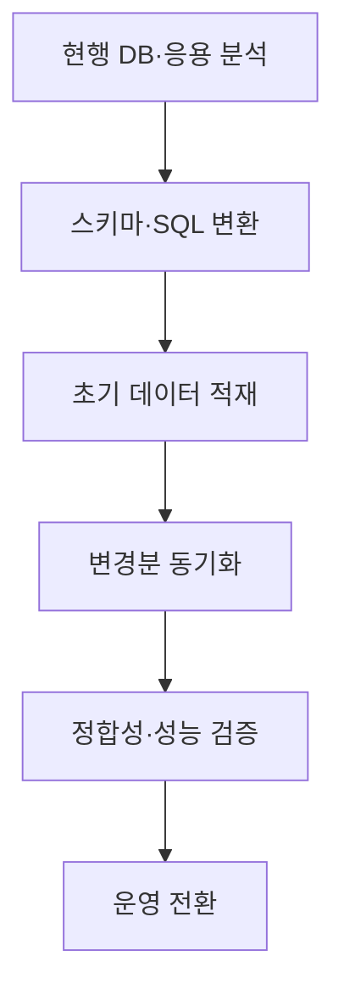
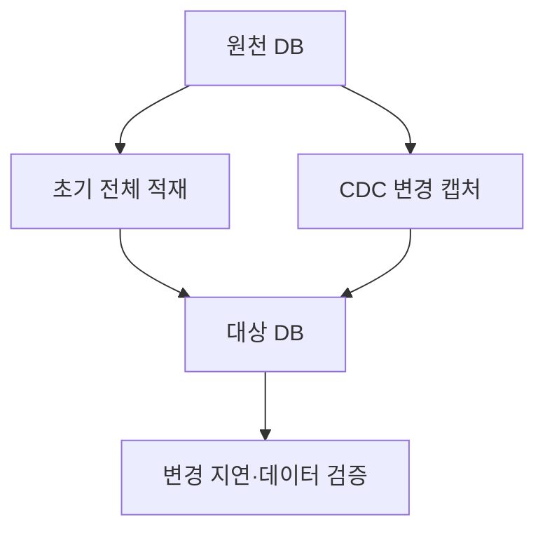

---
sidebar:
  order: 63
  label: "063. 오픈소스 DBMS 전환"
  badge:
    text: "기초"
    variant: note
title: "오픈소스 DBMS 전환 (Open Source DBMS Migration) 및 무중단 마이그레이션"
author: "Codex"
date: "2026-09-24T00:00:00+09:00"
tags:
  - "notes-data"
category: "03-data"
weight: 63
extra:
  model: "GPT-6"
  keyword_grade: "기초"
  question_no: "063"
---

## 지식 로드맵 내 현재 위치

데이터베이스 → 데이터베이스 아키텍처·마이그레이션 → 오픈소스 DBMS 전환

## 30초 인출

- 본질: **오픈소스 DBMS 전환**은 기존 데이터베이스의 데이터와 데이터베이스 기능을 목표 DBMS로 이전하고 검증하는 작업
- 메커니즘: 호환성을 분석·변환하고 초기 데이터와 변경분을 옮긴 뒤, 정합성·성능을 확인해 서비스를 전환

핵심 용어

- **오픈소스 DBMS 전환(Open-source DBMS Migration)**: 기존 데이터베이스의 데이터·스키마·응용 연계를 대상 오픈소스 DBMS로 이전하고 운영을 전환하는 작업
- **데이터베이스 관리 시스템(Database Management System, DBMS)**: 데이터의 저장·조회·변경을 관리하는 소프트웨어
- **변경 데이터 캡처(Change Data Capture, CDC)**: 데이터 변경을 식별해 다른 시스템에 전달하는 방식
- **컷오버(Cutover)**: 검증한 대상 시스템으로 운영 요청을 전환하는 단계
- **데이터 정합성(Data Consistency)**: 원천과 대상 데이터가 정의된 규칙·시점에 맞게 일치하는 상태

---

## 1교시 예상문제 (10점)

> 오픈소스 DBMS 전환의 정의와 목적, 주요 단계 및 검증 관점을 설명하시오. (예상)

---

## 1교시 10점 답안

### Ⅰ. 오픈소스 DBMS 전환의 개요

| 구분 | 핵심 |
|---|---|
| 정의 | 기존 데이터베이스의 데이터·스키마·응용 연계를 대상 오픈소스 DBMS로 이전하고 운영을 전환하는 작업 |
| 목적 | 대상 환경에서 데이터와 응용 기능을 유지하며 지속 가능한 운영 기반 확보 |

### Ⅱ. 전환 절차와 검증

| 검증 대상 | 확인 내용 |
|---|---|
| 데이터 | 건수·값·제약 조건의 일치 |
| 기능 | 주요 업무 SQL과 트랜잭션 결과 |
| 성능·운영 | 대표 부하, 백업·복구, 장애 대응 절차 |

제언: 실제 데이터와 주요 업무 부하로 전환을 반복 검증하고 승인 기준을 충족한 뒤 운영 요청을 변경

---

## 2~4교시 예상문제 (25점)

> 오픈소스 DBMS 전환의 개념과 목적을 설명하고, 사전 분석부터 운영 전환까지의 절차와 이기종 DBMS 간 호환성·정합성 검증 및 컷오버 시 고려사항을 서술하시오. (예상)

---

## 2~4교시 25점 답안

## Ⅰ. 오픈소스 DBMS 전환의 개요

| 구분 | 핵심 |
|---|---|
| 정의 | 기존 데이터베이스의 데이터·스키마·응용 연계를 대상 오픈소스 DBMS로 이전하고 운영을 전환하는 작업 |
| 목적 | 대상 환경에서 데이터와 응용 기능을 유지하며 지속 가능한 운영 기반 확보 |

## Ⅱ. 전환 대상과 호환성 분석

| 분석 영역 | 주요 확인 항목 |
|---|---|
| 데이터·스키마 | 자료형, 제약 조건, 인덱스, 파티션, 대용량 객체 |
| DB 기능 | 저장 프로시저, 트리거, 함수, 권한·작업 스케줄 |
| 응용 연계 | SQL 방언, 드라이버, 트랜잭션·격리 수준 의존 |
| 운영 요구 | 부하 특성, 백업·복구, 가용성·보안 요구 |

- 자동 스키마 변환 결과에도 수작업 수정·대체 설계가 남을 수 있으므로 변환 보고서와 응용 코드를 함께 점검

## Ⅲ. 데이터 이동과 변경 동기화

- 전체 적재와 CDC를 병행하면 적재 중 발생한 원천 변경을 대상으로 전달하는 설계 가능
- CDC 방식과 지원 범위는 원천·대상 DBMS 및 사용 도구에 따라 차이가 있는 점
- 데이터 검증 쿼리는 원천·대상 자원과 네트워크를 추가로 사용할 수 있는 점

## Ⅳ. 전환 절차와 승인 기준

| 순서 | 주요 활동 | 전환 판단 자료 |
|---|---|---|
| 1. 사전 분석 | 대상 범위·의존성·호환성 조사 | 객체·업무·위험 목록 |
| 2. 변환·개발 | 스키마·SQL·DB 기능 변환 | 변환 결과와 미전환 항목 |
| 3. 적재·동기화 | 전체 데이터 적재 및 변경 반영 | 적재 진행·복제 지연 |
| 4. 검증 | 데이터, 기능, 성능, 운영 절차 점검 | 불일치·결함 처리 내역 |
| 5. 컷오버 | 쓰기 통제, 최종 동기화, 접속 전환 | 승인 기준과 복귀 조건 |

## Ⅴ. 한계와 대응

| 한계 | 대응 |
|---|---|
| DBMS별 자료형·함수·SQL 동작 차이로 기능 불일치 가능성 | 대표 업무 SQL과 트랜잭션을 대상으로 회귀 테스트 및 결과 비교 |
| 초기 적재·CDC 중 데이터 불일치나 복제 지연 가능성 | 건수·표본·업무 규칙 기반 검증과 복제 지연 감시 |
| 전환 뒤 원천 DB로 복귀할 때 신규 변경을 반영하지 못할 가능성 | 복귀 결정 시점의 쓰기 정책과 데이터 복구·재전환 절차를 사전에 설계·훈련 |

## Ⅵ. 기술사적 제언

| 한계 | 해결 방안 |
|---|---|
| 전환 성공 기준이 기술 작업 완료에만 맞춰져 업무 승인과 분리될 위험 | 핵심 업무별 데이터·기능·성능 승인 기준을 먼저 정하고 리허설 결과를 근거로 컷오버 여부를 결정 |

---

## 출제 이력과 검증 출처

- AWS Prescriptive Guidance, “Heterogeneous database migration”: https://docs.aws.amazon.com/prescriptive-guidance/latest/migration-oracle-database/heterogeneous-migration.html
- AWS Database Migration Service User Guide, “Components of AWS DMS”: https://docs.aws.amazon.com/dms/latest/userguide/CHAP_Introduction.Components.html
- AWS Database Migration Service User Guide, “Data validation”: https://docs.aws.amazon.com/dms/latest/userguide/CHAP_Validating.html
- 기존 노트에 적힌 기술사 회차·문항은 공식 원문 링크를 확인하지 못해 출제 이력으로 단정하지 않음

## 연결 토픽

- [고가용성 아키텍처](./051_ha_architecture/) · [인덱스](./047_index/) · [옵티마이저](./091_optimizer/)
