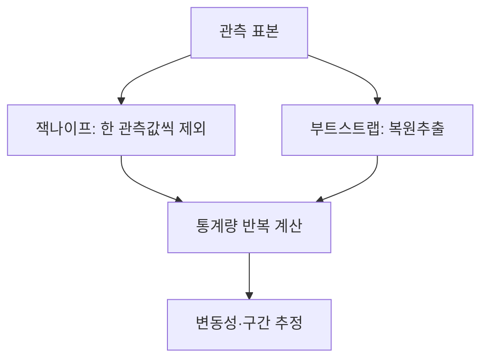
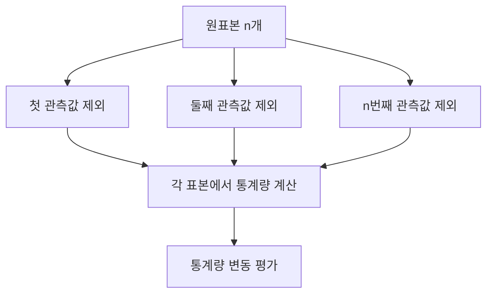
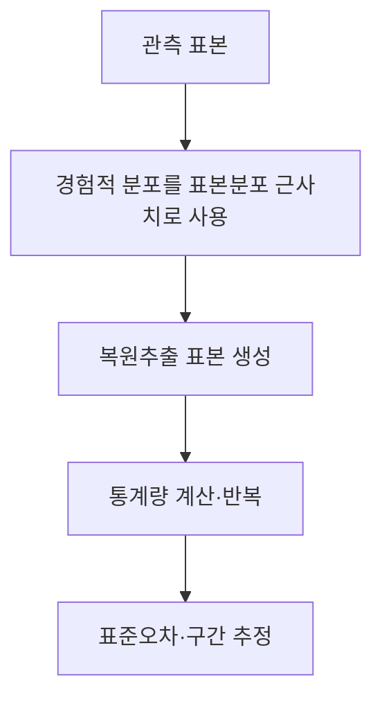

---
sidebar:
  order: 68
  label: "068. 잭나이프·부트스트랩"
  badge:
    text: "기초"
    variant: note
title: "재표본화 기법 (잭나이프 vs 부트스트랩) 및 비모수 신뢰구간 추정"
author: "Codex"
date: "2026-09-24T00:00:00+09:00"
tags:
  - "notes-data"
category: "03-data"
weight: 68
extra:
  model: "GPT-6"
  keyword_grade: "기초"
  question_no: "068"
---

## 지식 로드맵 내 현재 위치

데이터베이스 → 통계·데이터 분석 → 잭나이프·부트스트랩

## 30초 인출

- 본질: **재표본화(Resampling)**는 관측 표본을 다시 구성해 통계량의 변동성을 추정하는 방법
- 메커니즘: 잭나이프는 관측값을 하나씩 제외하고, 부트스트랩은 복원추출 표본을 반복 생성

핵심 용어

- **재표본화(Resampling)**: 관측한 표본에서 새 표본을 구성해 통계량의 표본 변동성을 평가하는 방법
- **잭나이프(Jackknife)**: 관측값을 하나씩 제외한 표본들로 통계량을 다시 계산하는 재표본화 방법
- **부트스트랩(Bootstrap)**: 경험적 표본분포에서 복원추출을 반복해 통계량의 변동성을 추정하는 방법
- **복원추출(Sampling with Replacement)**: 선택한 관측값을 다시 추출 대상에 포함하는 표본 추출 방식
- **신뢰구간(Confidence Interval)**: 정해진 절차로 반복 표본을 만들 때 모수를 포함하도록 설계된 구간 추정량

---

## 1교시 예상문제 (10점)

> 잭나이프와 부트스트랩의 정의와 목적, 표본 구성 방식 및 차이를 설명하시오. (예상)

---

## 1교시 10점 답안

### Ⅰ. 재표본화 기법의 개요

| 구분 | 핵심 |
|---|---|
| 정의 | 관측한 표본에서 새 표본을 구성해 통계량의 표본 변동성을 평가하는 방법 |
| 목적 | 통계량의 표준오차·불확실성 평가와 구간 추정 지원 |

### Ⅱ. 잭나이프와 부트스트랩

| 구분 | 잭나이프 | 부트스트랩 |
|---|---|---|
| 표본 구성 | 한 관측값씩 제외 | 표본 크기를 유지해 복원추출 |
| 반복 방식 | 통상 n개 제외 표본 | 반복 횟수 B를 정해 반복 |
| 주의점 | 통계량의 성질에 따라 적합성 제한 | 표본 설계와 관측 의존성을 반영해야 함 |

제언: 표본 설계와 통계량의 특성에 맞는 재표본화 방식을 선택하고 추정 결과의 안정성을 확인

---

## 2~4교시 예상문제 (25점)

> 재표본화의 개념을 설명하고 잭나이프와 부트스트랩의 작동 원리·장단점을 비교한 뒤, 신뢰구간 추정 시 고려사항을 제시하시오. (예상)

---

## 2~4교시 25점 답안

## Ⅰ. 재표본화 기법의 개요

| 구분 | 핵심 |
|---|---|
| 정의 | 관측한 표본에서 새 표본을 구성해 통계량의 표본 변동성을 평가하는 방법 |
| 목적 | 통계량의 표준오차·불확실성 평가와 구간 추정 지원 |

## Ⅱ. 잭나이프의 표본 구성

- 각 반복 표본은 원자료에서 관측값 하나를 제외한 n−1개 자료로 구성
- 각 표본에서 계산한 통계량 차이를 이용해 편향·분산 등 추정에 활용
- 통계량의 매끄러움과 표본 구조에 따라 잭나이프 추정이 부적절할 수 있는 한계

## Ⅲ. 부트스트랩 표본분포 근사

| 결과 | 활용 |
|---|---|
| 반복 통계량의 표준편차 | 표준오차 추정 |
| 반복 통계량의 분위수 | 백분위수 신뢰구간 구성 |
| 편향 보정 방식 | BCa 등 다른 부트스트랩 구간 방법 적용 가능 |

- 부트스트랩은 모집단 분포를 모르는 상태에서 표본분포를 근사하는 방법이며, 자료가 대표성 있고 표본 설계를 적절히 반영한다는 조건이 중요한 전제

## Ⅳ. 방법 비교와 적용 판단

| 판단축 | 잭나이프 | 부트스트랩 |
|---|---|---|
| 생성 방식 | 결정론적 leave-one-out 표본 | 복원추출을 반복하는 모의 표본 |
| 계산 규모 | 표본 크기에 따른 반복 | 설정한 반복 횟수에 따른 계산 |
| 강점 | 간결한 재계산으로 통계량 민감도 평가 | 다양한 통계량의 표본 변동과 구간 평가 |
| 한계 | 비매끄러운 통계량 등에서 추정 성질 악화 가능 | 표본 수·자료 구조·모형에 따라 근사 정확도 제한 |

## Ⅴ. 한계와 대응

| 한계 | 대응 |
|---|---|
| 시계열·군집 표본의 의존성을 무시한 독립 재추출 가능성 | 블록·군집 등 실제 표본 설계를 반영한 재표본화 방식 선택 |
| 작은 표본이나 대표성이 낮은 자료에서 원자료에 없는 변동을 복원하기 어려움 | 표본 선정 과정과 불확실성을 함께 검토하고 외부 자료·민감도 분석 보완 |

## Ⅵ. 기술사적 제언

| 한계 | 해결 방안 |
|---|---|
| 보고서에서 신뢰구간 산출 방식과 표본 설계가 생략되면 결과 비교가 어려운 점 | 재표본 단위·반복 수·구간 산정법·난수 재현 정보를 분석 산출물에 함께 기록 |

---

## 출제 이력과 검증 출처

- Bradley Efron, “Bootstrap Methods: Another Look at the Jackknife,” *The Annals of Statistics*, 7(1), 1–26, 1979: https://doi.org/10.1214/aos/1176344552
- Bradley Efron and Robert J. Tibshirani, *An Introduction to the Bootstrap*, Chapman & Hall, 1993.
- R. G. Miller, *The Jackknife, the Bootstrap and Other Resampling Plans*, SIAM.

## 연결 토픽

- [표본추출](./032_sampling/) · [앙상블 학습](./062_ensemble_bagging_boosting/) · [기술통계](./036_descriptive_statistics/)
