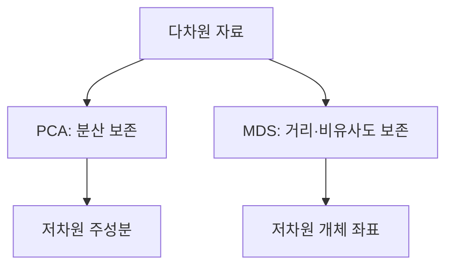
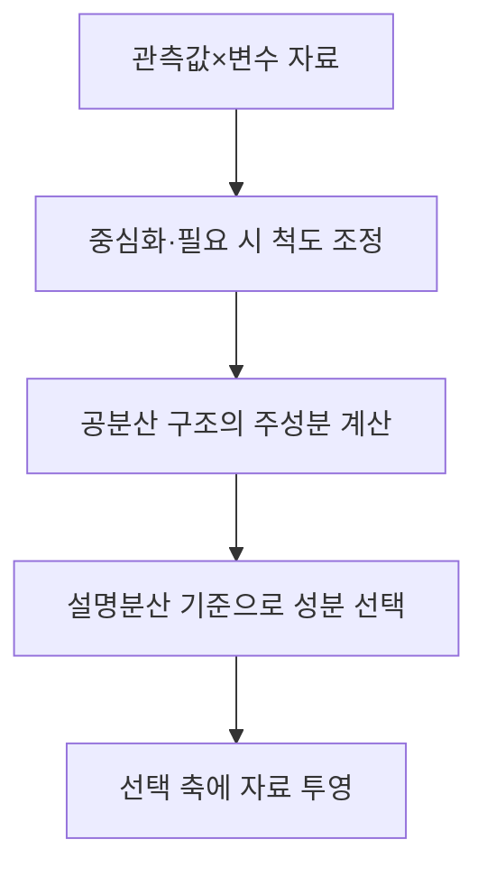
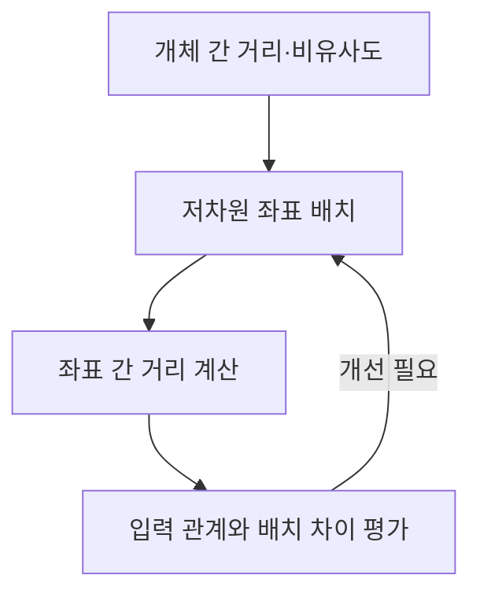

---
sidebar:
  order: 69
  label: "069. 차원 축소: PCA·MDS"
  badge:
    text: "기초"
    variant: note
title: "차원 축소 (Dimensionality Reduction) 및 PCA·다차원척도법(MDS)"
author: "Codex"
date: "2026-09-24T00:00:00+09:00"
tags:
  - "notes-data"
category: "03-data"
weight: 69
extra:
  model: "GPT-6"
  keyword_grade: "기초"
  question_no: "069"
---

## 지식 로드맵 내 현재 위치

데이터베이스 → 머신러닝·데이터마이닝 → 차원 축소

## 30초 인출

- 본질: **차원 축소(Dimensionality Reduction)**는 자료를 더 적은 변수나 좌표로 표현하면서 분석에 필요한 정보를 보존하는 방법
- 메커니즘: PCA는 변동이 큰 직교 방향을 찾고, MDS는 개체 간 거리·비유사도 관계를 저차원 공간에 표현

핵심 용어

- **차원 축소(Dimensionality Reduction)**: 자료를 더 적은 좌표로 표현해 복잡도나 시각화 부담을 줄이는 방법
- **주성분분석(Principal Component Analysis, PCA)**: 자료의 분산을 최대한 보존하는 직교 선형 축으로 투영하는 방법
- **다차원척도법(Multidimensional Scaling, MDS)**: 개체 간 거리·비유사도를 저차원 좌표에 표현하는 방법
- **설명분산(Explained Variance)**: 주성분이 원자료의 변동 중 설명하는 비율
- **스트레스(Stress)**: MDS 저차원 배치가 입력 비유사도를 얼마나 왜곡하는지 나타내는 적합도 기준

---

## 1교시 예상문제 (10점)

> 차원 축소의 정의와 목적을 설명하고, 주성분분석(PCA)과 다차원척도법(MDS)의 원리를 비교하시오. (예상)

---

## 1교시 10점 답안

### Ⅰ. 차원 축소의 개요

| 구분 | 핵심 |
|---|---|
| 정의 | 자료를 더 적은 변수나 좌표로 표현하면서 분석에 필요한 정보를 보존하는 방법 |
| 목적 | 계산·해석 부담 완화와 저차원 자료 탐색 지원 |

### Ⅱ. PCA와 MDS 비교

| 관점 | PCA | MDS |
|---|---|---|
| 입력 | 관측값과 변수로 된 자료 행렬 | 개체 간 거리·비유사도 |
| 보존 대상 | 투영 후 분산 | 개체 간 거리 또는 순위 관계 |
| 결과 | 변수의 선형결합인 주성분 | 개체별 저차원 좌표 |

제언: 분석 목적이 변수 축약인지 개체 간 유사성 시각화인지 먼저 정한 뒤 기법을 선택

---

## 2~4교시 예상문제 (25점)

> 차원 축소의 필요성을 설명하고, PCA와 MDS의 입력 자료·작동 원리·정보 보존 방식 및 적용 시 한계를 비교하시오. (예상)

---

## 2~4교시 25점 답안

## Ⅰ. 차원 축소의 개요

| 구분 | 핵심 |
|---|---|
| 정의 | 자료를 더 적은 변수나 좌표로 표현하면서 분석에 필요한 정보를 보존하는 방법 |
| 목적 | 계산·해석 부담 완화와 저차원 자료 탐색 지원 |

## Ⅱ. PCA의 원리

- PCA는 분산이 큰 직교 방향부터 주성분으로 선택해 원자료를 선형 투영하는 방식
- 측정 단위 차이가 결과를 지배할 우려가 있으면 변수 표준화 여부를 검토하는 기준
- 설명분산은 보존 정보의 정도를 나타내며, 업무상 중요도와 동일하지는 않은 점

| 결과 | 의미 |
|---|---|
| 주성분 축 | 원 변수의 선형결합으로 이루어진 직교 축 |
| 설명분산 비율 | 각 축이 원자료 변동을 설명하는 비율 |

## Ⅲ. MDS의 원리

- 계량 MDS는 입력 거리의 크기를, 비계량 MDS는 거리 순위 관계를 저차원 배치에서 표현하는 방식
- 스트레스는 입력 관계와 저차원 거리의 차이를 평가하는 기준이며, 절대 임계값을 보편적으로 적용하지 않고 자료·목적과 함께 해석
- MDS 좌표축의 방향과 원점은 회전·이동에 따라 바뀔 수 있으므로 축을 원 변수의 의미로 직접 해석하지 않는 점

## Ⅳ. PCA와 MDS 선택 비교

| 비교축 | PCA | MDS |
|---|---|---|
| 입력 표현 | 관측치별 변수값 | 개체 간 거리·비유사도 행렬 |
| 주된 보존 관계 | 전체 자료의 분산 | 개체 쌍의 거리 또는 순서 |
| 결과 해석 | 각 주성분의 변수 기여도 분석 | 개체의 상대적 근접성 시각화 |
| 주요 한계 | 선형 투영이며 분산이 낮은 축의 정보 손실 가능 | 거리를 만들거나 보존하는 방식에 결과가 의존 |
| 선택 목적 | 변수 축약·상관 구조 요약 | 유사도 자료의 저차원 배치 |

## Ⅴ. 한계와 대응

| 한계 | 대응 |
|---|---|
| 축소 과정에서 원자료 정보 손실 | 설명분산·거리 적합도와 후속 업무 성능을 함께 확인 |
| 데이터 전처리와 척도 선택에 결과 민감 | 학습 자료 안에서 전처리 기준을 적합하고 검증 자료에 적용 |
| 2차원 그림을 원자료의 모든 관계로 오해할 가능성 | 축소 결과와 보존 대상·왜곡 정도를 함께 설명 |

## Ⅵ. 기술사적 제언

| 문제 | 해결 방안 |
|---|---|
| 시각화 결과만 보고 축소 자료를 업무 판단의 완전한 대체물로 사용할 위험 | 원자료 지표와 축소 결과를 병행 검토하고, 해당 업무에서 허용할 정보 손실을 사전에 정해 평가 |

---

## 출제 이력과 검증 출처

- scikit-learn User Guide, “Decomposing signals in components”: https://scikit-learn.org/stable/modules/decomposition.html
- scikit-learn User Guide, “Manifold learning / Multidimensional scaling”: https://scikit-learn.org/stable/modules/manifold.html
- Ian T. Jolliffe, *Principal Component Analysis*, 2nd ed., Springer.
- Joseph B. Kruskal, “Multidimensional scaling by optimizing goodness of fit to a nonmetric hypothesis,” *Psychometrika*, 1964.

## 연결 토픽

- [데이터마이닝](./043_data_mining/) · [군집분석](./005_cluster_analysis/) · [벡터 데이터베이스](./044_vector_database/)
