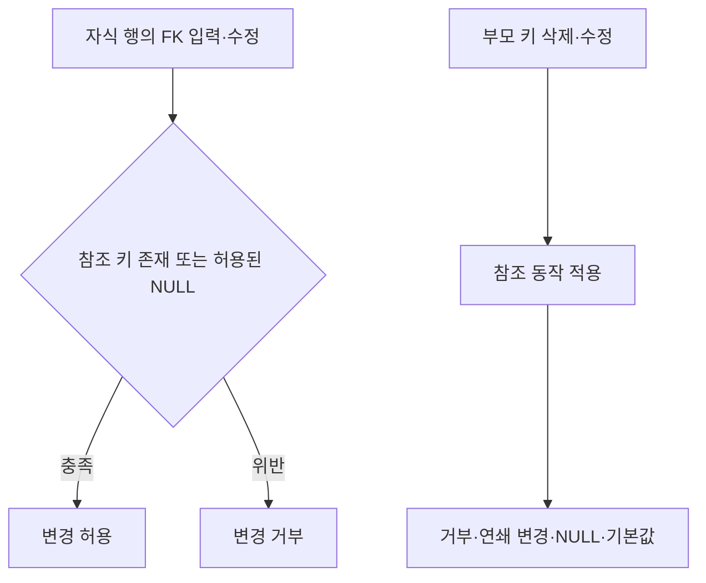
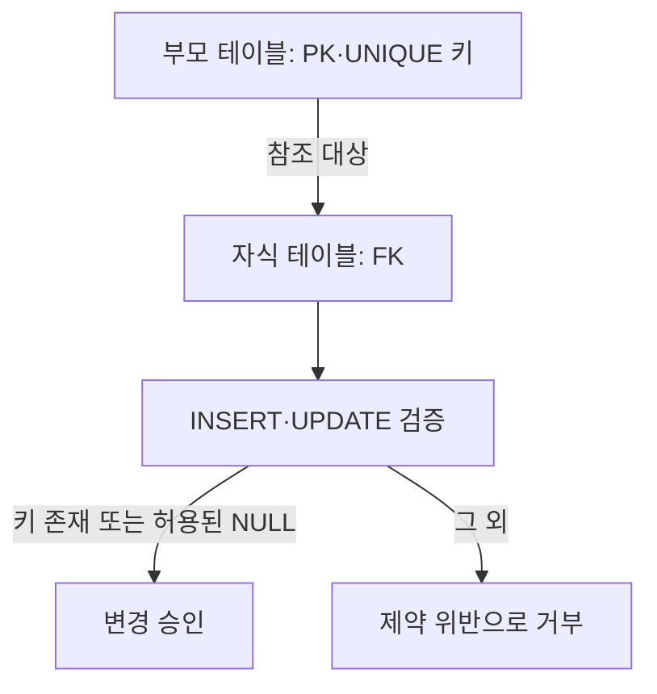

---
sidebar:
  order: 70
  label: "070. 참조 무결성"
  badge:
    text: "기초"
    variant: note
title: "참조 무결성 (Referential Integrity) 및 외래키 연쇄 동작 (CASCADE, RESTRICT)"
author: "Codex"
date: "2026-09-24T00:00:00+09:00"
tags:
  - "notes-data"
category: "03-data"
weight: 70
extra:
  model: "GPT-6"
  keyword_grade: "기초"
  question_no: "070"
---

## 지식 로드맵 내 현재 위치

데이터베이스 → 데이터 모델링·무결성 → 참조 무결성

## 30초 인출

- 본질: **참조 무결성(Referential Integrity)**은 외래키가 부모 테이블의 유효한 키를 참조하도록 유지하는 제약
- 메커니즘: 자식 데이터 입력·수정과 부모 데이터 삭제·수정 시 참조 관계를 검사하고, 정의한 연쇄 동작을 적용

핵심 용어

- **참조 무결성(Referential Integrity)**: 외래키 값이 참조 대상의 유효한 키를 가리키도록 보장하는 데이터 제약
- **외래키(Foreign Key, FK)**: 다른 테이블의 기본키나 고유 키를 참조하는 열 또는 열의 조합
- **기본키(Primary Key, PK)**: 테이블 행을 고유하게 식별하는 키
- **참조 동작(Referential Action)**: 참조된 부모 키의 삭제·수정 시 자식 행을 처리하는 규칙
- **고아 행(Orphan Row)**: 유효한 부모 행과 연결되지 않는 자식 행

---

## 1교시 예상문제 (10점)

> 참조 무결성의 정의와 목적, 외래키 검증 및 부모 키 변경 시 적용되는 주요 참조 동작을 설명하시오. (예상)

---

## 1교시 10점 답안

### Ⅰ. 참조 무결성의 개요

| 구분 | 핵심 |
|---|---|
| 정의 | 외래키 값이 참조 대상의 유효한 키를 가리키도록 보장하는 데이터 제약 |
| 목적 | 테이블 간 연결에서 유효하지 않은 참조의 저장 방지 |

### Ⅱ. 참조 검증과 동작

| 부모 변경 규칙 | 자식 행 처리 |
|---|---|
| RESTRICT / NO ACTION | 참조 중인 자식이 있으면 변경 제한 |
| CASCADE | 관련 자식 행도 삭제하거나 참조 키 갱신 |
| SET NULL | 자식 외래키를 NULL로 변경 |
| SET DEFAULT | 자식 외래키를 기본값으로 변경; 새 값도 유효해야 함 |

제언: 부모·자식 데이터의 생명주기와 업무 규칙을 확인해 참조 동작을 명시적으로 선택

---

## 2~4교시 예상문제 (25점)

> 참조 무결성의 구성과 위반 상황을 설명하고, 자식 데이터 변경 시의 검증 및 부모 데이터 삭제·수정 시 참조 동작을 비교하시오. (예상)

---

## 2~4교시 25점 답안

## Ⅰ. 참조 무결성의 개요

| 구분 | 핵심 |
|---|---|
| 정의 | 외래키 값이 참조 대상의 유효한 키를 가리키도록 보장하는 데이터 제약 |
| 목적 | 테이블 간 연결에서 유효하지 않은 참조의 저장 방지 |

## Ⅱ. 참조 관계와 위반 검증

- 외래키는 부모의 기본키 또는 DBMS가 허용하는 고유 키를 참조하는 제약
- 자식 행의 외래키 변경 때 대응하는 부모 키가 존재해야 하는 규칙
- 외래키가 NULL일 수 있는지는 NOT NULL 등 별도 제약과 DBMS 규칙으로 결정

## Ⅲ. 부모 행 변경 시 참조 동작

| 동작 | 삭제 시 | 키 수정 시 | 고려사항 |
|---|---|---|---|
| RESTRICT | 참조 행 존재 시 거부 | 참조 행 존재 시 거부 | 즉시 제한 규칙 |
| NO ACTION | 제약 검사 시점에 위반이면 거부 | 제약 검사 시점에 위반이면 거부 | 지연 제약에서는 RESTRICT와 시점 차이 가능 |
| CASCADE | 자식 행 연쇄 삭제 | 자식 FK에 새 키 전파 | 자식의 생명주기가 부모에 종속되는 경우 |
| SET NULL | 자식 FK를 NULL로 설정 | 자식 FK를 NULL로 설정 | 해당 FK 열에 NULL 허용 필요 |
| SET DEFAULT | 자식 FK를 기본값으로 설정 | 자식 FK를 기본값으로 설정 | 기본값도 참조 제약을 만족해야 함 |

- 참조 동작의 지원 범위와 세부 의미는 DBMS별로 확인이 필요한 항목

## Ⅳ. 제약 적용과 운영 고려

| 설계 항목 | 판단 기준 |
|---|---|
| 참조 키 | 기본키 또는 적절한 고유 키 지정 |
| NULL 허용 | 관계 선택성 및 업무상 미지정 상태 허용 여부 |
| 참조 동작 | 부모·자식의 생명주기와 변경 정책 |
| 인덱스 | 부모 변경 시 참조 자식 검색 비용을 고려한 FK 인덱스 필요성 |
| 분산 데이터 | DB 제약의 적용 범위와 서비스 간 관계 관리 책임 |

## Ⅴ. 한계와 대응

| 한계 | 대응 |
|---|---|
| CASCADE가 다수 자식 행을 함께 변경할 수 있음 | 삭제·갱신 영향 범위를 확인하고 트랜잭션·권한·감사 정책과 조합 |
| DBMS별 동작·연기 가능성 차이 | 목표 DBMS의 제약 문서와 실제 스키마로 검증 |
| 분리된 데이터 저장소 간 FK 제약을 직접 적용하기 어려움 | 업무 이벤트·애플리케이션 검증과 정합성 대사 등 별도 통제 설계 |

## Ⅵ. 기술사적 제언

| 문제 | 해결 방안 |
|---|---|
| 스키마의 참조 동작이 업무상 삭제·수정 정책과 어긋날 가능성 | 엔터티 생명주기별 변경 시나리오를 정의하고 DDL 제약 및 통합 테스트 사례에 직접 반영 |

---

## 출제 이력과 검증 출처

- PostgreSQL 18 Documentation, “Constraints”: https://www.postgresql.org/docs/18/ddl-constraints.html
- PostgreSQL 18 Documentation, “CREATE TABLE”: https://www.postgresql.org/docs/18/sql-createtable.html
- MySQL 8.0 Reference Manual, “FOREIGN KEY Constraints”: https://dev.mysql.com/doc/refman/8.0/en/create-table-foreign-keys.html
- C. J. Date, *An Introduction to Database Systems*, relational integrity constraints.

## 연결 토픽

- [무결성 제약](./013_integrity_constraint/) · [데이터 모델링](./042_data_modeling/) · [ERD](./028_erd/)
