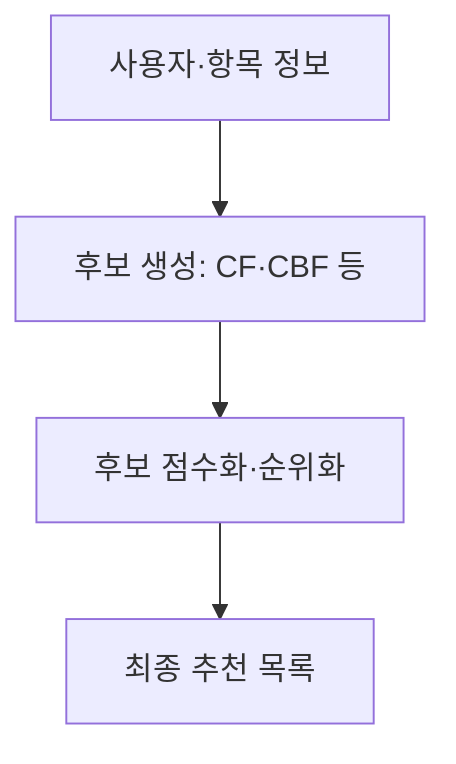
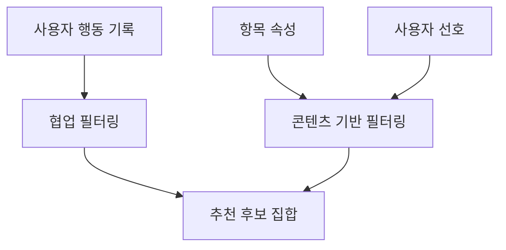
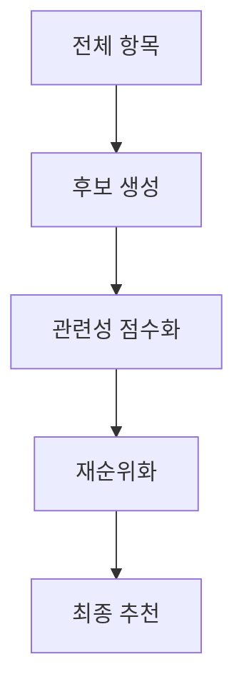

---
sidebar:
  order: 71
  label: "071. 추천 시스템 필터링"
  badge:
    text: "기초"
    variant: note
title: "필터링 기법 (Filtering) 및 추천 시스템과 데이터 엔지니어링"
author: "Codex"
date: "2026-09-24T00:00:00+09:00"
tags:
  - "notes-data"
category: "03-data"
weight: 71
extra:
  model: "GPT-6"
  keyword_grade: "기초"
  question_no: "071"
---

## 지식 로드맵 내 현재 위치

데이터베이스 → 빅데이터 분석·추천 시스템 → 추천 시스템 필터링

## 30초 인출

- 본질: **추천 시스템 필터링**은 사용자·항목 정보를 이용해 큰 항목 집합에서 사용자에게 맞는 후보를 고르는 과정
- 메커니즘: 협업 필터링은 사용자 행동의 유사성을, 콘텐츠 기반 필터링은 항목 속성의 유사성을 이용하고, 후보를 점수화해 노출 순위를 구성

핵심 용어

- **추천 시스템(Recommendation System)**: 사용자 맥락에 맞는 항목을 선별·정렬해 제안하는 정보 시스템
- **협업 필터링(Collaborative Filtering, CF)**: 사용자와 항목의 상호작용 패턴을 이용해 선호 항목을 추천하는 방식
- **콘텐츠 기반 필터링(Content-based Filtering, CBF)**: 항목 특성과 사용자 선호 프로필의 유사성을 이용하는 추천 방식
- **후보 생성(Candidate Generation)**: 큰 항목 집합에서 후속 평가 대상의 작은 후보 집합을 만드는 단계
- **재순위화(Re-ranking)**: 초기 순위를 다양성·신선도·정책 등 추가 조건에 맞춰 조정하는 단계

---

## 1교시 예상문제 (10점)

> 추천 시스템의 정의와 목적을 설명하고, 협업 필터링과 콘텐츠 기반 필터링의 원리를 비교하시오. (예상)

---

## 1교시 10점 답안

### Ⅰ. 추천 시스템 필터링의 개요

| 구분 | 핵심 |
|---|---|
| 정의 | 사용자·항목 정보를 이용해 큰 항목 집합에서 사용자에게 맞는 후보를 고르는 과정 |
| 목적 | 탐색 부담을 줄이고 이용 맥락에 맞는 항목 발견 지원 |

### Ⅱ. 대표 필터링 방식과 처리 흐름

| 방식 | 사용하는 정보 | 원리 |
|---|---|---|
| 협업 필터링(CF) | 사용자·항목 상호작용 | 유사한 사용자나 항목의 행동 패턴 활용 |
| 콘텐츠 기반(CBF) | 항목 속성·사용자 선호 | 선호 항목과 속성이 유사한 항목 선택 |

제언: 신규 사용자와 신규 항목의 정보 부족을 고려해 후보 생성 방식을 함께 검토

---

## 2~4교시 예상문제 (25점)

> 추천 시스템 필터링의 정의와 목적을 설명하고, 협업·콘텐츠 기반 필터링 및 후보 생성·점수화·재순위화 흐름, 주요 한계와 대응을 서술하시오. (예상)

---

## 2~4교시 25점 답안

## Ⅰ. 추천 시스템 필터링의 개요

| 구분 | 핵심 |
|---|---|
| 정의 | 사용자·항목 정보를 이용해 큰 항목 집합에서 사용자에게 맞는 후보를 고르는 과정 |
| 목적 | 탐색 부담을 줄이고 이용 맥락에 맞는 항목 발견 지원 |

## Ⅱ. 협업 필터링과 콘텐츠 기반 필터링

| 비교축 | 협업 필터링(CF) | 콘텐츠 기반 필터링(CBF) |
|---|---|---|
| 입력 | 사용자·항목의 평점·조회·구매 등 상호작용 | 항목 속성과 사용자 선호 프로필 |
| 선택 원리 | 유사 사용자·항목의 행동을 이용 | 선호 항목과 속성이 비슷한 항목 선택 |
| 장점 | 기존 속성 설계 없이 행동으로 관계를 학습하는 방식 | 다른 사용자의 기록이 없어도 항목 속성 활용 가능 |
| 한계 | 상호작용이 적은 신규 사용자·항목에서 정보 부족 | 기존 선호와 유사한 항목에 편중될 가능성 |

## Ⅲ. 후보 생성과 순위화 구조

| 단계 | 역할 | 예시 기준 |
|---|---|---|
| 후보 생성 | 큰 항목 공간에서 평가할 항목을 선별 | 사용자·항목 유사도, 인기, 문맥 |
| 점수화 | 후보별 사용자 관련성을 계산 | 조회·구매 가능성 등 업무 목적에 맞는 점수 |
| 재순위화 | 최종 목록에 추가 제약을 반영 | 중복·신선도·다양성·정책 조건 |

## Ⅳ. 데이터 운영과 용어 구분

| 운영 항목 | 고려사항 |
|---|---|
| 상호작용 로그 | 조회·클릭·구매 의미와 수집 편향을 구분 |
| 항목 속성 | 정확성·갱신 시점·결측 관리 |
| 평가 | 오프라인 평가와 실제 노출 결과를 구분하고 노출 편향 고려 |
| 필터링 용어 | 추천 필터링은 후보 선별 과정이며, Bloom Filter는 집합 포함 여부를 근사 판별하는 별도 자료구조 |

## Ⅴ. 한계와 대응

| 한계 | 대응 |
|---|---|
| 신규 사용자·항목은 상호작용 정보가 부족한 문제 | 콘텐츠 속성·비개인화 후보 등 초기 정보원을 함께 사용 |
| 과거 기록과 노출 편향에 맞춘 추천 가능성 | 후보 출처와 노출을 기록하고 다양한 품질 지표로 평가 |
| 개인화로 항목 다양성이 줄어들 가능성 | 재순위화 단계에서 중복·다양성 기준을 업무 목적에 맞게 적용 |

## Ⅵ. 기술사적 제언

| 한계 | 해결 방안 |
|---|---|
| 추천 품질을 클릭률 하나로만 판단하면 이용자 가치와 콘텐츠 편중을 놓칠 가능성 | 클릭·장기 이용·항목 다양성 등 업무 목표에 맞는 평가 기준을 정하고 후보 생성·순위화 단계별로 검증 |

---

## 출제 이력과 검증 출처

- Google for Developers, Machine Learning Recommendation Systems, “Recommendation systems overview”: https://developers.google.com/machine-learning/recommendation/overview/types
- Google for Developers, “Candidate generation overview”: https://developers.google.com/machine-learning/recommendation/overview/candidate-generation
- Google for Developers, “Collaborative filtering”: https://developers.google.com/machine-learning/recommendation/collaborative/basics
- Google for Developers, “Scoring” and “Re-ranking”: https://developers.google.com/machine-learning/recommendation/dnn/scoring · https://developers.google.com/machine-learning/recommendation/dnn/re-ranking

## 연결 토픽

- [데이터마이닝](./043_data_mining/) · [앙상블 학습](./062_ensemble_bagging_boosting/) · [데이터 관측가능성](./054_data_observability/)
