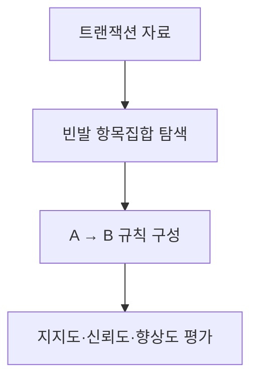
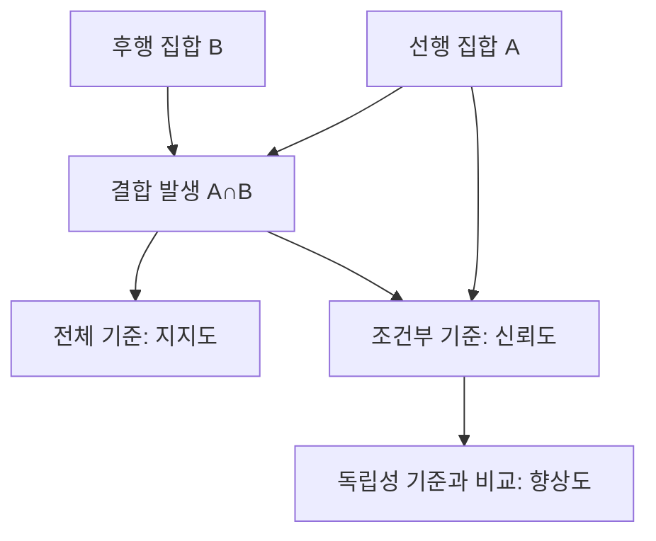
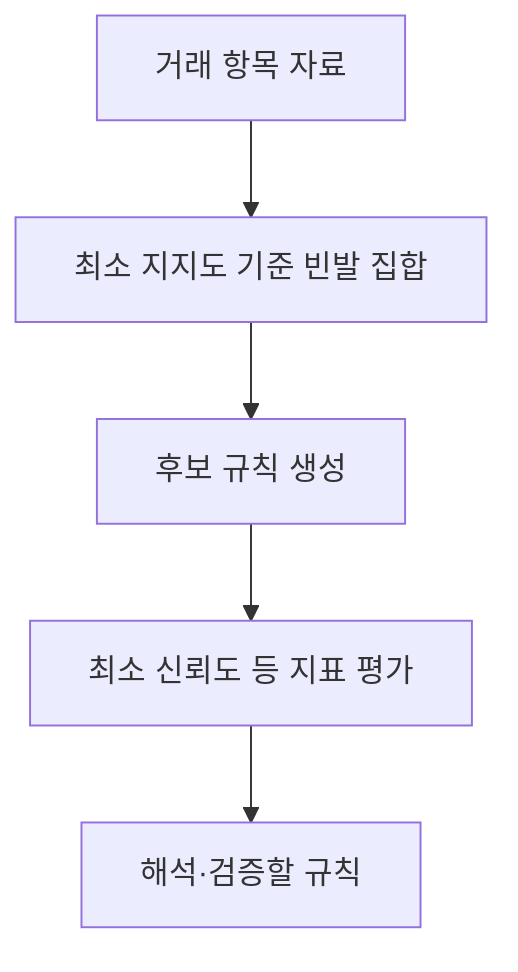

---
sidebar:
  order: 72
  label: "072. 연관규칙분석"
  badge:
    text: "기초"
    variant: note
title: "연관규칙분석 (Association Rule Mining) 및 지지도·신뢰도·향상도"
author: "Codex"
date: "2026-09-24T00:00:00+09:00"
tags:
  - "notes-data"
category: "03-data"
weight: 72
extra:
  model: "GPT-6"
  keyword_grade: "기초"
  question_no: "072"
---

## 지식 로드맵 내 현재 위치

데이터베이스 → 머신러닝·데이터마이닝 → 연관규칙분석

## 30초 인출

- 본질: **연관규칙분석(Association Rule Mining)**은 거래 항목에서 함께 나타나는 항목 집합과 규칙을 찾는 분석
- 메커니즘: 지지도는 전체 빈도, 신뢰도는 조건부 빈도, 향상도는 독립 발생 대비 결합 정도를 측정

핵심 용어

- **연관규칙분석(Association Rule Mining)**: 트랜잭션 자료에서 항목 간 동시 발생 관계를 찾는 분석
- **지지도(Support)**: 전체 트랜잭션 중 규칙의 항목 집합이 함께 나타난 비율
- **신뢰도(Confidence)**: 선행 항목이 나타난 트랜잭션 중 후행 항목도 나타난 비율
- **향상도(Lift)**: 선행 항목이 주어졌을 때 후행 항목의 발생률을 독립성 기준 발생률과 비교한 값
- **Apriori**: 빈발 항목 집합의 부분집합도 빈발해야 한다는 성질로 후보를 가지치기하는 알고리즘
- **FP-Growth(Frequent Pattern Growth)**: FP-Tree에 빈발 패턴 정보를 압축해 후보 생성 부담을 줄이는 알고리즘

---

## 1교시 예상문제 (10점)

> 연관규칙분석의 정의와 목적을 설명하고 지지도·신뢰도·향상도의 의미와 산출 관계를 설명하시오. (예상)

---

## 1교시 10점 답안

### Ⅰ. 연관규칙분석의 개요

| 구분 | 핵심 |
|---|---|
| 정의 | 트랜잭션 자료에서 항목 간 동시 발생 관계를 찾는 분석 |
| 목적 | 반복되는 항목 조합과 연관 후보를 찾아 업무 의사결정에 활용 |

### Ⅱ. 평가 지표와 관계

| 지표 | 수식 | 의미 |
|---|---|---|
| 지지도(Support) | $P(A\cap B)$ | 전체 거래 중 A와 B가 함께 나타난 비율 |
| 신뢰도(Confidence) | $P(B\mid A)=P(A\cap B)/P(A)$ | A가 있을 때 B도 나타난 비율 |
| 향상도(Lift) | $P(B\mid A)/P(B)$ | A가 있을 때 B 발생률과 전체 B 발생률의 비 |

- 향상도는 1보다 크면 양의 연관, 1이면 독립에 부합, 1보다 작으면 음의 연관을 나타내는 값
- 통계적 유의성이나 인과 관계를 단독으로 증명하는 기준은 아님

제언: 최소 빈도와 업무상 의미를 함께 검토하고 연관 규칙을 인과 효과로 해석하지 않도록 주의

---

## 2~4교시 예상문제 (25점)

> 연관규칙분석의 정의와 절차를 설명하고, 지지도·신뢰도·향상도 지표 및 Apriori와 FP-Growth의 동작 원리를 비교하시오. (예상)

---

## 2~4교시 25점 답안

## Ⅰ. 연관규칙분석의 개요

| 구분 | 핵심 |
|---|---|
| 정의 | 트랜잭션 자료에서 항목 간 동시 발생 관계를 찾는 분석 |
| 목적 | 반복되는 항목 조합과 연관 후보를 찾아 업무 의사결정에 활용 |

## Ⅱ. 규칙과 평가 지표

- 연관규칙 $A\rightarrow B$는 선행 항목집합 $A$와 후행 항목집합 $B$의 동시 발생 관계를 나타내며, 일반적으로 두 집합은 서로 겹치지 않는 구성

| 지표 | 수식 | 해석 |
|---|---|---|
| 지지도(Support) | $support(A\rightarrow B)=P(A\cap B)$ | 규칙이 전체 자료에 나타나는 빈도 |
| 신뢰도(Confidence) | $confidence(A\rightarrow B)=P(B\mid A)$ | 선행 집합이 있을 때 후행 집합도 나타나는 비율 |
| 향상도(Lift) | $lift(A\rightarrow B)=P(B\mid A)/P(B)$ | 후행 집합의 전체 빈도와 비교한 상대적 발생률 |

- 향상도는 연관 방향과 크기를 요약하지만 교란 요인·표본 불확실성을 통제하지 않으므로 인과성의 증거로 볼 수 없는 한계

## Ⅲ. 빈발 항목 집합과 규칙 도출

- 최소 지지도는 후보 탐색 범위를 줄이고, 신뢰도·향상도는 도출된 규칙의 특성을 평가하는 기준
- 임계값은 분석 자료의 규모와 업무 목적에 맞춰 정하는 설정값

## Ⅳ. Apriori와 FP-Growth 비교

| 비교축 | Apriori | FP-Growth |
|---|---|---|
| 핵심 원리 | 빈발 항목집합의 부분집합도 빈발해야 하는 성질로 후보 가지치기 | FP-Tree에 빈발 패턴을 압축하고 조건부 패턴으로 탐색 |
| 후보 생성 | 단계별 후보 집합 구성 | 명시적 후보 집합 생성을 줄이는 방식 |
| 주요 비용 | 여러 차수 후보와 자료 스캔 비용 | FP-Tree 구성·메모리와 조건부 패턴 처리 비용 |
| 선택 고려 | 자료 크기·항목 수·희소성 | 패턴 공유 정도·메모리 한계·구현 특성 |

- FP-Growth가 항상 Apriori보다 빠르다고 단정할 수 없으며, 실행 비용은 자료와 구현에 따른 비교 항목

## Ⅴ. 한계와 대응

| 한계 | 대응 |
|---|---|
| 신뢰도만 높아도 후행 항목 자체의 높은 빈도 때문일 수 있음 | 향상도 등 다른 지표와 기준 빈도를 함께 검토 |
| 다수의 규칙이 산출되어 우연한 관계가 포함될 가능성 | 최소 빈도·도메인 검토·별도 기간 재검증으로 규칙을 선별 |
| 관찰된 연관을 원인·효과로 오해할 가능성 | 별도 실험·인과 분석 없이 정책 효과로 단정하지 않음 |

## Ⅵ. 기술사적 제언

| 한계 | 해결 방안 |
|---|---|
| 마이닝 결과가 현재 표본의 연관에 그치고 실제 의사결정 효과가 확인되지 않을 가능성 | 후보 규칙을 업무 가설로 분류하고 다른 기간·집단에서 재현성을 확인한 뒤 통제 실험으로 적용 효과 검증 |

---

## 출제 이력과 검증 출처

- Rakesh Agrawal and Ramakrishnan Srikant, “Fast Algorithms for Mining Association Rules,” *VLDB*, 1994.
- Jiawei Han, Jian Pei, and Yiwen Yin, “Mining Frequent Patterns without Candidate Generation,” *ACM SIGMOD*, 2000.
- Pang-Ning Tan, Michael Steinbach, and Vipin Kumar, *Introduction to Data Mining*, 2nd ed., Chapter 5.

## 연결 토픽

- [데이터마이닝](./043_data_mining/) · [추천 시스템 필터링](./071_filtering/) · [군집분석](./005_cluster_analysis/)
