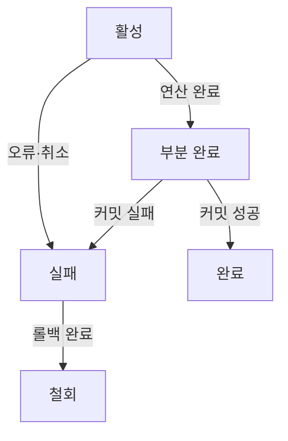
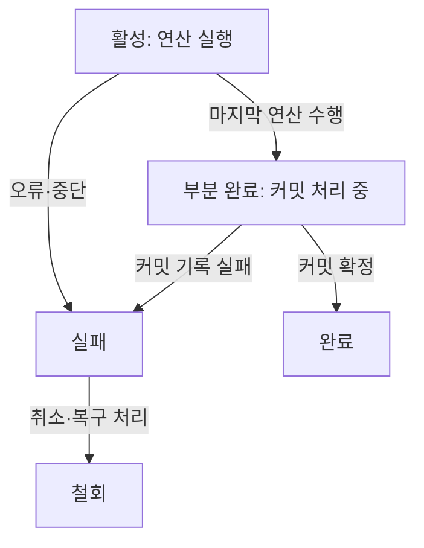
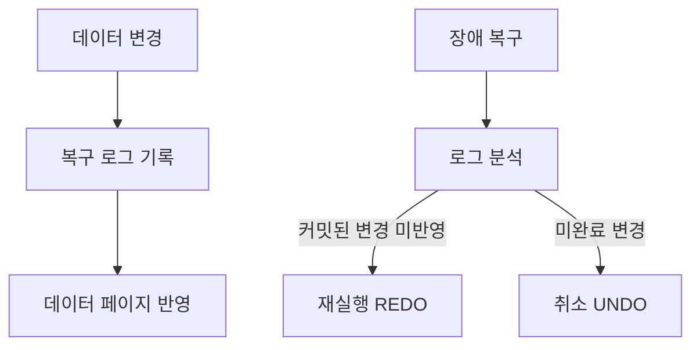

---
sidebar:
  order: 78
  label: "078. 트랜잭션"
  badge:
    text: "기초"
    variant: note
title: "트랜잭션 (Transaction) 및 ACID 특성과 상태 전이도"
author: "Codex"
date: "2026-09-24T00:00:00+09:00"
tags:
  - "notes-data"
category: "03-data"
weight: 78
extra:
  model: "GPT-6"
  keyword_grade: "기초"
  question_no: "078"
---

## 지식 로드맵 내 현재 위치

데이터베이스 → 트랜잭션·동시성 제어 → 트랜잭션

## 30초 인출

- 본질: **트랜잭션(Transaction)**은 하나의 논리 작업을 함께 성공시키거나 취소하는 데이터베이스 작업 단위
- 메커니즘: 연산을 실행하고 커밋 또는 롤백하며, 원자성·일관성·격리성·영속성 원칙으로 데이터 상태를 관리

핵심 용어

- **트랜잭션(Transaction)**: 하나의 논리 작업을 성공 또는 취소 단위로 처리하는 데이터베이스 작업 묶음
- **원자성(Atomicity)**: 트랜잭션의 변경이 모두 반영되거나 모두 취소되는 성질
- **일관성(Consistency)**: 트랜잭션이 데이터베이스의 유효 조건을 지키도록 하는 성질
- **격리성(Isolation)**: 동시에 수행되는 트랜잭션 간 간섭을 제어하는 성질
- **영속성(Durability)**: 성공 처리된 변경을 장애 복구 후에도 보존하는 성질
- **로그 선행 기록(Write-Ahead Logging, WAL)**: 데이터 페이지 변경보다 로그를 먼저 안정 저장해 복구에 활용하는 방식

---

## 1교시 예상문제 (10점)

> 트랜잭션의 정의와 목적을 설명하고, ACID 특성과 트랜잭션의 상태 전이를 서술하시오. (예상)

---

## 1교시 10점 답안

### Ⅰ. 트랜잭션의 개요

| 구분 | 핵심 |
|---|---|
| 정의 | 하나의 논리 작업을 성공 또는 취소 단위로 처리하는 데이터베이스 작업 묶음 |
| 목적 | 동시 처리와 장애에도 데이터의 유효 상태를 관리 |

### Ⅱ. ACID와 상태 전이

| 속성 | 핵심 보장 |
|---|---|
| 원자성(Atomicity) | 전체 반영 또는 전체 취소 |
| 일관성(Consistency) | 정의된 데이터 유효 조건 유지 |
| 격리성(Isolation) | 동시 작업 간섭 제어 |
| 영속성(Durability) | 커밋된 변경의 복구 가능성 |

제언: 업무 불변 조건과 동시 실행 수준을 확인해 트랜잭션 경계와 복구 동작을 설계

---

## 2~4교시 예상문제 (25점)

> 트랜잭션의 정의와 ACID 4대 특성, 이를 지원하는 DBMS 기술 요소를 설명하고, 트랜잭션의 상태 전이와 장애 시 복구 흐름을 서술하시오. (예상)

---

## 2~4교시 25점 답안

## Ⅰ. 트랜잭션의 개요

| 구분 | 핵심 |
|---|---|
| 정의 | 하나의 논리 작업을 성공 또는 취소 단위로 처리하는 데이터베이스 작업 묶음 |
| 목적 | 동시 처리와 장애에도 데이터의 유효 상태를 관리 |

## Ⅱ. ACID 특성과 지원 요소

| 속성 | 보장 의미 | 지원 요소 예시 |
|---|---|---|
| 원자성(Atomicity) | 작업 전체 반영 또는 취소 | undo 정보·롤백 처리 등 |
| 일관성(Consistency) | 트랜잭션 전후 데이터 유효 조건 유지 | 제약조건과 올바른 업무 로직 |
| 격리성(Isolation) | 동시 실행 간섭의 통제 | 잠금, 다중 버전 동시성 제어(MVCC), 격리 수준 |
| 영속성(Durability) | 커밋 결과 보존과 장애 복구 | 로그 선행 기록(WAL)·복구 로그·저장장치 설정 |

- 이 요소는 대표 구현 예이며, 세부 기법과 보장 범위는 DBMS 및 설정에 따라 달라지는 점
- 일관성은 DB 제약조건만으로 모든 업무 규칙이 자동 보장되는 뜻이 아니며, 트랜잭션 로직도 유효 조건을 지켜야 하는 성질

## Ⅲ. 트랜잭션 상태와 전이

| 상태 | 의미 |
|---|---|
| 활성(Active) | 트랜잭션 연산 수행 중 |
| 부분 완료(Partially Committed) | 마지막 연산 후 커밋 처리가 확정되기 전 |
| 완료(Committed) | 커밋 성공 상태 |
| 실패(Failed) | 오류로 정상 완료 불가 상태 |
| 철회(Aborted) | 변경 취소 후 종료 또는 재시작 결정 상태 |

## Ⅳ. 장애 복구와 로그 관계

- WAL 방식에서는 데이터 페이지를 기록하기 전에 관련 로그를 안정 저장하는 원칙
- 커밋 기록의 안정 저장과 체크포인트 등 복구 동작은 제품 구현과 설정에 따르는 항목
- 일부 DBMS는 커밋 확인 전에 로그의 로컬 저장 또는 복제 완료를 요구하는 설정을 제공

## Ⅴ. 한계와 대응

| 한계 | 대응 |
|---|---|
| 높은 격리 수준과 긴 트랜잭션으로 동시성·자원 사용이 저하될 가능성 | 업무 불변 조건을 지키는 범위에서 격리 수준과 트랜잭션 길이 조정 |
| 외부 서비스 호출을 포함하면 장애·지연이 DB 작업까지 확장될 가능성 | DB 트랜잭션과 외부 통신 경계를 구분하고 실패·재시도 흐름 별도 설계 |
| 커밋 응답과 복제·저장 설정의 관계를 놓치면 내구성 요구 오해 가능성 | 목표 장애 범위와 동기화 정책을 명시하고 복구 시험으로 확인 |

## Ⅵ. 기술사적 제언

| 문제 | 해결 방안 |
|---|---|
| 트랜잭션의 ACID 요구를 업무 위험과 구분하지 않아 동시성이나 복구 목표가 불명확해질 가능성 | 업무 불변 조건과 장애 시 보존 대상부터 정하고 격리·로그·복구 설정을 그 기준에 맞춰 시험 |

---

## 출제 이력과 검증 출처

- PostgreSQL 18 Documentation, “Write-Ahead Logging (WAL)”: https://www.postgresql.org/docs/18/wal-intro.html
- PostgreSQL 18 Documentation, “Write Ahead Log configuration”: https://www.postgresql.org/docs/18/runtime-config-wal.html
- PostgreSQL 18 Documentation, “COMMIT”: https://www.postgresql.org/docs/18/sql-commit.html
- Jim Gray, “The Transaction Concept: Virtues and Limitations,” *VLDB*, 1981.
- C. Mohan et al., “ARIES: A Transaction Recovery Method Supporting Fine-Granularity Locking,” *ACM Transactions on Database Systems*, 1992.

## 연결 토픽

- [트랜잭션 격리 수준](./020_isolation_level/) · [동시성 제어](./009_concurrency_control/) · [팬텀 충돌](./049_phantom_conflict/)
