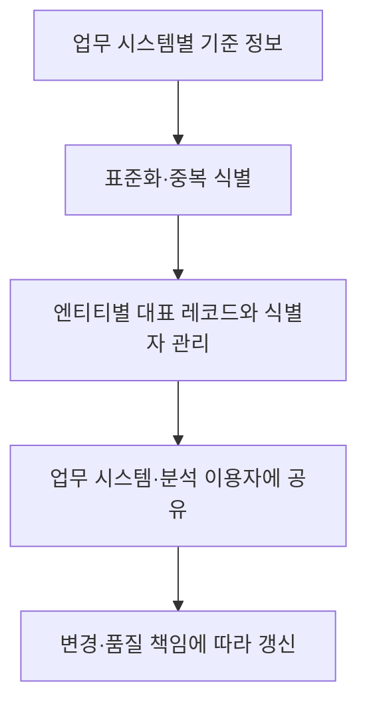
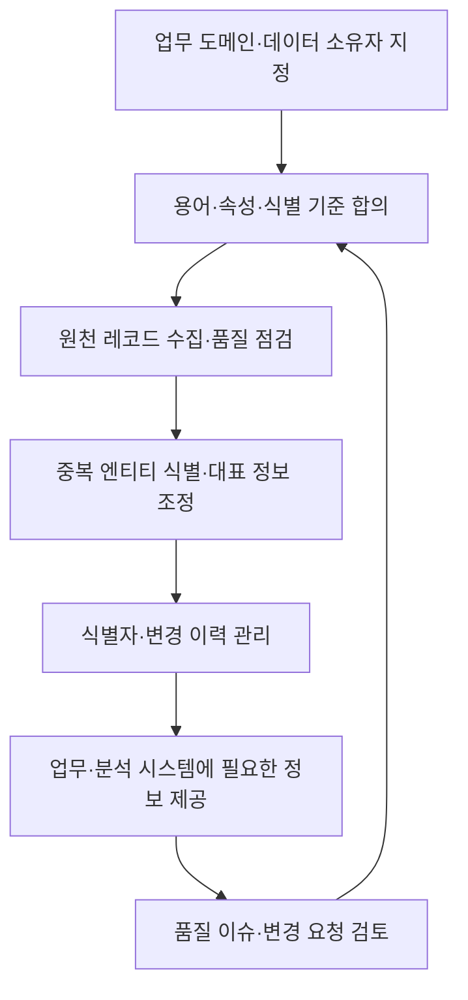

---
sidebar:
  order: 83
  label: "083. MDM (Master Data Management)"
  badge:
    text: "기초"
    variant: note
title: "MDM (Master Data Management, 마스터 데이터 관리) 및 4대 구축 아키텍처"
author: "Antigravity"
date: "2026-09-24T16:05:00+09:00"
tags:
  - "notes-data"
category: "03-data"
weight: 83
extra:
  model: "GPT-6"
  keyword_grade: "기초"
  question_no: "083"
---

## 지식 로드맵 내 현재 위치

데이터 관리 → 데이터 거버넌스·품질 → 마스터 데이터 관리

## 30초 인출

- 본질: **마스터 데이터 관리(MDM)**는 여러 업무 시스템에 흩어진 고객·상품 같은 기준 정보를 관리하는 조직·절차·기술의 결합
- 메커니즘: 원천별 레코드를 표준화·식별·조정하고, 식별자와 골든 레코드를 업무 필요에 맞게 공유
- 구조 선택: 원천 위치와 갱신 책임에 따라 Registry·Consolidated·Co-existence·Transactional 유형을 선택

핵심 용어

| 용어 | 설명 |
|---|---|
| **마스터 데이터 관리(Master Data Management, MDM)** | 조직의 공유 기준 정보를 식별·관리하고 이를 업무에 일관되게 제공하는 관리 체계 |
| **마스터 데이터(master data)** | 고객·제품·조직처럼 여러 업무 과정에서 참조하는 핵심 업무 엔티티 정보 |
| **골든 레코드(golden record)** | 여러 원천의 기록을 조정해 관리하는 엔티티의 대표 레코드 |
| **레지스트리(Registry)** | 원천 데이터를 유지하면서 시스템 간 엔티티 식별자 연결을 관리하는 방식 |
| **데이터 스튜어드(data steward)** | 담당 데이터의 정의·품질·변경을 실무에서 조정하는 역할 |
| **변경 데이터 캡처(Change Data Capture, CDC)** | 데이터베이스 변경을 감지해 다른 시스템으로 전달하는 연계 방식 |

---

## 1교시 예상문제 (10점)

> 마스터 데이터 관리(MDM)의 정의, 목적과 대표 구축 유형을 설명하시오. (예상)

---

## 1교시 10점 답안

### Ⅰ. MDM의 개요

| 구분 | 핵심 |
|---|---|
| 정의 | 조직의 공유 기준 정보를 식별·관리하고 이를 업무에 일관되게 제공하는 관리 체계 |
| 목적 | 시스템 간 기준 정보의 불일치와 중복을 줄여 업무·분석의 신뢰성 확보 |

### Ⅱ. 핵심 처리

| 단계 | 처리 내용 |
|---|---|
| 표준화 | 명칭·형식·속성 정의의 차이를 조정 |
| 식별·조정 | 같은 엔티티의 중복 레코드를 식별하고 출처·속성별 기준에 따라 대표 정보 구성 |
| 공유·유지 | 식별자와 변경 정보를 업무 시스템에 필요한 방식으로 제공하고 관리 |

### Ⅲ. 구축 유형

| 유형 | 데이터 관리 방식 |
|---|---|
| Registry | 원천 레코드를 두고 시스템 간 식별자 연결 중심으로 관리 |
| Consolidated | 원천 데이터를 허브에 모아 통합 뷰·분석 제공 |
| Co-existence | 허브와 원천이 기준 정보를 나누어 보유하며 변경을 연계 |
| Transactional | 허브가 기준 정보의 생성·변경을 주도하고 원천에 배포 |

**제언:** 데이터 도메인별 소유자·변경 책임과 원천별 갱신 방식을 먼저 정하는 MDM 설계

---

## 2~4교시 예상문제 (25점)

> 마스터 데이터 관리(MDM)의 개념과 필요성을 설명하고, 마스터 정보의 식별·통합·공유 절차와 대표 구축 유형을 비교하시오. (예상)

---

## 2~4교시 25점 답안

### Ⅰ. MDM의 개요

| 구분 | 핵심 |
|---|---|
| 정의 | 조직의 공유 기준 정보를 식별·관리하고 이를 업무에 일관되게 제공하는 관리 체계 |
| 목적 | 시스템 간 기준 정보의 불일치와 중복을 줄여 업무·분석의 신뢰성 확보 |

### Ⅱ. 마스터 데이터 관리 절차

### Ⅲ. 구축 유형과 데이터 통제 범위

| 유형 | 허브의 역할 | 변경·배포 특성 | 적합한 목적 |
|---|---|---|---|
| Registry | 원천 간 식별자 연결 관리 | 원천 데이터가 주 저장 위치 | 시스템 간 식별·탐색 |
| Consolidated | 원천 기록을 모아 통합 뷰 제공 | 통합 데이터로 분석·조회 지원 | 분석·보고 일관성 |
| Co-existence | 조정된 기준 정보를 허브·원천이 함께 관리 | 변경 연계와 동기화 설계 필요 | 운영 시스템에 기준 정보 공유 |
| Transactional | 중앙에서 기준 정보의 생성·변경 통제 | 중앙 변경을 원천에 배포 | 공통 기준의 중앙 운영 |

### Ⅳ. 거버넌스와 통제

| 관리 요소 | 확인 내용 |
|---|---|
| 데이터 책임 | 업무 데이터 소유자와 스튜어드의 결정·처리 권한 |
| 식별·중복 조정 | 일치 기준, 자동 조정 범위, 검토가 필요한 불확실 사례 |
| 변경·배포 | 변경 승인, 이벤트 전달, 실패 재처리, 원천별 동기화 상태 |
| 품질·감사 | 유효성 규칙, 출처와 변경 이력, 이용자의 오류 정정 경로 |

### Ⅴ. 도입 한계와 기술사적 제언

| 한계 | 해결 방안 |
|---|---|
| 시스템별 데이터 정의와 소유권이 다르면 단일 기준 합의가 지연될 수 있음 | 핵심 도메인부터 책임자·용어·식별 규칙을 합의하고 변경 절차를 문서화 |
| 중앙 허브와 여러 원천의 동기화가 지연되거나 실패할 수 있음 | 변경 이벤트·재처리·상태 감시를 설계하고 불일치 발견 시 정정 주체를 지정 |

**제언:** 업무 도메인의 데이터 책임·원천 갱신 방식·배포 실패 처리 기준을 포함한 단계적 MDM 목표 아키텍처

---

## 출제 이력과 검증 출처

- 정보관리기술사 제127회 2교시: MDM의 필요성, 주요 구성요소 및 구축 유형
- 컴퓨터시스템응용기술사 제120회 1교시: 마스터 데이터와 골든 레코드
- DAMA International, *DAMA-DMBOK: Data Management Body of Knowledge*, 2nd ed., Reference and Master Data
- [GS1 Global Data Model](https://www.gs1.org/standards/gs1-global-data-model): 공유 제품 데이터 정의의 표준화 사례

---

## 연결 토픽

- [003. 데이터 품질관리](./003_data_quality_management.md)
- [006. 데이터 거버넌스](./006_data_governance.md)
- [008. 데이터 표준화](./008_data_standardization.md)
