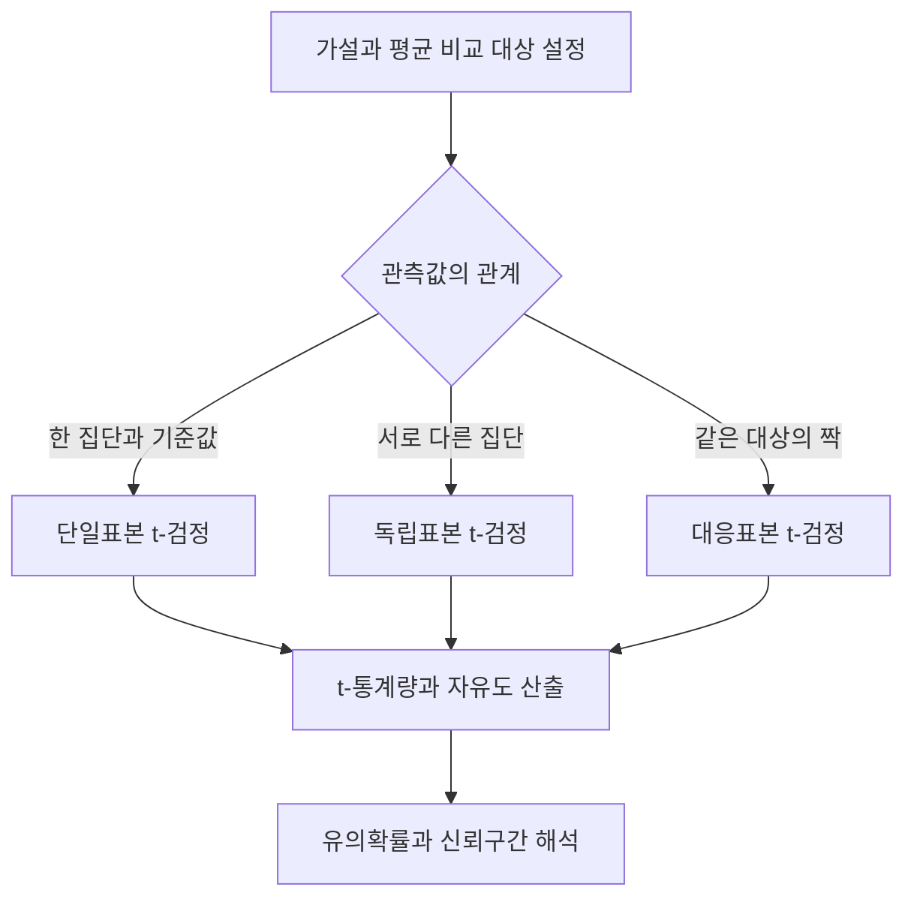
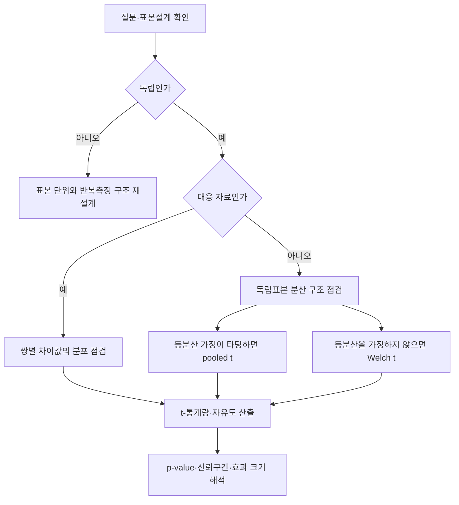

---
sidebar:
  order: 86
  label: "086. t-검정 (t-test)"
  badge:
    text: "기초"
    variant: note
title: "t-검정 (Student's t-test) 및 독립표본·대응표본 가설검정"
author: "Antigravity"
date: "2026-09-24T16:00:00+09:00"
tags:
  - "notes-data"
category: "03-data"
weight: 86
extra:
  model: "GPT-6"
  keyword_grade: "기초"
  question_no: "086"
---

## 지식 로드맵 내 현재 위치

데이터 분석 → 통계적 추론 → t-검정

## 30초 인출

- 본질: **t-검정**은 모집단 분산을 모를 때 표본 자료로 평균에 관한 가설을 검정하는 방법
- 메커니즘: 표본평균과 기준 평균의 차이를 표준오차로 나눈 t-통계량을 구하고, 자유도에 맞는 t-분포로 판단
- 유형 구분: 기준값과 한 집단은 단일표본, 서로 다른 두 집단은 독립표본, 같은 대상의 짝지은 관측값은 대응표본 t-검정

핵심 용어

| 용어 | 설명 |
|---|---|
| **t-검정(Student's t-test)** | 표본분산으로 표준오차를 추정해 모평균에 관한 가설을 검정하는 방법 |
| **자유도(Degrees of Freedom, df)** | 통계량의 분포를 정하는 독립 정보의 수 |
| **Welch t-검정** | 두 집단의 분산이 같다고 가정하지 않는 독립표본 평균 검정 |
| **유의확률(p-value)** | 귀무가설이 참이라는 가정 아래 관측 결과만큼 극단적인 통계량을 얻을 확률 |
| **효과 크기(effect size)** | 집단 간 차이의 크기를 표본 크기와 구별해 표현하는 지표 |

---

## 1교시 예상문제 (10점)

> t-검정의 정의, 목적과 주요 유형을 설명하시오. (예상)

---

## 1교시 10점 답안

### Ⅰ. t-검정의 개요

| 구분 | 핵심 |
|---|---|
| 정의 | 표본분산으로 표준오차를 추정해 모평균에 관한 가설을 검정하는 방법 |
| 목적 | 모집단 분산을 모르는 상황에서 표본평균의 차이가 우연한 표본오차만으로 설명되는지 판단 |

### Ⅱ. t-검정의 유형

| 유형 | 비교 대상 | 핵심 자료 |
|---|---|---|
| 단일표본 | 한 집단 평균과 기준값 | 한 표본 |
| 독립표본 | 서로 독립인 두 집단 평균 | 두 독립 표본 |
| 대응표본 | 같은 대상의 두 조건 평균 차이 | 짝지은 차이값 |

### Ⅲ. 검정 흐름

**제언:** 검정 유형과 가정을 먼저 확인하고 효과 크기·신뢰구간을 함께 보고하는 분석 절차

---

## 2~4교시 예상문제 (25점)

> t-검정의 개념과 원리를 설명하고, 단일표본·독립표본·대응표본의 적용 대상과 가정 점검 방법을 비교하시오. (예상)

---

## 2~4교시 25점 답안

### Ⅰ. t-검정의 개요

| 구분 | 핵심 |
|---|---|
| 정의 | 표본분산으로 표준오차를 추정해 모평균에 관한 가설을 검정하는 방법 |
| 목적 | 모집단 분산을 모르는 상황에서 표본평균의 차이가 우연한 표본오차만으로 설명되는지 판단 |

### Ⅱ. t-통계량의 원리

단일표본 검정에서는 다음 통계량을 사용하며, 귀무가설과 표본의 독립성·정규성 조건 아래 자유도 \(n-1\)인 t-분포를 따른다.

| 항목 | 의미 |
|---|---|
| \(t=(\bar{x}-\mu_0)/(s/\sqrt{n})\) | 기준 평균과 표본평균의 차이를 표준오차 단위로 표현 |
| \(\bar{x}, \mu_0\) | 표본평균과 귀무가설의 기준 평균 |
| \(s/\sqrt n\) | 표본표준편차로 추정한 표본평균의 표준오차 |
| \(n-1\) | 표본평균 추정에 사용된 자유도 |

### Ⅲ. 자료 관계에 따른 검정 선택

| 유형 | 적용 조건 | 통계량의 핵심 |
|---|---|---|
| 단일표본 | 한 모집단 평균과 기준값 비교 | \((\bar{x}-\mu_0)/(s/\sqrt n)\) |
| 독립표본 | 서로 독립인 두 집단 평균 비교 | 평균 차이를 두 표본의 표준오차로 나눔 |
| 대응표본 | 같은 대상·짝을 이룬 관측값의 평균 차이 비교 | 각 쌍의 차이 \(d_i\)를 단일표본처럼 검정 |

독립표본에서 등분산을 가정하지 않으면 Welch t-검정을 적용할 수 있다. 대응표본 검정의 정규성 가정은 각 집단의 값이 아니라 쌍별 차이값에 관한 가정이다.

### Ⅳ. 가정과 해석

| 점검 항목 | 해석과 주의점 |
|---|---|
| 독립성 | 표본 추출·실험 설계에서 확보할 조건으로, 단일 검정 하나로 보장되지 않음 |
| 정규성 | 작은 표본에서는 모집단 분포나 대응 차이값의 분포를 살핌; 큰 표본에서의 근사는 데이터 구조와 이상치 영향도 함께 고려 |
| 등분산성 | pooled 독립표본 검정의 가정; 분산 동일성이 불확실하면 Welch 방식으로 추정 가능 |
| 유의성 | 유의수준과 p-value를 비교하되 효과의 크기나 업무상 중요성과 동일시하지 않음 |

### Ⅴ. 분석 결과의 보고와 개선 제언

| 한계 | 해결 방안 |
|---|---|
| p-value만으로 차이의 크기나 실무 중요도를 알기 어려움 | 효과 크기와 신뢰구간을 함께 제시하고 사전 정의한 의사결정 기준과 비교 |
| 반복 관측·다중 비교가 독립성 또는 오류율 해석을 흐릴 수 있음 | 실험 단위와 비교 횟수를 사전에 정하고 자료 구조에 맞는 분석 방법 선택 |

**제언:** 분석계에 가설·표본설계·검정 선택 근거와 효과 크기·신뢰구간을 함께 기록하는 결과 검토 절차

---

## 출제 이력과 검증 출처

- 정보관리기술사 제132회 2교시 1번: 중심극한정리, t-검정, z-검정
- 컴퓨터시스템응용기술사 제131회 1교시: 독립표본 t-검정과 대응표본 t-검정
- 정보관리기술사 제121회 1교시: 가설검정의 오류와 t-검정
- [NIST/SEMATECH Engineering Statistics Handbook: Two-Sample t-Test](https://www.itl.nist.gov/div898/handbook/eda/section3/eda353.htm)
- [R stats 공식 문서: Student's t-Test](https://stat.ethz.ch/R-manual/R-devel/library/stats/html/t.test.html)
- Gosset, W. S. (1908), “The Probable Error of a Mean,” *Biometrika*

---

## 연결 토픽

- [041. 가설검정](./041_hypothesis_testing.md)
- [036. 기술통계 vs 추론통계](./036_descriptive_statistics.md)
- [012. z-검정](./012_z_test.md)
