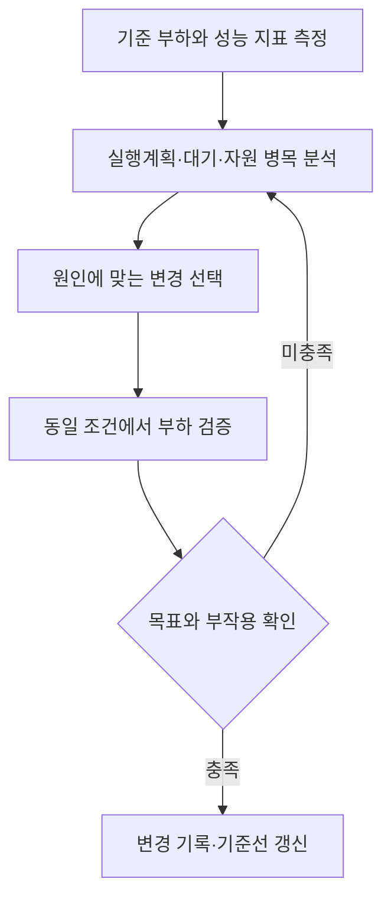
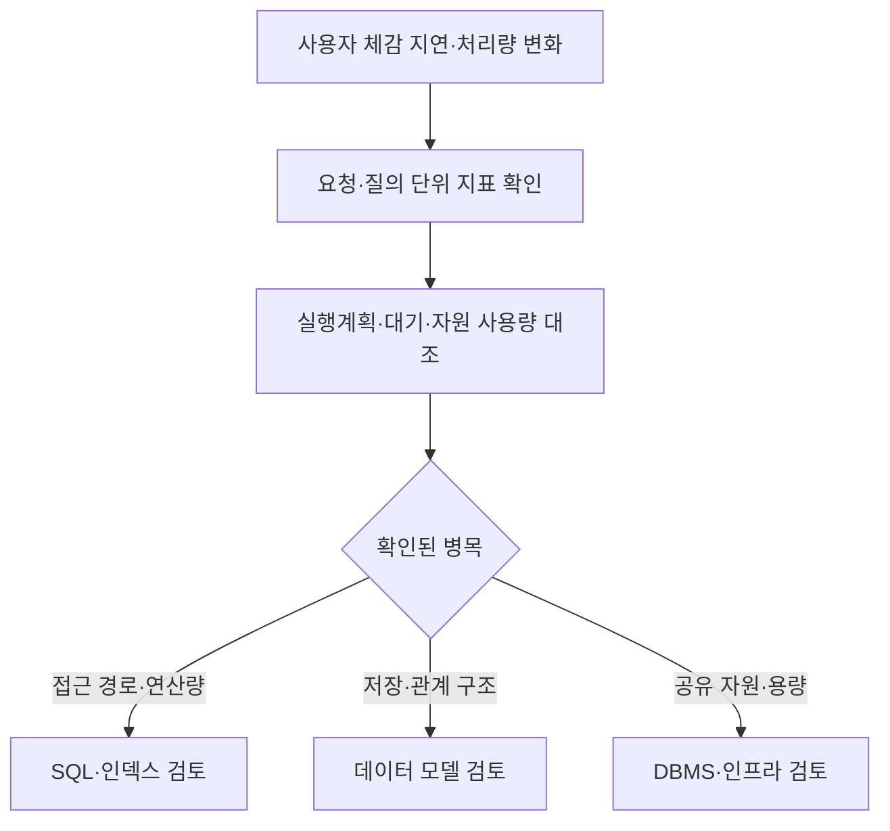
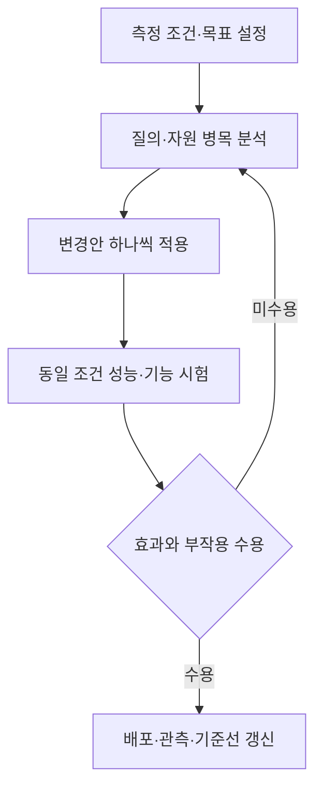

---
sidebar:
  order: 88
  label: "088. 데이터베이스 튜닝 (Database Tuning)"
  badge:
    text: "기초"
    variant: note
title: "데이터베이스 튜닝 (Database Tuning) 및 3대 계층별 접근 전략"
author: "Antigravity"
date: "2026-09-24T16:10:00+09:00"
tags:
  - "notes-data"
weight: 88
extra:
  model: "GPT-6"
  keyword_grade: "기초"
  question_no: "088"
---

## 지식 로드맵 내 현재 위치

데이터베이스 → 물리적 설계·운영 → 성능 관리와 튜닝

## 30초 인출

- 본질: **데이터베이스 튜닝**은 측정된 성능 병목을 찾아 데이터 구조·DBMS 자원·질의 접근을 개선하는 작업
- 메커니즘: 기준 부하와 지표 측정 → 원인 분석 → 변경 → 동일 조건의 전후 검증
- 접근 영역: 데이터 모델·DBMS 환경·SQL과 인덱스를 함께 살피되 병목 근거에 맞춰 조정

핵심 용어

| 용어 | 설명 |
|---|---|
| **데이터베이스 튜닝(Database Tuning)** | 데이터베이스의 응답·처리 성능을 측정하고 병목을 개선하는 작업 |
| **실행계획(execution plan)** | 질의를 수행하기 위해 옵티마이저가 선택한 접근·조인 연산의 계획 |
| **인덱스(index)** | 조건 검색과 정렬 등을 지원하도록 키와 행 위치를 관리하는 자료구조 |
| **대기 이벤트(wait event)** | 세션이 CPU 외의 자원이나 작업 완료를 기다리는 상태를 나타내는 관측 정보 |
| **서비스 수준 목표(Service Level Objective, SLO)** | 서비스 성능·신뢰성에 대해 합의한 측정 가능한 목표 |

---

## 1교시 예상문제 (10점)

> 데이터베이스 튜닝의 정의, 목적과 주요 접근 영역을 설명하시오. (예상)

---

## 1교시 10점 답안

### Ⅰ. 데이터베이스 튜닝의 개요

| 구분 | 핵심 |
|---|---|
| 정의 | 데이터베이스의 응답·처리 성능을 측정하고 병목을 개선하는 작업 |
| 목적 | 업무 부하에 맞는 자원 사용과 예측 가능한 질의 성능 확보 |

### Ⅱ. 주요 튜닝 영역

| 영역 | 점검 대상 |
|---|---|
| 데이터 모델 | 엔티티·관계·저장 구조와 데이터 접근 패턴 |
| DBMS 환경 | CPU·메모리·저장장치·동시성·설정값 |
| SQL·접근 경로 | 질의문·실행계획·인덱스·조인 방식 |

### Ⅲ. 반복 개선 절차

**제언:** 튜닝 변경마다 원인·예상 효과·부작용과 동일 조건의 전후 측정값을 기록하는 운영 기준

---

## 2~4교시 예상문제 (25점)

> 데이터베이스 튜닝의 개념과 목적을 설명하고, 데이터 모델·DBMS 환경·SQL 및 인덱스 영역의 점검 항목과 튜닝 절차를 서술하시오. (예상)

---

## 2~4교시 25점 답안

### Ⅰ. 데이터베이스 튜닝의 개요

| 구분 | 핵심 |
|---|---|
| 정의 | 데이터베이스의 응답·처리 성능을 측정하고 병목을 개선하는 작업 |
| 목적 | 업무 부하에 맞는 자원 사용과 예측 가능한 질의 성능 확보 |

### Ⅱ. 병목을 찾는 관측 관계

### Ⅲ. 튜닝 영역과 조정 항목

| 영역 | 주요 점검 | 대표 조정 |
|---|---|---|
| 데이터 모델 | 중복·관계·데이터 증가·접근 빈도 | 정규화·반정규화 검토, 파티션·저장 구조 설계 |
| DBMS·인프라 | CPU·메모리·디스크·동시 세션·대기 | 용량·설정·배치 시간 조정, 자원 경합 완화 |
| SQL·인덱스 | 실행계획·조건절·조인·정렬·논리 읽기 | SQL 수정, 통계 갱신, 인덱스 추가·변경·제거 |

인덱스는 조회 경로를 줄일 수 있지만 저장 공간과 삽입·수정·삭제 비용을 늘릴 수 있다. 인덱스 컬럼 가공도 항상 사용 불가를 뜻하지 않으며, 표현식 인덱스 등 DBMS 기능과 질의 형태에 따라 달라진다.

### Ⅳ. 측정과 변경 검증

| 순서 | 수행 내용 | 확인 근거 |
|---|---|---|
| 1 | 재현 가능한 부하와 목표 지표 설정 | 요청량, 동시성, 응답시간·처리량 기준 |
| 2 | 지연 구간과 주요 질의 식별 | 응용 추적, 질의 통계, 자원·대기 지표 |
| 3 | 실행계획과 병목 원인 분석 | 추정·실측 행 수, 읽기량, CPU·I/O 대기 |
| 4 | 원인에 맞춰 한정된 변경 적용 | 변경 전후 계획·설정·코드 차이 |
| 5 | 동일 조건 부하와 기능 회귀 검증 | 성능 목표, 오류율, 자원·쓰기 영향 |

### Ⅴ. 운영 한계와 기술사적 제언

| 한계 | 해결 방안 |
|---|---|
| 평균값만 보면 느린 일부 요청이나 시점별 변동을 놓칠 수 있음 | 부하 조건과 구간별 지표를 함께 두고 백분위 응답시간·오류율·자원량을 대조 |
| 한 번의 변경이 조회 성능을 높이면서 쓰기·저장 비용을 악화시킬 수 있음 | 격리된 시험과 회귀 부하를 거쳐 변경 단위를 제한하고 롤백 기준을 마련 |

**제언:** 질의 추적·실행계획·부하 시험 결과를 변경 이력에 연결하는 성능 회귀 관리 체계

---

## 출제 이력과 검증 출처

- 정보관리기술사 제127회 1교시: 데이터베이스 튜닝의 영역과 절차
- Oracle, [Database Performance Tuning Guide](https://docs.oracle.com/en/database/oracle/oracle-database/19/tgdba/)
- PostgreSQL, [Using EXPLAIN](https://www.postgresql.org/docs/current/using-explain.html)
- PostgreSQL, [Indexes](https://www.postgresql.org/docs/current/indexes.html)

---

## 연결 토픽

- [047. 인덱스](./047_index.md)
- [091. 옵티마이저](./091_optimizer.md)
- [021. DB 파티셔닝과 샤딩](./021_db_partitioning_sharding.md)
