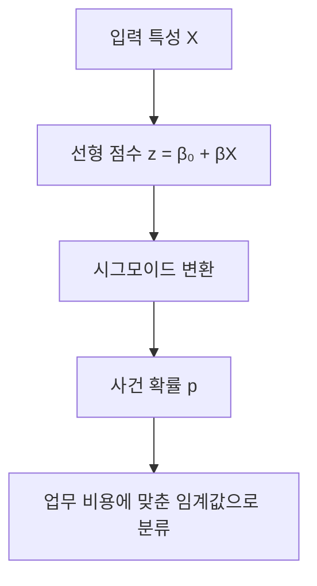

---
sidebar:
  order: 89
  label: "089. 로지스틱 회귀분석 (Logistic Regression)"
  badge:
    text: "기초"
    variant: note
title: "로지스틱 회귀분석 (Logistic Regression) 및 오즈비와 시그모이드 수학적 유도"
author: "Antigravity"
date: "2026-09-24T16:20:00+09:00"
tags:
  - "notes-data"
weight: 89
extra:
  model: "GPT-6"
  keyword_grade: "기초"
  question_no: "089"
---

## 지식 로드맵 내 현재 위치

데이터 분석 → 통계적 학습 → 분류 모델

## 30초 인출

- 본질: **로지스틱 회귀**는 입력 특성으로 범주 사건의 확률을 추정하는 통계 모델
- 메커니즘: 입력의 선형 결합을 로짓으로 두고, 역로짓인 시그모이드로 확률을 계산
- 해석: 계수는 다른 변수를 고정했을 때 로그 오즈 변화량이며, 지수화한 계수는 오즈비

<details>
<summary>핵심 용어</summary>

| 용어 | 설명 |
|---|---|
| **로지스틱 회귀(Logistic Regression)** | 입력 변수와 사건 확률 사이를 로짓 함수로 모형화하는 통계적 분류 모델 |
| **오즈(odds)** | 사건 발생 확률을 미발생 확률로 나눈 값 \(p/(1-p)\) |
| **로짓(logit)** | 확률의 오즈에 자연로그를 취한 값 |
| **시그모이드(sigmoid)** | 실수 입력을 0과 1 사이의 값으로 변환하는 로지스틱 함수 |
| **오즈비(Odds Ratio, OR)** | 설명 변수가 한 단위 바뀔 때 오즈가 곱해지는 비율; 다른 변수 고정 조건의 계수 해석 |
| **최대우도추정(Maximum Likelihood Estimation, MLE)** | 관측 표본이 주어졌을 우도를 크게 하는 모수를 추정하는 방법 |

</details>

---

## 1교시 예상문제 (10점)

> 로지스틱 회귀분석의 정의, 목적과 확률 추정 원리를 설명하시오. (예상)

---

## 1교시 10점 답안

### Ⅰ. 로지스틱 회귀의 개요

| 구분 | 핵심 |
|---|---|
| 정의 | 입력 변수와 사건 확률 사이를 로짓 함수로 모형화하는 통계적 분류 모델 |
| 목적 | 입력 조건에 따른 범주 사건의 확률을 추정해 분류·판단을 지원 |

### Ⅱ. 확률 변환

| 표현 | 의미 |
|---|---|
| \(p=P(Y=1\mid X)\) | 입력 \(X\)에서 사건 \(Y=1\)이 발생할 조건부 확률 |
| \(\log(p/(1-p))=\beta_0+\sum_i\beta_i x_i\) | 로그 오즈를 설명 변수의 선형 결합으로 표현 |
| \(p=1/(1+e^{-z})\) | 선형 점수 \(z\)를 확률 범위로 변환 |



**제언:** 확률 예측과 최종 분류 기준을 구분하고 업무 오분류 비용에 맞춰 임계값을 검증하는 모델 운영

---

## 2~4교시 예상문제 (25점)

> 로지스틱 회귀분석의 개념과 확률 추정 원리를 설명하고, 오즈·로짓·시그모이드의 관계와 계수 해석 시 유의점을 서술하시오. (예상)

---

## 2~4교시 25점 답안

### Ⅰ. 로지스틱 회귀의 개요

| 구분 | 핵심 |
|---|---|
| 정의 | 입력 변수와 사건 확률 사이를 로짓 함수로 모형화하는 통계적 분류 모델 |
| 목적 | 입력 조건에 따른 범주 사건의 확률을 추정해 분류·판단을 지원 |

### Ⅱ. 오즈·로짓·확률의 변환 관계

```mermaid
flowchart TD
    A[사건 확률 p] -->|오즈로 변환| B[p / (1-p)]
    B -->|자연로그| C[로짓 log(p / (1-p))]
    C -->|설명변수의 선형 결합으로 모형화| D[β₀ + βX]
    D -->|역로짓·시그모이드| E[추정 확률 1 / (1 + e⁻ᶻ)]
```

### Ⅲ. 추정과 계수 해석

| 항목 | 내용 |
|---|---|
| 모수 추정 | 이진 반응의 우도를 최대화하는 계수를 추정 |
| 계수 \(\beta_i\) | 다른 설명 변수를 고정할 때 \(x_i\) 한 단위 증가에 따른 로그 오즈 변화량 |
| \(e^{\beta_i}\) | 같은 조건에서 \(x_i\) 한 단위 증가 시 오즈에 곱해지는 비율 |
| 분류 기준 | 추정 확률을 임계값과 비교해 클래스를 정하되, 임계값은 오분류 비용·목표에 따라 선택 |

오즈비는 확률의 증가 배수나 인과 효과와 같지 않다. 관찰 자료에서 인과를 말하려면 별도의 연구 설계와 교란 통제가 필요하다. 이진 분류를 넘어선 다범주 결과에는 기준 범주를 둔 다항 로지스틱 회귀 등 확장을 검토한다.

### Ⅳ. 모델 검증과 적용 한계

| 한계 | 대응 |
|---|---|
| 클래스 불균형에서 정확도만 보면 소수 클래스를 놓칠 수 있음 | 혼동행렬과 정밀도·재현율·정밀도-재현율 곡선을 함께 살피고 운영 목표에 맞춰 임계값 결정 |
| 설명 변수 간 강한 상관은 계수 추정의 불확실성을 키울 수 있음 | 변수 정의·상관 구조를 확인하고 정규화 등 추정 안정화 방법을 검증 |
| 학습 자료와 운영 분포가 달라지면 확률 보정·성능이 저하될 수 있음 | 시간·집단 분리 검증, 확률 보정과 운영 후 성능 감시 적용 |

### Ⅴ. 기술사적 제언

| 한계 | 해결 방안 |
|---|---|
| 점수 임계값을 고정하면 업무별 오분류 비용을 반영하지 못함 | 예측 확률, 임계값 근거, 오분류 비용과 재검토 조건을 모델 변경 이력에 기록 |

**제언:** 데이터·모형·임계값·운영 결과를 함께 검증하는 재현 가능한 모델 관리 절차

---

## 출제 이력과 검증 출처

- 정보관리기술사 제124회 1교시: 로지스틱 회귀분석, 오즈비 및 시그모이드
- 컴퓨터시스템응용기술사 제120회 2교시: 선형 분류 기법과 로지스틱 회귀분석
- Hosmer, Lemeshow & Sturdivant, *Applied Logistic Regression*, 3rd ed.
- [Penn State STAT 504: Logistic Regression](https://online.stat.psu.edu/stat504/lesson/6)
- [scikit-learn User Guide: Logistic Regression](https://scikit-learn.org/stable/modules/linear_model.html#logistic-regression)

---

## 연결 토픽

- [036. 기술통계 vs 추론통계](./036_descriptive_statistics.md)
- [043. 데이터마이닝](./043_data_mining.md)
- [062. 앙상블: 배깅·부스팅](./062_ensemble_bagging_boosting.md)
