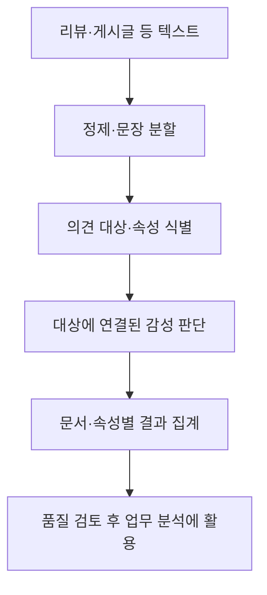
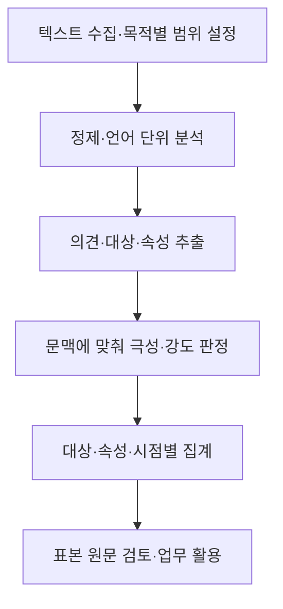

---
sidebar:
  order: 90
  label: "090. 오피니언 마이닝 (Opinion Mining)"
  badge:
    text: "기초"
    variant: note
title: "오피니언 마이닝(Opinion Mining) 및 속성 기반 감성 분석(ABSA) 체계"
author: "Antigravity"
date: "2026-09-24T16:25:00+09:00"
tags:
  - "notes-data"
weight: 90
extra:
  model: "GPT-6"
  keyword_grade: "기초"
  question_no: "090"
---

## 지식 로드맵 내 현재 위치

데이터 분석 → 텍스트 분석 → 오피니언 마이닝

## 30초 인출

- 본질: **오피니언 마이닝**은 텍스트에 표현된 의견의 대상과 태도를 찾아 구조화하는 분석
- 메커니즘: 의견 문서에서 개체·속성·극성과 문맥을 추출하고, 필요하면 작성자·시점 정보를 연결
- 적용: 문서 전체 감성뿐 아니라 속성별 의견을 구분해 제품·서비스 개선 판단에 활용

핵심 용어

| 용어 | 설명 |
|---|---|
| **오피니언 마이닝(Opinion Mining)** | 텍스트에서 의견의 대상과 평가·감정을 식별하는 분석 |
| **감성 분석(Sentiment Analysis)** | 텍스트에 나타난 감성 극성·강도 등을 분류하거나 추정하는 작업 |
| **속성 기반 감성 분석(Aspect-Based Sentiment Analysis, ABSA)** | 개체의 특정 속성에 연결된 감성을 분석하는 방법 |
| **개체(Entity)** | 의견이 향하는 제품·서비스 등 평가 대상 |
| **극성(polarity)** | 의견을 긍정·부정·중립 등으로 표현한 방향 |

---

## 1교시 예상문제 (10점)

> 오피니언 마이닝의 정의, 목적과 처리 구조를 설명하시오. (예상)

---

## 1교시 10점 답안

### Ⅰ. 오피니언 마이닝의 개요

| 구분 | 핵심 |
|---|---|
| 정의 | 텍스트에서 의견의 대상과 평가·감정을 식별하는 분석 |
| 목적 | 비정형 의견을 구조화해 이용자·제품·서비스에 관한 판단을 지원 |

### Ⅱ. 의견 정보의 구성

| 구성 | 확인 내용 |
|---|---|
| 대상 | 의견이 향하는 개체와 세부 속성 |
| 평가 | 문맥에 맞춘 감성 방향·강도 |
| 맥락 | 부정·반어·비교와 의견의 작성 시점 등 |

### Ⅲ. 분석 흐름

**제언:** 감성 예측 결과에 원문 근거와 검토 상태를 함께 보존하는 의견 분석 체계

---

## 2~4교시 예상문제 (25점)

> 오피니언 마이닝의 개념과 처리 구조를 설명하고, 문서 단위 감성 분석과 속성 기반 감성 분석의 차이 및 운영 시 유의점을 서술하시오. (예상)

---

## 2~4교시 25점 답안

### Ⅰ. 오피니언 마이닝의 개요

| 구분 | 핵심 |
|---|---|
| 정의 | 텍스트에서 의견의 대상과 평가·감정을 식별하는 분석 |
| 목적 | 비정형 의견을 구조화해 이용자·제품·서비스에 관한 판단을 지원 |

### Ⅱ. 분석 대상과 처리 구조

| 의견 요소 | 확인할 정보 | 예시 |
|---|---|---|
| 개체 | 평가의 대상 | 모바일 앱 |
| 속성 | 개체 안의 평가 항목 | 로그인, 화면, 응답속도 |
| 감성 | 해당 속성에 대한 평가 | 긍정·부정·중립 또는 세분 점수 |
| 맥락 | 부정·반어·비교·작성 시점 등 | “빠르긴 하지만 자주 끊긴다” |

### Ⅲ. 문서 단위와 속성 기반 분석

| 구분 | 문서 단위 분석 | 속성 기반 분석 |
|---|---|---|
| 결과 단위 | 문서 전체의 감성 | 개체의 세부 속성별 감성 |
| 장점 | 집계·경향 파악이 단순 | 한 문서 안의 상반된 평가를 분리 |
| 유의점 | 복합 의견이 하나의 점수에 묻힐 수 있음 | 속성 표현·감성 대상의 연결 오류를 점검 |

예를 들어 “화면은 선명하지만 앱은 자주 멈춘다”는 문장에서 화면과 앱 안정성에 대한 평가를 따로 연결한다.

### Ⅳ. 품질 관리와 적용

| 한계 | 대응 |
|---|---|
| 반어·부정 범위·도메인 용법이 단순 단어 사전과 다를 수 있음 | 문맥 포함 표본을 주기적으로 검토하고 해당 도메인의 평가 기준을 보완 |
| 학습 자료와 실제 이용자 언어가 달라지면 분류 품질이 떨어질 수 있음 | 시간·집단별 평가 자료를 마련하고 오류 사례로 재평가 |
| 집계 점수가 원문 맥락 없이 의사결정에 쓰일 수 있음 | 원문 근거·분석 버전·집계 기준을 연결하고 민감한 조치 전 사람 검토 |

### Ⅴ. 기술사적 제언

| 한계 | 해결 방안 |
|---|---|
| 전체 평점만 보면 어떤 기능의 개선이 필요한지 구별하기 어려움 | 속성별 의견을 업무 분류와 연결하되 원문 표본으로 자동 분석 결과를 확인 |

**제언:** 속성별 집계와 원문 추적을 함께 제공하는 고객 의견 분석 데이터 흐름

---

## 출제 이력과 검증 출처

- [IBM 감성 분석·오피니언 마이닝 개요](https://www.ibm.com/think/topics/sentiment-analysis): 텍스트의 의견·감성 분석과 규칙·학습 기반 처리

- 정보관리기술사 제122회 2교시: 빅데이터 분석에서 오피니언 마이닝의 개념·절차·감성 분석 기법
- Bing Liu, *Sentiment Analysis and Opinion Mining*, Morgan & Claypool Publishers
- Bing Liu, “Sentiment Analysis and Opinion Mining,” *Synthesis Lectures on Human Language Technologies*, 2012

---

## 연결 토픽

- [015. 텍스트 마이닝](./015_text_mining.md)
- [043. 데이터 마이닝](./043_data_mining.md)
