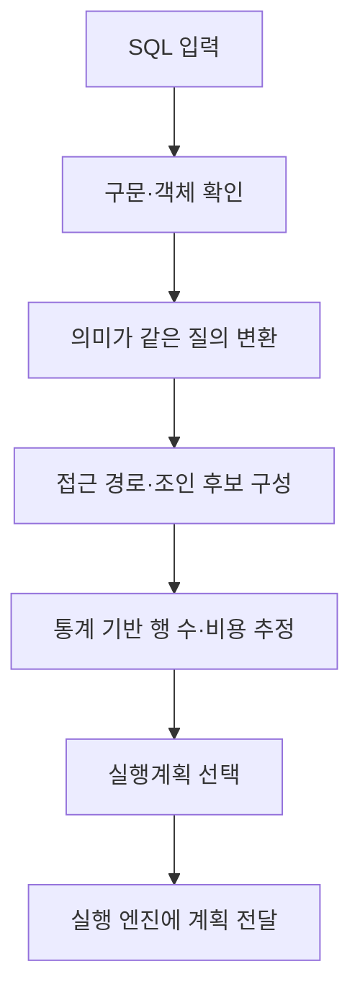
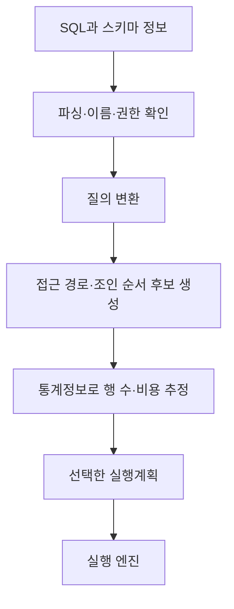

---
sidebar:
  order: 91
  label: "091. 옵티마이저 (RBO·CBO)"
  badge:
    text: "기초"
    variant: note
title: "데이터베이스 옵티마이저(Optimizer) 아키텍처 및 RBO와 CBO 비교 분석"
author: "Antigravity"
date: "2026-09-24T16:30:00+09:00"
tags:
  - "notes-data"
weight: 91
extra:
  model: "GPT-6"
  keyword_grade: "기초"
  question_no: "091"
---

## 지식 로드맵 내 현재 위치

데이터베이스 → SQL 실행·성능관리 → 질의 최적화

## 30초 인출

- 본질: **데이터베이스 옵티마이저**는 SQL 결과를 만들 실행 방법을 선택하는 DBMS 구성요소
- 메커니즘: 질의를 변환하고 통계·비용 추정에 따라 접근 경로와 조인 계획을 비교해 실행계획을 선택
- 관리: 실행계획은 데이터 분포·통계·설정에 따라 달라질 수 있어 실제 부하와 실행 결과를 대조

핵심 용어

| 용어 | 설명 |
|---|---|
| **데이터베이스 옵티마이저(database optimizer)** | SQL을 수행할 실행계획 후보를 평가·선택하는 DBMS 구성요소 |
| **실행계획(execution plan)** | 접근 경로·연산 순서·조인 방식 등 질의 실행 방법 |
| **비용 기반 옵티마이저(Cost-Based Optimizer, CBO)** | 통계와 비용 추정치를 사용해 실행계획을 선택하는 최적화 방식 |
| **규칙 기반 옵티마이저(Rule-Based Optimizer, RBO)** | 사전 정의된 규칙 우선순위로 실행계획을 고르는 방식 |
| **카디널리티(cardinality)** | 연산 결과로 예상되는 행 수 |
| **선택도(selectivity)** | 조건을 만족하는 행의 비율에 대한 추정치 |

---

## 1교시 예상문제 (10점)

> 데이터베이스 옵티마이저의 정의, 목적과 기본 작동 원리를 설명하시오. (예상)

---

## 1교시 10점 답안

### Ⅰ. 옵티마이저의 개요

| 구분 | 핵심 |
|---|---|
| 정의 | SQL을 수행할 실행계획 후보를 평가·선택하는 DBMS 구성요소 |
| 목적 | 질의 결과를 정확히 유지하면서 적절한 자원으로 실행할 방법 선택 |

### Ⅱ. 최적화 흐름

### Ⅲ. 핵심 판단 요소

| 요소 | 최적화에서의 역할 |
|---|---|
| 통계정보 | 테이블·열의 크기와 데이터 분포를 추정하는 입력 |
| 선택도·카디널리티 | 조건·연산 결과의 예상 행 수 산정 |
| 비용 추정 | 후보 계획의 자원 소모를 비교하기 위한 모델값 |

**제언:** 실행계획과 실제 처리량·대기 지표를 함께 살피는 질의 성능 점검

---

## 2~4교시 예상문제 (25점)

> 데이터베이스 옵티마이저의 역할과 처리 과정을 설명하고, 규칙 기반과 비용 기반 최적화의 차이 및 실행계획 검증 방법을 서술하시오. (예상)

---

## 2~4교시 25점 답안

### Ⅰ. 옵티마이저의 개요

| 구분 | 핵심 |
|---|---|
| 정의 | SQL을 수행할 실행계획 후보를 평가·선택하는 DBMS 구성요소 |
| 목적 | 질의 결과를 정확히 유지하면서 적절한 자원으로 실행할 방법 선택 |

### Ⅱ. 실행계획 결정 과정

### Ⅲ. RBO와 CBO 비교

| 비교 기준 | RBO | CBO |
|---|---|---|
| 계획 선택 | 미리 정한 규칙 우선순위 | 통계와 비용 추정에 따른 후보 비교 |
| 주요 입력 | 질의 형태와 적용 규칙 | 통계정보·데이터 분포·비용 모델 |
| 데이터 변화 대응 | 데이터량·분포 변화를 직접 반영하기 어려움 | 통계 갱신을 통해 추정에 반영 가능 |
| 유의점 | 특정 규칙의 우선이 실제 부하에 맞지 않을 수 있음 | 통계·추정 오차로 실제 실행이 예상과 다를 수 있음 |

현대 상용·오픈소스 DBMS는 주로 비용 기반 최적화를 사용한다. 세부 단계와 기능은 제품별 구현에 따라 다르므로 RBO의 고정 순위 수나 적응형 계획 전환을 모든 DBMS의 공통 동작으로 단정하지 않는다.

### Ⅳ. 실행계획 품질과 운영 검증

| 확인 항목 | 점검 방법 |
|---|---|
| 추정 정확도 | 계획의 예상 행 수와 실제 실행 행 수 비교 |
| 접근 경로 | 인덱스·테이블 스캔 선택이 질의 범위와 데이터 분포에 맞는지 확인 |
| 조인·정렬 | 중간 결과 크기와 메모리·임시 저장 사용 관찰 |
| 안정성 | 대표 데이터 분포와 부하 조건에서 성능 편차·회귀 측정 |

### Ⅴ. 운영 한계와 기술사적 제언

| 한계 | 해결 방안 |
|---|---|
| 통계가 오래되거나 분포 특성을 충분히 담지 못하면 행 수 추정이 빗나갈 수 있음 | 통계 수집 정책을 관리하고 계획 추정과 실제 실행 통계를 정기 비교 |
| 한 계획이 모든 입력값·부하에서 같은 성능을 내지 않을 수 있음 | 대표 입력값별 성능을 시험하고 계획 고정은 DBMS 기능·운영 위험을 검토한 뒤 적용 |

**제언:** SQL 변경·통계 갱신과 실행계획·실측 성능을 연결해 검토하는 계획 회귀 관리

---

## 출제 이력과 검증 출처

- 정보관리기술사 제127회 2교시: 데이터베이스 옵티마이저의 역할·구성요소·최적화 과정, RBO와 CBO
- Oracle, [Database SQL Tuning Guide: SQL Processing](https://docs.oracle.com/en/database/oracle/oracle-database/19/tgsql/sql-processing.html)
- PostgreSQL, [Query Planning](https://www.postgresql.org/docs/current/planner-optimizer.html)
- PostgreSQL, [Using EXPLAIN](https://www.postgresql.org/docs/current/using-explain.html)

---

## 연결 토픽

- [088. 데이터베이스 튜닝](./088_database_tuning.md)
- [047. 인덱스](./047_index.md)
- [098. 정적 SQL vs 동적 SQL](./098_dynamic_sql.md)
