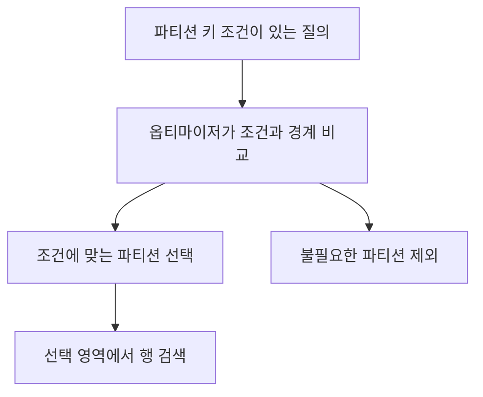
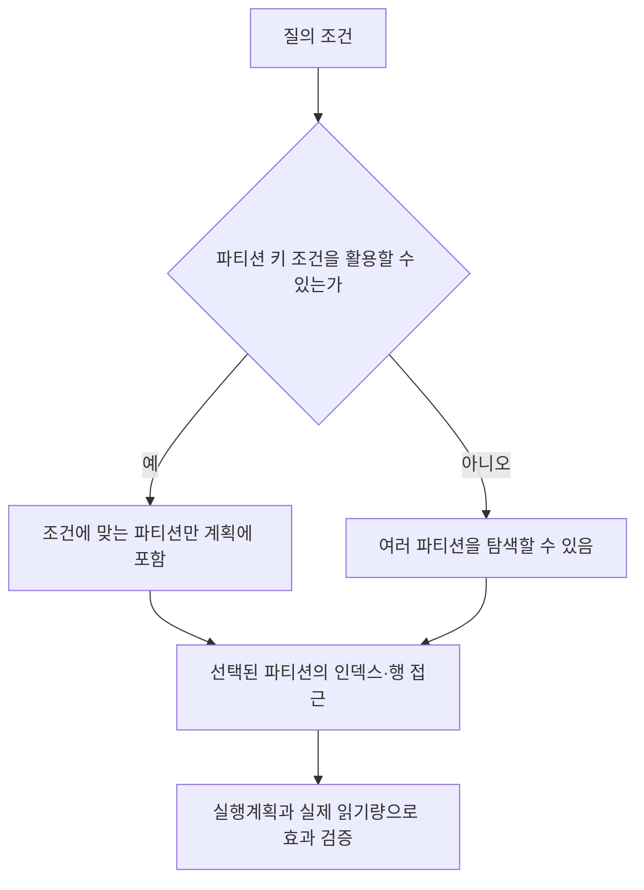

---
sidebar:
  order: 92
  label: "092. 파티셔닝 (Partitioning)"
  badge:
    text: "기초"
    variant: note
title: "데이터베이스 파티셔닝(Partitioning) 전략과 데이터 분할 아키텍처"
author: "Antigravity"
date: "2026-09-24T16:40:00+09:00"
tags:
  - "notes-data"
weight: 92
extra:
  model: "GPT-6"
  keyword_grade: "기초"
  question_no: "092"
---

## 지식 로드맵 내 현재 위치

데이터베이스 → 물리 구조·성능 관리 → 테이블 파티셔닝

## 30초 인출

- 본질: **테이블 파티셔닝**은 한 논리 테이블의 행을 키 기준에 따라 여러 물리 단위로 나누는 DBMS 기능
- 메커니즘: 파티션 키로 행을 배치하고, 조건에 맞는 파티션만 읽도록 제거(pruning)하며 관리 단위를 분리
- 선택: 범위·목록·해시 등은 키 분포와 질의 패턴에 맞춰 정하며, 실제 지원 범위는 DBMS별 확인

핵심 용어

| 용어 | 설명 |
|---|---|
| **파티셔닝(partitioning)** | 하나의 논리 테이블을 파티션 단위로 분할·관리하는 DBMS 기능 |
| **파티션 키(partition key)** | 행이 어느 파티션에 속하는지 결정하는 열 또는 표현식 |
| **파티션 프루닝(partition pruning)** | 조건에 맞지 않는 파티션을 실행 대상에서 제외하는 최적화 |
| **로컬 인덱스(local index)** | 대응하는 테이블 파티션별로 나뉘어 관리되는 인덱스 |
| **글로벌 인덱스(global index)** | 여러 테이블 파티션에 걸친 키 범위를 관리하는 인덱스 구조 |
| **샤딩(sharding)** | 데이터를 여러 독립 노드에 나누어 분산 저장하는 수평 분산 방식 |

---

## 1교시 예상문제 (10점)

> 데이터베이스 파티셔닝의 정의, 목적과 대표 분할 방식을 설명하시오. (예상)

---

## 1교시 10점 답안

### Ⅰ. 파티셔닝의 개요

| 구분 | 핵심 |
|---|---|
| 정의 | 하나의 논리 테이블을 파티션 단위로 분할·관리하는 DBMS 기능 |
| 목적 | 질의 접근 범위와 대량 데이터의 운영·유지보수 단위를 조정 |

### Ⅱ. 대표 분할 방식

| 방식 | 분할 기준 | 대표 고려사항 |
|---|---|---|
| 범위(Range) | 값의 구간 | 날짜·수치 범위 질의와 보관기간 관리 |
| 목록(List) | 지정된 값 집합 | 코드별 분류와 미등록 값 처리 |
| 해시(Hash) | 키의 해시 결과 | 균등 분산 목적, 범위 질의에는 제한 |
| 복합(Composite) | 둘 이상의 분할 기준 조합 | 여러 접근 패턴과 운영 복잡성 조정 |

### Ⅲ. 파티션 프루닝

**제언:** 파티션 키·질의 조건·DBMS 인덱스 유지 방식을 함께 검증하는 물리 설계

---

## 2~4교시 예상문제 (25점)

> 데이터베이스 파티셔닝의 개념과 목적을 설명하고, 분할 방식·파티션 프루닝·인덱스 구조 및 샤딩과의 차이를 서술하시오. (예상)

---

## 2~4교시 25점 답안

### Ⅰ. 파티셔닝의 개요

| 구분 | 핵심 |
|---|---|
| 정의 | 하나의 논리 테이블을 파티션 단위로 분할·관리하는 DBMS 기능 |
| 목적 | 질의 접근 범위와 대량 데이터의 운영·유지보수 단위를 조정 |

### Ⅱ. 분할 방식과 키 선택

| 방식 | 배치 규칙 | 적합한 접근 패턴 | 유의사항 |
|---|---|---|---|
| 범위 | 연속값 구간별 배치 | 기간·구간 조건 조회, 기간 단위 관리 | 구간 한쪽에 새 데이터가 몰릴 수 있음 |
| 목록 | 키의 지정 값별 배치 | 지역·업무 코드별 조회·관리 | 새 값의 기본 처리 필요 |
| 해시 | 키의 해시 값에 따른 배치 | 동등 조건 조회와 분산 | 범위 조건으로 일부 파티션만 찾기 어려움 |
| 복합 | 범위 안에서 해시 등 추가 분할 | 기간과 엔티티 키를 함께 쓰는 대규모 데이터 | 파티션 수·관리 복잡성 증가 |

### Ⅲ. 질의 접근과 프루닝

컬럼에 함수를 적용하면 프루닝이 반드시 불가능한 것은 아니며, 표현식·형변환·DBMS 기능에 따라 달라진다. 파티션 키를 조건에 직접 활용할 수 있는지 실행계획으로 확인한다.

### Ⅳ. 인덱스와 분산 구조

| 구분 | 구조 | 운영상 고려 |
|---|---|---|
| 로컬 인덱스 | 테이블 파티션에 대응하는 인덱스 파티션으로 구성 | 파티션 추가·삭제 등 수명주기 관리가 비교적 국소적 |
| 글로벌 인덱스 | 여러 테이블 파티션을 아우르거나 별도 키로 관리 | 파티션 변경 시 제품별 인덱스 유지·재구성 옵션 검토 |
| 샤딩 | 복수 독립 노드에 데이터 분산 | 라우팅·분산 질의·트랜잭션·재분배를 별도 설계 |

### Ⅴ. 도입 한계와 기술사적 제언

| 한계 | 해결 방안 |
|---|---|
| 키 선택이 질의와 맞지 않으면 파티션을 나누어도 스캔량이 줄지 않을 수 있음 | 실제 질의 분포·데이터 증가·보관주기를 분석해 키를 고르고 실행계획으로 검증 |
| 파티션을 지나치게 잘게 나누면 메타데이터·운영 작업이 늘어날 수 있음 | 파티션 수와 크기를 운영·복구 능력에 맞춰 정하고 자동화 작업을 시험 |

**제언:** 업무 질의와 데이터 수명주기에 근거한 파티션 키·인덱스·보관 단위 설계

---

## 출제 이력과 검증 출처

- 정보관리기술사 제127회 2교시: 파티셔닝의 개념, 분할 방식 및 인덱스 파티션
- PostgreSQL, [Table Partitioning](https://www.postgresql.org/docs/current/ddl-partitioning.html)
- Oracle, [VLDB and Partitioning Guide](https://docs.oracle.com/en/database/oracle/oracle-database/19/vldbg/)

---

## 연결 토픽

- [021. DB 파티셔닝과 샤딩](./021_db_partitioning_sharding.md)
- [045. 샤딩](./045_sharding.md)
- [047. 인덱스](./047_index.md)
