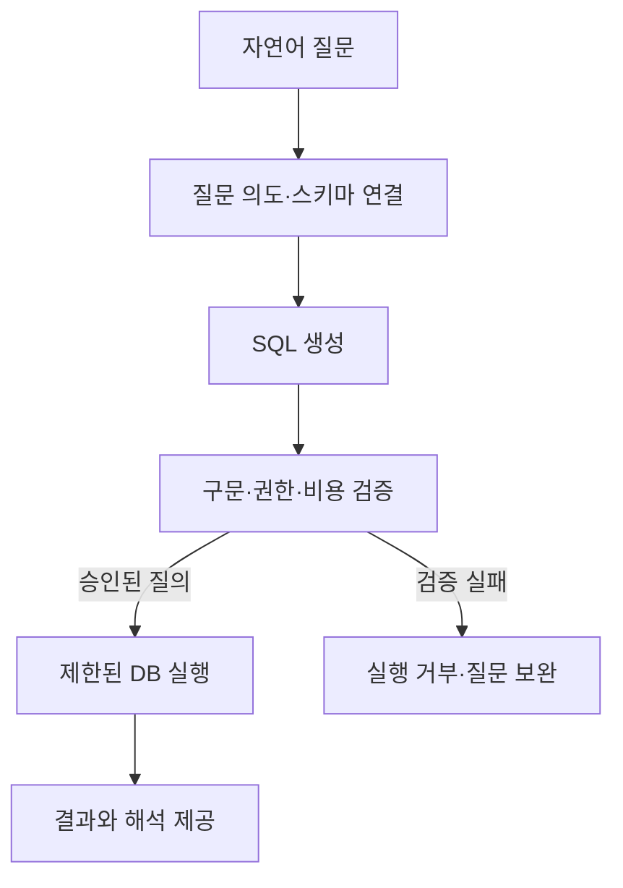
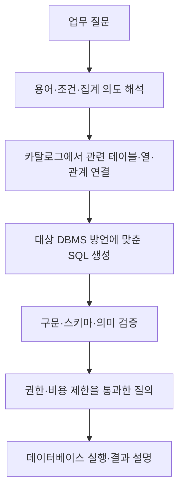

---
sidebar:
  order: 94
  label: "094. TEXT2SQL"
  badge:
    text: "기초"
    variant: note
title: "Text-to-SQL(NL2SQL) 아키텍처 및 LLM 기반 자연어 쿼리 변환 체계"
author: "Antigravity"
date: "2026-09-24T16:50:00+09:00"
tags:
  - "notes-data"
weight: 94
extra:
  model: "GPT-6"
  keyword_grade: "기초"
  question_no: "094"
---

## 지식 로드맵 내 현재 위치

데이터베이스·AI → 자연어 데이터 질의 → Text-to-SQL

## 30초 인출

- 본질: **Text-to-SQL**은 자연어 질문을 데이터베이스 질의로 변환하는 방식
- 메커니즘: 질문 의도와 스키마를 연결해 SQL을 만들고, 구문·권한·자원 제한을 검증한 뒤 실행
- 통제: 자연어 입력이나 생성 SQL을 신뢰하지 않고 최소 권한, 제한된 데이터 범위와 실행 한도를 적용

핵심 용어

| 용어 | 설명 |
|---|---|
| **Text-to-SQL** | 자연어 질문을 SQL 질의로 변환하는 기술 |
| **스키마 연결(schema linking)** | 질문의 표현을 데이터베이스 테이블·열·관계에 연결하는 과정 |
| **추상 구문 트리(Abstract Syntax Tree, AST)** | SQL 문법 구조를 노드와 관계로 표현한 자료구조 |
| **최소 권한(least privilege)** | 작업 수행에 필요한 범위로 계정·도구의 권한을 제한하는 보안 원칙 |
| **읽기 전용 복제본(read replica)** | 주 데이터베이스의 변경 내용을 받아 읽기 질의를 제공하는 복제 데이터베이스 |

---

## 1교시 예상문제 (10점)

> Text-to-SQL의 정의, 목적과 기본 처리 구조를 설명하시오. (예상)

---

## 1교시 10점 답안

### Ⅰ. Text-to-SQL의 개요

| 구분 | 핵심 |
|---|---|
| 정의 | 자연어 질문을 SQL 질의로 변환하는 기술 |
| 목적 | SQL을 직접 작성하지 않는 이용자의 데이터 탐색을 지원 |

### Ⅱ. 처리 구조

| 단계 | 수행 내용 |
|---|---|
| 질문·스키마 연결 | 질문의 대상·조건을 데이터 사전과 관계에 대응 |
| SQL 생성 | 연결된 스키마와 질의 의도를 바탕으로 SQL 구성 |
| 검증·실행 | SQL 문법, 이용자 권한, 비용 제한을 확인하고 결과 제공 |

**제언:** 생성·검증·실행을 분리하고 최소 권한 계정으로 질의를 수행하는 데이터 접근 구조

---

## 2~4교시 예상문제 (25점)

> Text-to-SQL의 개념과 처리 구조를 설명하고, 스키마 연결·생성 결과 검증·실행 통제를 포함한 안전한 적용 방안을 서술하시오. (예상)

---

## 2~4교시 25점 답안

### Ⅰ. Text-to-SQL의 개요

| 구분 | 핵심 |
|---|---|
| 정의 | 자연어 질문을 SQL 질의로 변환하는 기술 |
| 목적 | SQL을 직접 작성하지 않는 이용자의 데이터 탐색을 지원 |

### Ⅱ. 질문에서 SQL까지의 변환

### Ⅲ. 스키마 연결과 결과 검증

| 점검 항목 | 설계 내용 |
|---|---|
| 업무 용어 | 동의어·정의와 카탈로그의 테이블·열을 연결 |
| 조인 관계 | 명시된 키·관계를 이용하고 불명확한 조건은 사용자 확인 |
| SQL 문법 | 대상 DBMS 방언 파서와 스키마를 이용해 존재하지 않는 열·구문 오류 탐지 |
| 의미 정확성 | 표본 질문·정답 SQL 또는 업무 검토를 통해 결과 의미 평가 |
| 생성 오류 | 오류 정보를 제한적으로 제공해 수정 시도; 횟수·권한·비용 상한 유지 |

### Ⅳ. 보안·운영 통제

| 위험 | 통제 |
|---|---|
| 생성 결과의 과도한 조회·민감 열 접근 | 사용자별 권한, 허용 뷰·열, 행 범위와 최소 권한 계정 적용 |
| 자원 고갈·장시간 질의 | 실행시간·반환 행·동시성·비용 제한과 취소 기능 적용 |
| 입력 문장에 포함된 지시 조작 | 모델 지시와 데이터의 경계 설정, 도구 권한 분리, SQL을 신뢰 경계에서 독립 검증 |
| 결과 오해·환각 설명 | SQL·필터·기간을 이용자에게 드러내고 결과 근거와 불확실성을 표시 |

SELECT 문만 허용하는 정책이나 읽기 전용 계정은 단독 보안 보장이 아니다. 저장 함수·자원 소모 질의·민감 데이터 조회를 포함해 실제 DBMS 권한과 실행 경계를 검증한다.

### Ⅴ. 도입 한계와 기술사적 제언

| 한계 | 해결 방안 |
|---|---|
| 약어·모호한 업무 용어와 품질 낮은 스키마 설명은 엉뚱한 데이터 연결로 이어질 수 있음 | 데이터 카탈로그·정의·관계를 관리하고 불확실한 질문은 추가 확인으로 전환 |
| 문법상 유효한 SQL도 업무 의도와 다를 수 있음 | 기준 질문·정답 결과를 이용해 정확성과 권한 위반을 회귀 평가 |

**제언:** 카탈로그 품질·접근권한·평가 데이터·실행한도를 함께 관리하는 Text-to-SQL 운영 체계

---

## 출제 이력과 검증 출처

- 정보관리기술사 제137회 2교시: Text-to-SQL
- Pourreza et al., [DIN-SQL: Decomposed In-Context Learning of Text-to-SQL with Self-Correction](https://papers.neurips.cc/paper_files/paper/2023/file/72223cc66f63ca1aa59edaec1b3670e6-Paper-Conference.pdf)
- OWASP, [LLM Prompt Injection Prevention Cheat Sheet](https://cheatsheetseries.owasp.org/cheatsheets/LLM_Prompt_Injection_Prevention_Cheat_Sheet.html)
- OWASP, [Database Security Cheat Sheet](https://cheatsheetseries.owasp.org/cheatsheets/Database_Security_Cheat_Sheet.html)

---

## 연결 토픽

- [015. 텍스트 마이닝](./015_text_mining.md)
- [098. 정적 SQL vs 동적 SQL](./098_dynamic_sql.md)
