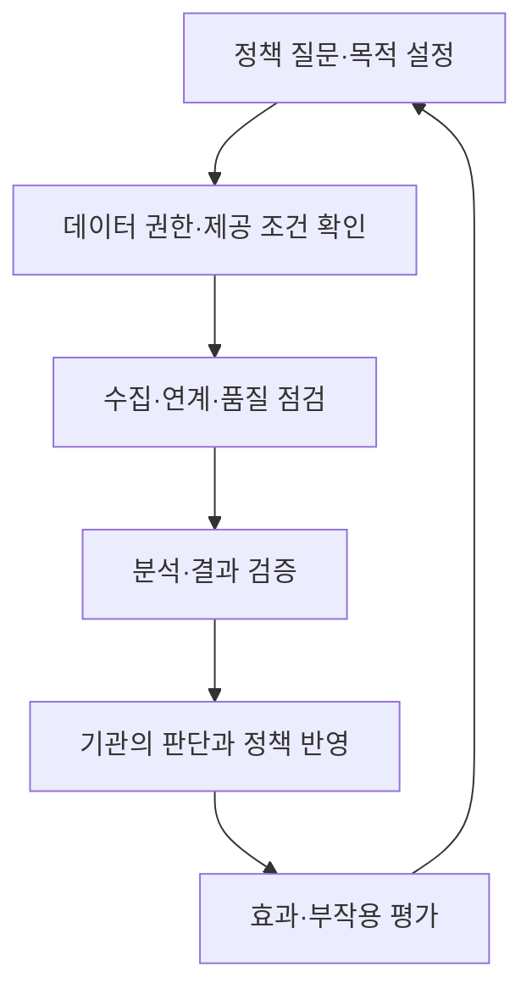
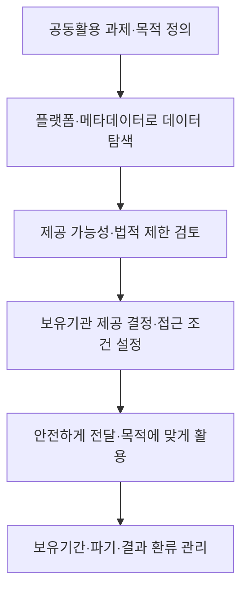

---
sidebar:
  order: 97
  label: "097. AI·데이터 기반 행정"
  badge:
    text: "기초"
    variant: note
title: "데이터기반행정 및 AI 기반 공공의사결정 거버넌스 체계"
author: "Antigravity"
date: "2026-09-24T17:05:00+09:00"
tags:
  - "notes-data"
weight: 97
extra:
  model: "GPT-6"
  keyword_grade: "기초"
  question_no: "097"
---

## 지식 로드맵 내 현재 위치

데이터 관리 → 공공 데이터 활용 → 데이터기반행정

## 30초 인출

- 본질: **데이터기반행정**은 공공기관이 데이터를 분석해 정책 수립과 의사결정에 활용하는 행정
- 메커니즘: 목적·권한을 정하고 데이터를 수집·연계·분석한 뒤 결과를 검토해 정책에 반영
- AI 활용: 기관이 최종 권한과 책임을 지며 개인정보·편향·결정 투명성을 함께 고려

핵심 용어

| 용어 | 설명 |
|---|---|
| **데이터기반행정(data-based administration)** | 공공기관이 데이터를 분석해 정책 수립과 의사결정에 활용하는 행정 |
| **데이터 통합관리 플랫폼** | 공공기관 데이터의 등록·탐색·공동활용을 지원하는 법정 플랫폼 |
| **메타데이터(metadata)** | 데이터의 구조·속성·특성·이력 등을 설명하는 자료 |
| **개인정보 보호법(Personal Information Protection Act, PIPA)** | 개인정보의 처리와 보호에 관한 사항을 정한 법률 |
| **인공지능(AI) 활용 거버넌스** | 행정 의사결정에 AI를 적용할 때 책임·보호·투명성을 관리하는 체계 |

---

## 1교시 예상문제 (10점)

> 데이터기반행정의 정의, 목적과 추진 절차를 설명하시오. (예상)

---

## 1교시 10점 답안

### Ⅰ. 데이터기반행정의 개요

| 구분 | 핵심 |
|---|---|
| 정의 | 공공기관이 데이터를 분석해 정책 수립과 의사결정에 활용하는 행정 |
| 목적 | 객관적·과학적 행정을 통해 공공기관의 책임성·대응성·신뢰성을 높이고 국민 삶의 질 향상 |

### Ⅱ. 추진 절차

| 단계 | 주요 확인 |
|---|---|
| 과제 정의 | 정책 질문·이용 목적·담당 기관 설정 |
| 데이터 확보 | 보유기관·공동활용 가능성·법적 근거와 제한 확인 |
| 분석·검증 | 품질·대표성·분석 한계와 결과 근거 확인 |
| 정책 반영 | 담당 기관의 검토와 권한에 따라 정책·서비스에 활용 |
| 평가·관리 | 결과·부작용·데이터 갱신을 평가하고 개선 |

**제언:** 데이터의 목적·근거·품질·정책 활용 결과를 연결해 기록하는 행정 분석 관리

---

## 2~4교시 예상문제 (25점)

> 데이터기반행정의 개념과 목적을 설명하고, 데이터의 공동활용 절차와 인공지능을 정책·의사결정에 활용할 때 필요한 책임·보호·투명성 통제를 서술하시오. (예상)

---

## 2~4교시 25점 답안

### Ⅰ. 데이터기반행정의 개요

| 구분 | 핵심 |
|---|---|
| 정의 | 공공기관이 데이터를 분석해 정책 수립과 의사결정에 활용하는 행정 |
| 목적 | 객관적·과학적 행정을 통해 공공기관의 책임성·대응성·신뢰성을 높이고 국민 삶의 질 향상 |

### Ⅱ. 데이터 공동활용 절차

법은 공동활용이 필요한 일정 분야의 데이터 등록과 제공 요청·결정 절차를 정한다. 모든 행정 데이터를 무조건 공유하거나 개인정보 보호 규정을 대체하는 제도로 해석하지 않는다.

### Ⅲ. 행정 데이터 관리 기반

| 관리 항목 | 주요 내용 |
|---|---|
| 메타데이터·관계도 | 데이터 구조·속성·이력과 데이터 간 관계를 관리해 탐색·연계 지원 |
| 제공·이용 | 요청 목적과 제공 제한을 검토하고 승인 범위·보유 기간을 관리 |
| 품질·책임 | 데이터 최신성·정확성·연계성, 소관 기관과 활용 기관의 책임 관리 |
| 개인정보 | 개인정보 포함 시 개인정보 보호법상 처리 근거와 보호 조치 확인 |

### Ⅳ. AI 활용의 책임과 신뢰 통제

| 통제 영역 | 적용 내용 |
|---|---|
| 책임성 | AI 결과를 정책에 활용하더라도 최종 권한·책임 주체를 명확히 함 |
| 개인정보 | 목적·처리 근거·최소 이용 범위와 안전조치 점검 |
| 편향·투명성 | 데이터·모델의 편향 가능성과 결정의 설명·검토 경로 고려 |
| 품질·감독 | 결과를 담당자가 검토하고 오류 정정·이의 제기 절차 마련 |

### Ⅴ. 도입 한계와 기술사적 제언

| 한계 | 해결 방안 |
|---|---|
| 부서별 정의·품질이 다른 데이터를 단순 결합하면 분석 결과를 오해할 수 있음 | 메타데이터·품질 기준과 결합 목적을 먼저 합의하고 출처·변환 이력을 보존 |
| 자동 분석 결과가 행정 판단을 대신하면 권한·책임과 오류 구제 경로가 불명확해질 수 있음 | 담당 기관의 최종 권한을 유지하고 사람의 재검토·정정·이의 처리 절차를 설계 |

**제언:** 공공 데이터의 공동활용과 AI 분석을 정책 전 과정의 책임·보호·평가와 연결하는 거버넌스

---

## 출제 이력과 검증 출처

- 「인공지능 및 데이터 기반 행정 활성화에 관한 법률」 제1조·제2조·제3조·제8조·제16조, 2026년 8월 28일 시행본
- 「개인정보 보호법」: 개인정보가 포함된 데이터의 수집·제공·이용 근거와 보호 조치
- 행정안전부, [제2차 데이터기반행정 활성화 기본계획(2024~2026) 발표](https://mois.go.kr/frt/bbs/type010/commonSelectBoardArticle.do?bbsId=BBSMSTR_000000000008&nttId=107026)
- [국가법령정보센터: 인공지능 및 데이터 기반 행정 활성화에 관한 법률](https://www.law.go.kr/lsInfoP.do?lsiSeq=283735)

---

## 연결 토픽

- [006. 데이터 거버넌스](./006_data_governance.md)
- [008. 데이터 표준화](./008_data_standardization.md)
- [034. 비정형 데이터 가명처리 가이드라인](./034_pseudonymized_data_guidelines_unstructured.md)
