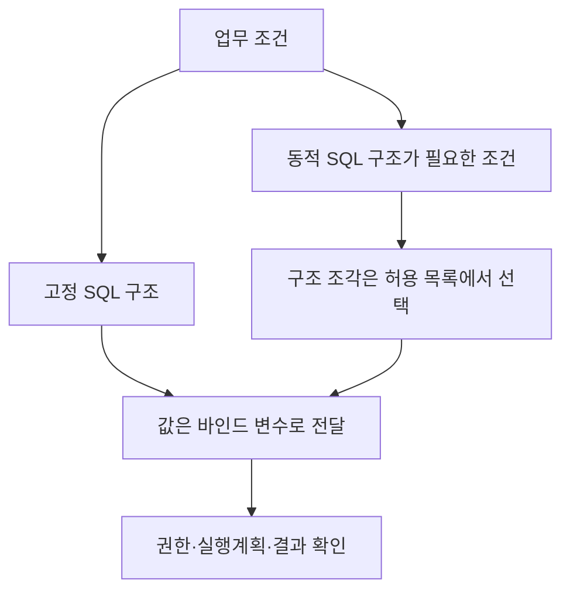
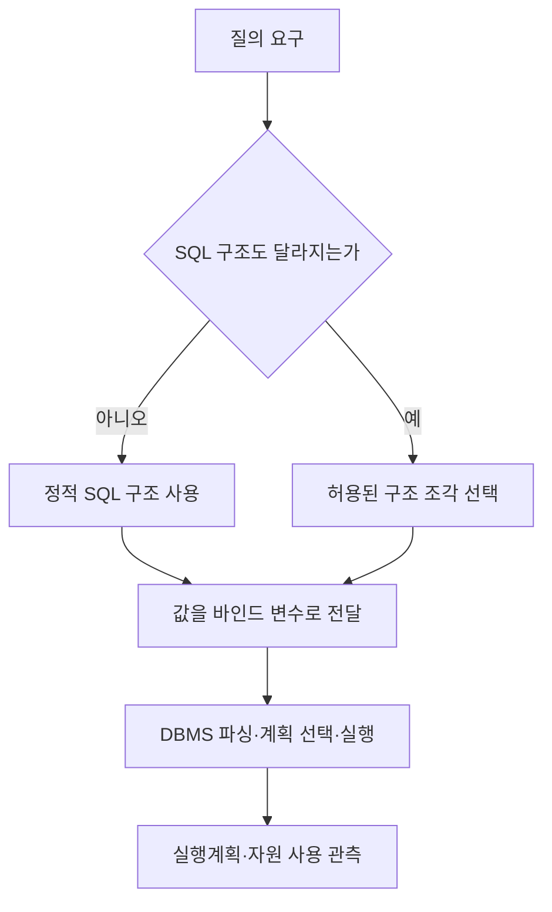

---
sidebar:
  order: 98
  label: "098. 정적 SQL vs 동적 SQL"
  badge:
    text: "기초"
    variant: note
title: "정적 SQL(Static SQL)과 동적 SQL(Dynamic SQL)의 비교 및 실행 메커니즘"
author: "Antigravity"
date: "2026-09-24T17:15:00+09:00"
tags:
  - "notes-data"
weight: 98
extra:
  model: "GPT-6"
  keyword_grade: "기초"
  question_no: "098"
---

## 지식 로드맵 내 현재 위치

데이터베이스 개발 → SQL 생성·실행 → 정적 SQL과 동적 SQL

## 30초 인출

- 본질: **정적 SQL과 동적 SQL**은 실행할 SQL 구조를 언제, 어떻게 결정하는지의 구분
- 메커니즘: 정적 SQL은 구조가 코드에 고정되고, 동적 SQL은 실행 중 조건에 따라 SQL 구조를 구성
- 통제: 값은 바인드 변수로 전달하고, 동적으로 바뀌는 식별자·정렬 기준은 허용 목록으로 제한

핵심 용어

| 용어 | 설명 |
|---|---|
| **정적 SQL(static SQL)** | SQL 구조가 프로그램 코드에 미리 정해진 질의 |
| **동적 SQL(dynamic SQL)** | 실행 중에 SQL 문장 구조의 일부를 구성하는 질의 |
| **바인드 변수(bind variable)** | SQL 구조와 분리해 실행 시 전달하는 값 매개변수 |
| **SQL 인젝션(SQL injection)** | 신뢰하지 않는 입력이 SQL 문맥에 섞여 의도하지 않은 명령으로 해석되는 취약점 |
| **준비된 문장(prepared statement)** | 질의 구조를 준비하고 매개변수를 분리해 실행하는 인터페이스 |

---

## 1교시 예상문제 (10점)

> 정적 SQL과 동적 SQL의 정의, 목적과 차이를 설명하시오. (예상)

---

## 1교시 10점 답안

### Ⅰ. 정적·동적 SQL의 개요

| 구분 | 핵심 |
|---|---|
| 정의 | 실행할 SQL 구조를 코드 작성 시 미리 정하는 방식과 실행 중 구성하는 방식의 구분 |
| 목적 | 질의 구조의 고정성과 조건 변화 요구에 맞는 SQL 작성 방식 선택 |

### Ⅱ. 비교

| 구분 | 정적 SQL | 동적 SQL |
|---|---|---|
| 구조 결정 | 코드 작성 시 정해짐 | 실행 중 조건에 따라 구성 |
| 적용 상황 | 질의 형태가 안정적 | 선택 조건·열·테이블 등 구조가 달라짐 |
| 주요 주의점 | 바뀐 요구사항을 표현하려면 코드 수정 | 문자열 구성·식별자 통제·실행계획 재사용 관리 |

### Ⅲ. 입력값 분리와 SQL 실행

**제언:** 입력값 바인딩과 동적 식별자 허용 목록을 표준 SQL 작성 규칙에 포함

---

## 2~4교시 예상문제 (25점)

> 정적 SQL과 동적 SQL의 개념·적용 차이를 설명하고, 동적 SQL의 실행계획 관리와 SQL 인젝션 방지 방안을 서술하시오. (예상)

---

## 2~4교시 25점 답안

### Ⅰ. 정적·동적 SQL의 개요

| 구분 | 핵심 |
|---|---|
| 정의 | 실행할 SQL 구조를 코드 작성 시 미리 정하는 방식과 실행 중 구성하는 방식의 구분 |
| 목적 | 질의 구조의 고정성과 조건 변화 요구에 맞는 SQL 작성 방식 선택 |

### Ⅱ. 구조 선택과 실행 흐름

### Ⅲ. 구현 선택과 성능

| 항목 | 정적 SQL | 동적 SQL |
|---|---|---|
| 구조의 변경 | 코드의 질의 구조 고정 | 실행 조건에 따라 구성 가능 |
| 값 전달 | 바인드 변수 사용 가능 | 바인드 변수 사용 가능 |
| 계획 재사용 | 텍스트·객체·DBMS 동작에 따라 달라짐 | 문장이 달라지면 재사용이 줄 수 있으나 바인드로 반복 질의의 문장을 안정화 가능 |
| 구현 점검 | 질의 변경 시 테스트·배포 관리 | SQL 조각 조립, 권한, 계획 변동과 성능을 함께 점검 |

동적 SQL이라는 이유만으로 매번 하드 파싱이 발생하는 것은 아니다. 파싱·계획 캐시와 재사용 여부는 DBMS와 드라이버, 문장 텍스트·바인드 사용에 따라 달라진다.

### Ⅳ. 인젝션 방지와 동적 구조 통제

| 입력 종류 | 처리 원칙 |
|---|---|
| 값·검색어 | 준비된 문장과 바인드 변수를 사용 |
| 테이블·열·정렬 방향 | 바인드 대상이 될 수 없는 구조 요소는 코드의 허용 목록에서 선택 |
| 사용자 권한 | 필요한 테이블·행·열만 허용하는 최소 권한 계정 사용 |
| 실행 결과 | 입력 변형 테스트, 오류·권한 로그와 비정상 질의 감시 |

### Ⅴ. 설계 한계와 기술사적 제언

| 한계 | 해결 방안 |
|---|---|
| 조건 조합마다 SQL 구조가 달라지면 계획 수와 관리 지점이 증가할 수 있음 | 반복 패턴을 정리하고 바인드·캐시·실행계획을 실측해 적절한 분기 단위 결정 |
| 입력 문자열 결합은 SQL 구문 변경과 권한 범위 확대 위험을 만듦 | 값 바인딩, 식별자 허용 목록, 최소 권한과 보안 시험을 적용 |

**제언:** 정적·동적 SQL 모두 값 매개변수화와 실행계획 관측을 기본으로 하는 SQL 개발 표준

---

## 출제 이력과 검증 출처

- 정보관리기술사 제134회 1교시: 정적 SQL과 동적 SQL 비교
- Oracle, [Native Dynamic SQL](https://docs.oracle.com/en/database/oracle/oracle-database/19/lnpls/native-dynamic-sql.html)
- PostgreSQL, [PREPARE](https://www.postgresql.org/docs/current/sql-prepare.html)
- OWASP, [SQL Injection Prevention Cheat Sheet](https://cheatsheetseries.owasp.org/cheatsheets/SQL_Injection_Prevention_Cheat_Sheet.html)

---

## 연결 토픽

- [088. 데이터베이스 튜닝](./088_database_tuning.md)
- [091. 옵티마이저](./091_optimizer.md)
- [094. Text-to-SQL](./094_text2sql.md)
