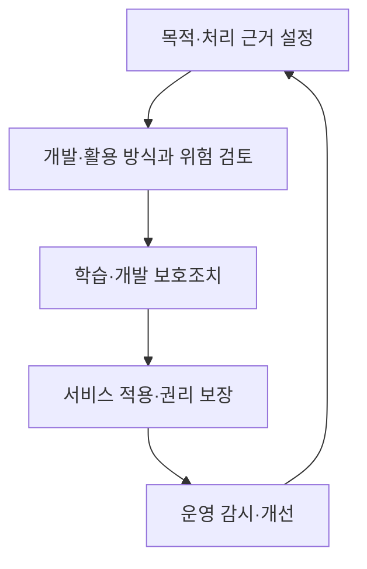
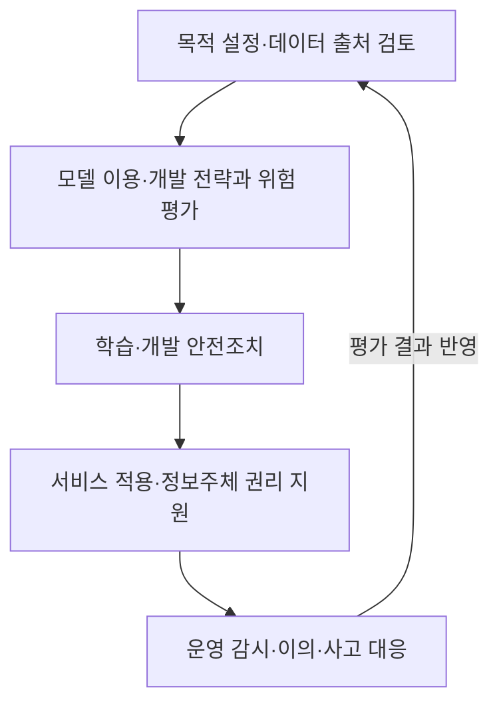
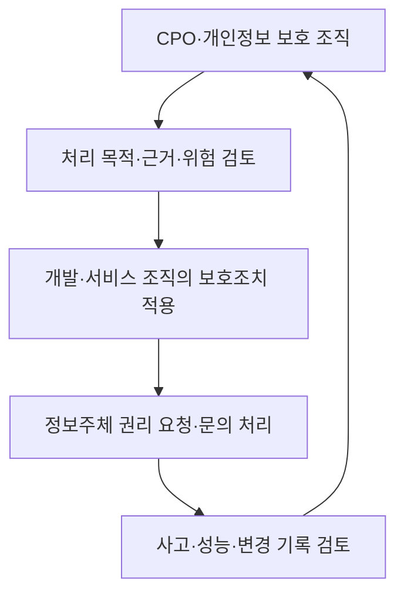

---
sidebar:
  order: 101
  label: "101. 생성형 AI 개인정보 안내서"
  badge:
    text: "기초"
    variant: note
title: "생성형 AI 개발·활용 개인정보 처리 안내서 및 프라이버시 보호 가이드라인"
author: "Antigravity"
date: "2026-09-24T17:35:00+09:00"
tags:
  - "notes-data"
weight: 101
extra:
  model: "GPT-6"
  keyword_grade: "기초"
  question_no: "101"
---

## 지식 로드맵 내 현재 위치

데이터 보호 → AI·데이터 거버넌스 → 생성형 AI 개인정보 처리

## 30초 인출

- 본질: **생성형 AI 개인정보 처리 안내서**는 AI 개발·활용 과정의 개인정보 보호법 적용과 안전조치를 안내하는 개인정보위 지침
- 메커니즘: 목적 설정 → 개발 방식 선택 → 학습·개발 → 적용·관리의 생애주기별로 처리 근거와 위험 통제를 검토
- 운영: CPO 중심 거버넌스와 정보주체 권리·안전성 관리를 지속적으로 점검

핵심 용어

| 용어 | 설명 |
|---|---|
| **생성형 AI 개인정보 처리 안내서** | 생성형 AI 개발·활용에서 개인정보 보호법 적용과 안전조치를 안내하는 개인정보위 지침 |
| **개인정보 보호위원회(Personal Information Protection Commission, PIPC)** | 개인정보 보호 정책과 관련 업무를 수행하는 중앙행정기관 |
| **개인정보 보호책임자(Chief Privacy Officer, CPO)** | 개인정보 처리·보호 업무를 총괄하는 조직 내 책임자 |
| **개인정보 영향평가(Privacy Impact Assessment, PIA)** | 개인정보파일의 운용으로 인한 침해 위험을 사전에 분석·평가하는 절차 |
| **기계학습 망각(machine unlearning)** | 학습 데이터 일부의 영향을 줄이거나 제거하도록 모델을 갱신하는 연구·기술 접근 |

---

## 1교시 예상문제 (10점)

> 생성형 AI 개인정보 처리 안내서의 목적과 생애주기별 주요 고려사항을 설명하시오. (예상)

---

## 1교시 10점 답안

### Ⅰ. 안내서의 개요

| 구분 | 핵심 |
|---|---|
| 정의 | 생성형 AI 개발·활용에서 개인정보 보호법 적용과 안전조치를 안내하는 개인정보위 지침 |
| 목적 | 개인정보 처리의 불확실성을 줄이고 생애주기 전반의 자율적 보호 역량 강화 |

### Ⅱ. 생애주기별 확인사항

| 단계 | 확인사항 |
|---|---|
| 목적 설정 | 개발·활용 목적, 처리하는 개인정보 종류·출처와 적법 근거 |
| 전략 수립 | 서비스형 모델 이용·기성 모델 활용·자체 개발 등 방식별 위험과 완화책 |
| 학습·개발 | 데이터·모델·에이전트 관련 위험과 기술·관리 보호조치 |
| 적용·관리 | 정보주체 권리, 운영 중 위험·변경 및 사고 대응 |

**제언:** 목적·처리 근거·위험 완화·권리 대응을 모델 변경 이력과 함께 관리하는 개인정보 보호 체계

---

## 2~4교시 예상문제 (25점)

> 개인정보위의 생성형 AI 개발·활용 개인정보 처리 안내서의 구성과 생애주기별 주요 관리사항을 설명하고, CPO 중심의 개인정보 보호 거버넌스 방안을 서술하시오. (예상)

---

## 2~4교시 25점 답안

### Ⅰ. 안내서의 개요

| 구분 | 핵심 |
|---|---|
| 정의 | 생성형 AI 개발·활용에서 개인정보 보호법 적용과 안전조치를 안내하는 개인정보위 지침 |
| 목적 | 개인정보 처리의 불확실성을 줄이고 생애주기 전반의 자율적 보호 역량 강화 |

### Ⅱ. 생애주기별 관리 흐름

| 단계 | 핵심 관리 내용 |
|---|---|
| 목적 설정 | 처리 목적과 개인정보 유형·출처 확인, 처리 근거와 필요성 검토 |
| 전략 수립 | 서비스형 LLM 활용·기성 모델 활용·자체 개발 등 유형별 위험 완화책 마련 |
| 학습·개발 | 데이터 오염·탈옥 등 위험에 대한 다층 안전조치, 에이전트 관리 |
| 적용·관리 | 정보주체 권리 보장, 운영 결과·사고·변경 관리 |

### Ⅲ. 유형별 위험 검토와 보호조치

| 개발·활용 방식 | 주요 쟁점 | 점검 방향 |
|---|---|---|
| 서비스형 LLM 이용 | 이용자 입력의 수집·저장·제공 및 학습 활용 여부 | 계약·처리방침·설정과 실제 데이터 흐름 확인 |
| 기성 모델 활용 | 사전학습·미세조정 자료의 출처와 개인정보 영향 | 데이터 출처·처리 근거·모델 위험과 안전조치 검토 |
| 자체 모델 개발 | 학습자료·개발환경·운영 서비스의 전 과정 위험 | 접근통제·보유기간·테스트·운영 감시를 생애주기에 반영 |

개인정보 처리 근거와 보호조치는 데이터 종류·출처·이용 목적과 실제 처리 방식에 따라 검토한다. 공개 웹 정보, robots.txt, 가명처리, 특정 모델 공급자 계약은 그 자체로 개인정보 처리의 적법성을 보장하지 않는다.

### Ⅳ. 정보주체 권리와 CPO 거버넌스

| 거버넌스 요소 | 운영 내용 |
|---|---|
| 책임 | CPO와 서비스·모델·데이터 담당자 간 역할·승인 경로 |
| 권리 | 처리방침, 권리 요청 접수·검토·회신과 이의제기 지원 |
| 데이터 관리 | 출처·목적·접근·보유·파기·위탁 및 국외이전 등 처리 기록 |
| 안전성 | 위험도에 맞춘 접근통제·유출방지·테스트·사고 대응 |
| 개선 | 모델·데이터 변경 시 재검토와 지속적 업데이트 |

기계학습 망각은 안내서가 다루는 기술 동향 중 하나이며, 개인정보 삭제권을 항상 대체하거나 법적 의무로 정한 단일 해법으로 간주하지 않는다. 모델·데이터에 대한 권리 요청은 적용 법령과 처리 구조에 따라 검토한다.

### Ⅴ. 도입 한계와 기술사적 제언

| 한계 | 해결 방안 |
|---|---|
| 모델 공급·학습·운영 단계마다 개인정보 처리 주체와 통제 범위가 달라질 수 있음 | 데이터 흐름·위탁 관계·책임자·변경 이력을 함께 기록하고 단계별 재검토 |
| 기술 조치만 적용하면 적법 근거·정보주체 권리·실제 운영을 놓칠 수 있음 | CPO 검토를 목적·개발·운영 절차에 연결하고 권리·사고 대응을 정기 시험 |

**제언:** 개인정보 처리 근거·데이터 흐름·권리 대응을 생성형 AI 생애주기 관리에 통합

---

## 출제 이력과 검증 출처

- 개인정보보호위원회, [「생성형 인공지능(AI) 개발·활용을 위한 개인정보 처리 안내서」 공개](https://pipc.go.kr/np/cop/bbs/selectBoardArticle.do?bbsId=BS074&mCode=C020010000%22&nttId=11410), 2025-08
- 개인정보보호위원회, [2025년 12월 개인정보 정책 설명회 자료 목록](https://pipc.go.kr/np/cop/bbs/selectBoardArticle.do?bbsId=BS061&mCode=C010010000&nttId=11674)
- 개인정보보호위원회, 「개인정보 보호법」 및 「개인정보 보호법 시행령」

---

## 연결 토픽

- [034. 비정형 데이터 가명처리 가이드라인](./034_pseudonymized_data_guidelines_unstructured.md)
- [094. Text-to-SQL](./094_text2sql.md)
