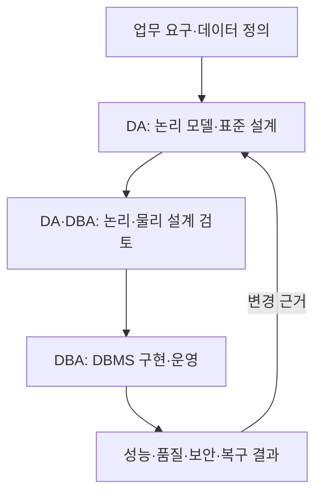
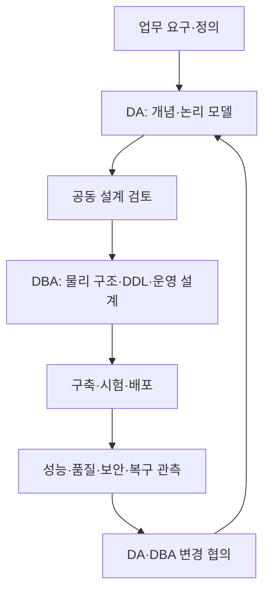

---
sidebar:
  order: 103
  label: "103. DA vs DBA"
  badge:
    text: "기초"
    variant: note
title: "DA(Data Architect)와 DBA(Database Administrator)의 역할 비교 및 거버넌스 협업 체계"
author: "Antigravity"
date: "2026-09-24T17:45:00+09:00"
tags:
  - "notes-data"
weight: 103
extra:
  model: "GPT-6"
  keyword_grade: "기초"
  question_no: "103"
---

## 지식 로드맵 내 현재 위치

데이터 관리 → 아키텍처·운영 역할 → DA와 DBA

## 30초 인출

- 본질: **DA와 DBA**는 조직의 데이터 구조·표준 설계와 데이터베이스 구현·운영을 나누어 수행하는 역할
- 메커니즘: DA는 업무 요구와 논리 구조를 정리하고, DBA는 이를 DBMS 물리 설계·운영 조건에 맞춰 구현하며 피드백
- 협업: 논리 모델과 운영 성능·보안·복구 요구를 함께 검토하며 변경 이력을 동기화

핵심 용어

| 용어 | 설명 |
|---|---|
| **데이터 아키텍트(Data Architect, DA)** | 데이터 정의·구조·표준을 업무 요구에 맞게 설계하는 역할 |
| **데이터베이스 관리자(Database Administrator, DBA)** | 데이터베이스의 물리 구현·접근·성능·복구를 관리하는 역할 |
| **논리 데이터 모델(logical data model)** | 업무 엔티티·속성·관계를 DBMS 구현 세부와 분리해 표현한 모델 |
| **물리 데이터 모델(physical data model)** | 특정 DBMS의 저장·인덱스·파티션 등 구현 구조를 표현한 모델 |
| **데이터베이스 신뢰성 엔지니어(Database Reliability Engineer, DBRE)** | 자동화·신뢰성 공학을 데이터베이스 운영에 적용하는 직무 명칭 |

---

## 1교시 예상문제 (10점)

> 데이터 아키텍트(DA)와 데이터베이스 관리자(DBA)의 역할과 협업 관계를 설명하시오. (예상)

---

## 1교시 10점 답안

### Ⅰ. 역할 비교의 개요

| 구분 | 핵심 |
|---|---|
| 정의 | 데이터 구조·표준 설계 역할과 데이터베이스 구현·운영 역할의 구분 |
| 목적 | 업무 데이터의 의미·품질을 유지하면서 안전하고 효율적인 저장·이용 지원 |

### Ⅱ. 역할과 산출물

| 구분 | DA | DBA |
|---|---|---|
| 중심 관점 | 업무 정의·논리 구조·표준 | DBMS 구현·성능·접근·복구 |
| 대표 산출·작업 | 용어·정의, 논리 모델, 데이터 표준 | 물리 모델 검토, DDL·인덱스, 백업·복구·운영 점검 |
| 협업 입력 | 업무 의미와 데이터 규칙 | 처리량·저장·보안·가용성 요구와 실측 결과 |

### Ⅲ. 협업 흐름

**제언:** 논리 모델·물리 스키마·운영 변경을 같은 저장소와 검토 절차에 연결하는 데이터 설계 관리

---

## 2~4교시 예상문제 (25점)

> 데이터 아키텍트(DA)와 데이터베이스 관리자(DBA)의 역할 차이를 설명하고, 데이터 설계·구축·운영 전반의 협업 및 클라우드 환경에서의 역할 조정 방안을 서술하시오. (예상)

---

## 2~4교시 25점 답안

### Ⅰ. 역할 비교의 개요

| 구분 | 핵심 |
|---|---|
| 정의 | 데이터 구조·표준 설계 역할과 데이터베이스 구현·운영 역할의 구분 |
| 목적 | 업무 데이터의 의미·품질을 유지하면서 안전하고 효율적인 저장·이용 지원 |

### Ⅱ. 책임과 관점

| 관점 | DA | DBA |
|---|---|---|
| 데이터 의미 | 업무 용어·정의·관계·표준 정리 | 구현이 의미·제약을 유지하는지 확인 |
| 구조 | 개념·논리 구조와 데이터 규칙 | DBMS별 저장·접근 구조와 제약 구현 |
| 운영 요구 | 데이터 품질·계보·변경 요구 전달 | 성능·용량·접근통제·백업복구 관리 |
| 의사결정 | 업무 모델·표준 변경 협의 | 물리 구조·운영 변경의 위험과 결과 공유 |

### Ⅲ. 생애주기별 협업

### Ⅳ. 클라우드·자동화 환경

| 변화 | 역할 조정 |
|---|---|
| 관리형 데이터베이스가 인프라 작업 일부를 제공 | DBA 업무는 서비스 책임분계·설정·접근통제·비용·복구 검증을 포함 |
| 스키마 변경이 코드 배포와 연결 | DA 표준과 DBA 운영 조건을 버전관리·자동 검사 절차에 반영 |
| 데이터 플랫폼·제품별 기능이 다양 | 역할을 고정 직급으로 가정하지 않고 조직·서비스 계약의 책임 경계를 문서화 |

직무 명칭과 권한은 조직마다 다르며, DBA가 DA 업무를 겸하거나 플랫폼 팀으로 통합되기도 한다. DA와 DBA를 항상 별도 조직으로 두어야 한다거나 특정 승인권을 보편 규칙으로 단정하지 않는다.

### Ⅴ. 설계 한계와 기술사적 제언

| 한계 | 해결 방안 |
|---|---|
| 논리 모델과 실제 DB 스키마가 다른 저장소·절차에서 바뀌면 불일치가 누적될 수 있음 | 모델·DDL·변경 승인·배포 결과를 형상관리하고 자동 비교·검토 |
| 데이터 품질과 성능 요구가 충돌하면 한 역할의 관점만으로 결정하기 어려움 | 업무 영향·운영 지표·보안·복구 요구를 함께 검토하고 변경 근거를 기록 |

**제언:** 역할 이름보다 데이터 정의·물리 변경·운영 책임을 명시한 공동 데이터 변경관리 절차

---

## 출제 이력과 검증 출처

- 정보관리기술사 제124회 2교시: 데이터베이스 관리자(DBA)의 역할과 DA 협업 체계
- DAMA International, *DAMA-DMBOK: Data Management Body of Knowledge*, 2nd ed.
- 한국데이터산업진흥원, *데이터아키텍처 전문가 가이드*

---

## 연결 토픽

- [006. 데이터 거버넌스](./006_data_governance.md)
- [008. 데이터 표준화](./008_data_standardization.md)
- [088. 데이터베이스 튜닝](./088_database_tuning.md)
