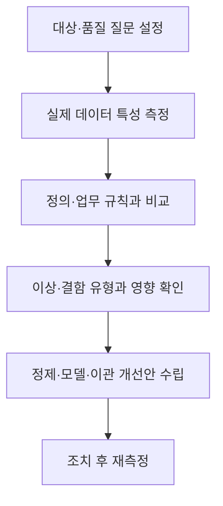
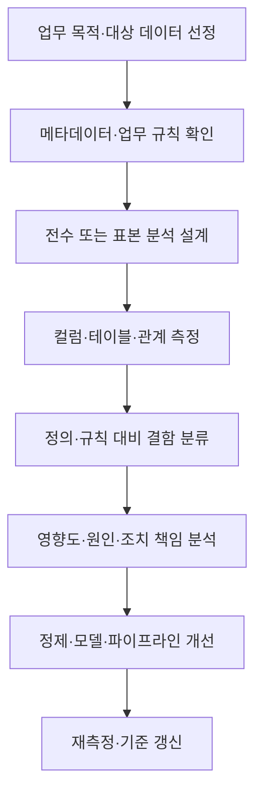

---
sidebar:
  order: 105
  label: "105. 데이터 프로파일링"
  badge:
    text: "기초"
    variant: note
title: "데이터 프로파일링(Data Profiling) 분석 기법 및 데이터 품질 진단 체계"
author: "Antigravity"
date: "2026-09-24T18:00:00+09:00"
tags:
  - "notes-data"
weight: 105
extra:
  model: "GPT-6"
  keyword_grade: "기초"
  question_no: "105"
---

## 지식 로드맵 내 현재 위치

데이터 관리 → 데이터 품질 → 데이터 프로파일링

## 30초 인출

- 본질: **데이터 프로파일링**은 실제 데이터의 구조·내용·관계를 살펴 품질 특성을 파악하는 분석
- 메커니즘: 컬럼 분포·테이블 내부 규칙·테이블 간 관계를 측정하고 정의·업무 규칙과 비교
- 활용: 결함·이상 징후를 드러내 정제·모델링·이관 계획의 근거 제공

핵심 용어

| 용어 | 설명 |
|---|---|
| **데이터 프로파일링(Data Profiling)** | 실제 데이터의 구조·내용·관계를 분석해 품질 특성을 파악하는 활동 |
| **카디널리티(cardinality)** | 컬럼에 나타나는 서로 다른 값의 수 또는 비율 |
| **함수적 종속(functional dependency)** | 한 속성값이 다른 속성값을 결정하는 데이터 관계 |
| **참조 무결성(referential integrity)** | 참조하는 키 값이 대상 레코드에 존재하도록 유지하는 관계 제약 |
| **데이터 정제(data cleansing)** | 발견한 결함을 합의된 규칙에 따라 수정·표준화·제외하는 처리 |

---

## 1교시 예상문제 (10점)

> 데이터 프로파일링의 정의, 목적과 주요 분석 차원을 설명하시오. (예상)

---

## 1교시 10점 답안

### Ⅰ. 데이터 프로파일링의 개요

| 구분 | 핵심 |
|---|---|
| 정의 | 실제 데이터의 구조·내용·관계를 분석해 품질 특성을 파악하는 활동 |
| 목적 | 데이터 결함과 특성을 가시화해 정제·통합·이관 의사결정 지원 |

### Ⅱ. 분석 차원

| 차원 | 주요 점검 |
|---|---|
| 컬럼 | 형식·결측·값 분포·중복·범위 |
| 테이블 | 키 후보·중복행·업무 규칙·속성 간 종속 |
| 관계 | 참조 키·고아 행·시스템 간 값 대응 |

### Ⅲ. 진단에서 개선까지

**제언:** 프로파일 결과를 결함 유형·업무 영향·조치 책임자와 연결하는 품질 진단 절차

---

## 2~4교시 예상문제 (25점)

> 데이터 프로파일링의 개념과 목적을 설명하고, 컬럼·테이블·관계 차원의 분석 내용과 수행 절차 및 운영상 고려사항을 서술하시오. (예상)

---

## 2~4교시 25점 답안

### Ⅰ. 데이터 프로파일링의 개요

| 구분 | 핵심 |
|---|---|
| 정의 | 실제 데이터의 구조·내용·관계를 분석해 품질 특성을 파악하는 활동 |
| 목적 | 데이터 결함과 특성을 가시화해 정제·통합·이관 의사결정 지원 |

### Ⅱ. 프로파일링 범위

| 분석 단위 | 측정·확인 항목 | 예시 |
|---|---|---|
| 컬럼 | 자료형·포맷·결측·고유값·분포·범위 | 허용 코드·날짜 값·이상 범위 |
| 테이블 | 키 후보의 유일성·중복행·속성 규칙 | 주문일과 출고일의 관계 |
| 테이블 간 | 참조값·연결률·고아 행·엔티티 대응 | 주문 고객키와 고객 마스터 |

### Ⅲ. 분석·개선 절차

### Ⅳ. 운영·해석 고려사항

| 고려사항 | 적용 내용 |
|---|---|
| 대상 범위 | 목적·데이터량·처리시간을 고려해 전수·표본·증분 방식을 선택 |
| 접근 부하 | 스캔이 서비스에 미치는 영향을 평가하고 복제본·배치 시간·자원 한도를 설계 |
| 민감정보 | 불필요한 원문 수집·리포트 노출을 줄이고 접근권한·마스킹 적용 |
| 업무 해석 | 통계적 이상을 곧바로 오류로 판단하지 않고 도메인 담당자가 예외·원인을 검토 |
| 변경 관리 | 측정 규칙·코드·데이터 시점과 결과를 기록해 재현 가능성 유지 |

### Ⅴ. 진단 한계와 기술사적 제언

| 한계 | 해결 방안 |
|---|---|
| 수치·패턴 이상만으로 업무상 오류 여부를 확정하기 어려움 | 업무 정의·계보·규칙과 대조하고 데이터 담당자의 확인을 거침 |
| 대규모 전체 스캔이 운영 자원과 개인정보에 영향을 줄 수 있음 | 목적에 맞는 표본·증분 분석과 접근통제·자원 한도를 적용 |

**제언:** 데이터 파이프라인의 품질 규칙과 주기적 프로파일 결과를 함께 관리하는 품질 관측 체계

---

## 출제 이력과 검증 출처

- [IBM 데이터 프로파일링 절차](https://www.ibm.com/docs/en/iis/11.5.0?topic=columns-data-profiling-process): 열·키·도메인 분석을 통한 구조·품질 점검

- 정보관리기술사 제128회 2교시: 데이터 품질 관리를 위한 데이터 프로파일링 기법과 분석 단계
- DAMA International, *DAMA-DMBOK: Data Management Body of Knowledge*, 2nd ed., Data Quality
- 한국지능정보사회진흥원, *공공데이터 품질관리 매뉴얼*

---

## 연결 토픽

- [003. 데이터 품질관리](./003_data_quality_management.md)
- [156. 데이터 이관](./156_data_migration.md)
- [013. 무결성 제약조건](./013_integrity_constraint.md)
