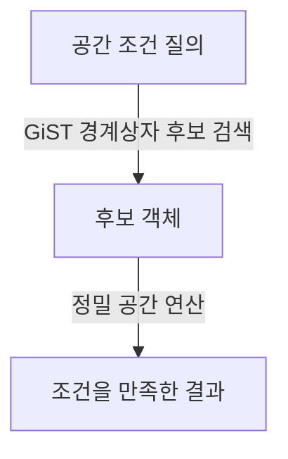

---
sidebar:
  order: 119
  label: "119. 공간 연산자"
  badge:
    text: "기초"
    variant: note
author: "Codex"
category: "03-data"
date: "2026-09-24T00:00:00+09:00"
tags:
  - "notes-data"
weight: 119
title: "공간 연산자와 공간 인덱스 처리"
extra:
  model: "GPT-6"
  keyword_grade: "기초"
  question_no: "119"
---

## 지식 로드맵 내 현재 위치

데이터베이스 → 공간정보 데이터베이스 → 공간 연산자

## 30초 인출

- 본질: **공간 연산자는 공간 객체의 관계·거리·형상을 질의하거나 계산하는 연산**
- 메커니즘: 공간 인덱스로 후보를 좁힌 뒤 정확한 공간 조건을 계산하는 연산이 있으며, 실제 인덱스 사용은 함수·인덱스·쿼리 계획에 좌우

핵심 용어

- **공간 연산자 (Spatial Operator)** : 공간 형상 간 위상 관계·거리·형상 결과를 조회하거나 계산하는 연산
- **MBR (Minimum Bounding Rectangle)** : 공간 형상을 감싸는 최소 직사각형 경계 상자
- **GiST (Generalized Search Tree)** : PostgreSQL에서 공간 인덱스 접근 방법으로 쓰이며 PostGIS geometry의 기본 공간 인덱스 구현은 R-tree 계열
- **ST_DWithin** : 지정 거리 안에 있는 두 공간 객체를 판정하는 PostGIS 함수; 인덱스 사용 가능 조건 포함

---

## 1교시 예상문제 (10점)

> 공간 연산자의 유형과 공간 인덱스를 활용한 질의 처리 원리를 설명하시오. (예상)

---

## 1교시 10점 답안

### Ⅰ. 공간 연산자 개요

| 구분 | 핵심 |
|---|---|
| 정의 | 공간 연산자는 공간 객체의 관계·거리·형상 결과를 판정하거나 계산하는 연산 |
| 목적 | 위치·접촉·포함·근접 조건에 맞는 공간 데이터를 질의·분석 |

### Ⅱ. 유형과 처리

| 유형 | 예 | 연산 |
|---|---|---|
| 위상 관계 | `ST_Intersects`, `ST_Contains` | 교차·포함 관계 판정 |
| 거리 | `ST_DWithin`, `ST_Distance` | 거리 조건 판정·거리값 계산 |
| 형상 생성 | `ST_Buffer`, `ST_Union` | 완충영역·합집합 형상 생성 |
| 인덱스 활용 질의 | GiST + 인덱스 인지 함수 | 경계상자 후보 검색 후 정밀 조건 확인 가능 |

**제언:** 좌표계·단위를 확인한 뒤 실행계획으로 공간 인덱스 사용 여부를 검증

---

## 2~4교시 예상문제 (25점)

> 공간 연산자의 유형과 공간 인덱스 기반 처리 원리를 설명하고, 거리·위상 질의 설계 시 유의사항을 기술하시오. (예상)

---

## 2~4교시 25점 답안

## Ⅰ. 공간 연산자 개요

| 구분 | 핵심 |
|---|---|
| 정의 | 공간 연산자는 공간 객체의 관계·거리·형상 결과를 판정하거나 계산하는 연산 |
| 목적 | 위치·접촉·포함·근접 조건에 맞는 공간 데이터를 질의·분석 |

## Ⅱ. 연산의 종류

| 종류 | 대표 연산 | 결과 |
|---|---|---|
| 위상 판정 | `ST_Intersects`, `ST_Contains`, `ST_Within` | 객체 간 공간 관계의 참·거짓 |
| 거리 계산·판정 | `ST_Distance`, `ST_DWithin` | 거리값 또는 지정 반경 내 여부 |
| 형상 구성 | `ST_Buffer`, `ST_Intersection`, `ST_Union` | 새 공간 형상 |

## Ⅲ. 인덱스 기반 후보 축소

경계상자 검색은 후보를 줄이는 단계이며 최종 공간 관계를 대신하지 않음. PostGIS의 인덱스 인지 연산자는 조건에 따라 이를 질의 계획에 포함

## Ⅳ. 정확성·성능 판단

| 조건 | 점검 기준 |
|---|---|
| 좌표계 | 두 geometry의 SRID 일치와 단위 의미 확인; geography는 거리 단위·계산 모형 확인 |
| 연산 선택 | 거리 임계 조건에는 `ST_DWithin` 검토; 정확한 거리값이 필요하면 `ST_Distance` 계산 |
| 실행계획 | 공간 인덱스 존재만으로 사용을 보장하지 않으므로 `EXPLAIN`으로 계획 확인 |
| 결과 정확성 | 후보 검색 뒤 실제 형상으로 조건을 확인하는 단계의 존재 여부 |

## Ⅴ. 기술사적 제언

| 문제 | 해결 방안 |
|---|---|
| 좌표계·함수 선택이 틀리면 빠른 질의도 잘못된 거리·관계 결과를 반환할 위험 | 데이터 적재 시 SRID·단위를 검증하고 대표 공간 질의별 실행계획과 결과 표본을 함께 검토 |

---

## 출제 이력과 검증 출처

- 출제 이력: 공간 연산자 유형과 공간 인덱스의 처리 원리에 관한 기본 예상문제
- 검증 출처: [PostGIS 공간 질의와 인덱스](https://postgis.net/docs/manual-dev/en/using_postgis_query.html), [PostGIS 공간 인덱스 FAQ](https://postgis.net/documentation/faq/spatial-indexes/), [ST_DWithin](https://postgis.net/docs/ST_DWithin.html)

## 연결 토픽

- 공간 데이터베이스, GIS, R-tree 공간 인덱스
