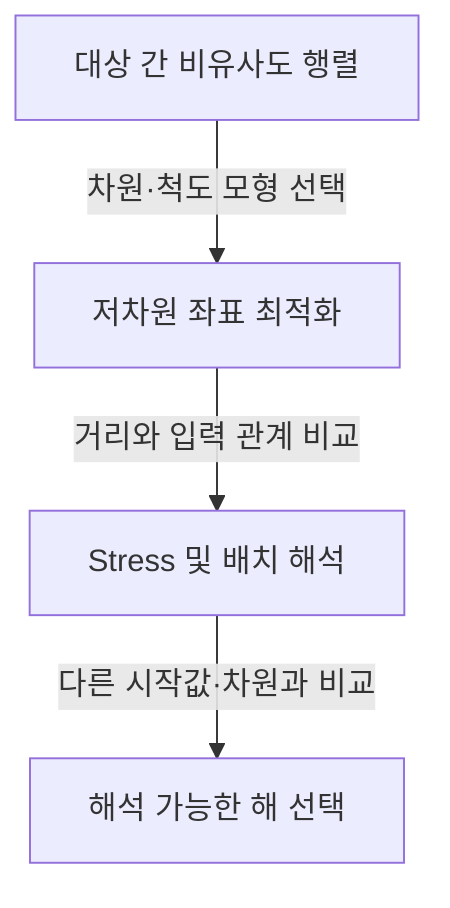

---
sidebar:
  order: 122
  label: "122. 다차원척도법"
  badge:
    text: "기초"
    variant: note
author: "Codex"
category: "03-data"
date: "2026-09-24T00:00:00+09:00"
tags:
  - "notes-data"
weight: 122
title: "다차원척도법(Multidimensional Scaling)의 개념과 적합도"
extra:
  model: "GPT-6"
  keyword_grade: "기초"
  question_no: "122"
---

## 지식 로드맵 내 현재 위치

데이터베이스 → 통계·데이터 분석 → 다변량 분석

## 30초 인출

- 본질: **다차원척도법은 대상 간 비유사도 정보를 저차원 좌표로 나타내 유사 관계를 시각적으로 살피는 분석법**
- 메커니즘: 입력 거리·비유사도와 배치 좌표 간 불일치를 스트레스 등 적합도 기준으로 줄임

핵심 용어

- **MDS (Multidimensional Scaling)** : 대상 간 비유사도를 저차원 공간의 거리로 표현하는 분석법
- **Metric MDS** : 입력 비유사도의 크기 관계를 거리로 맞추는 MDS 계열
- **Nonmetric MDS** : 입력 비유사도의 순서 관계가 유지되도록 단조 변환값과 배치를 맞추는 MDS 계열
- **Stress** : 입력 비유사도와 배치 좌표의 거리가 얼마나 불일치하는지 나타내는 적합도 기준
- **SMACOF (Scaling by Majorizing a Complicated Function)** : 스트레스 목적함수를 반복적으로 감소시키는 majorization 기반 최적화 절차

---

## 1교시 예상문제 (10점)

> 다차원척도법의 개념과 유형 및 적합도 평가 방법을 설명하시오. (예상)

---

## 1교시 10점 답안

### Ⅰ. 다차원척도법 개요

| 구분 | 핵심 |
|---|---|
| 정의 | 다차원척도법은 대상 간 비유사도를 저차원 공간의 거리로 표현하는 분석법 |
| 목적 | 복잡한 대상 간 유사·비유사 관계를 배치도로 탐색·해석 |

### Ⅱ. 유형과 평가

| 구분 | 핵심 |
|---|---|
| Metric MDS | 비유사도 크기 정보를 거리로 근사 |
| Nonmetric MDS | 비유사도의 순서 관계를 보존하는 거리 배치 |
| 적합도 | Stress 등 목적함수와 배치의 해석 가능성을 함께 검토 |

**제언:** 차원 수는 단일 Stress 기준값에 의존하지 말고 적합도와 해석 가능성을 함께 비교

---

## 2~4교시 예상문제 (25점)

> 다차원척도법의 개념과 유형, 분석 절차 및 적합도 해석 시 고려사항을 설명하시오. (예상)

---

## 2~4교시 25점 답안

## Ⅰ. 다차원척도법 개요

| 구분 | 핵심 |
|---|---|
| 정의 | 다차원척도법은 대상 간 비유사도를 저차원 공간의 거리로 표현하는 분석법 |
| 목적 | 복잡한 대상 간 유사·비유사 관계를 배치도로 탐색·해석 |

## Ⅱ. 유형과 보존 관계

| 유형 | 입력에서 보존하려는 관계 | 결과 해석 |
|---|---|---|
| Metric MDS | 비유사도의 수치 크기 | 좌표 거리와 입력값 간 근사 관계 |
| Nonmetric MDS | 비유사도의 순위 | 거리가 비유사도 순서를 따르는 단조 관계 |

## Ⅲ. 분석 절차

좌표의 회전·반사·이동은 거리 관계를 바꾸지 않으므로 축 자체에 절대적인 의미를 부여하지 않음

## Ⅳ. 적합도와 해석 한계

| 점검 | 해석 원칙 |
|---|---|
| Stress | 정의·정규화 방식이 구현에 따라 다를 수 있어 보편 임계값을 절대 기준으로 사용하지 않음 |
| 차원 수 | 적합도와 함께 배치의 안정성·해석 가능성 검토 |
| 초기값 | 국소해 영향을 고려해 여러 초기화 결과 비교 |
| 입력자료 | 거리척도·결측치 처리·비유사도 정의가 최종 구조에 미치는 영향 확인 |

## Ⅴ. 기술사적 제언

| 문제 | 해결 방안 |
|---|---|
| 배치 그림을 실제 공간축이나 절대적 군집으로 오독할 위험 | 비유사도 정의·차원 수·Stress 산정법을 함께 제시하고 여러 초기화에서 유지되는 관계만 해석 |

---

## 출제 이력과 검증 출처

- 출제 이력: 다차원척도법의 개념·유형·적합도에 관한 기본 예상문제
- 검증 출처: Kruskal & Wish, *Multidimensional Scaling*; Borg & Groenen, *Modern Multidimensional Scaling*

## 연결 토픽

- 주성분분석, 군집분석, 다변량 시각화
