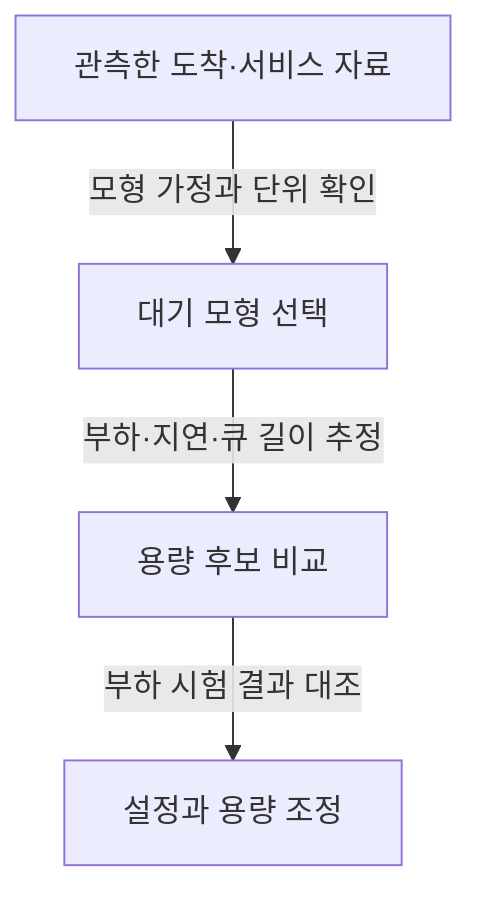

---
sidebar:
  order: 123
  label: "123. 대기행렬이론"
  badge:
    text: "기초"
    variant: note
author: "Codex"
category: "03-data"
date: "2026-09-24T00:00:00+09:00"
tags:
  - "notes-data"
weight: 123
title: "대기행렬이론(Queueing Theory)의 구조와 용량 분석"
extra:
  model: "GPT-6"
  keyword_grade: "기초"
  question_no: "123"
---

## 지식 로드맵 내 현재 위치

데이터베이스 → 통계·데이터 분석 → 대기행렬이론

## 30초 인출

- 본질: **대기행렬이론은 요청의 도착과 서비스 과정에서 생기는 대기 현상을 확률 모형으로 분석하는 이론**
- 메커니즘: 도착률·서비스율·서버 수·대기 규칙을 정해 시스템 내 개체 수와 체류시간을 추정

핵심 용어

- **대기행렬이론 (Queueing Theory)** : 도착하는 개체와 서비스 시설 사이의 대기 현상을 분석하는 확률 모형 체계
- **켄달 표기법 (Kendall's Notation)** : 도착 분포·서비스 분포·서버 수·용량·모집단·서비스 규율로 대기 모형을 표현하는 표기
- **리틀의 법칙 (Little's Law)** : 안정된 시스템의 평균 개체 수와 유효 도착률·평균 체류시간 사이의 관계 $L=\lambda W$
- **이용률 $\rho$** : 서버가 바쁜 시간 비율을 나타내는 모형별 부하 지표

---

## 1교시 예상문제 (10점)

> 대기행렬이론의 기본 구조와 켄달 표기법 및 리틀의 법칙을 설명하시오. (예상)

---

## 1교시 10점 답안

### Ⅰ. 대기행렬이론 개요

| 구분 | 핵심 |
|---|---|
| 정의 | 대기행렬이론은 요청의 도착·대기·서비스를 확률 모형으로 분석하는 이론 |
| 목적 | 서비스 지연과 시스템 부하를 추정해 운영·용량 결정을 지원 |

### Ⅱ. 구조와 기본 관계

| 요소 | 의미 |
|---|---|
| 도착 과정 | 도착률 $\lambda$와 도착 간격 분포 |
| 대기 공간 | 대기 수용량과 서비스 순서 |
| 서비스 시설 | 서버 수 $c$와 서비스 시간·처리율 $\mu$ |
| 리틀의 법칙 | $L=\lambda W$, $L_q=\lambda W_q$ (장기 평균 관계) |

**제언:** 평균값만 보지 말고 실제 도착·서비스 분포와 목표 응답시간을 함께 반영

---

## 2~4교시 예상문제 (25점)

> 대기행렬이론의 기본 구조와 켄달 표기법을 설명하고, 리틀의 법칙 및 대표 모형의 시스템 용량 분석 활용을 기술하시오. (예상)

---

## 2~4교시 25점 답안

## Ⅰ. 대기행렬이론 개요

| 구분 | 핵심 |
|---|---|
| 정의 | 대기행렬이론은 요청의 도착·대기·서비스를 확률 모형으로 분석하는 이론 |
| 목적 | 서비스 지연과 시스템 부하를 추정해 운영·용량 결정을 지원 |

## Ⅱ. 대기 시스템과 켄달 표기

| 기호 | 의미 |
|---|---|
| $A$ | 도착 간격 분포 (예: $M$은 Markovian/지수 간격 가정) |
| $B$ | 서비스 시간 분포 |
| $c$ | 병렬 서버 수 |
| $K$ | 시스템 내 최대 수용 개체 수 |
| $N$ | 모집단 크기 |
| $Z$ | 서비스 규율; 기호 생략 시 관례는 모형·문헌에 따라 표기 확인 |

## Ⅲ. 평균 관계와 대표 모형

| 관계·모형 | 식·전제 |
|---|---|
| 리틀의 법칙 | 안정 조건에서 $L=\lambda W$, 대기열만 보면 $L_q=\lambda W_q$ |
| M/M/1 이용률 | $\rho=\lambda/\mu<1$일 때 정상상태 모형 |
| M/M/1 평균 개체 수 | $L=\rho/(1-\rho)$, 이에 따라 $W=L/\lambda$ |
| M/G/1 | 서비스시간 분포의 변동성까지 고려하는 단일 서버 모형 |

리틀의 법칙은 특정 도착 분포에 한정된 M/M/1 공식이 아니라, 적절한 안정·평균 조건에서 적용되는 장기 평균 관계

## Ⅳ. 정보시스템 용량 분석

| 적용 | 판단 포인트 |
|---|---|
| 웹·API 요청 | 평균만이 아니라 피크·버스트와 서비스시간 분포 반영 |
| 작업 큐 | 유입률과 소비 처리율, 큐 길이·대기시간 추세 비교 |
| 용량 결정 | 이용률 임계값을 일률 강제하지 않고 서비스 목표·비용·변동성으로 판단 |

## Ⅴ. 기술사적 제언

| 한계 | 해결 방안 |
|---|---|
| 평균 트래픽만으로 사이징하면 피크 변동과 긴 꼬리 지연을 놓칠 가능성 | 실제 부하 분포를 반영한 부하 시험으로 후보 용량을 비교하고 지연·큐 길이 목표에 맞춰 단계적으로 조정 |

---

## 출제 이력과 검증 출처

- [NIST 대기 시스템 성능 자료](https://nvlpubs.nist.gov/nistpubs/Legacy/SP/nbsspecialpublication500-65.pdf): 평균 체류 시간·처리량·시스템 내 평균 건수의 Little 법칙

- 출제 이력: 제120회 정보관리 2교시 출제 이력으로 기록된 문항(원문 출처 확인 필요)
- 검증 출처: J. D. C. Little, “A Proof for the Queuing Formula: L = λW,” *Operations Research*, 1961; Kleinrock, *Queueing Systems, Volume I: Theory*

## 연결 토픽

- 성능 분석, 신뢰도 분석, 서버 용량 관리
