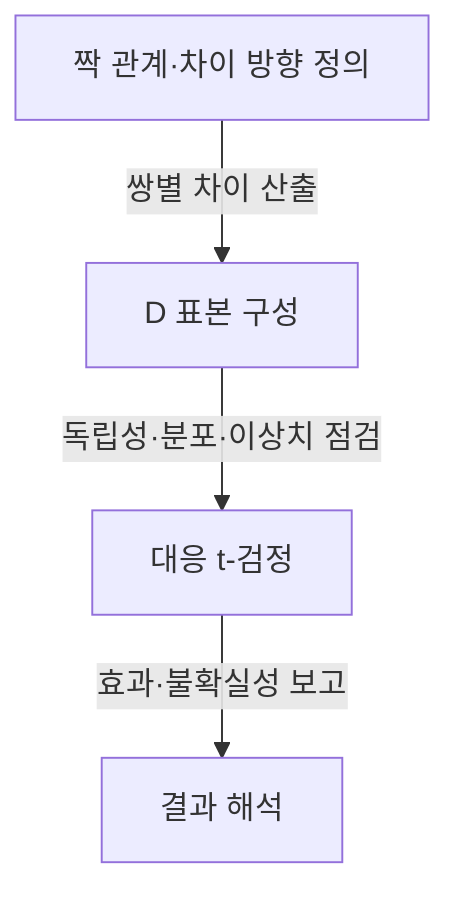

---
sidebar:
  order: 124
  label: "124. 대응 표본 t-검정"
  badge:
    text: "기초"
    variant: note
author: "Codex"
category: "03-data"
date: "2026-09-24T00:00:00+09:00"
tags:
  - "notes-data"
weight: 124
title: "대응 표본 t-검정(Paired t-test)의 원리와 적용"
extra:
  model: "GPT-6"
  keyword_grade: "기초"
  question_no: "124"
---

## 지식 로드맵 내 현재 위치

데이터베이스 → 통계·데이터 분석 → 가설검정

## 30초 인출

- 본질: **대응 표본 t-검정은 짝지어진 관측값의 차이 평균이 기준값과 다른지 검정하는 방법**
- 메커니즘: 각 쌍의 차이 $D$를 계산해 일표본 t-검정으로 분석; 핵심 분포 가정은 쌍별 차이값의 정규성

핵심 용어

- **대응 표본 t-검정 (Paired t-test)** : 짝별 차이값의 모평균을 검정하는 t-검정
- **차이값 $D$** : 한 쌍 두 관측의 순서가 정해진 차이 $D_i=X_{2i}-X_{1i}$
- **윌콕슨 부호순위 검정 (Wilcoxon Signed-Rank Test)** : 대응 차이값의 순위와 부호를 이용하는 비모수 검정
- **자유도 (Degrees of Freedom)** : 대응 t-검정에서 쌍 수가 $n$일 때 $n-1$

---

## 1교시 예상문제 (10점)

> 대응 표본 t-검정의 개념과 절차 및 기본 가정을 설명하시오. (예상)

---

## 1교시 10점 답안

### Ⅰ. 대응 표본 t-검정 개요

| 구분 | 핵심 |
|---|---|
| 정의 | 대응 표본 t-검정은 짝지어진 관측값의 차이 평균을 검정하는 방법 |
| 목적 | 짝 간 공통 변동을 반영해 두 조건의 평균 차이를 평가 |

### Ⅱ. 검정 절차

| 순서 | 내용 |
|---|---|
| 1 | 짝의 기준과 차이 방향을 정해 $D_i=X_{2i}-X_{1i}$ 계산 |
| 2 | $H_0:\mu_D=0$ 설정; $t=\bar D/(s_D/\sqrt n)$, $df=n-1$ 산출 |
| 3 | 쌍 간 독립성 및 차이값 분포를 검토하고 유의수준에 따라 결론 해석 |

**제언:** 효과 방향·크기와 신뢰구간을 p값과 함께 보고

---

## 2~4교시 예상문제 (25점)

> 대응 표본 t-검정의 원리·가정·절차를 설명하고, 독립 표본 t-검정과의 차이 및 적용 시 유의사항을 기술하시오. (예상)

---

## 2~4교시 25점 답안

## Ⅰ. 대응 표본 t-검정 개요

| 구분 | 핵심 |
|---|---|
| 정의 | 대응 표본 t-검정은 짝지어진 관측값의 차이 평균을 검정하는 방법 |
| 목적 | 짝 간 공통 변동을 반영해 두 조건의 평균 차이를 평가 |

## Ⅱ. 검정 원리와 통계량

| 요소 | 내용 |
|---|---|
| 가설 | $H_0:\mu_D=0$; 대립가설은 연구 질문에 따라 양측·단측 설정 |
| 통계량 | $t=(\bar D-\mu_{D0})/(s_D/\sqrt n)$ |
| 자유도 | $df=n-1$ |
| 해석 | 평균 차이, 신뢰구간, p값을 함께 해석 |

## Ⅲ. 가정과 절차

추론의 주요 조건은 쌍 간 독립성 및 차이값 분포의 정규성(특히 소표본에서 중요); 두 시점 각각의 값이 따로 정규분포일 필요는 없음. 큰 표본에서 정규 근사가 가능해도 이상치·의존성 문제는 별도 검토

## Ⅳ. 검정 선택과 IT 성능 실험

| 설계·자료 | 선택·유의점 |
|---|---|
| 같은 서버·같은 질의의 전후 측정 | 대응 검정; 시간 추세·측정 순서·시스템 상태 교란 통제 |
| 서로 다른 두 집단 | 독립 표본 검정; 등분산이 불확실하면 Welch 검정 고려 |
| 차이값 정규성에 민감한 자료 | 윌콕슨 부호순위 검토; 대칭성 등 해당 검정의 가정 확인 |
| 성능 개선 해석 | 통계적 유의성과 실무적 효과 크기·신뢰구간을 구별 |

## Ⅴ. 기술사적 제언

| 한계 | 해결 방안 |
|---|---|
| 전후 성능 차이를 시스템 튜닝 효과로 오인할 수 있는 시간·부하 변화 | 동일 조건의 짝 설계와 동시 관측 통제를 우선 적용하고, 실행 순서를 무작위화해 효과 추정의 타당성을 높임 |

---

## 출제 이력과 검증 출처

- 출제 이력: 제131회 정보관리 2교시 출제 이력으로 기록된 대응 표본·독립 표본 t-검정 문항(원문 출처 확인 필요)
- 검증 출처: [NIST/SEMATECH e-Handbook of Statistical Methods](https://www.itl.nist.gov/div898/handbook/), NIST Dataplot T TEST reference

## 연결 토픽

- 가설검정, 독립 표본 t-검정, 실험설계
