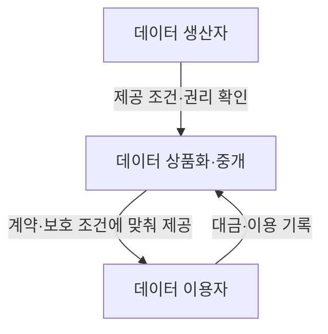
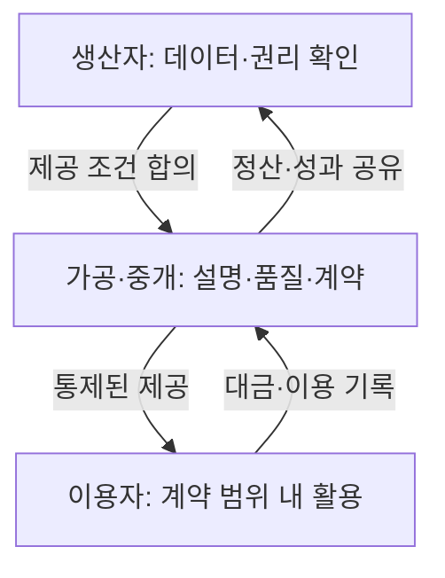

---
sidebar:
  order: 127
  label: "127. 데이터 커머스 (Data Commerce)"
  badge:
    text: "기초"
    variant: note
author: "OpenAI Codex"
category: "03-data"
date: "2026-09-24T17:05:00+09:00"
tags:
  - "notes-data"
weight: 127
title: "데이터 커머스(Data Commerce)"
extra:
  model: "GPT-6"
  keyword_grade: "기초"
  question_no: "127"
---

## 지식 로드맵 내 현재 위치

데이터베이스 → 데이터 경제·거래 → 데이터 커머스

## 30초 인출

- 본질: **데이터 커머스**는 데이터를 상품이나 서비스로 만들어 거래하고 활용하는 활동
- 메커니즘: 생산자 → 상품화·거래 → 이용자, 각 단계에서 이용 조건과 보호 조치 관리
- 판단: 파일 제공, API 제공, 분석환경 제공 중 데이터 민감도와 이용 목적에 맞는 방식 선택

핵심 용어

- **데이터 커머스(Data Commerce)**: 데이터를 상품·서비스로 구성해 거래하고 이용 조건을 관리하는 활동
- **Data as a Service (DaaS)**: 데이터 자체 또는 데이터 처리 결과를 서비스 형태로 제공하는 방식
- **데이터 안심구역**: 반출이 제한된 데이터와 분석환경을 제공해 안전한 데이터 활용을 지원하는 공간
- **가명정보 결합**: 서로 다른 개인정보처리자의 가명정보를 법정 목적과 절차에 따라 전문기관이 결합하는 처리

---

## 1교시 예상문제 (10점)

> 데이터 커머스의 개념, 거래 구조 및 주요 유통 방식을 설명하시오. (예상)

---

## 1교시 10점 답안

### Ⅰ. 개요

| 구분 | 핵심 |
|---|---|
| 정의 | 데이터를 상품·서비스로 구성해 거래하고 이용 조건을 관리하는 활동 |
| 목적 | 데이터 생산자의 가치 회수와 이용자의 데이터 활용 촉진 |

### Ⅱ. 거래 구조

생산자는 제공 가능한 데이터와 권리를 확인하고, 중개·가공자는 품질과 이용조건을 명시하며, 이용자는 계약 범위 안에서 데이터를 활용하는 구조.

### Ⅲ. 유통 방식과 한 줄 제언

| 방식 | 제공 형태 | 적용 시 확인 사항 |
|---|---|---|
| 데이터 제공 | 파일·데이터셋 전달 | 목적, 범위, 재제공, 보관기간 |
| DaaS | API·분석 결과 제공 | 접근통제, 사용량, 가용성 |
| 안심구역 | 통제된 분석환경 제공 | 분석 승인, 결과 반출 심사 |

제언: 데이터 민감도와 이용 목적에 따라 제공 방식을 정하고 계약에 권리·보안·재이용 조건을 명시.

---

## 2~4교시 예상문제 (25점)

> 데이터 커머스의 개념과 거래 구조를 설명하고, 주요 거래 유형과 데이터 유통 과정의 법적·기술적 고려사항 및 개선 방안을 논하시오. (예상)

---

## 2~4교시 25점 답안

## Ⅰ. 데이터 커머스 개요

| 구분 | 핵심 |
|---|---|
| 정의 | 데이터를 상품·서비스로 구성해 거래하고 이용 조건을 관리하는 활동 |
| 목적 | 데이터 생산자의 가치 회수와 이용자의 데이터 활용 촉진 |

## Ⅱ. 데이터 거래의 가치 흐름

데이터 거래는 파일 전달만으로 끝나지 않으며, 제공 권리와 이용범위 확인, 상품 설명, 계약, 제공, 정산의 연계가 핵심.

## Ⅲ. 거래 유형과 제공 방식

| 유형 | 거래 당사자·내용 | 운영상 초점 |
|---|---|---|
| 데이터 제공형 | 보유자가 이용자에게 기존 데이터를 제공 | 이용범위·갱신·재제공 조건 |
| 데이터 창출형 | 당사자 협력으로 새 데이터 생성 | 산출물 권리·비용·책임 배분 |
| 가공서비스형 | 데이터를 정제·분석해 결과 제공 | 입력자료 보호·산출물 검수 |
| 중개거래형 | 플랫폼이 제공자와 이용자 간 거래를 중개 | 플랫폼 역할·수수료·분쟁 처리 |

제공 채널은 파일 전달, DaaS API, 데이터 안심구역 등으로 구성 가능하며, 채널 자체가 거래유형이나 법적 권한을 정하지는 않음.

## Ⅳ. 유통 과정의 통제 항목

| 단계 | 확인 항목 | 기술·관리 통제 |
|---|---|---|
| 제공 전 | 제공 권한, 개인정보·저작권 등 제한 | 출처·권리 검토, 최소수집·가명처리 검토 |
| 계약 | 목적, 범위, 기간, 재제공, 책임 | 표준계약 조항, 버전·승인 기록 |
| 제공·이용 | 이용자·목적·접근 범위 | 인증·권한관리, 암호화, 사용기록 |
| 분석·결과 반출 | 재식별·기밀 노출 가능성 | 결과물 점검, 안심구역 반출 심사 |
| 종료 | 보관·파기·정산 의무 | 접근 회수, 자료 파기 확인, 정산 기록 |

서로 다른 개인정보처리자 간 가명정보 결합은 법정 목적 및 지정 전문기관 절차가 적용되며, 결합 결과의 외부 반출에도 별도 처리와 승인 요건이 존재.

## Ⅴ. 기술사적 제언

| 한계 | 해결 방안 |
|---|---|
| 계약마다 이용 목적·재제공·보관 조건의 표현이 달라 이행 확인과 분쟁 대응이 어려움 | 표준계약 항목을 데이터 카탈로그와 연결하고, 승인된 목적·기간·재제공 조건을 접근정책과 이용기록에 반영 |

## 출제 이력과 검증 출처

- 출제 이력: KPC 기출검색 자료 기준 제127회 정보관리기술사 4교시 2번. Q-net 원문은 확인하지 못한 상태.
- 과학기술정보통신부, [데이터 표준계약서 및 활용안내서 배포](https://www.msit.go.kr/bbs/view.do?bbsSeqNo=67&mId=245&nttSeqNo=3139474)
- 국가법령정보센터, [데이터 산업진흥 및 이용촉진에 관한 기본법](https://www.law.go.kr/LSW/lsInfoP.do?ancYnChk=0&chrClsCd=010202&efYd=20251001&lsiSeq=277325&urlMode=lsInfoP)
- 국가법령정보센터, [개인정보 보호법 제28조의2부터 제28조의5](https://law.go.kr/LSW/lsLinkCommonInfo.do?lsJoLnkSeq=1020398635)

## 연결 토픽

- 상위 토픽: [데이터 거버넌스](./006_data_governance.md)
- 연관 토픽: [데이터 가치평가](./002_data_valuation.md), [비정형 가명정보 처리 가이드라인](./034_pseudonymized_data_guidelines_unstructured.md)
