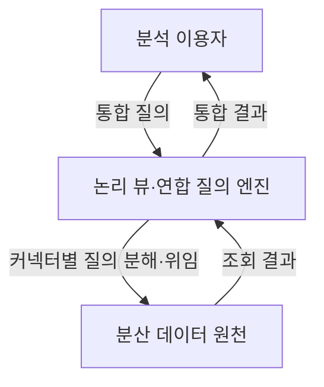

---
sidebar:
  order: 131
  label: "131. 로지컬 DW (Logical Data Warehouse)"
  badge:
    text: "기초"
    variant: note
author: "OpenAI Codex"
category: "03-data"
date: "2026-09-24T17:18:00+09:00"
tags:
  - "notes-data"
weight: 131
title: "로지컬 데이터 웨어하우스(Logical Data Warehouse)와 쿼리 푸시다운"
extra:
  model: "GPT-6"
  keyword_grade: "기초"
  question_no: "131"
---

## 지식 로드맵 내 현재 위치

데이터베이스 → 데이터 웨어하우스·빅데이터 → 로지컬 데이터 웨어하우스

## 30초 인출

- 본질: **로지컬 데이터 웨어하우스(Logical Data Warehouse, LDW)**는 여러 원천의 데이터를 논리적으로 통합해 이용하게 하는 분석 구조
- 메커니즘: 가상화·연합 질의 계층이 원천에 질의를 나누고 결과를 통합
- 최적화: 원천이 지원하는 필터·집계 연산은 커넥터를 통해 원천 쪽에서 처리

핵심 용어

- **Logical Data Warehouse (LDW)**: 분산된 원천 데이터에 논리적 통합 접근을 제공하는 분석 구조
- **데이터 가상화(Data Virtualization)**: 데이터를 별도 적재하지 않고 논리 뷰와 질의 계층으로 여러 원천을 조회하는 방식
- **연합 질의(Federated Query)**: 여러 데이터 원천에 질의를 실행하고 결과를 통합하는 처리
- **쿼리 푸시다운(Query Pushdown)**: 질의의 일부 연산을 데이터 원천에 위임해 처리하는 최적화
- **커넥터(Connector)**: 질의 엔진과 데이터 원천 사이의 연결·연산 위임 기능을 제공하는 구성요소

---

## 1교시 예상문제 (10점)

> 로지컬 데이터 웨어하우스의 개념과 구조, 쿼리 푸시다운의 역할을 설명하시오. (예상)

---

## 1교시 10점 답안

### Ⅰ. 개요

| 구분 | 핵심 |
|---|---|
| 정의 | 분산된 원천 데이터를 논리적으로 통합해 이용하게 하는 분석 구조 |
| 목적 | 데이터 복제·연계 부담을 줄이고 여러 원천에 대한 통합 분석 지원 |

### Ⅱ. 핵심 구조

### Ⅲ. 쿼리 푸시다운과 한 줄 제언

| 연산 | 동작 |
|---|---|
| 필터·컬럼 선택 | 원천 지원 시 조건과 필요한 컬럼만 원천에서 처리·반환 |
| 집계·조인 | 커넥터와 질의 형태가 지원할 때 원천 처리로 위임 |

제언: 원천 부하와 커넥터 지원 범위를 점검하고, 대표 질의의 실행계획으로 푸시다운 적용 여부를 확인.

---

## 2~4교시 예상문제 (25점)

> 로지컬 데이터 웨어하우스의 개념과 구성, 쿼리 푸시다운 원리를 설명하고, 물리적 데이터 웨어하우스와의 차이 및 도입 시 고려사항을 논하시오. (예상)

---

## 2~4교시 25점 답안

## Ⅰ. 로지컬 데이터 웨어하우스 개요

| 구분 | 핵심 |
|---|---|
| 정의 | 분산된 원천 데이터를 논리적으로 통합해 이용하게 하는 분석 구조 |
| 목적 | 데이터 복제·연계 부담을 줄이고 여러 원천에 대한 통합 분석 지원 |

## Ⅱ. 연합 질의 구조

가상화 엔진은 원천 메타데이터와 논리 뷰를 이용해 분산 질의를 실행하고, 각 원천의 응답을 하나의 결과로 조합.

## Ⅲ. 쿼리 푸시다운 원리

| 연산 | 원천 위임 시 효과 | 적용 조건 |
|---|---|---|
| 필터 | 불필요한 행의 전송 감소 | 원천·커넥터가 조건 연산 지원 |
| 프로젝션 | 필요한 열만 읽고 반환 | 원천·커넥터의 열 선택 지원 |
| 집계·조인 | 중간 데이터 이동 및 엔진 처리량 감소 가능 | 함수·조인 조건·원천 위치 등 질의별 지원 |

푸시다운 가능 여부는 원천과 커넥터, SQL 연산에 따라 달라지며 실행계획에서 실제 위임을 확인.

## Ⅳ. 물리적 DW와의 차이 및 선택

| 기준 | 물리적 DW | 로지컬 DW |
|---|---|---|
| 통합 방식 | 데이터를 적재·변환해 분석 저장소에 구성 | 원천에 질의해 논리 결과를 통합 |
| 장점 | 통제된 모델·성능 튜닝·원천 부하 분리 | 물리 복제와 적재 파이프라인을 줄일 수 있음 |
| 한계 | 적재 지연·중복 저장·파이프라인 관리 | 원천 부하·네트워크·이종 원천 조인 성능에 영향 |
| 적합 상황 | 반복적 대량 분석과 안정적 성능 요구 | 여러 원천의 통합 접근과 민첩한 조회 요구 |

로지컬 구조는 물리 적재를 전부 대체하는 해법이 아니며, 성능·신선도·원천 보호 요구에 따라 적재형 구조와 병행 가능.

## Ⅴ. 기술사적 제언

| 한계 | 해결 방안 |
|---|---|
| 분산 질의가 원천 업무 부하나 네트워크 지연을 키울 수 있음 | 질의별 실행계획·원천 부하를 관측하고, 반복·대량 분석은 캐시나 사전 적재와 비교해 경로를 선택 |

## 출제 이력과 검증 출처

- 출제 이력: KPC 기출검색 자료 기준 제121회 정보관리기술사 2교시의 로지컬 데이터 웨어하우스 관련 문항. Q-net 원문은 확인하지 못한 상태.
- Trino 공식 문서, [Pushdown](https://trino.io/docs/current/optimizer/pushdown.html)
- Trino 공식 문서, [Connectors](https://trino.io/docs/current/develop/connectors.html)

## 연결 토픽

- 상위 토픽: [OLAP](./039_olap.md)
- 연관 토픽: [데이터 레이크](./007_data_lake.md), [로지컬 데이터 웨어하우스 아키텍처](./132_logical_data_warehouse.md)
