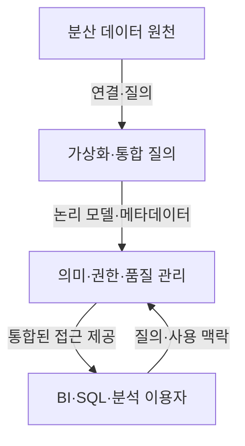

---
sidebar:
  order: 132
  label: "132. 로지컬 데이터웨어하우스 (LDW)"
  badge:
    text: "기초"
    variant: note
author: "OpenAI Codex"
category: "03-data"
date: "2026-09-24T17:22:00+09:00"
tags:
  - "notes-data"
weight: 132
title: "로지컬 데이터웨어하우스(LDW)의 계층 구조와 데이터 패브릭"
extra:
  model: "GPT-6"
  keyword_grade: "기초"
  question_no: "132"
---

## 지식 로드맵 내 현재 위치

데이터베이스 → 데이터 웨어하우스·빅데이터 → 로지컬 DW와 데이터 패브릭

## 30초 인출

- 본질: **로지컬 데이터웨어하우스(Logical Data Warehouse, LDW)**는 여러 원천을 논리적으로 연결해 통합 분석을 지원하는 구조
- 메커니즘: 데이터 원천, 가상화·통합 질의, 의미·접근 관리, 분석 이용자 계층의 연결
- 구분: 데이터 패브릭은 메타데이터와 자동화 기능을 활용해 데이터 통합·관리 작업을 지원하는 아키텍처 접근

핵심 용어

- **Logical Data Warehouse (LDW)**: 서로 다른 저장소의 데이터를 논리적으로 통합해 조회하는 데이터 관리 구조
- **시맨틱 계층(Semantic Layer)**: 기술 스키마를 업무 용어·정의로 연결해 분석에 제공하는 계층
- **데이터 패브릭(Data Fabric)**: 메타데이터와 자동화 기능을 활용해 다양한 환경의 데이터 관리·접근을 지원하는 아키텍처 접근
- **활성 메타데이터(Active Metadata)**: 사용·운영 과정에서 관측한 메타데이터를 관리·자동화에 활용하는 방식

---

## 1교시 예상문제 (10점)

> 로지컬 데이터웨어하우스의 구조와 데이터 패브릭의 관계를 설명하시오. (예상)

---

## 1교시 10점 답안

### Ⅰ. 개요

| 구분 | 핵심 |
|---|---|
| 정의 | 여러 데이터 원천을 논리적으로 연결해 통합 분석을 지원하는 데이터 관리 구조 |
| 목적 | 데이터 사일로와 중복 적재 부담을 줄이고 일관된 분석 접근 제공 |

### Ⅱ. 참조 계층 구조

| 계층 | 역할 |
|---|---|
| 원천 | 업무·분석 데이터를 보유 |
| 통합·가상화 | 원천 연결, 질의 조정, 데이터 결합 |
| 의미·관리 | 업무 정의, 메타데이터, 권한·품질 정책 적용 |
| 이용 | BI·SQL 분석 등 통합 결과 활용 |

### Ⅲ. 데이터 패브릭과 한 줄 제언

| 관점 | 핵심 |
|---|---|
| LDW | 논리 통합 접근과 연합 질의 중심 |
| 데이터 패브릭 | 메타데이터·자동화 기능을 포함해 데이터 관리·접근을 폭넓게 지원 |

제언: 데이터 환경과 통합 요구에 따라 논리 질의, 물리 적재, 메타데이터 자동화를 조합.

---

## 2~4교시 예상문제 (25점)

> 로지컬 데이터웨어하우스의 참조 계층과 주요 기능을 설명하고, 데이터 패브릭과의 공통점·차이 및 구축 시 고려사항을 논하시오. (예상)

---

## 2~4교시 25점 답안

## Ⅰ. 로지컬 데이터웨어하우스 개요

| 구분 | 핵심 |
|---|---|
| 정의 | 여러 데이터 원천을 논리적으로 연결해 통합 분석을 지원하는 데이터 관리 구조 |
| 목적 | 데이터 사일로와 중복 적재 부담을 줄이고 일관된 분석 접근 제공 |

## Ⅱ. 엔터프라이즈 참조 계층

참조 계층은 제품에 고정된 단일 표준이 아니라 데이터 연결, 의미 정리, 접근 관리, 이용을 구분해 설계하는 관점.

## Ⅲ. 핵심 기능과 데이터 이동 선택

| 기능 | 역할 | 설계 판단 |
|---|---|---|
| 가상화·연합 질의 | 분산 원천을 논리 뷰로 연결 | 원천 부하·커넥터 지원·질의 지연 평가 |
| 시맨틱·카탈로그 | 업무 정의와 원천 메타데이터 연결 | 용어·계보·소유자 관리 |
| 물리 적재·캐시 | 반복 분석 자료의 성능·가용성 지원 | 최신성·비용·운영 부하 비교 |

모든 데이터를 가상화하거나 무복제하는 것이 목표는 아니며, 빈번하고 무거운 질의는 물리 적재·캐시와 함께 검토.

## Ⅳ. LDW와 데이터 패브릭

| 구분 | 로지컬 DW | 데이터 패브릭 |
|---|---|---|
| 초점 | 분산 원천의 논리 통합·질의 | 환경 전반의 데이터 관리·접근 조정 |
| 주요 기반 | 가상화, 연합 질의, 논리 모델 | 메타데이터, 계보, 정책, 자동화 기능 등 |
| 관계 | 통합 접근을 제공하는 구조 | LDW 기능을 포함하거나 다른 통합 방식과 결합 가능 |
| 유의점 | 원천별 성능·기능 차이와 부하 | 자동화 범위·메타데이터 품질·정책 일관성 |

## Ⅴ. 기술사적 제언

| 한계 | 해결 방안 |
|---|---|
| 전사 통합을 한 번에 추진하면 원천·용어·접근정책 차이로 범위와 운영 복잡성이 커짐 | 업무 도메인 하나를 선정해 용어·원천·권한 메타데이터를 정리한 뒤, 통합 질의와 자동화 범위를 검증하며 점진 확대 |

## 출제 이력과 검증 출처

- 출제 이력: KPC 기출검색 자료의 제121회 정보관리기술사 로지컬 DW 관련 문항. 상세 원문 및 Q-net 원문은 확인하지 못한 상태.
- Trino 공식 문서, [Pushdown](https://trino.io/docs/current/optimizer/pushdown.html)
- W3C, [Data Catalog Vocabulary (DCAT) Version 3](https://www.w3.org/TR/vocab-dcat-3/)

## 연결 토픽

- 상위 토픽: [OLAP](./039_olap.md)
- 연관 토픽: [로지컬 DW와 쿼리 푸시다운](./131_logical_dw.md), [데이터 레이크](./007_data_lake.md)
