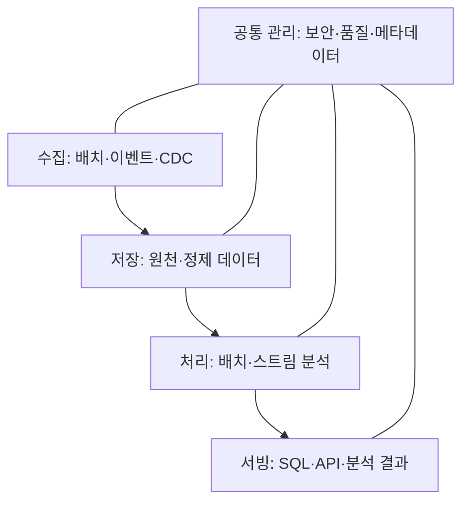

---
sidebar:
  order: 135
  label: "135. 빅데이터 플랫폼 아키텍처"
  badge:
    text: "기초"
    variant: note
author: "OpenAI Codex"
category: "03-data"
date: "2026-09-24T17:42:00+09:00"
tags:
  - "notes-data"
weight: 135
title: "빅데이터 플랫폼 아키텍처와 람다·카파·레이크하우스"
extra:
  model: "GPT-6"
  keyword_grade: "기초"
  question_no: "135"
---

## 지식 로드맵 내 현재 위치

데이터베이스 → 빅데이터·분석 아키텍처 → 수집·저장·처리·서빙 플랫폼

## 30초 인출

- 본질: **빅데이터 플랫폼**은 대규모·다양한 데이터를 수집해 처리하고 업무에 제공하는 데이터 시스템
- 메커니즘: 수집 → 저장 → 처리 → 서빙의 흐름을 공통 보안·품질·메타데이터 관리가 지원
- 구분: Lambda·Kappa는 처리 파이프라인 설계, Lakehouse는 분석 저장·테이블 관리 구조

핵심 용어

- **Lambda Architecture**: 배치 처리와 저지연 스트림 처리를 병행해 결과를 제공하는 구조
- **Kappa Architecture**: 스트림 처리 경로를 중심으로 실시간 처리와 로그 재처리를 구성하는 구조
- **Data Lakehouse**: 데이터 레이크의 유연한 저장과 분석용 테이블 관리 기능을 결합하려는 아키텍처 접근
- **Change Data Capture (CDC)**: 원천 데이터베이스의 변경을 추적해 변경분을 다른 시스템으로 전달하는 방식

---

## 1교시 예상문제 (10점)

> 빅데이터 플랫폼의 기본 계층과 Lambda·Kappa 아키텍처의 차이를 설명하시오. (예상)

---

## 1교시 10점 답안

### Ⅰ. 개요

| 구분 | 핵심 |
|---|---|
| 정의 | 대규모·다양한 데이터를 수집해 처리하고 업무에 제공하는 데이터 시스템 |
| 목적 | 규모·속도·형식이 다른 데이터의 안정적 분석·활용 지원 |

### Ⅱ. 플랫폼의 기본 흐름

### Ⅲ. 처리 구조와 한 줄 제언

| 구조 | 핵심 선택 |
|---|---|
| Lambda | 배치 정확도 경로와 저지연 스트림 경로를 함께 운영 |
| Kappa | 스트림 경로와 보존 로그 재처리를 중심으로 구성 |

제언: 처리 지연·재처리 요구와 중복 구현 부담을 비교해 구조를 선택하고 대표 장애·재처리 시나리오로 검증.

---

## 2~4교시 예상문제 (25점)

> 빅데이터 플랫폼의 계층 구조를 설명하고, Lambda와 Kappa의 처리 원리를 비교하시오. 데이터 레이크하우스와의 관계 및 설계 시 고려사항도 논하시오. (예상)

---

## 2~4교시 25점 답안

## Ⅰ. 빅데이터 플랫폼 개요

| 구분 | 핵심 |
|---|---|
| 정의 | 대규모·다양한 데이터를 수집해 처리하고 업무에 제공하는 데이터 시스템 |
| 목적 | 규모·속도·형식이 다른 데이터의 안정적 분석·활용 지원 |

## Ⅱ. 플랫폼 계층과 데이터 흐름

| 계층 | 책임 | 대표 고려사항 |
|---|---|---|
| 수집 | 배치·이벤트·변경 데이터 수용 | 중복, 순서, 재전송 |
| 저장 | 원천·정제·분석 데이터 보존 | 형식, 파티션, 보존기간 |
| 처리 | 변환·집계·모델 연산 | 지연, 처리량, 재처리 |
| 서빙 | 사용자·서비스에 결과 제공 | 질의 성능, 접근정책 |
| 공통 관리 | 메타데이터·품질·보안 통제 | 계보, 권한, 감사 |

## Ⅲ. Lambda와 Kappa 처리 구조

| 기준 | Lambda | Kappa |
|---|---|---|
| 처리 경로 | 배치 경로와 스트림 경로 병행 | 스트림 경로 중심 |
| 결과 결합 | 최신 스트림 결과와 배치 결과를 조합 | 보존 로그 재처리로 결과 재생성 |
| 장점 | 대량 과거자료 재계산과 저지연 결과를 함께 지원 | 로직 경로를 단순화할 수 있음 |
| 부담 | 두 경로의 로직·결과 정합성 관리 | 로그 보존·재처리 용량과 시간 확보 |

## Ⅳ. Lakehouse와의 관계

| 개념 | 주로 다루는 문제 | 관계 |
|---|---|---|
| Lambda·Kappa | 배치·스트림 처리 경로 구성 | 처리 아키텍처 선택 |
| Data Lakehouse | 데이터 저장·테이블 관리와 분석 접근 | 저장·분석 계층 설계 |
| 결합 판단 | 처리 요구와 저장 특성의 조합 | 특정 포맷이 Lambda·Kappa를 자동 대체하지 않음 |

테이블 포맷의 트랜잭션·스키마 진화 지원은 포맷, 카탈로그, 엔진, 쓰기 방식의 조합에 따라 확인.

## Ⅴ. 기술사적 제언

| 한계 | 해결 방안 |
|---|---|
| 배치와 스트림 경로가 나뉘면 비즈니스 로직 중복·결과 불일치 위험이 커지고, 단일 스트림은 과거 로그 재처리 부담이 커질 수 있음 | 업무별 허용 지연·정확도·재처리 범위를 먼저 정하고, 데이터 보존·재생 시험을 거쳐 Lambda 또는 Kappa를 선정하며 저장 구조는 별도 평가 |

## 출제 이력과 검증 출처

- 출제 이력: KPC 기출검색 자료 기준 제126회 정보관리기술사 1교시의 빅데이터 플랫폼 계층·Lambda·Kappa 비교 문항. Q-net 원문은 확인하지 못한 상태.
- Michael Armbrust et al., [Lakehouse: A New Generation of Open Platforms that Unify Data Warehousing and Advanced Analytics](https://www.cidrdb.org/cidr2021/papers/cidr2021_paper17.pdf), CIDR 2021.
- Apache Iceberg 공식 문서, [Table Specification](https://iceberg.apache.org/spec/)

## 연결 토픽

- 상위 토픽: [빅데이터](./112_big_data.md)
- 연관 토픽: [데이터 레이크](./007_data_lake.md), [빅데이터 분석도구 선정 원칙](./134_big_data_analytics_tool_selection_principles.md)
