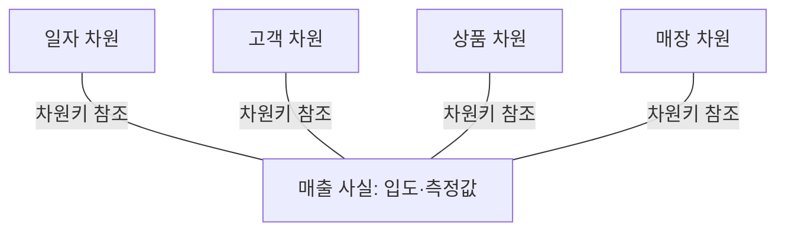

---
sidebar:
  order: 137
  label: "137. 스타 스키마 (Star Schema)"
  badge:
    text: "기초"
    variant: note
author: "OpenAI Codex"
category: "03-data"
date: "2026-09-24T17:54:00+09:00"
tags:
  - "notes-data"
weight: 137
title: "스타 스키마(Star Schema)의 차원 모델링과 최적화"
extra:
  model: "GPT-6"
  keyword_grade: "기초"
  question_no: "137"
---

## 지식 로드맵 내 현재 위치

데이터베이스 → 데이터 웨어하우스·빅데이터 → 차원 모델링

## 30초 인출

- 본질: **스타 스키마**는 분석 사실을 중심에 두고 차원 테이블을 직접 연결하는 차원 모델
- 메커니즘: 차원은 분석 맥락, 사실 테이블은 선언된 입도의 사건·측정값을 보유
- 설계: 업무 프로세스와 입도를 먼저 정하고 차원·사실을 도출

핵심 용어

- **스타 스키마(Star Schema)**: 사실 테이블과 관련 차원 테이블을 직접 연결하는 차원 모델
- **사실 테이블(Fact Table)**: 선언한 입도의 업무 사건과 차원 키·측정값을 기록하는 테이블
- **차원 테이블(Dimension Table)**: 사실을 분석·분류할 때 사용하는 업무 맥락과 속성을 담는 테이블
- **입도(Grain)**: 사실 테이블의 한 행이 나타내는 업무 사건 수준
- **느리게 변화하는 차원(Slowly Changing Dimension, SCD)**: 변경되는 차원 속성의 이력 보존 방식을 구분하는 기법

---

## 1교시 예상문제 (10점)

> 스타 스키마의 개념과 사실·차원 테이블의 관계, 차원 모델 설계 시 고려사항을 설명하시오. (예상)

---

## 1교시 10점 답안

### Ⅰ. 개요

| 구분 | 핵심 |
|---|---|
| 정의 | 사실 테이블과 관련 차원 테이블을 직접 연결하는 차원 모델 |
| 목적 | 업무 사건을 여러 분석 관점에서 조회·집계할 수 있는 구조 제공 |

### Ⅱ. 사실·차원 구조

### Ⅲ. 설계 핵심과 한 줄 제언

| 요소 | 역할·판단 |
|---|---|
| 사실 테이블 | 차원 키와 입도별 사건·측정값 기록 |
| 차원 테이블 | 일자·고객·상품 등 분석 맥락 제공 |
| 입도 | 한 행이 의미하는 사건 단위의 명시 |

제언: 사실 테이블의 입도와 차원 속성의 이력 요구를 먼저 합의하고 분석 질의로 검증.

---

## 2~4교시 예상문제 (25점)

> 스타 스키마의 구조와 설계 절차를 설명하고, 스노우플레이크 스키마와의 차이 및 질의 최적화·차원 이력 관리 시 고려사항을 논하시오. (예상)

---

## 2~4교시 25점 답안

## Ⅰ. 스타 스키마 개요

| 구분 | 핵심 |
|---|---|
| 정의 | 사실 테이블과 관련 차원 테이블을 직접 연결하는 차원 모델 |
| 목적 | 업무 사건을 여러 분석 관점에서 조회·집계할 수 있는 구조 제공 |

## Ⅱ. 사실·차원 관계와 입도

| 구성 | 핵심 내용 |
|---|---|
| 사실 테이블 | 차원 외래키와 입도별 측정값 또는 이벤트 존재 기록 |
| 차원 테이블 | 사용자 질의의 필터·그룹 기준인 업무 속성 |
| 입도 | 사실 테이블 한 행이 표현하는 최소 업무 단위 |

## Ⅲ. 차원 모델 설계 절차

| 순서 | 설계 작업 | 핵심 산출 |
|---|---|---|
| 1 | 분석할 업무 프로세스 선택 | 범위·업무 이벤트 |
| 2 | 사실 테이블 입도 선언 | 한 행의 의미 |
| 3 | 입도에 맞는 차원 도출 | 분석 관점·속성 |
| 4 | 측정 사실 정의 | 가산성·집계 규칙 |

## Ⅳ. 스타·스노우플레이크 비교와 질의 최적화

| 기준 | 스타 스키마 | 스노우플레이크 스키마 |
|---|---|---|
| 차원 구조 | 속성을 한 차원 테이블에 모으는 비정규화 경향 | 차원 계층을 여러 정규화 테이블로 분리하는 경향 |
| 조인 | 사실과 차원의 직접 연결 | 차원 계층까지 추가 조인 가능 |
| 장점 | 단순한 분석 질의와 사용 편의 | 중복 감소와 계층 속성의 관리 |
| 선택 | 질의 단순성·성능 요구 검토 | 중복·갱신·모델 관리 요구 검토 |

데이터베이스의 스타 변환은 제품·인덱스·질의 조건에 따라 적용 여부가 달라지는 옵티마이저 기법이며, 스타 스키마 자체가 특정 성능을 보장하지 않음.

## Ⅴ. 차원 이력 관리

| 방식 | 처리 | 적합한 요구 |
|---|---|---|
| SCD Type 1 | 기존 속성을 덮어써 이력 미보존 | 현재 값만 필요 |
| SCD Type 2 | 새 행과 대리키·유효기간을 추가해 이력 보존 | 과거 시점의 사실을 당시 차원 값으로 분석 |
| SCD Type 3 | 이전 값 등을 제한된 별도 열에 보존 | 제한된 변경 이력 비교 |

## Ⅵ. 기술사적 제언

| 한계 | 해결 방안 |
|---|---|
| 입도가 불명확하거나 차원 변경 정책이 없으면 사실 중복·잘못된 집계·과거 보고서 변동이 발생 | 업무 담당자와 행의 의미·측정값 집계 규칙·이력 보존 범위를 승인하고, 대표 시점별 질의로 모델을 검증 |

## 출제 이력과 검증 출처

- 출제 이력: KPC 기출검색 자료 기준 제122회 정보관리기술사 1교시의 스타·스노우플레이크 스키마 비교 문항. Q-net 원문은 확인하지 못한 상태.
- Ralph Kimball, Margy Ross, *The Data Warehouse Toolkit*, 3rd ed., Wiley.
- Oracle Database, [Data Warehousing Optimizations and Techniques: Star Transformation](https://docs.oracle.com/database/121/DWHSG/schemas.htm)

## 연결 토픽

- 상위 토픽: [OLAP](./039_olap.md)
- 연관 토픽: [반정규화](./017_denormalization.md), [MOLAP](./161_molap.md)
