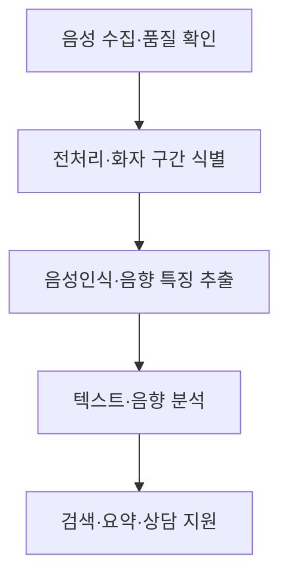

---
sidebar:
  order: 138
  label: "138. 음성데이터 마이닝 (Voice Data Mining)"
  badge:
    text: "기초"
    variant: note
author: "OpenAI Codex"
category: "03-data"
date: "2026-09-24T18:00:00+09:00"
tags:
  - "notes-data"
weight: 138
title: "음성데이터 마이닝(Voice Data Mining)과 컨택센터 분석"
extra:
  model: "GPT-6"
  keyword_grade: "기초"
  question_no: "138"
---

## 지식 로드맵 내 현재 위치

데이터베이스 → 통계·데이터 분석 → 비정형 음성 데이터 분석

## 30초 인출

- 본질: **음성데이터 마이닝**은 음성 신호와 발화 내용을 분석해 업무에 필요한 정보를 추출하는 방법
- 메커니즘: 음성 품질 처리 → 음성인식·화자·음향 분석 → 텍스트·음향 정보 결합
- 활용: 상담 검색·요약·품질 점검에 적용하되 감정·의도 추정은 참고 신호로 검증

핵심 용어

- **음성데이터 마이닝(Voice Data Mining)**: 음성 신호와 발화 내용을 분석해 업무 정보를 추출하는 활동
- **자동 음성인식(Automatic Speech Recognition, ASR)**: 음성 신호를 인식해 문자 표현으로 변환하는 기술
- **화자 분리(Diarization)**: 녹음에서 화자별 발화 구간을 식별하는 처리
- **인공지능 컨택센터(AI Contact Center, AICC)**: 인공지능을 상담 업무와 고객 접점 운영에 활용하는 컨택센터
- **단어 오류율(Word Error Rate, WER)**: 기준 전사와 인식 전사의 삽입·삭제·대치 오류를 단어 수로 정규화한 지표

---

## 1교시 예상문제 (10점)

> 음성데이터 마이닝의 개념과 처리 구조, 주요 활용 및 유의사항을 설명하시오. (예상)

---

## 1교시 10점 답안

### Ⅰ. 개요

| 구분 | 핵심 |
|---|---|
| 정의 | 음성 신호와 발화 내용을 분석해 업무 정보를 추출하는 활동 |
| 목적 | 비정형 음성에서 검색·분류·상담 지원에 필요한 정보 도출 |

### Ⅱ. 분석 흐름

### Ⅲ. 활용과 한 줄 제언

| 적용 | 분석 결과 | 확인 사항 |
|---|---|---|
| 상담 검색·요약 | 발화문·주제·요약 | 전사 정확도·누락 |
| 품질·운영 분석 | 발화 구간·상담 지표 | 표본 검수·업무 맥락 |
| 감정·의도 보조 | 모델의 분류·점수 | 추정 불확실성·편향 |

제언: 개인정보와 이용 목적을 먼저 검토하고, 전사·분류 결과를 표본 검수와 상담원 피드백으로 확인.

---

## 2~4교시 예상문제 (25점)

> 음성데이터 마이닝의 처리 구성과 분석 기능을 설명하고, 컨택센터 활용 구조 및 데이터 품질·개인정보·모델 해석상의 고려사항을 논하시오. (예상)

---

## 2~4교시 25점 답안

## Ⅰ. 음성데이터 마이닝 개요

| 구분 | 핵심 |
|---|---|
| 정의 | 음성 신호와 발화 내용을 분석해 업무 정보를 추출하는 활동 |
| 목적 | 비정형 음성에서 검색·분류·상담 지원에 필요한 정보 도출 |

## Ⅱ. 처리 구성과 데이터 흐름

음성인식 결과와 음향 특징은 서로 다른 근거이므로 분석 목적에 따라 결합하며, 전사 텍스트가 음성의 모든 의미를 보존한다고 가정하지 않음.

## Ⅲ. 주요 분석 기능

| 기능 | 입력·처리 | 활용·검증 |
|---|---|---|
| 음성인식(ASR) | 발화를 문자로 변환 | WER/CER와 도메인 용어 전사 검수 |
| 화자 분리 | 발화 구간에 화자 식별자 부여 | 중첩 발화·짧은 발화의 오류 확인 |
| 음향 분석 | 음높이·강도·운율 등 신호 특성 추출 | 장비·환경·개인차를 고려한 해석 |
| 언어 분석 | 전사 텍스트의 주제·의도·요약 분석 | 라벨 정의·표본 검토·현업 확인 |

## Ⅳ. 컨택센터 적용과 통제

| 업무 단계 | 적용 예 | 운영 통제 |
|---|---|---|
| 상담 중 | 관련 지식 검색·상담원 보조 | 지연·오답 시 상담원 확인 경로 |
| 상담 후 | 요약·분류·후속업무 생성 | 전사 오류와 자동 생성 내용 검수 |
| 운영 분석 | 반복 문의·품질 이슈 집계 | 편향·표본성·평가 기준 점검 |
| 데이터 관리 | 녹음·전사·분석 결과 저장 | 이용 목적·접근권한·보존기간 관리 |

감정·의도 분석은 음성에서 추정한 모델 출력이며 화자의 실제 감정이나 의도를 확정하는 근거가 아님.

## Ⅴ. 기술사적 제언

| 한계 | 해결 방안 |
|---|---|
| 전사·감정 분류 결과를 사실로 취급하면 오인식·환경 편향이 상담 평가와 고객 대응에 전파될 수 있음 | 자동 분석 결과에 신뢰도·검수 상태를 표시하고, 중요한 판단은 상담원 확인과 정정 절차를 거치도록 운영 |

## 출제 이력과 검증 출처

- 개인정보 보호위원회, [개인정보 보호법](https://law.go.kr/LSW/lsLinkCommonInfo.do?lsJoLnkSeq=1020398635)
- National Institute of Standards and Technology (NIST), [Speech Recognition Evaluation](https://www.nist.gov/itl/iad/mig/speech)

## 연결 토픽

- 연관 토픽: [텍스트 마이닝](./115_text_mining.md), [빅데이터 분석도구 선정 원칙](./134_big_data_analytics_tool_selection_principles.md)
