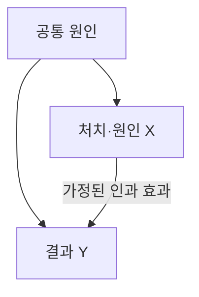

---
sidebar:
  order: 139
  label: "139. 인과관계 (Causation)"
  badge:
    text: "기초"
    variant: note
author: "OpenAI Codex"
category: "03-data"
date: "2026-09-24T18:04:00+09:00"
tags:
  - "notes-data"
weight: 139
title: "인과관계(Causation)와 인과추론"
extra:
  model: "GPT-6"
  keyword_grade: "기초"
  question_no: "139"
---

## 지식 로드맵 내 현재 위치

데이터베이스 → 통계·데이터 분석 → 관측 연관성과 개입 효과

## 30초 인출

- 본질: **인과관계**는 특정 원인·처치가 결과에 미치는 효과에 관한 관계
- 메커니즘: 처치를 받은 경우와 받지 않은 경우의 결과를 비교하는 반사실 문제
- 추론: 무작위 실험이나 가정을 명시한 관측자료 설계로 인과효과를 추정

핵심 용어

- **인과관계(Causation)**: 처치·원인의 변화가 결과에 미치는 효과를 나타내는 관계
- **인과추론(Causal Inference)**: 실험·관측 자료와 식별 가정으로 인과효과를 추정하는 방법
- **반사실(Counterfactual)**: 같은 단위가 다른 처치 조건에 놓였을 때의 가상 결과
- **평균처치효과(Average Treatment Effect, ATE)**: 처치 여부에 따른 잠재결과 차이의 모집단 평균
- **무작위 대조시험(Randomized Controlled Trial, RCT)**: 처치를 무작위 배정해 처치군과 대조군 결과를 비교하는 실험

---

## 1교시 예상문제 (10점)

> 인과관계의 의미와 상관관계와의 차이, 인과효과를 추정하는 기본 방법을 설명하시오. (예상)

---

## 1교시 10점 답안

### Ⅰ. 개요

| 구분 | 핵심 |
|---|---|
| 정의 | 특정 원인·처치가 결과에 미치는 효과에 관한 관계 |
| 목적 | 원인·처치 변경이 결과에 미치는 영향을 추정해 의사결정 지원 |

### Ⅱ. 연관성과 인과효과

관측된 상관은 처치 효과와 공통 원인·선택 과정의 영향을 함께 반영할 수 있으며, 화살표는 분석에서 검토할 인과 가정.

### Ⅲ. 추정 방법과 한 줄 제언

| 방법 | 핵심 조건 |
|---|---|
| 무작위 실험 | 배정 무작위화와 적절한 이행·측정 |
| 관측자료 분석 | 교란 통제 등 식별 가정과 설계의 타당성 |

제언: 효과를 주장하기 전에 비교 대상·처치 정의·교란요인과 식별 가정을 명시하고 검증.

---

## 2~4교시 예상문제 (25점)

> 인과관계와 상관관계의 차이 및 반사실을 이용한 인과효과의 의미를 설명하고, 실험·관측자료 기반 인과추론 방법과 적용 가정을 논하시오. (예상)

---

## 2~4교시 25점 답안

## Ⅰ. 인과관계 개요

| 구분 | 핵심 |
|---|---|
| 정의 | 특정 원인·처치가 결과에 미치는 효과에 관한 관계 |
| 목적 | 원인·처치 변경이 결과에 미치는 영향을 추정해 의사결정 지원 |

## Ⅱ. 반사실과 관측 연관성

| 개념 | 설명 |
|---|---|
| 잠재결과 | 단위별 처치 상태 $1$과 비처치 상태 $0$의 잠재결과 $Y(1),Y(0)$ |
| 인과효과 | 같은 단위에서 $Y(1)-Y(0)$; 동시에 두 결과를 관측할 수 없는 근본 문제 |
| 평균처치효과 | 모집단에서 잠재결과 차이의 평균 $E[Y(1)-Y(0)]$ |
| 상관관계 | 관측된 변수의 동반 변화; 그 자체로 처치효과를 식별하지 않음 |

## Ⅲ. 인과효과 식별 설계

| 설계 | 비교·추정 방식 | 핵심 가정·점검 |
|---|---|---|
| RCT | 무작위 배정 처치군·대조군 비교 | 배정·이탈·순응·측정 과정 점검 |
| 매칭·회귀 조정 | 관측 공변량이 유사한 단위 비교 | 측정된 공변량 조건부 교환가능성, 공통 지지 |
| 차분의 차분(Difference-in-Differences, DiD) | 처치 전후 변화의 집단 간 차이 비교 | 처치가 없었다면 추세가 평행하다는 가정 등 |

고전적 시간 선후·공변·비허위성은 인과성 검토의 출발점이며, 그것만으로 인과효과가 증명되거나 식별되는 것은 아님.

## Ⅳ. 결과 해석과 한계

| 위험 | 영향 | 대응 |
|---|---|---|
| 미측정 교란 | 처치군과 대조군의 비교 가능성 저하 | 설계 근거·민감도 분석·대안 설명 제시 |
| 역인과·시간 혼동 | 원인과 결과 방향 오판 | 처치 시점·결과 관측 시점 명시 |
| 선택·이탈 편향 | 관측 표본이 목표 집단을 대표하지 못함 | 배정 이후 흐름과 누락 자료 분석 |
| 외적 타당성 제한 | 한 환경의 추정치를 다른 환경에 일반화하기 어려움 | 대상·환경 차이를 명시하고 재검증 |

## Ⅴ. 기술사적 제언

| 한계 | 해결 방안 |
|---|---|
| 서비스 변경 후 지표가 바뀌어도 자연 변화·사용자 구성 변화와 처치 효과를 분리하기 어려움 | 변경 단위·핵심 결과·비교집단을 사전에 정의하고 가능하면 무작위 실험을 수행하며, 불가능하면 관측 설계와 식별 가정을 기록·검증 |

## 출제 이력과 검증 출처

- Miguel A. Hernán, James M. Robins, [Causal Inference: What If](https://miguelhernan.org/whatifbook)

## 연결 토픽

- 연관 토픽: [상관관계](./136_correlation.md), [실험설계](./108_experiment_design.md), [독립표본 t-검정](./130_independent_t_test.md)
