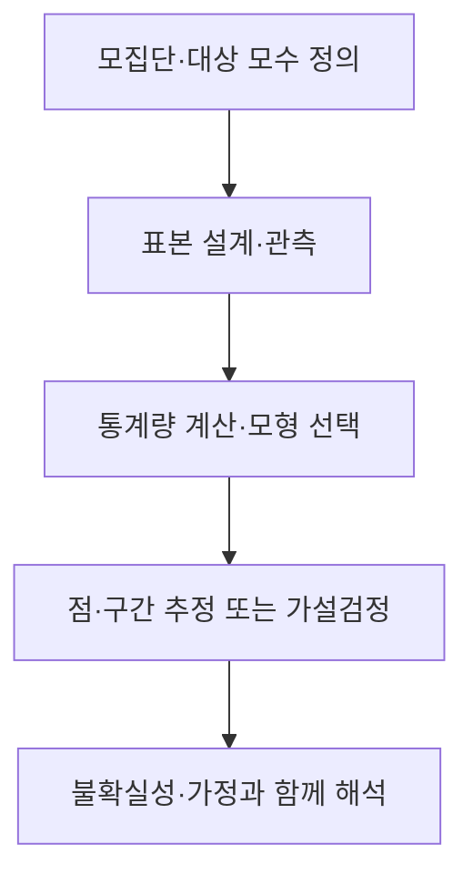

---
sidebar:
  order: 143
  label: "143. 추론통계 (Inferential Statistics)"
  badge:
    text: "기초"
    variant: note
author: "OpenAI Codex"
category: "03-data"
date: "2026-09-24T18:12:00+09:00"
tags:
  - "notes-data"
weight: 143
title: "추론통계(Inferential Statistics)의 표본 기반 추정과 검정"
extra:
  model: "GPT-6"
  keyword_grade: "기초"
  question_no: "143"
---

## 지식 로드맵 내 현재 위치

데이터베이스 → 통계·데이터 분석 → 표본에서 모집단으로의 추론

## 30초 인출

- 본질: **추론통계**는 표본자료로 모집단의 특성을 추정하고 가설을 평가하는 통계 방법
- 메커니즘: 표본 설계·확률모형에 따라 점추정·구간추정·가설검정을 수행
- 해석: 불확실성과 가정을 함께 제시하고 통계적 유의성과 실질적 중요성을 구분

핵심 용어

- **추론통계(Inferential Statistics)**: 표본자료와 통계모형을 이용해 모집단 특성을 추정·검정하는 방법
- **모집단(Population)**: 추론의 대상이 되는 전체 단위 집합
- **표본(Sample)**: 모집단에서 관측·분석한 일부 단위
- **모수(Parameter)**: 모집단의 분포나 특성을 나타내는 값
- **통계량(Statistic)**: 표본자료로 계산한 요약값
- **p-value**: 귀무가설과 모형이 참일 때 관측값 이상으로 극단적인 검정통계량이 나올 확률

---

## 1교시 예상문제 (10점)

> 추론통계의 정의와 목적, 표본에서 모집단 특성을 추정·검정하는 기본 구조를 설명하시오. (예상)

---

## 1교시 10점 답안

### Ⅰ. 개요

| 구분 | 핵심 |
|---|---|
| 정의 | 표본자료와 통계모형을 이용해 모집단 특성을 추정·검정하는 방법 |
| 목적 | 제한된 관측자료로 모집단에 관한 근거 있는 판단과 불확실성 평가 |

### Ⅱ. 추론의 기본 흐름

### Ⅲ. 한 줄 제언

제언: 추론 전에 목표 모집단·표본 설계·추정량과 가정을 명시하고 효과 크기와 불확실성을 함께 보고.

---

## 2~4교시 예상문제 (25점)

> 추론통계의 개념을 설명하고, 모집단·표본·모수·통계량의 관계, 추정과 가설검정의 원리 및 해석상 유의점을 논하시오. (예상)

---

## 2~4교시 25점 답안

## Ⅰ. 추론통계 개요

| 구분 | 핵심 |
|---|---|
| 정의 | 표본자료와 통계모형을 이용해 모집단 특성을 추정·검정하는 방법 |
| 목적 | 제한된 관측자료로 모집단에 관한 근거 있는 판단과 불확실성 평가 |

## Ⅱ. 표본에서 모집단으로의 추론

| 구분 | 의미 |
|---|---|
| 모집단·모수 | 추론 대상과 그 모집단 특성 |
| 표본·통계량 | 관측된 일부 자료와 그 자료에서 계산한 값 |
| 추론 절차 | 표본변동을 고려해 모수에 관한 추정·검정 수행 |

## Ⅲ. 추정과 가설검정

| 방법 | 산출·질문 | 해석 |
|---|---|---|
| 점추정 | 모수의 단일 추정값 | 추정값만으로 표본 불확실성을 나타내지 않음 |
| 구간추정 | 모수와 양립하는 값의 범위·신뢰수준 | 반복 표집에서 구간 생성 절차의 포괄률로 해석 |
| 가설검정 | 귀무·대립가설과 검정통계량·유의수준 | p-value는 귀무가설 아래 관측값 이상으로 극단적인 결과의 확률 |

## Ⅳ. 추론의 타당성과 해석

| 요인 | 추론에 미치는 영향 | 점검 |
|---|---|---|
| 표본 추출·누락 | 선택편향과 대표성 제한 | 대상 모집단·표집틀·응답 누락 확인 |
| 통계모형 가정 | 표준오차·구간·검정 결과 왜곡 가능 | 분포·독립성·모형 적합성 점검 |
| 반복 검정·큰 표본 | 작은 차이도 통계적으로 유의할 수 있음 | 효과 크기·신뢰구간·다중검정 함께 보고 |
| 관측 연구 | 추론 결과가 인과효과를 뜻하지 않음 | 연구설계와 교란 가능성 별도 평가 |

무작위 표집·중심극한정리만이 모든 추론의 전제인 것은 아니며, 유효한 방법과 가정은 추정 대상·표본 설계·통계 모형에 따라 달라짐.

## Ⅴ. 기술사적 제언

| 한계 | 해결 방안 |
|---|---|
| 표본과 모형의 불확실성을 숨긴 채 p-value 하나로 결론내리면 통계적 유의성과 사업상 중요성이 혼동 | 분석계획에 모집단·표집·가정·목표 효과를 기록하고, 추정치·신뢰구간·검정결과·효과 해석을 함께 보고 |

## 출제 이력과 검증 출처

- National Institute of Standards and Technology (NIST), [What are confidence intervals?](https://www.itl.nist.gov/div898/handbook/prc/section1/prc14.htm)
- NIST, [Critical values and p-values](https://itl.nist.gov/div898/handbook/prc/section1/prc131.htm)

## 연결 토픽

- 연관 토픽: [점추정과 구간추정](./163_point_vs_interval_estimation.md), [가설검정](./041_hypothesis_testing.md), [독립표본 t-검정](./130_independent_t_test.md)
