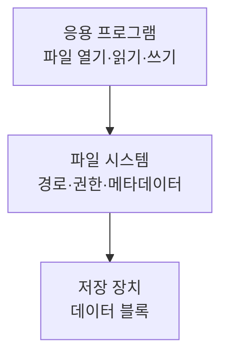
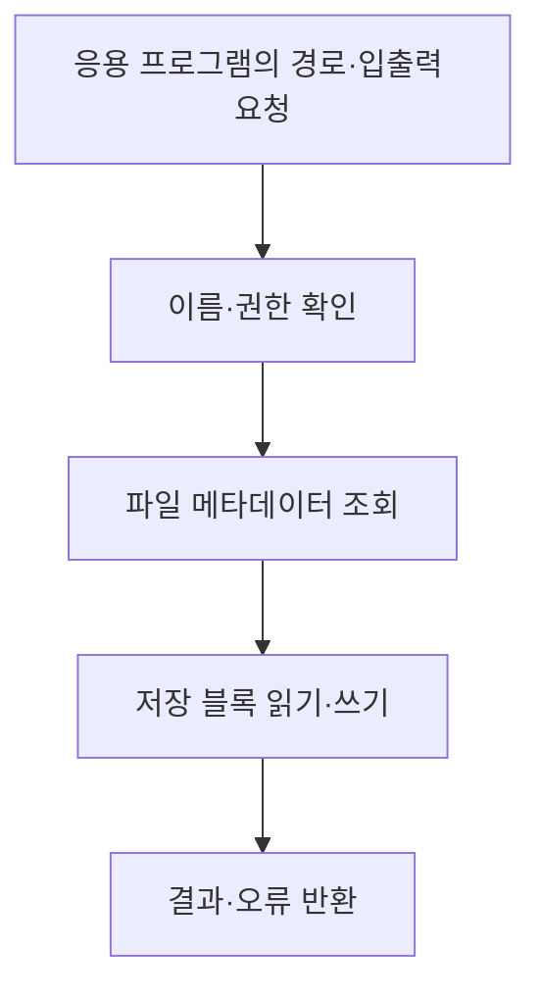

---
sidebar:
  order: 147
  label: "147. 파일 시스템 데이터 관리"
  badge:
    text: "기초"
    variant: note
title: "파일 시스템 데이터 관리"
author: "Codex"
date: "2026-09-24T00:00:00+09:00"
tags:
  - "notes-data"
weight: 147
extra:
  model: "GPT-6"
  keyword_grade: "기초"
  question_no: "147"
---

## 지식 로드맵 내 현재 위치

지식 위치: 자료처리·데이터 → 데이터 저장·관리 → **파일 시스템 데이터 관리**

## 30초 인출

- 본질: **파일 시스템**은 파일·디렉터리의 이름·위치·속성·접근을 관리하여 응용 프로그램이 저장 장치의 데이터를 읽고 쓰게 하는 운영체제 기능
- 메커니즘: 경로·권한 확인 → 파일의 메타데이터와 저장 블록 찾기 → 읽기·쓰기 수행 → 변경·오류 상태 반영

핵심 용어

- **파일 시스템(File System)** : 파일·디렉터리와 저장 공간을 조직하고 파일 접근을 제공하는 운영체제 기능
- **파일(File)** : 이름과 속성을 가진 데이터 저장 단위
- **디렉터리(Directory)** : 파일·다른 디렉터리의 이름과 위치를 조직하는 구조
- **메타데이터(Metadata)** : 파일 크기·권한·시각·저장 위치 등의 관리 정보
- **파일 조직 방식** : 파일 안의 레코드를 저장·찾는 응용 수준의 방식
- **순차 파일** : 레코드를 정해진 순서로 처리하는 조직 방식
- **직접 파일** : 키·주소 계산으로 원하는 레코드 위치를 찾는 조직 방식
- **ISAM(Indexed Sequential Access Method)** : 순차 데이터 접근과 색인을 함께 사용하는 파일 조직 방식
- **DBMS(Database Management System)** : 데이터 모델·질의·제약·트랜잭션 등을 관리하는 데이터베이스 관리 시스템

---

## 1교시 예상문제 (10점)

> 파일 시스템 데이터 관리에 관하여 설명하시오. (예상·10점)

---

## 1교시 10점 답안

### Ⅰ. 파일 시스템 데이터 관리의 개요

| 구분 | 핵심 |
|---|---|
| 정의 | **파일 시스템 데이터 관리**는 파일·디렉터리와 저장 공간을 조직하고 경로·속성·권한에 따라 데이터를 읽고 쓰게 하는 운영체제의 관리 기능 |
| 목적 | 응용 프로그램이 저장 장치의 물리적 위치를 직접 다루지 않고 파일 단위로 데이터 이용 |

### Ⅱ. 기본 구조

### Ⅲ. DBMS와의 구분

| 파일 시스템 | DBMS |
|---|---|
| 파일·디렉터리·바이트 접근 제공 | 스키마·질의·제약·트랜잭션 관리 |

파일 안의 레코드 의미와 업무 규칙은 응용 프로그램이나 DBMS 같은 상위 계층이 담당.

---

## 2~4교시 예상문제 (25점)

> 파일 시스템 데이터 관리의 개념과 구성, 파일 조직 방식 및 DBMS와의 차이를 설명하시오. (예상·25점)

---

## 2~4교시 25점 답안

## Ⅰ. 파일 시스템 데이터 관리의 개요

| 구분 | 핵심 |
|---|---|
| 정의 | **파일 시스템 데이터 관리**는 파일·디렉터리와 저장 공간을 조직하고 경로·속성·권한에 따라 데이터를 읽고 쓰게 하는 운영체제의 관리 기능 |
| 목적 | 응용 프로그램이 저장 장치의 물리적 위치를 직접 다루지 않고 파일 단위로 데이터 이용 |

## Ⅱ. 파일 접근 구조

| 구성 | 맡는 일 |
|---|---|
| 디렉터리·경로 | 파일 이름과 위치 조직 |
| 메타데이터 | 크기·권한·저장 블록 등 관리 |
| 입출력 인터페이스 | 파일 열기·읽기·쓰기·닫기 |

## Ⅲ. 파일 조직 방식과 구분

| 조직 방식 | 레코드 접근 | 적합한 경우 | 한계 |
|---|---|---|---|
| 순차 | 레코드를 순서대로 처리 | 일괄 처리 | 임의 레코드 검색 비용 |
| 직접 | 키·주소 계산으로 접근 | 키 중심 조회 | 충돌·배치 관리 |
| 색인 순차 | 색인으로 찾고 순차 접근 | 검색과 순차 처리 혼용 | 색인·오버플로 관리 |

이 표의 **파일 조직 방식**은 파일 내부 레코드 설계에 관한 것. 운영체제의 모든 파일 시스템이 순차·직접·ISAM 셋 중 하나로 구현된다는 뜻이 아님.

## Ⅳ. 파일 시스템과 DBMS

| 관점 | 파일 시스템 | DBMS |
|---|---|---|
| 기본 관리 단위 | 파일·디렉터리·바이트 | 테이블·레코드·스키마 |
| 데이터 의미 | 응용이 파일 형식을 해석 | 데이터 모델과 질의 언어로 정의 |
| 관계·제약 | 응용 설계에 의존 | 키·제약 기능 제공 |
| 동시 변경·회복 | 파일 시스템·응용 구현에 의존 | 트랜잭션·동시성·회복 기능 제공 |

파일 시스템도 권한·동시 접근·저널링 등 기능이 있으므로 모든 파일 시스템에 동시성·복구 기능이 없다고 일반화하지 않음.

## Ⅴ. 적용 판단

| 요구 | 우선 검토 |
|---|---|
| 문서·영상·프로그램 산출물의 저장 | 파일 시스템과 객체 저장소 |
| 여러 레코드의 조건 질의·관계·제약 | DBMS |
| 대용량 원본 파일과 구조화된 색인 혼용 | 파일·객체 저장소 + 메타데이터 DB |

## Ⅵ. 한계와 대응

| 한계 | 대응 방안 |
|---|---|
| 응용마다 레코드 포맷·업무 규칙이 다름 | 파일 형식·스키마·버전 문서화 |
| 여러 파일 간 일관된 변경이 어려움 | 필요한 작업에는 DBMS 트랜잭션 검토 |
| 파일·권한·보존 정책의 관리 누락 | 메타데이터·접근·백업 기준 운영 |

## Ⅶ. 기술사적 제언

| 우선 제언 | 적용·확인 |
|---|---|
| 원본 파일과 메타데이터의 저장 역할 분리 | 원본은 파일·객체 저장소, 검색·권한·업무 관계는 DBMS에서 관리 |
| 연결 정보의 무결성 확인 | 파일 삭제·복구 시 메타데이터 연결 상태를 함께 시험 |

## 연결 토픽

- 연관 토픽: [데이터베이스](./128_database.md), [무결성 제약](./013_integrity_constraint.md)
