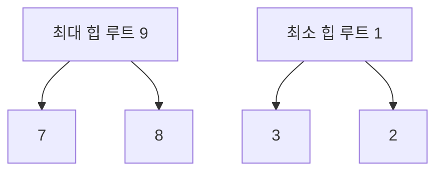
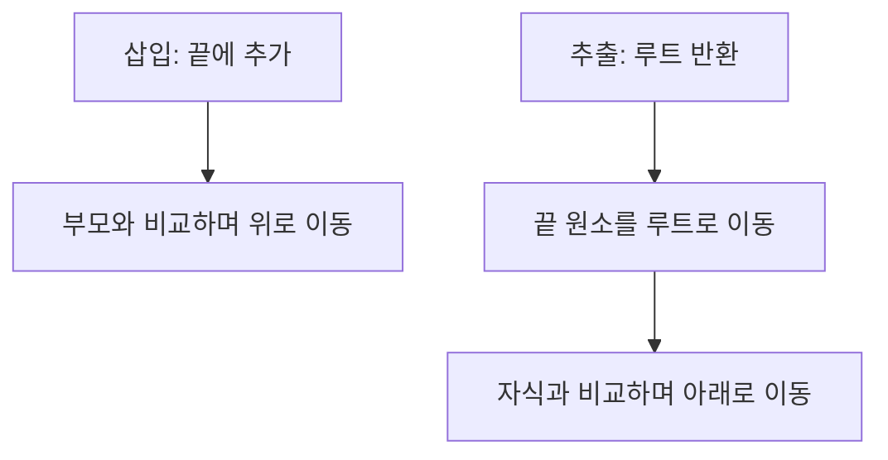

---
sidebar:
  order: 148
  label: "148. 힙 (Max·Min Heap)"
  badge:
    text: "기초"
    variant: note
title: "힙(최대·최소 힙)"
author: "Codex"
date: "2026-09-24T00:00:00+09:00"
tags:
  - "notes-data"
weight: 148
extra:
  model: "GPT-6"
  keyword_grade: "기초"
  question_no: "148"
---

## 지식 로드맵 내 현재 위치

지식 위치: 자료처리·데이터 → 자료구조 → **힙**

## 30초 인출

- 본질: **힙**은 완전 이진 트리의 형태와 부모·자식 간 우선순위 관계를 유지해 루트에서 최댓값 또는 최솟값을 바로 확인하는 자료구조
- 메커니즘: 끝에 삽입해 위로 재배치하거나 루트를 제거하고 끝 원소를 내려 재배치하며 힙 조건 복원

핵심 용어

- **힙(Heap)** : 완전 이진 트리와 부모·자식 간 대소관계를 유지하는 자료구조
- **완전 이진 트리(Complete Binary Tree)** : 마지막 층을 제외하고 가득 차며 마지막 층은 왼쪽부터 채워지는 이진 트리
- **최대 힙(Max Heap)** : 부모 키가 각 자식 키 이상이며 루트가 최댓값인 힙
- **최소 힙(Min Heap)** : 부모 키가 각 자식 키 이하이며 루트가 최솟값인 힙
- **루트 조회(Peek)** : 최상위 우선순위 값을 제거하지 않고 확인하는 연산
- **루트 추출(Extract)** : 루트 값을 꺼내고 힙 조건을 다시 만드는 연산
- **상향 재배치(Sift Up)** : 삽입한 원소를 부모와 비교하며 위로 옮기는 과정
- **하향 재배치(Sift Down)** : 루트로 옮긴 원소를 자식과 비교하며 아래로 옮기는 과정
- **우선순위 큐(Priority Queue)** : 우선순위가 높은 원소를 먼저 꺼내는 추상 자료형

---

## 1교시 예상문제 (10점)

> 힙에 관하여 설명하시오. (예상·10점)

---

## 1교시 10점 답안

### Ⅰ. 힙의 개요

| 구분 | 핵심 |
|---|---|
| 정의 | **힙**은 완전 이진 트리의 형태와 부모·자식 간 우선순위 관계를 유지하는 자료구조 |
| 목적 | 최댓값·최솟값의 빠른 조회와 우선순위 기반 삽입·추출 |

### Ⅱ. 최대·최소 힙

| 구분 | 부모·자식 규칙 | 루트 |
|---|---|---|
| 최대 힙 | 부모 ≥ 자식 | 최댓값 |
| 최소 힙 | 부모 ≤ 자식 | 최솟값 |

### Ⅲ. 연산

루트 **조회 O(1)**, 삽입·루트 **추출 O(log n)**. 힙 내부 전체가 정렬된 것은 아니므로 임의 값 검색은 일반적으로 O(n).

---

## 2~4교시 예상문제 (25점)

> 힙의 개념과 최대·최소 힙의 구조, 삽입·추출 연산 및 활용을 설명하시오. (예상·25점)

---

## 2~4교시 25점 답안

## Ⅰ. 힙의 개요

| 구분 | 핵심 |
|---|---|
| 정의 | **힙**은 완전 이진 트리의 형태와 부모·자식 간 우선순위 관계를 유지하는 자료구조 |
| 목적 | 최댓값·최솟값의 빠른 조회와 우선순위 기반 삽입·추출 |

## Ⅱ. 구조와 불변식

| 불변식 | 의미 |
|---|---|
| 형태 | 마지막 층을 왼쪽부터 채우는 완전 이진 트리 |
| 최대 힙 순서 | 각 부모 ≥ 직접 자식 |
| 최소 힙 순서 | 각 부모 ≤ 직접 자식 |
| 배열 저장 | 완전한 형태를 인덱스로 표현 가능 |

0부터 시작하는 배열에서는 i의 왼쪽 자식이 2i+1, 오른쪽 자식이 2i+2, 부모가 ⌊(i−1)/2⌋. 형제나 서로 다른 서브트리 전체 사이에는 정렬 순서가 없음.

## Ⅲ. 삽입·추출

| 연산 | 핵심 처리 | 시간 |
|---|---|---|
| 루트 조회 | 첫 원소 확인 | O(1) |
| 삽입 | 끝에 추가·상향 재배치 | O(log n) |
| 루트 추출 | 끝 원소 이동·하향 재배치 | O(log n) |
| 임의 키 검색 | 순서 정보가 부족해 순회 | O(n) |

## Ⅳ. 우선순위 큐·힙 정렬과 관계

| 활용 | 힙의 역할 |
|---|---|
| 우선순위 큐 | 우선순위가 가장 높은 작업을 반복 추출 |
| 상위 k개 유지 | 크기 k의 힙으로 후보 관리 |
| 힙 정렬 | 힙을 만든 뒤 루트를 반복 추출해 정렬 |

힙 정렬은 O(n log n) 시간에 가능하지만, 우선순위 큐가 반드시 힙으로만 구현되는 것은 아님.

## Ⅴ. BST와의 선택

| 판단 | 힙 | 균형 BST |
|---|---|---|
| 우선순위 극값 | 루트에서 확인 | 순서 탐색 필요 |
| 임의 키·범위 검색 | 비효율적 | 정렬 순서 활용 |
| 주된 용도 | 우선순위 큐 | 키 탐색·범위 조회 |

## Ⅵ. 한계와 대응

| 한계 | 대응 방안 |
|---|---|
| 루트만 보고 전체가 정렬됐다고 오해 | 부모·자식 관계와 임의 탐색을 구분 |
| 루트 조회와 추출 비용 혼동 | 조회 O(1), 재배치하는 추출 O(log n) 구분 |
| 임의 키 검색이 많은 업무에 사용 | BST·해시 등 대안 구조 비교 |

## Ⅶ. 기술사적 제언

| 요구 | 우선 검토할 구조 |
|---|---|
| 반복적인 최댓값·최솟값 추출 | 힙 기반 우선순위 큐 |
| 임의 키·범위 질의 | 균형 BST·인덱스와 검색 비용 비교 |

## 연결 토픽

- 연관 토픽: [이진 탐색 트리](./027_binary_search_tree.md), [K-Means](./029_k_means.md)
