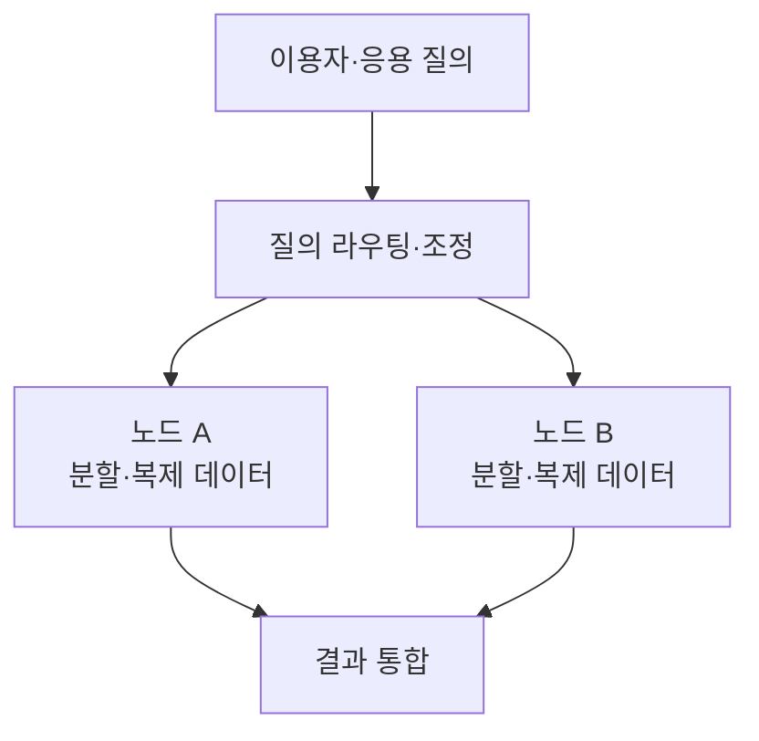
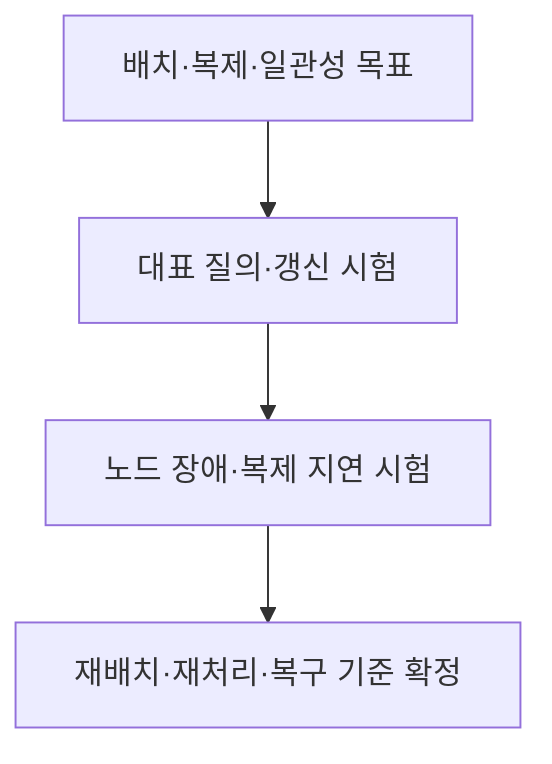

---
sidebar:
  order: 149
  label: "149. 분산 데이터베이스"
  badge:
    text: "기초"
    variant: note
title: "분산 데이터베이스"
author: "Codex"
date: "2026-09-24T00:00:00+09:00"
tags:
  - "notes-data"
weight: 149
extra:
  model: "GPT-6"
  keyword_grade: "기초"
  question_no: "149"
---

## 지식 로드맵 내 현재 위치

지식 위치: 자료처리·데이터 → 분산 저장·처리 → **분산 데이터베이스**

## 30초 인출

- 본질: **분산 데이터베이스**는 여러 노드에 나누거나 복제한 데이터를 함께 관리하고 질의·갱신을 처리하는 데이터베이스
- 메커니즘: 데이터 배치·복제 정책 정의 → 질의를 해당 노드로 전달 → 결과·갱신 조정 → 장애·정합성 확인

핵심 용어

- **분산 데이터베이스(Distributed Database)** : 연결된 여러 노드의 데이터를 논리적으로 함께 관리하는 데이터베이스
- **분할(Fragmentation)** : 데이터를 키·범위·속성 등에 따라 부분으로 나누는 것
- **샤딩(Sharding)** : 수평 분할한 데이터를 여러 노드에 배치하는 방식
- **복제(Replication)** : 같은 데이터를 여러 노드에 두는 방식
- **분산 투명성** : 이용자가 데이터의 분할·위치·복제 세부를 매번 직접 처리하지 않아도 되는 성질
- **분산 질의** : 여러 노드의 데이터를 읽고 결과를 결합하는 질의
- **분산 트랜잭션** : 여러 노드의 변경을 하나의 업무 단위로 조정하는 처리
- **2PC(Two-Phase Commit, 2단계 커밋)** : 참여 노드의 준비 확인 후 커밋·취소를 결정하는 분산 원자적 커밋 프로토콜
- **합의(Consensus)** : 분산 노드가 상태·순서 등에 대해 같은 결정에 도달하도록 하는 기법

---

## 1교시 예상문제 (10점)

> 분산 데이터베이스에 관하여 설명하시오. (예상·10점)

---

## 1교시 10점 답안

### Ⅰ. 분산 데이터베이스의 개요

| 구분 | 핵심 |
|---|---|
| 정의 | **분산 데이터베이스**는 여러 노드에 나누거나 복제한 데이터를 함께 관리하고 질의·갱신을 처리하는 데이터베이스 |
| 목적 | 데이터·부하의 분산과 장애 대응, 필요한 논리적 접근 제공 |

### Ⅱ. 핵심 구조

### Ⅲ. 설계 관점

| 선택 | 함께 볼 것 |
|---|---|
| 분할 | 키 쏠림·노드 간 질의 |
| 복제 | 읽기 최신성·장애 전환 |
| 트랜잭션 | 여러 노드의 정합성·지연·실패 처리 |

- 제언: 노드 수 확대보다 업무의 질의·갱신 범위와 장애 시 허용 결과를 먼저 정의.

---

## 2~4교시 예상문제 (25점)

> 분산 데이터베이스의 개념과 구성, 데이터 배치·질의·트랜잭션 처리 및 운영상 한계를 설명하시오. (예상·25점)

---

## 2~4교시 25점 답안

## Ⅰ. 분산 데이터베이스의 개요

| 구분 | 핵심 |
|---|---|
| 정의 | **분산 데이터베이스**는 여러 노드에 나누거나 복제한 데이터를 함께 관리하고 질의·갱신을 처리하는 데이터베이스 |
| 목적 | 데이터·부하의 분산과 장애 대응, 필요한 논리적 접근 제공 |

## Ⅱ. 구성과 데이터 배치

| 구성 | 역할 | 확인할 한계 |
|---|---|---|
| 분할·샤딩 | 데이터량·부하 분산 | 키 쏠림·노드 간 조인 |
| 복제 | 읽기·장애 대응 | 지연·충돌·전환 |
| 라우팅·메타데이터 | 데이터 위치와 질의 대상 결정 | 배치 변경·오류 |
| 질의 조정 | 노드별 결과 병합 | 네트워크·부분 실패 |

## Ⅲ. 분산 투명성과 질의

| 투명성 | 이용자에게 숨기는 정보 | 내부 처리 |
|---|---|---|
| 위치 | 저장 노드 | 라우팅 |
| 분할 | 데이터 조각 | 조각 선택·병합 |
| 복제 | 복제본 | 읽기 대상·갱신 전파 |

투명성은 제품·설정에 따라 제공 범위가 다르며 네트워크 지연·부분 장애를 없애지 않음.

## Ⅳ. 트랜잭션·일관성

| 요구 | 처리 방식 예 | 절충 |
|---|---|---|
| 여러 노드의 원자적 확정 | 2PC 등 분산 커밋 | 조정 지연·장애 시 대기 |
| 복제본의 동일한 변경 순서 | 합의·로그 복제 등 | 통신·합의 비용 |
| 서비스 간 긴 업무 흐름 | 보상 단계·재시도 등 | 중간 상태·보상 실패 관리 |

**2PC**, 합의, 보상 기반 업무 흐름은 해결하는 문제가 서로 다름. 하나가 다른 하나의 일반적 대체재는 아님.

## Ⅴ. 운영 흐름

| 검증 | 확인할 결과 |
|---|---|
| 부하 | 핫 샤드·노드 간 통신 |
| 정합성 | 동시 갱신·복제 지연 시 값 |
| 장애 | 부분 실패·복구 후 데이터 상태 |

## Ⅵ. 한계와 대응

| 한계 | 대응 방안 |
|---|---|
| 분할만 하면 확장성이 보장된다고 가정 | 키 분포·노드 간 질의 비용 측정 |
| 복제본의 최신성·충돌 정책 미정 | 업무별 읽기·쓰기 보장과 충돌 처리 정의 |
| 부분 장애·조정 실패를 시험하지 않음 | 실패 주입·재시도·복구 상태 검증 |

## Ⅶ. 기술사적 제언

| 우선 제언 | 실행·확인 |
|---|---|
| 업무별 질의·갱신·복구 목표 확정 | 목표에 맞는 데이터 배치·일관성 정책 선택 |
| 정상·장애 상황을 함께 검증 | 정상 부하와 노드 장애·복제 지연·재배치 중 결과 비교 |

## 연결 토픽

- 연관 토픽: [분산 DB 투명성](./025_distributed_db_transparency.md), [DB 파티셔닝·샤딩](./021_db_partitioning_sharding.md)
