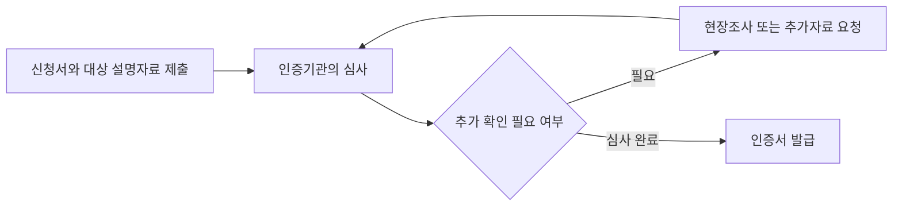

---
sidebar:
  order: 150
  label: "150. 데이터 품질인증 가이드라인"
  badge:
    text: "기초"
    variant: note
title: "데이터 품질인증 가이드라인 (Data Quality Certification)"
author: "Antigravity"
date: "2026-09-24T00:00:00+09:00"
tags:
  - "notes-data"
weight: 150
extra:
  model: "GPT-6"
  keyword_grade: "기초"
  question_no: "150"
---

## 지식 로드맵 내 현재 위치

<div class="itpe-topic-path" aria-label="지식 경로"><span>데이터 관리</span><span>데이터 거버넌스</span><span>품질 관리</span><strong>데이터 품질인증 가이드라인</strong></div>

## 큰 그림과 30초 인출

데이터 품질인증의 법적 대상은 데이터 내용·구조·관리체계 등이며, 구체 기준은 시행령 제20조의5에서 정함.

- 본질: **데이터 품질인증은 신청 대상 데이터의 품질을 법령상 기준에 따라 평가하는 제도로, 지정 인증기관이 내용·구조·관리체계를 확인하고 인증서를 발급**
- 인출: 법 제20조는 인증 사업과 인증기관 지정 근거, 시행령 제20조의5는 대상별 품질기준을 규정.
- 판단축: 내용은 완전성·유효성·정확성, 구조는 일관성, 관리체계는 유용성·접근성을 기준으로 구분.
- 주의: 데이터산업법과 시행령은 DQC-V/DQC-M 명칭이나 고정 등급(99.99% 등)을 법정 2대 트랙으로 규정하지 않음. 인증 세부기준은 소관 부처 고시 확인 필요
---

## 1교시 예상문제 (10점)

> 데이터 품질인증 가이드라인 (Data Quality Certification)의 정의와 목적, 핵심 구조와 작동 원리를 설명하시오. (예상)

---

## 1교시 10점 답안

| 항목 | 핵심 서술 내용 |
|:---|:---|
| **정의** | 신청 대상 데이터의 품질을 법령이 정한 기준으로 평가하는 인증 제도 |
| **목적** | 데이터 품질을 확인할 수 있는 기준과 인증 절차를 통해 데이터의 신뢰성 향상 지원 |

- **10점 제언**: 인증 기준을 일회성 심사 자료에 그치지 않고 운영 중 품질 점검 규칙과 개선 이력에 연결.
---

### 핵심 관계

| 심사 관점 | 시행령상 품질기준 | 확인 내용 예시 |
|:---|:---|:---|
| **내용** | 완전성·유효성·정확성 | 필수 값 누락, 허용 형식 위반, 검증 가능한 기준값과 불일치 |
| **구조** | 일관성 | 데이터 구조의 정의·관계·표현 사이 일관성 |
| **관리체계** | 유용성·접근성 | 데이터를 목적에 맞게 활용하고 필요한 사용자가 접근할 수 있는지 확인 |

---

## 2~4교시 예상문제 (25점)

> 데이터 산업진흥 및 이용촉진에 관한 기본법에 따른 데이터 품질인증의 목적과 법적 근거, 대상별 품질기준 및 신청·인증 절차를 설명하고, 데이터 운영에서 품질을 지속 관리하는 방안을 제시하시오. (예상)

---

## 2~4교시 25점 답안

### Ⅰ. 데이터 품질인증 제도의 개요 및 법적 근거

| 구분 | 핵심 |
|---|---|
| **정의** | 신청 대상 데이터의 품질을 법령이 정한 기준으로 평가하는 인증 제도 |
| **목적** | 데이터 품질을 확인할 수 있는 기준과 인증 절차를 통해 데이터의 신뢰성 향상 지원 |

- **추진 배경**:
  - 서로 다른 기관과 업무에서 생산·유통되는 데이터 품질을 확인할 법령상 기준과 인증 절차의 필요
- **법적 근거**:
  - **데이터산업법 제20조 (데이터 품질관리 등)**: 과학기술정보통신부장관은 관계 부처와 협의해 품질인증 등 품질관리 사업을 추진할 수 있고, 인증기관을 지정할 수 있음. 지정 기관은 법정 품질기준에 따라 신청 건을 인증.
- **핵심 가치**:
  - 신청 데이터의 품질 특성을 확인하고 품질관리 개선에 활용

### Ⅱ. 데이터 품질인증 대상과 기준

#### 한 줄 요약: 시행령은 인증 대상을 내용·구조·관리체계 등으로 나누고 대상별 품질기준을 정함

<div class="itpe-diagram-box">
  <div class="itpe-diagram-header">
    <span class="itpe-tag">아키텍처 다이어그램</span>
    <span class="itpe-title">데이터 품질인증 대상과 법정 품질기준</span>
  </div>
  <div class="itpe-diagram-body">
    <svg class="itpe-svg" viewBox="0 0 520 280" width="100%" height="280" xmlns="http://www.w3.org/2000/svg">
      <defs>
        <marker id="arrow-dq" viewBox="0 0 10 10" refX="6" refY="5" markerWidth="6" markerHeight="6" orient="auto-start-reverse">
          <path d="M 0 1 L 8 5 L 0 9 z" fill="var(--color-text, #333)" />
        </marker>
      </defs>
      <!-- 최상단: 데이터 품질인증 제도 -->
      <rect x="120" y="12" width="280" height="42" rx="5" fill="var(--color-bg-secondary, #f0f4f8)" stroke="var(--color-border, #0284c7)" stroke-width="2" />
      <text x="260" y="32" font-size="13" font-weight="bold" text-anchor="middle" fill="var(--color-text, #111)">데이터 품질인증 제도 (데이터산업법 제20조)</text>
      <text x="260" y="46" font-size="9" text-anchor="middle" fill="var(--color-text-muted, #555)">지정 인증기관 ┃ 신청 대상별 기준</text>

      <path d="M 210 54 L 140 85" stroke="var(--color-primary, #0284c7)" stroke-width="1.5" marker-end="url(#arrow-dq)" />
      <path d="M 310 54 L 380 85" stroke="var(--color-primary, #0284c7)" stroke-width="1.5" marker-end="url(#arrow-dq)" />

      <!-- Current statutory targets: content, structure, management system -->
      <rect x="20" y="90" width="480" height="175" rx="5" fill="#eff6ff" stroke="#3b82f6" stroke-width="1.5" />
      <text x="260" y="115" font-size="12" font-weight="bold" text-anchor="middle" fill="#1d4ed8">시행령 제20조의5: 인증 대상과 품질기준</text>
      <text x="42" y="150" font-size="11" fill="#1e293b">데이터 내용 ─ 완전성 · 유효성 · 정확성</text>
      <text x="42" y="180" font-size="11" fill="#1e293b">데이터 구조 ─ 일관성</text>
      <text x="42" y="210" font-size="11" fill="#1e293b">데이터 관리체계 ─ 유용성 · 접근성</text>
      <text x="42" y="240" font-size="10" fill="#475569">그 밖의 대상·기준은 소관 부처가 정하는 기준에 따름</text>
    </svg>
  </div>
  <div class="itpe-diagram-footer">
    인증 대상과 평가 기준은 현행 법령 및 위임 고시에서 확인
  </div>
</div>

### Ⅲ. 데이터 품질기준의 적용

#### 한 줄 요약: 데이터 대상별로 법령에 열거된 품질 특성을 기준으로 평가

| 심사 관점 | 세부 검증 항목 | 오류 판정 기준 |
|:---|:---|:---|
| **유효성 (Validity)** | 날짜 포맷, 전화번호, 이메일, 주민번호 등 도메인 형식 | 지정된 표준 정규식 패턴 또는 유효 범위(Range)를 벗어난 경우 |
| **정확성 (Accuracy)** | 비즈니스 업무 규칙(Business Rule), 계산 수식 일치 여부 | "주문총액 = 상품단가 × 수량 - 할인금액" 등 산술적 불일치 |
| **일관성 (Consistency)** | 구조의 정의·관계·표현 간 일관성 | 스키마·관계 정의의 상충 여부 |
| **완전성 (Completeness)** | 필요한 데이터 항목의 누락 여부 | 인증 대상과 품질기준에서 요구하는 필수 값의 누락 |

법률·시행령은 이 노트에 제시했던 Class A/B/C 점수 구간이나 단일 정합률 산식을 규정하지 않음. 세부 측정·등급 기준은 현행 소관 부처 고시 확인 필요.

### Ⅳ. 데이터 관리체계

#### 한 줄 요약: 관리체계 대상은 법정 기준인 데이터 유용성과 접근성을 중심으로 확인

| 판단 관점 | 적용 질문 |
|---|---|
| **유용성** | 데이터가 명시된 이용 목적에 적합한가 |
| **접근성** | 정당한 권한을 가진 이용자가 필요한 데이터에 접근할 수 있는가 |
| **운영 증거** | 기준·책임·품질 점검·개선 이력이 추적 가능한가 |

### Ⅴ. 신청과 인증 절차

#### 한 줄 요약: 신청자는 대상 설명자료를 제출하고, 인증기관은 필요 시 현장조사·추가 자료를 요청한 뒤 인증서를 발급



### Ⅵ. 실무 아키텍처 연계: DataOps 기반 상시 품질 파이프라인

#### 한줄 요약: 인증용 일회성 정제를 탈피하고, CI/CD 배포 파이프라인에 품질 검증 게이트를 자동화하는 DataOps 체계

```text
[DataOps 상시 데이터 품질 검증 아키텍처]

  [원천 데이터 소스] ──► [ETL 파이프라인] ──► [Great Expectations 품질 검증 게이트]
                                                     │
                             ┌───────────────────────┴───────────────────────┐
                             ▼ (검증 규칙 통과)                              ▼ (규칙 위반)
                      [DW / 마트 적재]                               [Slack 알림 & 파이프라인 차단]
                             │                                               │
                             ▼                                               ▼
                      [BI / AI 서빙]                                  [Data Steward 격리 정제]
```

- **일회성 인증의 한계**:
  - 인증 시점의 평가만으로 운영 중 새로 유입되는 데이터의 품질을 보장할 수 없으므로, 실제 운영 규칙과 모니터링을 별도로 유지할 필요
- **DataOps 품질 게이트 구축**:
  - **Great Expectations / Soda Core** 등의 도구를 Airflow ETL 파이프라인의 스테이징 단계에 배치
  - 신규 데이터 유입 시 `expect_column_values_to_not_be_null`, `expect_column_values_to_be_in_set` 등의 테스트를 자동 실행하고, 오류율 초과 시 배포 파이프라인을 즉시 차단(Circuit Breaker)

### Ⅶ. 기술사적 제언

| 한계 | 해결 방안 |
|---|---|
| 인증 시점의 확인만으로 운영 데이터 품질의 변화를 계속 포착하기 어려움 | 인증에 사용한 품질 기준을 운영 규칙으로 연결하고, 주기적 진단 결과와 개선 이력을 관리 |

---

## 출제 이력과 검증 출처

- **기출 이력**:
  - 데이터 품질 관련 예상 1순위 (데이터산업법 시행 및 국가 데이터 정책 연계)
  - 제128회 정보관리 1교시: 데이터 품질 관리 성숙도 모델
- **검증 출처**:
  - [데이터 산업진흥 및 이용촉진에 관한 기본법 제20조](https://www.law.go.kr/LSW/lsInfoP.do?ancYnChk=0&chrClsCd=010202&efYd=20251001&lsiSeq=277325&urlMode=lsInfoP)
  - [같은 법 시행령 제20조의3~제20조의5](https://www.law.go.kr/LSW/lsInfoP.do?ancYnChk=0&chrClsCd=010202&efYd=20251223&lsiSeq=280559&urlMode=lsInfoP)
---

## 연결 토픽

- 상위 토픽: [03-021 데이터 거버넌스](file:///C:/workspace/study/src/content/docs/notes/itpe/03-data/021_data_governance.md)
- 선수 토픽: [03-022 데이터 무결성](file:///C:/workspace/study/src/content/docs/notes/itpe/03-data/022_integrity.md)
- 후속 토픽: [03-127 데이터 커머스](file:///C:/workspace/study/src/content/docs/notes/itpe/03-data/127_data_commerce.md), [03-080 EDA](file:///C:/workspace/study/src/content/docs/notes/itpe/03-data/080_eda.md)
