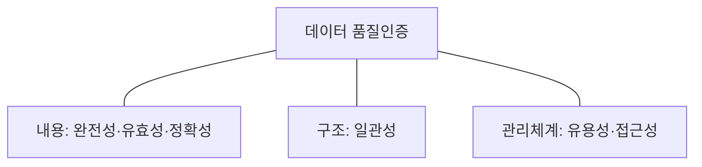
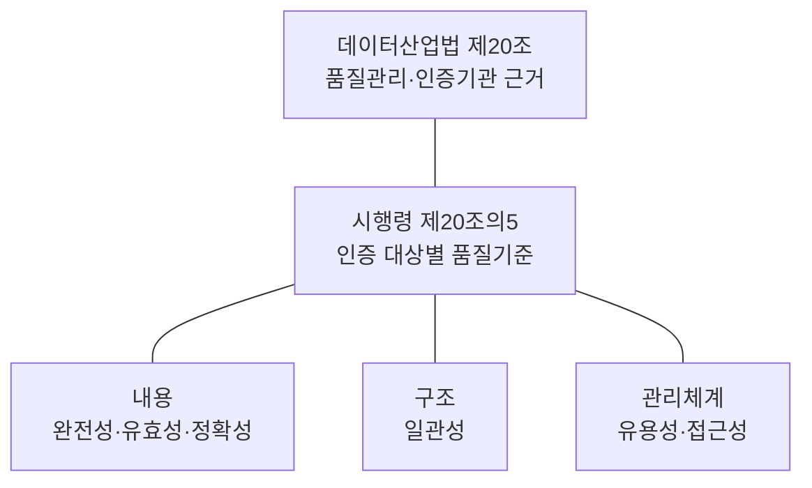
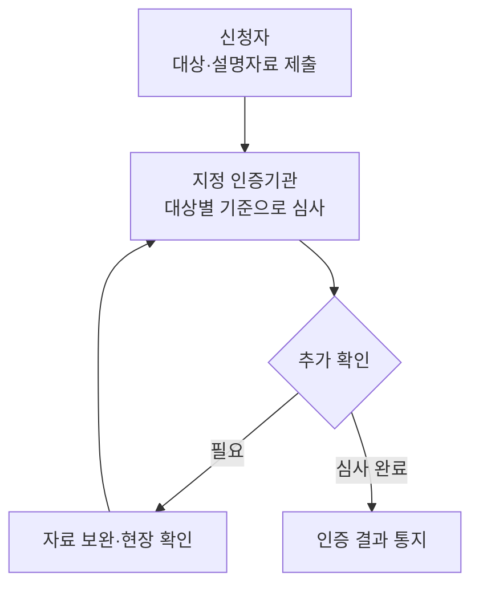
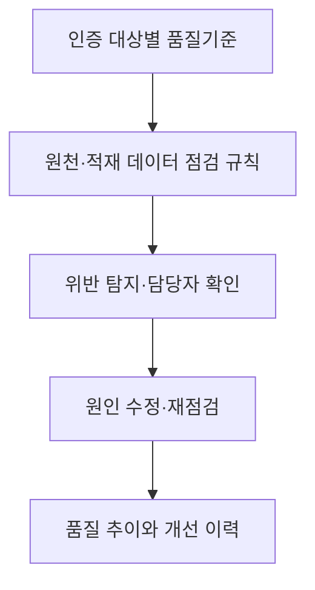

---
sidebar:
  order: 150
  label: "150. 데이터 품질인증 가이드라인"
  badge:
    text: "기초"
    variant: note
title: "데이터 품질인증 가이드라인 (Data Quality Certification)"
author: "Antigravity"
date: "2026-09-24T00:00:00+09:00"
tags:
  - "notes-data"
weight: 150
extra:
  model: "GPT-6"
  keyword_grade: "기초"
  question_no: "150"
---

## 지식 로드맵 내 현재 위치

데이터 관리데이터 거버넌스품질 관리<strong>데이터 품질인증 가이드라인</strong>

## 큰 그림과 30초 인출

데이터 품질인증의 법적 대상은 데이터 내용·구조·관리체계 등이며, 구체 기준은 시행령 제20조의5에서 정함.

- 본질: **데이터 품질인증은 신청 대상 데이터의 품질을 법령상 기준에 따라 평가하는 제도로, 지정 인증기관이 내용·구조·관리체계를 확인하고 인증서를 발급**
- 인출: 법 제20조는 인증 사업과 인증기관 지정 근거, 시행령 제20조의5는 대상별 품질기준을 규정.
- 판단축: 내용은 완전성·유효성·정확성, 구조는 일관성, 관리체계는 유용성·접근성을 기준으로 구분.
- 주의: 데이터산업법과 시행령은 DQC-V/DQC-M 명칭이나 고정 등급(99.99% 등)을 법정 2대 트랙으로 규정하지 않음. 인증 세부기준은 소관 부처 고시 확인 필요
---

## 1교시 예상문제 (10점)

> 데이터 품질인증에 관하여 설명하시오. (예상·10점)

---

## 1교시 10점 답안

| 항목 | 핵심 서술 내용 |
|:---|:---|
| **정의** | 신청 대상 데이터의 품질을 법령이 정한 기준으로 평가하는 인증 제도 |
| **목적** | 데이터 품질을 확인할 수 있는 기준과 인증 절차를 통해 데이터의 신뢰성 향상 지원 |

- **10점 제언**: 인증에 사용한 품질기준을 운영 중 점검 규칙과 개선 이력에 연결.

### Ⅰ. 데이터 품질인증의 대상과 기준

### 핵심 관계

| 심사 관점 | 시행령상 품질기준 | 확인 내용 예시 |
|:---|:---|:---|
| **내용** | 완전성·유효성·정확성 | 필수 값 누락, 허용 형식 위반, 검증 가능한 기준값과 불일치 |
| **구조** | 일관성 | 데이터 구조의 정의·관계·표현 사이 일관성 |
| **관리체계** | 유용성·접근성 | 데이터를 목적에 맞게 활용하고 필요한 사용자가 접근할 수 있는지 확인 |

---

## 2~4교시 예상문제 (25점)

> 데이터 품질인증의 법적 근거와 대상별 품질기준을 설명하고, 인증 결과를 운영 품질관리에 활용하는 방안을 제시하시오. (예상·25점)

---

## 2~4교시 25점 답안

### Ⅰ. 데이터 품질인증 제도의 개요 및 법적 근거

| 구분 | 핵심 |
|---|---|
| **정의** | 신청 대상 데이터의 품질을 법령이 정한 기준으로 평가하는 인증 제도 |
| **목적** | 데이터 품질을 확인할 수 있는 기준과 인증 절차를 통해 데이터의 신뢰성 향상 지원 |

- **추진 배경**:
  - 서로 다른 기관과 업무에서 생산·유통되는 데이터 품질을 확인할 법령상 기준과 인증 절차의 필요
- **법적 근거**:
  - **데이터산업법 제20조 (데이터 품질관리 등)**: 과학기술정보통신부장관은 관계 부처와 협의해 품질인증 등 품질관리 사업을 추진할 수 있고, 인증기관을 지정할 수 있음. 지정 기관은 법정 품질기준에 따라 신청 건을 인증.
- **핵심 가치**:
  - 신청 데이터의 품질 특성을 확인하고 품질관리 개선에 활용

### Ⅱ. 법적 근거와 인증 대상

데이터산업법 제20조는 데이터 품질관리 사업과 인증기관 지정의 근거를 둔다. 시행령 제20조의5는 인증 대상을 데이터 내용·구조·관리체계 등으로 구분하고 대상별 품질기준을 정한다.

| 대상 | 품질기준 | 확인 질문 |
|---|---|---|
| **데이터 내용** | 완전성·유효성·정확성 | 필요한 값이 있고, 허용 범위에 맞으며, 실제 사실·기준과 일치하는가 |
| **데이터 구조** | 일관성 | 항목·관계·표현의 정의가 서로 충돌하지 않는가 |
| **데이터 관리체계** | 유용성·접근성 | 이용 목적에 맞고 필요한 이용자가 접근할 수 있는가 |

### Ⅲ. 신청·심사·인증의 관계

신청 대상과 기준을 정해 자료를 제출하면 인증기관이 해당 기준으로 심사하고 결과를 통지하는 구조.

인증 절차의 세부 서식·방법·유효기간은 현행 법령과 소관 고시를 확인. 이 도해는 신청과 심사의 핵심 관계를 요약한 것으로 모든 법정 절차의 순서를 재현한 것은 아님.

### Ⅳ. 인증 기준의 운영 적용

인증 당시의 평가 결과는 운영 중 새로 유입되는 데이터의 품질을 자동으로 보장하지 않음. 대상별 기준을 실제 점검 규칙에 연결하고, 위반 결과와 조치 이력을 관리.

| 한계 | 대응 |
|---|---|
| 인증 시점 이후 데이터 내용·구조가 변경될 수 있음 | 유입·변경 시 완전성·유효성·정확성·일관성 점검 |
| 기준은 있으나 오류를 수정할 담당과 이력이 불분명할 수 있음 | 항목별 책임자와 조치 기한을 정하고 재점검 결과 기록 |

### Ⅴ. 기술사적 제언

인증 신청 때 작성한 대상·기준 목록을 운영 품질 규칙의 출발점으로 활용하고, 데이터 변경 시 규칙을 함께 갱신. 인증 결과와 별도로 운영 품질 추이를 확인할 수 있는 관리 체계 마련.

---

## 출제 이력과 검증 출처

- **출제 유형**: 데이터 품질관리와 법정 인증제도의 관계를 묻는 예상문제
- **검증 출처**:
  - [데이터 산업진흥 및 이용촉진에 관한 기본법 제20조](https://www.law.go.kr/LSW/lsInfoP.do?ancYnChk=0&chrClsCd=010202&efYd=20251001&lsiSeq=277325&urlMode=lsInfoP)
  - [같은 법 시행령 제20조의5](https://www.law.go.kr/LSW/lsInfoP.do?ancYnChk=0&chrClsCd=010202&efYd=20251223&lsiSeq=280559&urlMode=lsInfoP)

---

## 연결 토픽

- 상위 토픽: [데이터 거버넌스](./021_data_governance/)
- 선수 토픽: [데이터 무결성](./022_integrity/)
