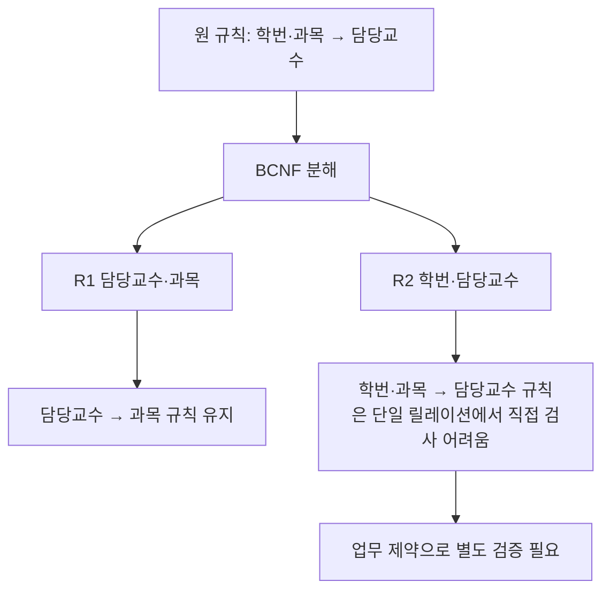

---
sidebar:
  order: 153
  label: "153. BCNF(Boyce-Codd Normal Form)"
  badge:
    text: "기초"
    variant: note
title: "BCNF (Boyce-Codd Normal Form, 보이스-코드 정규형)"
author: "Antigravity"
date: "2026-09-24T00:00:00+09:00"
tags:
  - "notes-data"
weight: 153
extra:
  model: "GPT-6"
  keyword_grade: "기초"
  question_no: "153"
---

## 지식 로드맵 내 현재 위치

데이터베이스관계형 데이터 모델정규화 이론<strong>BCNF(보이스-코드 정규형)</strong>

## 큰 그림과 30초 인출

| 회상 축 | 핵심 |
|:---|:---|
| **판정 규칙** | 모든 비자명한 FD에서 결정자가 슈퍼키인지 확인 |
| **목적** | 비키 결정자에서 생길 수 있는 갱신 이상 감소 |
| **분해 시 확인** | 무손실 조인과 종속성 보존을 따로 검토 |

- 본질: **제3정규형(3NF)을 만족하면서도 복합 후보키가 중첩될 때 발생하는 갱신 이상을 해결하기 위해, 릴레이션 내에 존재하는 모든 비자명한 함수적 종속성($X \rightarrow Y$)에서 결정자($X$)가 예외 없이 반드시 슈퍼키(Super Key)가 되도록 강제한 엄격한 정규형(Strong 3NF)**
- 암기: `비자명 FD → 결정자 슈퍼키` / BCNF 분해는 무손실 조인이 가능하지만 종속성 보존을 잃을 수 있음
- 판단축:
  - **3NF**: $X \rightarrow Y$에서 $X$가 슈퍼키이거나, $Y$가 후보키의 일부(주속성, Prime Attribute)이면 허용. 표준 3NF 합성 절차는 종속성 보존 분해를 제공하지만, 분해 결과와 보장 조건을 확인해야 함.
  - **BCNF**: 종속되는 속성($Y$)이 주속성이든 비주속성이든 상관없이, 결정자($X$)는 슈퍼키여야 함. 해당 함수 종속성에서 생기는 중복을 줄이지만 모든 업무 이상을 제거하지는 않음.
- 주의: BCNF 분해에서는 원래의 복합 함수 종속성 제약을 분해된 릴레이션 각각에서 직접 검증하지 못하는 종속성 보존 손실이 발생할 수 있으므로, 실무에서는 업무 무결성 규칙에 따라 3NF와 BCNF를 선택함

핵심 용어

- **함수적 종속성 (Functional Dependency, FD)** : 속성 집합 $X$가 정해지면 $Y$ 값이 하나로 결정되는 관계 $X \rightarrow Y$.
- **결정자 (Determinant)** : 함수적 종속성의 왼쪽 속성 집합 $X$.
- **슈퍼키 (Superkey)** : 릴레이션의 각 튜플을 유일하게 식별하는 속성 집합.
- **주속성 (Prime Attribute)** : 후보키 가운데 하나 이상에 포함되는 속성.
- **무손실 조인 분해 (Lossless-Join Decomposition)** : 분해된 릴레이션을 조인했을 때 원래 릴레이션을 정확히 복원하는 분해.
- **종속성 보존 (Dependency Preservation)** : 분해된 릴레이션별 종속성만 검사해 원래 함수 종속성을 확인할 수 있는 성질.

---

## 1교시 예상문제 (10점)

> BCNF (Boyce-Codd Normal Form, 보이스-코드 정규형)의 정의와 목적, 핵심 구조와 작동 원리를 설명하시오. (예상)

---

## 1교시 10점 답안

| 구분 | 핵심 |
|:---|:---|
| **정의** | 모든 비자명한 함수적 종속성에서 결정자가 슈퍼키인 정규형 |
| **목적** | 3NF가 허용하는 비후보키 결정자에서 생길 수 있는 중복·갱신 이상을 줄이는 기준 |

| 항목 | 핵심 서술 내용 |
|:---|:---|
| **BCNF 보충 설명** | 3NF의 주속성 예외를 없애 결정자 슈퍼키 조건을 엄격히 적용 |
| **등장 배경** | 3NF가 종속 속성($Y$)이 주속성이면 결함을 허용하는 맹점이 있어, 복합 후보키 중첩 시 발생하는 이상현상을 해결하기 위해 등장 |
| **핵심 규칙** | 모든 비자명한 $X \rightarrow Y$에서 $X$가 슈퍼키 (주속성 예외 없음) |
| **3NF vs BCNF** | 표준 3NF 합성은 종속성 보존을 보장 / BCNF는 일부 종속성 보존 손실 가능 |
| **실무 제언** | 종속성 보존 손실과 제약 검증 비용을 평가해, 업무 제약을 보존하는 정규형과 검증 방법을 선택 |
---

### 핵심 관계

| 비교 항목 | 제3정규형 (3NF) | 보이스-코드 정규형 (BCNF) |
|:---|:---|:---|
| **정규화 규칙** | 모든 $X \rightarrow Y$에 대해 $X$가 슈퍼키이거나, **$Y$가 주속성** | 모든 $X \rightarrow Y$에 대해 **$X$는 반드시 슈퍼키** |
| **주속성 예외 허용** | **허용함** ($Y$가 후보키의 일부이면 $X$가 비후보키여도 통과) | **불허함** (결정자 $X$의 후보키 여부만 엄격 검증) |
| **이상현상** | 정규형 조건만으로 모든 갱신 이상이 사라진다고 단정할 수 없음 | BCNF 위반 FD에 따른 중복을 줄이나 모든 업무 이상을 자동 제거하지는 않음 |
| **무손실 분해 보장** | 표준 3NF 합성 절차에서 보장 | BCNF 분해 알고리즘의 각 분해 단계에서 보장 |
| **종속성 보존 (FD Preservation)** | 3NF 분해 알고리즘으로 종속성 보존이 가능하나, 모든 임의의 3NF 스키마 분해를 보장하는 뜻은 아님 | 보존되지 않을 수 있음 |
| **조인 오버헤드** | 분해 결과와 질의에 좌우 | 분해 뒤 일부 질의에 조인이 추가될 수 있음 |
| **실무 적용성** | 종속성 보존이 중요한 설계에서 고려 | 갱신 이상 감소와 종속성 보존 필요성을 함께 고려 |

---

## 2~4교시 예상문제 (25점)

> 관계형 데이터베이스 정규화 이론에서 제3정규형(3NF)과 보이스-코드 정규형(BCNF)의 개념을 비교하고, 3NF는 만족하지만 BCNF를 위배하는 구체적 사례(수강-교수 관계)를 들어 이상현상 발생 원인, 분해 과정 및 종속성 보존(Dependency Preservation) 손실 트레이드오프를 설명하시오. (25점)

> (25점, 예상)

---

## 2~4교시 25점 답안

## Ⅰ. 제3정규형의 한계와 BCNF의 등장 배경

| 구분 | 핵심 |
|:---|:---|
| **정의** | 모든 비자명한 함수적 종속성에서 결정자가 슈퍼키인 정규형 |
| **목적** | 3NF가 허용하는 비후보키 결정자에서 생길 수 있는 중복·갱신 이상을 줄이는 기준 |

#### 한줄 요약: 종속 속성이 주속성이면 결함을 눈감아주던 3NF의 맹점을 없애고, "모든 결정자는 슈퍼키"를 강제한 정규형

- **3NF의 정의적 맹점**:
  - E.F. Codd의 고전적 제3정규형은 "모든 비자명한 $X \rightarrow Y$에 대해 $X$가 슈퍼키이거나, $Y$가 후보키의 일부(주속성)여야 한다"로 정의됨
  - 따라서 결정자 $X$가 후보키가 아니더라도, 화살표를 받는 우변 $Y$가 후보키의 속성이기만 하면 3NF를 통과하는 구조적 결함 발생
- **이상현상 잔존**:
  - 복수의 복합 후보키가 서로 중첩(Overlapping)될 경우, 비후보키가 주속성을 결정하면서 심각한 삽입·삭제·수정 이상이 발생함
- **BCNF의 제안**:
  - BCNF는 3NF보다 엄격하게 비자명한 함수 종속성의 결정자가 슈퍼키일 것을 요구

## Ⅱ. BCNF의 핵심 수학적 정의와 성립 조건

#### 한줄 요약: 자명하지 않은 함수 종속성의 결정자는 슈퍼키여야 함

### 1. BCNF의 수학적 정의
- 릴레이션 $R$에 성립하는 모든 비자명한(Non-trivial) 함수적 종속성 $X \rightarrow Y$ ($Y \nsubseteq X$)에 대하여:
  $$X \text{는 } R \text{의 슈퍼키(Super Key)이다.}$$

### 2. 주속성(Prime Attribute)과 비주속성(Non-prime Attribute)
- **주속성**: 릴레이션의 어떤 후보키에라도 속하는 속성
- **비주속성**: 어떤 후보키에도 속하지 않는 속성
- 3NF는 비자명한 함수 종속성에서 결정자가 슈퍼키이거나 우변의 각 속성이 주속성이면 허용하지만, BCNF는 결정자가 슈퍼키여야 함

| 판정 항목 | 조건 | 판단 |
|---|---|---|
| BCNF 위반 후보 | 비자명한 $X \rightarrow Y$ 존재 | 결정자 $X$가 슈퍼키인지 검사 |
| 3NF 예외 | $X$가 슈퍼키가 아니지만 $Y$가 주속성 | 3NF는 허용 가능, BCNF는 위반 |
| 분해 후 | 분해 릴레이션마다 투영된 함수 종속성 검사 | 무손실 조인과 종속성 보존을 각각 확인 |

## Ⅲ. 3NF 만족 및 BCNF 위배 사례와 분해 아키텍처

#### 한줄 요약: (학번, 과목 $\rightarrow$ 교수)와 (교수 $\rightarrow$ 과목) 관계에서 발생하는 이상현상과 무손실 분해

| 원 릴레이션·함수 종속성 | 분해 결과·검증 |
|---|---|
| $R(학번, 과목, 교수)$; $(학번, 과목) \rightarrow 교수$, $교수 \rightarrow 과목$ | $R_1(교수, 과목)$, $R_2(학번, 교수)$ |
| 후보키 $(학번, 과목)$와 $(학번, 교수)$; $교수$는 슈퍼키가 아니므로 BCNF 위반 | $R_1$에서 $교수 \rightarrow 과목$ 확인 가능; 첫 번째 종속성은 조인 없이 확인 불가 |
| 분해는 $교수 \rightarrow 과목$을 기준으로 수행 | 공통 속성 $교수$가 $R_1$을 결정하므로 무손실 조인; 종속성 보존 손실 가능 |

### 1. 전형적 비즈니스 시나리오
- 한 학생은 여러 과목을 수강할 수 있음
- 한 과목은 여러 교수가 강의할 수 있음
- 한 학생은 한 과목에 대해 오직 1명의 담당 교수만 수강 신청함: `{학번, 과목} -> 담당교수`
- **단, 한 교수는 오직 한 과목만 강의함**: `담당교수 -> 과목`

### 2. 3대 이상현상 (Anomaly) 발생
1. **수정 이상 (Modification Anomaly)**: 김교수의 담당 과목이 '데이터베이스'에서 '빅데이터'로 변경되면, 김교수의 수업을 듣는 학생 500명의 레코드를 모두 찾아 수정해야 하며, 누락 시 데이터 불일치 발생.
2. **삽입 이상 (Insertion Anomaly)**: 신임 이교수가 부임하여 '알고리즘' 과목을 배정받았으나, 아직 수강 신청한 학생이 없으면 기본키의 일부인 `학번`이 Null이 되어 교수를 등록할 수 없음 (엔터티 무결성 위배).
3. **삭제 이상 (Deletion Anomaly)**: 박교수의 수업을 유일하게 수강하던 1명의 학생이 수강을 취소하여 튜플을 삭제하면, 박교수가 어떤 과목을 담당한다는 정보까지 함께 소멸됨.

## Ⅳ. 제3정규형(3NF)과 BCNF 상세 비교

#### 한줄 요약: 종속성 보존을 우선하는 실용적 3NF와, 결정자의 순수성을 우선하는 엄격한 BCNF

| 비교 항목 | 제3정규형 (3NF) | 보이스-코드 정규형 (BCNF) |
|:---|:---|:---|
| **정규화 규칙** | 모든 $X \rightarrow Y$에 대해 $X$가 슈퍼키이거나, **$Y$가 주속성** | 모든 $X \rightarrow Y$에 대해 **$X$는 반드시 슈퍼키** |
| **주속성 예외 허용** | **허용함** ($Y$가 후보키의 일부이면 $X$가 슈퍼키가 아니어도 3NF 조건 충족 가능) | **불허함** (비자명한 FD의 결정자 $X$가 슈퍼키여야 함) |
| **이상현상 제거 수준** | BCNF 위반 함수 종속성이 남을 수 있음 | BCNF 위반 함수 종속성의 중복을 줄이나 업무 제약·다치 종속성 등은 별도 검토 |
| **무손실 분해 보장** | 표준 3NF 합성 절차에서 보장 | BCNF 분해 알고리즘의 각 분해 단계에서 보장 |
| **종속성 보존 (FD Preservation)** | 분해 방식에 따라 보존 여부 확인 필요 | 보존되지 않을 수 있음 (Loss 발생 가능) |
| **조인 오버헤드** | 분해 결과와 질의에 좌우 | 분해 뒤 일부 질의에 조인이 추가될 수 있음 |
| **실무 적용성** | 업무 제약 확인과 종속성 보존이 중요할 때 고려 | 결정자 슈퍼키 조건을 엄격히 적용하되 제약 보존도 함께 검토 |

## Ⅴ. BCNF 분해의 핵심 트레이드오프: 종속성 보존 손실

#### 한줄 요약: 갱신 이상을 없애기 위해 쪼갰더니, 기존 비즈니스 제약조건을 검증하기 위해 매번 조인해야 하는 딜레마

- **체이스 알고리즘(Chase Algorithm) 판정**:
  - BCNF 분해는 항상 무손실 조인(Lossless-join)을 만족함을 체이스 표로 증명 가능함
  - 이 사례에서는 분해된 릴레이션에 투영된 함수 종속성만으로 원래의 $(학번, 과목) \rightarrow 담당교수$를 직접 검사할 수 없어 종속성 보존이 되지 않음. 이는 모든 BCNF 분해에 공통인 결과는 아님

## Ⅵ. 실무 아키텍처 적용 및 모델러의 의사결정 기준

#### 한줄 요약: 데이터 갱신 빈도와 비즈니스 유일성 제약 검증 비용 간의 트레이드오프를 평가하여 타협

| 선택 기준 | 3NF 유지 검토 | BCNF 분해 검토 |
|---|---|---|
| 종속성 검증 | 원래 업무 종속성을 릴레이션 제약으로 직접 유지해야 함 | 분해 뒤 별도 검증 방식 마련 가능 |
| 갱신 이상 | 중복으로 인한 변경·삽입·삭제 이상 감수 여부 검토 | 결정자 슈퍼키 규칙으로 해당 중복 감소 |
| 구현 비용 | 적은 조인으로 제약 적용 용이 | 추가 조인과 응용 계층 제약 검증 비용 고려 |

- **의사결정 매트릭스**:
  1. **BCNF 분해를 단행하는 경우**:
     - 교수-과목과 같이 마스터 성격의 데이터 갱신(Update/Insert)이 매우 빈번하여 이상현상 발생 리스크가 치명적인 경우
     - 종속성 보존 손실은 애플리케이션 서비스 계층의 트랜잭션 밸리데이터 또는 DB 인메모리 캐시 검증으로 방어
  2. **3NF를 유지하고 타협하는 경우**:
     - {학번, 과목}에 대한 유일성 제약을 저장 구조 변경 이후에도 직접 검사해야 하는 수강신청 시스템
     - 3NF 테이블 구조를 그대로 유지하고, `{학번, 과목}` 복합 유니크 인덱스를 걸어 DB 엔진 차원에서 즉시 차단
     - 교수-과목 매핑 변경은 관리자 전용 트랜잭션에서 트리거로 동기화

## Ⅶ. 기술사적 제언

| 한계 | 우선 제안 |
|:---|:---|
| BCNF 분해 뒤 일부 종속성을 각 릴레이션에서 직접 검사하기 어려울 수 있음 | 업무 제약과 종속성 보존 요구를 비교해 3NF 또는 BCNF를 선택하고, 분해 뒤 제약을 검사할 위치를 정함 |
| 정규형 선택만으로 모든 업무 무결성이 보장되지는 않음 | 후보키·무손실 조인·종속성 보존을 확인하고, 분해 뒤에도 업무 제약 테스트를 유지 |

---

## 출제 이력과 검증 출처

- [IBM 데이터베이스 정규화 개요](https://www.ibm.com/think/topics/database-normalization): 결정자·후보키에 따른 BCNF와 조인 종속성의 구분

- **기출 이력**:
  - 기존 제105회 정보관리·제114회 컴퓨터시스템응용 기출 표기는 공식 Q-Net 원문 미수집으로 회차·문항·배점 미확인
- **검증 출처**:
  - R.F. Boyce, D.D. Chamberlin, M.M. Astrahan, "Specifying Queries as Relational Expressions", CACM
  - Abraham Silberschatz et al., "Database System Concepts 7th Edition", Chapter 14 Relational Database Design
  - C.J. Date, "An Introduction to Database Systems 8th Edition", Functional Dependencies and Normalization
---

## 연결 토픽

- 상위 토픽: [03-024 정규화 종합](file:///C:/workspace/study/src/content/docs/notes/itpe/03-data/024_normalization_overview.md)
- 선수 토픽: [03-029 제3정규형(3NF)](file:///C:/workspace/study/src/content/docs/notes/itpe/03-data/029_3nf.md), [03-159 함수적 종속성](file:///C:/workspace/study/src/content/docs/notes/itpe/03-data/159_functional_dependency.md)
- 후속 토픽: [03-030 제4정규형(4NF)](file:///C:/workspace/study/src/content/docs/notes/itpe/03-data/030_4nf.md), [03-142 제5정규형(5NF)](file:///C:/workspace/study/src/content/docs/notes/itpe/03-data/142_5nf.md)
