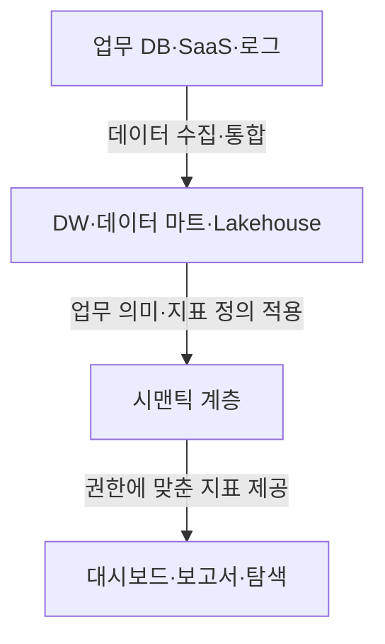
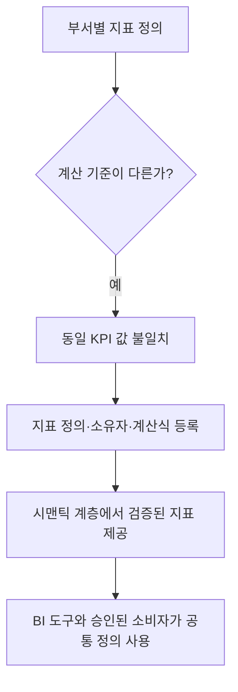

---
sidebar:
  order: 154
  label: "154. BI(Business Intelligence)"
  badge:
    text: "기초"
    variant: note
title: "비즈니스 인텔리전스 (BI, Business Intelligence)"
author: "Antigravity"
date: "2026-09-24T00:00:00+09:00"
tags:
  - "notes-data"
weight: 154
extra:
  model: "GPT-6"
  keyword_grade: "기초"
  question_no: "154"
---

## 지식 로드맵 내 현재 위치

데이터 분석데이터 시각화 및 BI의사결정 지원<strong>비즈니스 인텔리전스(BI)</strong>

## 큰 그림과 30초 인출

- 본질: **기업 내외부에 축적된 대규모 데이터를 수집·정제·통합하여 다차원 분석 모델로 가공한 후, 경영진과 실무진이 직관적으로 이해할 수 있는 시각화 리포트와 대시보드로 제공하여 과학적 데이터 기반 의사결정(Data-Driven Decision Making)을 지원하는 기술 및 프로세스 체계**
- 암기: `원-저-시-소` (4계층: 원천, 저장, 시맨틱, 소비) / `전-셀-증` (발전 3단계: 전통적BI, 셀프서비스BI, 증강분석BI)
- 판단축:
  - **보고서 중심 BI**: 정형 보고서와 대시보드로 지표·현황을 전달.
  - **셀프서비스 BI**: 현업 사용자가 통제된 데이터와 도구로 직접 탐색·시각화.
  - **공통 기반**: 지표 정의, 접근권한, 데이터 품질과 계보를 관리해 일관된 해석 지원.
- 주의: BI 세대 구분과 도입 효과는 보편적 시간·성능 기준이 아니며, 제품과 조직의 운영 방식에 따라 달라짐.

핵심 용어

- **BI (Business Intelligence)** : 조직 데이터를 분석·시각화해 의사결정을 지원하는 정보 제공 체계.
- **OLAP (Online Analytical Processing)** : 다차원 관점에서 집계·탐색 질의를 수행하는 분석 처리 방식.
- **데이터 웨어하우스 (Data Warehouse, DW)** : 분석과 보고를 위해 통합·축적한 데이터 저장소.
- **데이터 마트 (Data Mart)** : 특정 업무 영역의 분석에 맞춰 구성한 데이터 집합.
- **시맨틱 계층 (Semantic Layer)** : 데이터 항목과 지표의 업무 의미·계산 규칙을 분석 도구에 공통으로 제공하는 계층.
- **KPI (Key Performance Indicator)** : 목표 달성 상태를 측정하는 핵심 성과 지표.

---

## 1교시 예상문제 (10점)

> 비즈니스 인텔리전스 (BI, Business Intelligence)의 정의와 목적, 핵심 구조와 작동 원리를 설명하시오. (예상)

---

## 1교시 10점 답안

| 항목 | 핵심 서술 내용 |
|:---|:---|
| **정의** | 기업 데이터를 수집·가공·분석하여 의사결정에 쓸 정보와 시각화를 제공하는 체계 |
| **목적** | 경영진과 실무자가 일관된 정보를 바탕으로 업무 판단을 내리도록 지원 |
| **4계층 구조** | ① 원천 계층(OLTP/로그) $\rightarrow$ ② 저장·가공(DW/Lakehouse) $\rightarrow$ ③ 시맨틱 계층(SSOT 메트릭) $\rightarrow$ ④ 표출·소비(KPI/셀프서비스/Text-to-BI) |
| **운영 방식** | 관리형 보고·분석, 셀프서비스 분석, 시맨틱 계층·AI 보조 등 조직 요구에 따른 방식 |
| **핵심 과제** | 부서별 지표 불일치(지표 사일로)를 줄이기 위한 공통 지표 정의와 관리 |
| **실무 제언** | LLM 기반 자연어 질의(Text-to-BI) 도입 시 할루시네이션 방지를 위해 시맨틱 모델을 가드레일로 연동 |
---

### 핵심 관계

| BI 제공 방식 | 관리형 보고·분석 | 셀프서비스 분석 | 시맨틱 계층·AI 보조 |
|:---|:---|:---|:---|
| **주 사용자** | IT·데이터 조직과 업무 사용자 | 현업 사용자 | 통제된 셀프서비스 사용자 |
| **주요 제공물** | 정기 보고서·대시보드 | 사용자 정의 시각화·질의 | 공통 의미 모델 기반 분석·대화형 탐색 |
| **핵심 고려사항** | 요구 반영 대기와 배포 관리 | 지표 정의의 분산과 권한 통제 | 의미 모델 품질, 접근 통제, 결과 검증 |

---

## 2~4교시 예상문제 (25점)

> 비즈니스 인텔리전스(BI)의 정의와 목적, 데이터 처리부터 분석·정보 제공까지의 핵심 구조 및 의사결정 지원 방안을 설명하시오. (예상)

> (25점, 예상)

---

## 2~4교시 25점 답안

## Ⅰ. 데이터 기반 의사결정을 위한 BI(Business Intelligence) 개요

| 구분 | 핵심 |
|:---|:---|
| **정의** | 기업 데이터를 수집·가공·분석하여 의사결정에 쓸 정보와 시각화를 제공하는 체계 |
| **목적** | 경영진과 실무자가 일관된 정보를 바탕으로 업무 판단을 내리도록 지원 |

#### 한줄 요약: 방대한 비즈니스 데이터를 수집·가공·시각화하여 경험과 감이 아닌 데이터에 기반한 의사결정을 지원하는 체계

- **추진 배경**:
  - 조직에 여러 업무 데이터가 축적되며, 이를 의사결정에 활용할 일관된 분석과 전달 방식의 필요
- **정의**:
  - 조직이 더 나은 비즈니스 의사결정을 내릴 수 있도록 지원하는 데이터 수집, 데이터 웨어하우징, 다차원 분석(OLAP), 시각화 대시보드, 보고서 생성 기술 및 방법론의 총칭
- **핵심 가치**:
  - 주요 지표와 분석 결과를 이용자가 이해하고 판단에 활용할 수 있도록 지원

## Ⅱ. 모던 BI의 4계층 참조 아키텍처

#### 한줄 요약: 원천 수집부터 DW 적재, 중앙 시맨틱 모델링, 시각화 소비로 이어지는 종단간 파이프라인

## Ⅲ. BI의 제공 방식

#### 한줄 요약: 관리형 보고·셀프서비스·AI 보조는 BI 제공 방식의 선택지이며 한 조직에 함께 존재 가능

| BI 제공 방식 | 관리형 보고·분석 | 셀프서비스 분석 | 시맨틱 계층·AI 보조 |
|:---|:---|:---|:---|
| **주 사용자** | IT·데이터 조직과 업무 사용자 | 현업 사용자 | 통제된 셀프서비스 사용자 |
| **주요 제공물** | 정기 보고서·대시보드 | 사용자 정의 시각화·질의 | 공통 의미 모델 기반 분석·대화형 탐색 |
| **핵심 고려사항** | 요구 반영 대기와 배포 관리 | 지표 정의의 분산과 권한 통제 | 의미 모델 품질, 접근 통제, 결과 검증 |

## Ⅳ. BI vs 비즈니스 분석(BA) vs 인공지능(AI/ML) 비교

#### 한줄 요약: "무슨 일이 일어났는가"의 기술적 분석(BI)에서, "왜 일어났고 무엇을 해야 하는가"의 처방적 분석(BA/AI)으로의 심화

| 비교 항목 | 비즈니스 인텔리전스 (BI) | 비즈니스 분석 (BA / Advanced Analytics) | 인공지능 / 머신러닝 (AI/ML) |
|:---|:---|:---|:---|
| **질문 관점** | **"무슨 일이 일어났는가?"** (What happened?) | **"왜 일어났으며, 무엇이 일어날 것인가?"** | **"어떻게 자율적으로 최적화할 것인가?"** |
| **주요 질문** | 무엇이 일어났는가, 어떤 패턴이 있는가 | 왜 일어났는가, 무엇이 일어날 수 있는가 | 어떤 조치를 지원·자동화할 수 있는가 |
| **대표 기법** | 집계, 필터, 다차원 분석 | 진단·예측·최적화 분석 | 기계학습·생성형 AI 활용 |
| **산출 예** | 대시보드, KPI 보고서 | 예측 결과와 시나리오 | 추천·자연어 응답 등 보조 결과 |

## Ⅴ. 지표 사일로(Metric Silo) 극복을 위한 시맨틱 레이어 전략

#### 한줄 요약: 대시보드 툴 내부에 박혀 있던 비즈니스 로직을 중앙 코드로 분리하여 '단일 진실원(SSOT)' 확립

1. **지표의 코드화 (Metrics-as-Code)**:
   - "월간 활성 사용자(MAU)"와 같은 지표의 업무 정의·계산식·필터를 버전 관리되는 설정 또는 코드로 명시.
2. **헤드리스(Headless) 아키텍처**:
   - 시맨틱 레이어가 특정 시각화 도구에 종속되지 않고 REST/GraphQL/SQL 인터페이스를 제공하여, Tableau든 파이썬이든 동일한 지표를 소비.
3. **대시보드 라이프사이클 거버넌스**:
   - 사용 현황과 담당자를 주기적으로 확인해 미사용·중복 대시보드를 정리하고, 검증된 지표를 쓴 대시보드에 승인 상태 표시.

## Ⅵ. 차세대 트렌드: 생성형 AI 기반 대화형 BI (Text-to-BI)

#### 한줄 요약: 자연어 질의를 분석 모델에 연결해 차트·요약 생성을 돕는 BI 방식

| 처리 단계 | 통제 지점 |
|---|---|
| 사용자 질문 | 목적·범위를 명확히 하고 사용자 권한 확인 |
| 의미 해석·질의 생성 | 승인된 시맨틱 모델과 지표 정의만 참조 |
| 실행·응답 생성 | 생성 SQL·필터 검토와 결과 근거 표시 |
| 사용자 확인 | 응답을 업무 판단 전에 검증 |

- **동작 메커니즘**:
  - 사용자: *"지난달 서울 지역 20대 고객 중 이탈 위험이 가장 높은 상위 5개 상품군은?"*
  - LLM 에이전트: 시맨틱 레이어의 메타데이터를 참조하여 SQL 자동 생성 $\rightarrow$ DW 실행 $\rightarrow$ 차트 렌더링 및 핵심 요약 텍스트 브리핑.
- **통제 요건**:
  - 질의 범위를 승인된 데이터 모델과 사용자 권한으로 제한하고, 생성 SQL·필터·결과 근거를 점검할 수 있도록 구성.

## Ⅶ. 기술사적 제언

| 한계 | 우선 제안 |
|:---|:---|
| 지표의 업무 정의, 데이터 소유자, 변경 승인이 불명확하면 공통 계산식만 두어도 신뢰 문제가 남음 | 핵심 KPI별 책임자와 승인 절차를 지정하고, 정의 변경 시 테스트·영향 분석·사용자 공지를 거쳐 배포 |
| 자연어 질의가 잘못된 조인·필터를 만들 수 있음 | 허용된 시맨틱 모델·데이터 권한 안에서 질의를 생성하고 결과 근거를 사용자에게 표시 |

---

## 출제 이력과 검증 출처

- **기출 이력**:
  - 제102회 정보관리 2교시: 기업의 데이터 기반 의사결정을 위한 BI의 발전 과정, 주요 구성요소 및 성공적 도입 방안
  - 제120회 컴퓨터시스템응용 1교시: 셀프서비스 BI의 개념과 데이터 거버넌스 과제
- **검증 출처**:
  - Ralph Kimball & Margy Ross, "The Data Warehouse Toolkit 3rd Edition", Dimensional Modeling
  - Gartner, "Magic Quadrant for Analytics and Business Intelligence Platforms", 2024-2026
  - dbt Labs, "The Semantic Layer and Modern Data Stack Architecture Guide"
---

## 연결 토픽

- 상위 토픽: [03-021 데이터 거버넌스](file:///C:/workspace/study/src/content/docs/notes/itpe/03-data/021_data_governance.md)
- 선수 토픽: [03-131 논리적 DW](file:///C:/workspace/study/src/content/docs/notes/itpe/03-data/131_logical_dw.md), [03-137 스타 스키마](file:///C:/workspace/study/src/content/docs/notes/itpe/03-data/137_star_schema.md)
- 후속 토픽: [03-161 MOLAP](file:///C:/workspace/study/src/content/docs/notes/itpe/03-data/161_molap.md), [03-158 프로세스 마이닝](file:///C:/workspace/study/src/content/docs/notes/itpe/03-data/158_process_mining.md)
