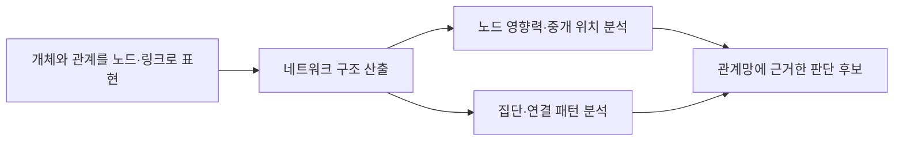
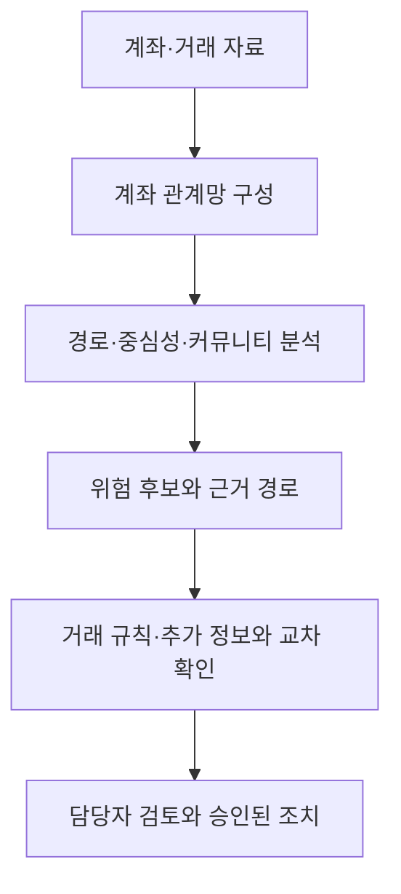

---
sidebar:
  order: 155
  label: "155. SNA(Social Network Analysis)"
  badge:
    text: "기초"
    variant: note
title: "사회연결망분석 (SNA, Social Network Analysis)"
author: "Antigravity"
date: "2026-09-24T00:00:00+09:00"
tags:
  - "notes-data"
weight: 155
extra:
  model: "GPT-6"
  keyword_grade: "기초"
  question_no: "155"
---

## 지식 로드맵 내 현재 위치

데이터 분석고급 분석 기법그래프 마이닝<strong>사회연결망분석(SNA)</strong>

## 큰 그림과 30초 인출

- 본질: **개인, 조직, 시스템 등의 개체(Node)와 이들 간의 관계(Edge)를 수학적 그래프 이론을 바탕으로 모델링하여, 네트워크의 위상 구조(Topology)와 핵심 영향력자(Hub/Broker)를 4대 중심성 지표로 정량 분석하는 데이터 마이닝 기술**
- 암기: `노-엣-밀-직` (그래프 구조: 노드, 엣지, 밀도, 직경) / `연-매-근-고` (4대 중심성: 연결, 매개, 근접, 고유벡터)
- 판단축:
  - **연결 중심성 (Degree)**: 직접 연결된 링크 수 $\rightarrow$ 단순 인기도, 활동량 측정.
  - **매개 중심성 (Betweenness)**: 노드 간 최단 경로상에 위치하는 빈도 $\rightarrow$ 정보 유통의 관문/브로커, 네트워크 단절 위험점.
  - **근접 중심성 (Closeness)**: 모든 노드까지의 거리 역수 합 $\rightarrow$ 신속한 정보 전파자.
  - **고유벡터 중심성 (Eigenvector)**: 중요한 노드와 연결된 가중치 $\rightarrow$ 실질적 파워 엘리트.
- 주의: 매개 중심성과 최단경로 기반 지표는 계산량과 메모리 사용이 커질 수 있으므로, 그래프 크기·밀도·정확도 요구에 맞춰 알고리즘과 처리 방식을 선택함

핵심 용어

- **SNA (Social Network Analysis)** : 행위자와 관계로 표현한 네트워크의 구조·위치를 분석하는 방법.
- **노드 (Node)** : 네트워크에서 사람·조직·계정 등 분석 대상을 나타내는 요소.
- **간선 (Edge)** : 두 노드 사이의 관계를 나타내는 연결.
- **연결 중심성 (Degree Centrality)** : 한 노드에 직접 연결된 이웃의 수 또는 비율.
- **매개 중심성 (Betweenness Centrality)** : 다른 노드 쌍의 최단 경로에 한 노드가 포함되는 정도.
- **근접 중심성 (Closeness Centrality)** : 한 노드에서 다른 노드까지의 최단거리 합에 기반한 접근성 지표.
- **고유벡터 중심성 (Eigenvector Centrality)** : 연결된 이웃의 중요도까지 반영하는 중심성 지표.

---

## 1교시 예상문제 (10점)

> 사회연결망분석 (SNA, Social Network Analysis)의 정의와 목적, 핵심 구조와 작동 원리를 설명하시오. (예상)

---

## 1교시 10점 답안

| 구분 | 핵심 |
|:---|:---|
| **정의** | 노드와 링크로 표현한 네트워크의 구조·관계를 분석하는 기법 |
| **목적** | 관계망 내 영향력·중개 위치·집단 구조를 파악해 업무 판단을 지원 |

| 항목 | 핵심 서술 내용 |
|:---|:---|
| **정의** | 노드(개체)와 링크(관계)로 구성된 수학적 그래프 모델을 기반으로 네트워크 위상 구조와 영향력을 분석하는 기법 |
| **4대 중심성** | ① 연결(직접 링크 수, 마당발) ② 매개(최단경로 통과율, 가교/브로커) ③ 근접(최단거리 합의 역수, 전파자) ④ 고유벡터(영향력 가중치, 실세) |
| **거시 지표** | 밀도(결속력), 직경(네트워크 크기), 군집계수(작은 세상 효과), 루뱅 모듈러리티(커뮤니티 탐지) |
| **인프라 선택** | 다단계 관계 탐색이 핵심인 경우 그래프 저장소를 검토하되, 데이터·질의 특성에 따라 선택 |
| **실무 적용** | 관계망 지표를 위험 신호로 활용할 경우, 업무 담당자의 검토와 기존 탐지 규칙을 함께 적용 |

- **제언**: 중심성은 위험의 확정 판정이 아닌 조사 우선순위 신호로 활용.
---

### 핵심 관계

| 중심성 지표 | 수학적 계산 원리 | 네트워크 내 의미 및 해석 | 비즈니스 실무 활용 |
|:---|:---|:---|:---|
| **연결 중심성 (Degree)** | $C_D(v) = \frac{\text{deg}(v)}{N-1}$ | 한 노드가 보유한 직접 링크의 수 (In-degree, Out-degree) | 트위터 인플루언서, 대규모 허브 라우터 식별 |
| **매개 중심성 (Betweenness)** | $C_B(v) = \sum_{s \ne v \ne t} \frac{\sigma_{st}(v)}{\sigma_{st}}$ | 노드 쌍 간의 최단 경로 중 해당 노드를 거치는 비율 | **자금세탁 중간 송금책**, 단일 장애점(SPOF) 탐지 |
| **근접 중심성 (Closeness)** | $C_C(v) = \frac{N-1}{\sum_{u \ne v} d(v, u)}$ | 모든 타 노드까지의 최단 거리($d$) 합의 역수 | 전염병 슈퍼 전파자, 물류 유통 센터 최적 입지 |
| **고유벡터 중심성 (Eigenvector)** | $x_v = \frac{1}{\lambda} \sum_{t \in M(v)} x_t$ | 연결된 이웃 노드들의 중심성 점수를 재귀적으로 합산 | **구글 PageRank**, 학술 논문 인용 파급력 분석 |

---

## 2~4교시 예상문제 (25점)

> 사회연결망분석(SNA, Social Network Analysis)의 개념과 주요 구성요소를 설명하고, 4가지 중심성(연결, 매개, 근접, 고유벡터) 지표의 계산 원리와 차이점 및 금융 이상거래탐지(FDS)와 마케팅 분야의 실무 활용 방안을 논하시오. (25점)

> (25점, 예상)

---

## 2~4교시 25점 답안

## Ⅰ. 사회연결망분석(SNA)의 개요 및 패러다임 전환

| 구분 | 핵심 |
|:---|:---|
| **정의** | 노드와 링크로 표현한 네트워크의 구조·관계를 분석하는 기법 |
| **목적** | 관계망 내 영향력·중개 위치·집단 구조를 파악해 업무 판단을 지원 |

#### 한줄 요약: 개별 속성이 아닌 개체 간의 '관계(Relation)'를 그래프로 모델링하여 네트워크의 구조적 영향력을 규명하는 기법

- **패러다임 전환**:
  - 전통적 통계 분석은 "모든 관측치는 독립적이다"라는 가정하에 나이, 소득 등 개별 속성(Attribute)만 분석
  - SNA는 "개체 간의 관계와 상호작용" 자체를 핵심 데이터로 취급하여 집단적 구조와 파급력을 규명
- **정의**:
  - 수학적 그래프 이론(Graph Theory)에 기반하여 노드(Node/Vertex)와 링크(Edge/Link)로 표현된 복잡계 네트워크의 구조적 패턴, 정보 전파 경로, 핵심 매개 노드를 정량화하는 분석 방법론
- **핵심 가치**:
  - 테이블 형태로는 보이지 않는 숨겨진 연결 관계(자금세탁 점조직, 공모 사기단) 즉시 적발
  - 커뮤니티 탐지(Louvain Modularity)를 통한 세분화된 고객 집단 도출

## Ⅱ. SNA 4대 중심성(Centrality) 지표의 메커니즘

#### 한줄 요약: 네트워크 내에서 "누가 진짜 실세인가"를 서로 다른 수학적 관점으로 측정하는 4대 지표

| 중심성 | 계산 관점 | 답하는 질문 |
|---|---|---|
| 연결 중심성 (Degree) | 직접 연결의 수·비율 | 직접 연결이 많은 노드는 누구인가? |
| 매개 중심성 (Betweenness) | 노드 쌍 최단 경로의 통과 정도 | 집단 사이 정보·자원 흐름을 매개하는 노드는 누구인가? |
| 근접 중심성 (Closeness) | 다른 노드까지의 최단거리 합 | 네트워크의 다른 노드에 비교적 짧은 경로로 도달하는 노드는 누구인가? |
| 고유벡터 중심성 (Eigenvector) | 연결 이웃의 중심성 점수 | 중요한 이웃과 연결된 노드는 누구인가? |

## Ⅲ. 거시적 네트워크 구조 지표와 커뮤니티 탐지

#### 한줄 요약: 개별 노드를 넘어 네트워크 전체의 응집도와 집단 구조를 파악하는 거시 지표

| 지표·분석 | 계산·판정 관점 | 해석 |
|:---|:---|:---|
| 밀도 | 실제 링크 수와 가능한 링크 수의 비율 | 네트워크의 연결 정도 |
| 직경 | 연결된 노드 쌍 사이 최단거리의 최댓값 | 네트워크의 최대 거리 규모 |
| 군집계수 | 이웃 노드 사이 연결의 정도 | 국소적 결속 정도 |
| Louvain | 모듈러리티를 높이는 커뮤니티 분할 휴리스틱 | 연결이 조밀한 집단 후보 |

- **작은 세상 효과 (Small-World Phenomenon)**:
  - 높은 군집 계수(Clustering Coefficient)와 짧은 평균 경로 길이(Average Path Length)를 동시에 갖는 특성 (밀그램의 6단계 분리 이론).

## Ⅳ. 엔터프라이즈 실무 아키텍처: 그래프 DB와 GNN 연계

#### 한줄 요약: 그래프 관계 분석으로 위험 후보를 찾고 거래 규칙·담당자 검토로 이어지는 탐지 지원

- **RDBMS와 그래프 DB의 탐색 특성**:
  - 관계형 DB는 관계를 조인으로 탐색하고, 그래프 DB는 저장된 간선·인접 관계를 따라 탐색하도록 최적화할 수 있음.
  - 탐색 성능은 데이터 크기, 인덱스, 질의 모양, 저장 구조에 좌우되므로 그래프 DB의 다단계 탐색을 항상 $O(1)$로 보거나 특정 지연시간을 보장하지 않음.

## Ⅴ. SNA의 산업별 핵심 적용 사례

#### 한줄 요약: 금융 FDS, 인플루언서 마케팅, 공급망 리스크 관리, 사이버 보안 관제

| 활용 영역 | 네트워크 분석 | 활용 시 주의 |
|---|---|---|
| 금융 이상거래 | 계좌·기기·거래 관계의 경로와 집단 탐색 | 구조적 관계만으로 범죄 확정 금지 |
| 마케팅 | 커뮤니티와 관계상 영향력 후보 탐색 | 팔로워·중심성만으로 캠페인 효과 단정 금지 |
| 공급망·IT 운영 | 의존 관계와 연결 병목 후보 식별 | 실제 장애 영향과 대체 경로 확인 |

1. **금융 FDS 및 자금세탁방지 (AML)**:
   - 다수의 대포통장이 1개의 공통 IP, 디바이스 ID, 또는 전화번호를 공유하는 '점조직 사기 링(Fraud Ring)'을 서브그래프 패턴 매칭으로 적발.
2. **타겟 마케팅 및 인플루언서 발굴**:
   - 단순 팔로워 수뿐 아니라 관심사 커뮤니티 내 관계 위치를 살펴 마케팅 대상 후보를 발굴하고, 실제 반응 자료로 효과를 검증.
3. **공급망 및 IT 인프라 장애 격리**:
   - 전체 네트워크에서 매개 중심성이 가장 높은 핵심 서버나 부품 공급사를 식별하여 단일 장애점(SPOF)을 선제적으로 이중화.

## Ⅵ. 실무 대규모 그래프 연산 병목 및 튜닝 전략

#### 한줄 요약: 대규모 그래프의 Brandes 알고리즘 계산량을 관리하고 메모리 사용을 최적화

| 분석 대상 | 확장 시 부담 | 적용 판단 |
|---|---|---|
| 매개 중심성 | 최단 경로 계산량·메모리 증가 | 표본 근사와 정확도 요구를 비교 |
| 대규모 그래프 | 데이터 분산·반복 순회 비용 | 분산 처리 도구와 그래프 저장 구조를 실제 질의로 평가 |

- **매개 중심성 연산 부담**:
  - 노드가 1,000만 개일 때 모든 쌍의 최단 경로를 구하는 것은 물리적으로 불가능함
  - **대응책**:
    1. **근사 샘플링 (Random Walk Betweenness)**: 전체 노드가 아닌 무작위 표본 노드 $K$개를 추출하여 최단 경로를 근사 계산 ($O(K \cdot E)$).
    2. **분산 그래프 프레임워크 도입**: Apache Spark GraphX 또는 DGL(Deep Graph Library)을 적용하여 클러스터 메모리에 분산 적재 처리.

## Ⅶ. 기술사적 제언

### 실전 답안용 기술사적 제언

| 한계 | 우선 제안 |
|:---|:---|
| 관계망의 구조만으로 거래 의도나 범죄 여부를 확정하기 어려움 | 중심성·커뮤니티·경로 분석 결과는 후보 신호로 활용하고, 거래 속성·업무 규칙·조사 결과를 결합해 판단 |
| 실시간 스트림에 과거 관계가 섞이면 현재 위험을 잘못 평가할 수 있음 | 시간 범위와 데이터 갱신 시점을 명시하고, 탐지 결과를 담당자가 검토할 수 있도록 근거 경로를 보존 |

---

## 출제 이력과 검증 출처

- **기출 이력**:
  - 제118회 정보관리 2교시: 소셜 네트워크 분석(SNA)의 주요 개념, 4가지 중심성 지표 및 비즈니스 활용 방안
  - 제108회 컴퓨터시스템응용 1교시: 그래프 마이닝과 매개 중심성의 개념
- **검증 출처**:
  - Stanley Wasserman & Katherine Faust, "Social Network Analysis: Methods and Applications", Cambridge University Press
  - Mark Newman, "Networks: An Introduction", Oxford University Press
  - Ian Robinson et al., "Graph Databases 2nd Edition", O'Reilly Media
---

## 연결 토픽

- 상위 토픽: [03-080 탐색적 데이터 분석(EDA)](file:///C:/workspace/study/src/content/docs/notes/itpe/03-data/080_eda.md)
- 선수 토픽: [03-058 선형 vs 비선형 자료구조](file:///C:/workspace/study/src/content/docs/notes/itpe/03-data/058_linear_vs_nonlinear_data_structures.md)
- 후속 토픽: [03-158 프로세스 마이닝](file:///C:/workspace/study/src/content/docs/notes/itpe/03-data/158_process_mining.md), [03-112 빅데이터 개요](file:///C:/workspace/study/src/content/docs/notes/itpe/03-data/112_big_data.md)
