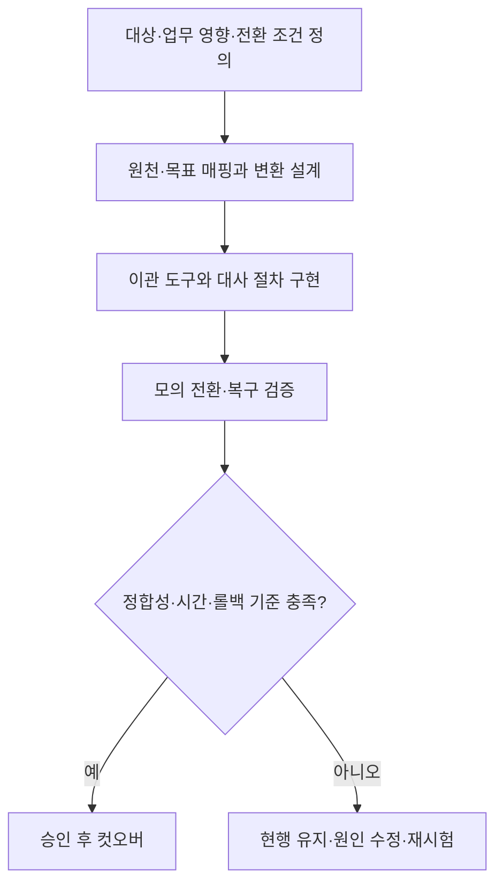
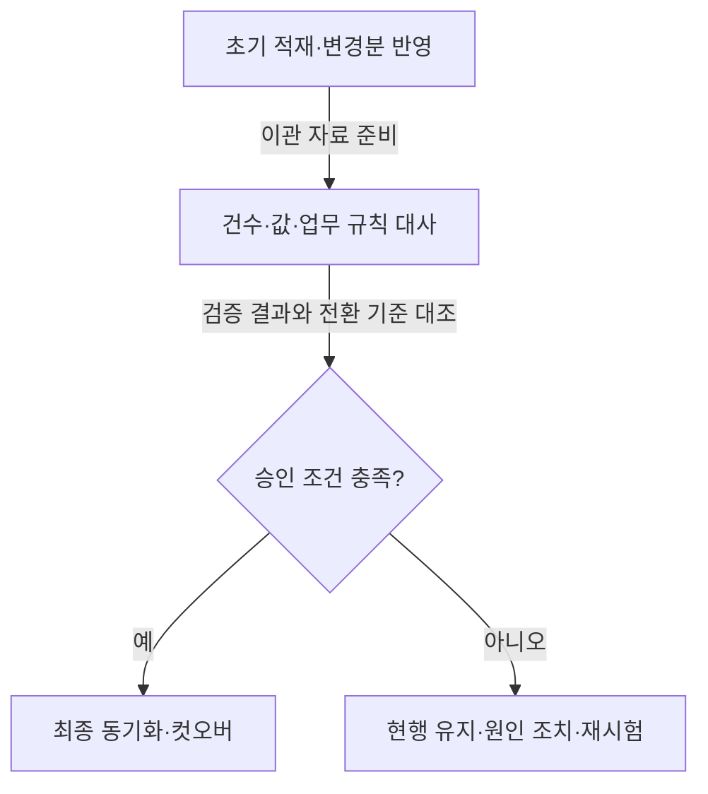
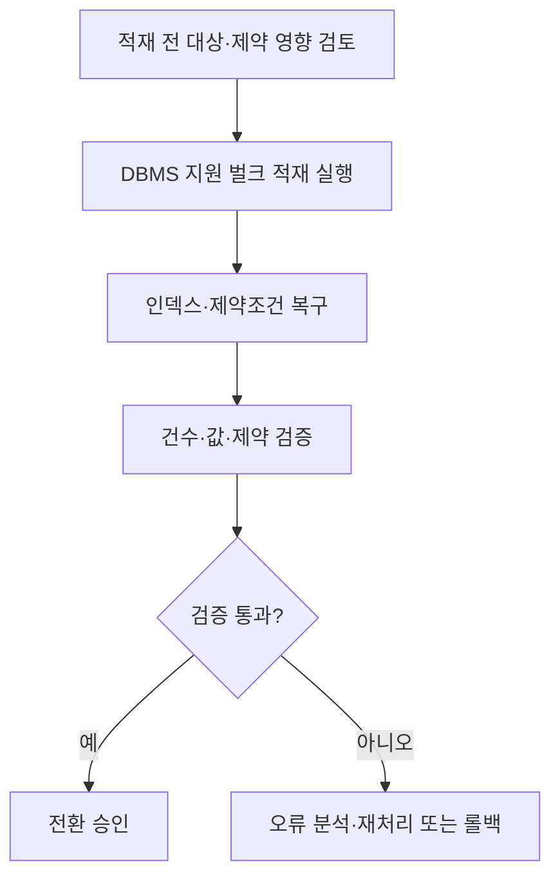
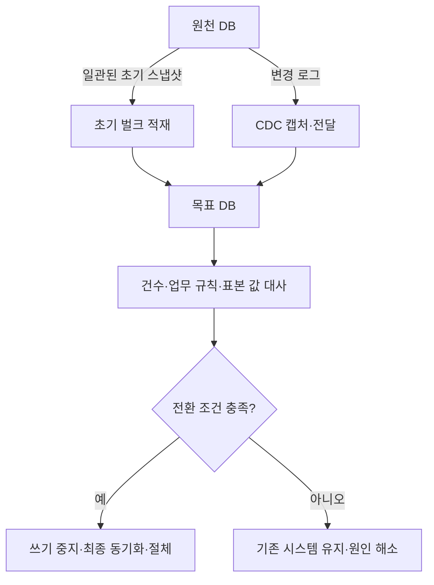

---
sidebar:
  order: 156
  label: "156. 데이터 이관 (Data Migration)"
  badge:
    text: "기초"
    variant: note
title: "대용량 데이터 이관(Data Migration) 및 무결성·정합성 검증 체계"
author: "Antigravity"
date: "2026-09-24T00:00:00+09:00"
tags:
  - "notes-data"
weight: 156
extra:
  model: "GPT-6"
  keyword_grade: "기초"
  question_no: "156"
---

## 지식 로드맵 내 현재 위치

데이터베이스데이터베이스 운영·엔지니어링마이그레이션<strong>데이터 이관(Data Migration)</strong>

## 큰 그림과 30초 인출

- 본질: **데이터 이관은 원천의 데이터를 목표 시스템으로 옮기고 변환 결과를 검증하는 활동으로, 계획·매핑·전환 방식과 데이터 대사를 정해 서비스 중단 및 정보 손실 위험을 관리**
- 암기: `계-설-개-모-본` (5단계 절차: 계획, 설계, 개발, 모의이관, 본이관) / `추-변-적-검` (핵심 활동: 추출, 변환, 적재, 검증) / `건-합-해` (3단계 정합성 검증: 건수대사, 합계대사, 해시대사)
- 판단축:
  - **빅뱅(Big-Bang)**: 한 번에 전환하는 방식으로, 준비가 단순할 수 있으나 전환 위험과 중단 시간을 한 시점에 감당.
  - **단계적(Phased)**: 기능·데이터 범위별로 나누어 전환하는 방식으로 위험을 분산할 수 있지만, 이행 중 신·구 데이터 정합과 운영 복잡성 관리가 필요.
- 주의: 리허설 횟수·허용 다운타임·롤백 기준은 서비스 요구와 계약·운영 조건에 따라 정하며, 일률적 횟수나 무중단·무손실을 보장하는 표현은 피함

핵심 용어

- **데이터 이관 (Data Migration)** : 원천 데이터를 목표 시스템으로 옮기고 변환·검증하는 활동.
- **ETL (Extract, Transform, Load)** : 원천에서 추출한 데이터를 변환한 뒤 목표 저장소에 적재하는 처리 방식.
- **CDC (Change Data Capture)** : 데이터베이스 변경을 포착해 후속 시스템에 전달하는 방식.
- **소스-타깃 매핑 (Source-to-Target Mapping)** : 원천 항목과 목표 항목 및 변환 규칙의 대응 정의.
- **대사 (Reconciliation)** : 원천과 목표의 건수·값·업무 규칙 결과를 비교해 이관 완전성을 확인하는 절차.
- **컷오버 (Cutover)** : 서비스 사용 대상을 기존 시스템에서 목표 시스템으로 전환하는 시점·절차.
- **빅뱅 이관 (Big-Bang Migration)** : 정한 전환 시점에 대상 범위를 한꺼번에 전환하는 방식.
- **단계적 이관 (Phased Migration)** : 기능·데이터 범위를 나누어 순차 전환하는 방식.

---

## 1교시 예상문제 (10점)

> 데이터 이관의 정의와 목적, 계획부터 검증·전환까지의 핵심 절차를 설명하시오. (예상)

---

## 1교시 10점 답안

| 항목 | 핵심 서술 내용 |
|:---|:---|
| **정의** | 원천 데이터를 목표 시스템의 구조·규칙에 맞춰 옮기고 검증하는 활동 |
| **목적** | 데이터의 의미와 업무 연속성을 유지하며 목표 시스템으로 안전하게 전환 |
| **핵심 절차** | 대상·품질 분석 → 소스-타깃 매핑·변환 설계 → 이관·대사 시험 → 컷오버 및 사후 검증 |
| **정합성 3단계 검증** | ① 건수 대사(COUNT) $\rightarrow$ ② 합계 대사(SUM/AVG) $\rightarrow$ ③ 내용 대사(컬럼 결합 해시 체크섬 및 MINUS 쿼리) |
| **적재 최적화** | 목표 DB의 기능·복구 요구를 검토해 벌크 적재, 병렬 처리, 인덱스·제약 관리 방식을 선택 |
| **실무 제언** | 컷오버 판단 기준과 복구 가능 시점을 정하고, 다운타임 목표에 맞춰 CDC 등 변경분 동기화를 검토 |
---

### 핵심 관계

| 이관 단계 | 주요 핵심 활동 (Activity) | 주요 산출물 (Deliverables) |
|:---|:---|:---|
| **1. 이관 계획** | 원천 DB 프로파일링, 이관 대상 확정, 보관 주기 기준 과거 데이터 퍼징(Purging) 및 아카이빙 | 데이터 이관 계획서, WBS, R&R 정의서 |
| **2. 이관 설계** | 소스-타겟 컬럼 1:1 매핑, 데이터 타입/길이 변환 룰 정의, 코드 매핑 테이블, 무결성 제약조건 선/후 설계 | 소스-타겟 매핑 정의서, 코드 변환 정의서, 정제 규칙서 |
| **3. 이관 개발** | ETL 도구 또는 Python/SQL 기반 추출-변환 스크립트 개발, 병렬 처리(Parallel DML) 최적화 | 이관 프로그램 소스, 배치 스크립트, 예외 로그 테이블 |
| **4. 모의 이관** | 대표·예외 데이터를 포함한 리허설, 소요 시간 실측, 병목 조정, 롤백 훈련 | 모의 이관 결과 보고서, 조치 내역서, 성능 튜닝서 |
| **5. 본 이관** | 서비스 차단 $\rightarrow$ 최종 백업 $\rightarrow$ 초기 벌크 $\rightarrow$ CDC 증분 $\rightarrow$ 대사 검증 $\rightarrow$ Go 판정 $\rightarrow$ 오픈 | 본 이관 결과서, 데이터 대사 검증 보고서, 오픈 승인서 |

---

## 2~4교시 예상문제 (25점)

> 데이터 이관의 정의와 목적, 주요 절차 및 전환 방식의 선택 기준을 설명하고, 대용량 이관의 적재·검증·컷오버 방안을 논하시오. (예상)

> (25점, 예상)

---

## 2~4교시 25점 답안

## Ⅰ. 시스템 재구축의 성패를 좌우하는 데이터 이관 개요

| 구분 | 핵심 |
|:---|:---|
| **정의** | 원천 데이터를 목표 시스템의 구조·규칙에 맞춰 옮기고 검증하는 활동 |
| **목적** | 데이터의 의미와 업무 연속성을 유지하며 목표 시스템으로 안전하게 전환 |

#### 한줄 요약: 이기종 환경 간 비즈니스 로직과 스키마 변경을 수용하며 원천 데이터를 목표 DB로 무결하게 이동·검증하는 전주기 방법론

- **추진 배경**:
  - 스키마와 코드 체계가 달라지는 전환에서 매핑·변환 오류와 데이터 누락을 통제할 필요
  - 규모·변경량·중단 허용도에 맞는 이관 전략과 검증 근거가 필요
- **정의**:
  - 레거시 데이터베이스에 축적된 트랜잭션 및 마스터 데이터를 신규 정보시스템의 데이터 모델에 부합하도록 정제·변환하여 목표 데이터베이스에 적재하고 정합성을 입증하는 일련의 활동
- **핵심 목표**:
  - 합의한 서비스 중단 시간과 데이터 손실 허용 기준 준수
  - 검증 가능한 데이터 대사와 결함 조치
  - 실패 시 복구·재전환 절차 확보

## Ⅱ. 데이터 이관 5단계 추진 절차 및 컷오버 타임라인

#### 한줄 요약: 사전 분석과 모의 이관으로 소요 시간·정합성·롤백 조건을 확인하는 체계

| 이관 단계 | 주요 핵심 활동 (Activity) | 주요 산출물 (Deliverables) |
|:---|:---|:---|
| **1. 이관 계획** | 원천 DB 프로파일링, 이관 대상 확정, 보관 주기 기준 과거 데이터 퍼징(Purging) 및 아카이빙 | 데이터 이관 계획서, WBS, R&R 정의서 |
| **2. 이관 설계** | 소스-타겟 컬럼 1:1 매핑, 데이터 타입/길이 변환 룰 정의, 코드 매핑 테이블, 무결성 제약조건 선/후 설계 | 소스-타겟 매핑 정의서, 코드 변환 정의서, 정제 규칙서 |
| **3. 이관 개발** | ETL 도구 또는 Python/SQL 기반 추출-변환 스크립트 개발, 병렬 처리(Parallel DML) 최적화 | 이관 프로그램 소스, 배치 스크립트, 예외 로그 테이블 |
| **4. 모의 이관** | 대표·예외 데이터를 포함한 리허설, 소요 시간 실측, 병목 조정, 롤백 훈련 | 모의 이관 결과 보고서, 조치 내역서, 성능 튜닝서 |
| **5. 본 이관** | 서비스 차단 $\rightarrow$ 최종 백업 $\rightarrow$ 초기 벌크 $\rightarrow$ CDC 증분 $\rightarrow$ 대사 검증 $\rightarrow$ Go 판정 $\rightarrow$ 오픈 | 본 이관 결과서, 데이터 대사 검증 보고서, 오픈 승인서 |

## Ⅲ. 데이터 이관 방식 비교: 빅뱅 vs 단계적 vs 병렬 운영

#### 한줄 요약: 시스템 다운타임 허용도와 리스크 수용성에 따른 전략적 이관 모델 선택

| 비교 항목 | 빅뱅 방식 (Big-Bang) | 단계적 방식 (Phased) | 병렬 운영 방식 (Parallel) |
|:---|:---|:---|:---|
| **전환 방식** | 지정된 단일 컷오버 기간(주말)에 전 업무 일괄 전환 | 업무 단위(여신, 수신 등) 또는 지점별 순차 전환 | 신·구 시스템을 일정 기간 동시 운영하며 실시간 비교 |
| **다운타임** | 상대적으로 김 (수 시간 ~ 수십 시간 전면 중단) | 짧음 (단위 업무별 최소 다운타임만 발생) | 거의 없음 (무중단 전환 가능) |
| **리스크 수준** | **극도로 높음** (본 이관 실패 시 전면 롤백 불가피) | 낮음 (문제 발생 시 해당 업무 단위만 격리 조치) | **최저** (오류 발견 시 구 시스템으로 즉시 복귀) |
| **비용 및 공수** | 낮음 (일회성 단기 집중 투입) | 중간 (인터페이스 및 임시 어댑터 개발 필요) | 매우 높음 (인프라 이중 운영, 양방향 CDC 구축) |
| **적용 권장** | 업무 간 결합도가 극도로 높고 다운타임 확보 가능한 시스템 | 모듈 간 독립성이 높고 대규모 시스템 (금융/대기업) | 24x365 무중단이 절대적인 미션 크리티컬 코어 시스템 |

## Ⅳ. 고속 벌크 적재(Bulk Load) 성능 튜닝 기법

#### 한줄 요약: DBMS별 벌크 적재 기능을 활용하고, 적재 후 인덱스·제약조건을 재검증

1. **Oracle Direct-Path INSERT 활용 예**:
   - DB 버퍼 캐시를 거치지 않고 데이터 파일의 HWM(High Water Mark) 뒤에 직접 블록을 할당하여 쓰는 `/*+ APPEND */` 힌트 및 `NOLOGGING` 옵션 적용.
2. **Oracle 병렬 DML (Parallel DML)**:
   - 서버 CPU 코어 수에 맞추어 `ALTER SESSION ENABLE PARALLEL DML;` 설정 후 파티션 단위 병렬 적재.
3. **DBMS별 인덱스 및 제약조건 처리**:
   - 적재 중에는 인덱스 갱신 부하를 없애기 위해 `UNUSABLE` 처리하고, 적재 완료 후 병렬로 일괄 `REBUILD` 수행.
   - Oracle의 `ENABLE NOVALIDATE`처럼 기존 데이터 검증과 신규 변경 검사를 분리하는 기능은 DBMS별 동작·제약을 확인해 적용.

## Ⅴ. 데이터 정합성·무결성 3대 검증 체계

#### 한줄 요약: 단순 건수 대사에서 출발하여 집계 금액 대사, 행 단위 해시 체크섬 대사로 이어지는 다계층 무결성 검증

| 검증 계층 | 검증 기법 및 쿼리 | 검증 내용 및 판정 기준 | 오류 감지 수준 |
|:---|:---|:---|:---:|
| **1단계: 볼륨 검증** | `COUNT(*)` 및 조건별 건수 대사 | 원천 테이블과 목표 테이블 간 총 레코드 수 100% 일치 | 누락 튜플 발견 |
| **2단계: 값/통계 검증** | `SUM(금액)`, `AVG(단가)`, `MAX/MIN` | 주요 수치형 비즈니스 핵심 컬럼의 총합 일치 확인 | 변환 산식 오류 발견 |
| **3단계: 내용 정밀 검증** | `MD5/SHA256(col1 || col2 || ...)` 및 `MINUS / EXCEPT` 쿼리 | 원천 데이터와 목표 데이터를 표준 문자열로 결합 후 해시값 비교 | 컬럼 값 왜곡 정밀 적발 |

## Ⅵ. 실무 아키텍처: CDC 기반 변경분 동기화

#### 한줄 요약: 초기 적재와 변경분 동기화를 병행해 전환 시 데이터 차이를 줄이는 이관 방식

- **동작 절차**:
  1. 원천 DB가 정상 운영되는 동안 초기 풀 스냅샷(Full Snapshot)을 타겟 DB에 백그라운드로 적재.
  2. 캡처 대상으로 설정한 스냅샷 이후 변경분은 DB 로그 또는 커넥터가 지원하는 방식으로 읽어 전달 계층에 반영.
  3. 변경분을 타겟 DB에 반영하고 지연·오류·순서 보장을 감시.
  4. 컷오버 전 최종 동기화와 대사, 롤백 기준을 확인한 뒤 서비스 영향과 업무 승인에 따라 신규 시스템으로 절체.

## Ⅶ. 기술사적 제언

| 한계 | 우선 제안 |
|:---|:---|
| 초기 스냅샷과 CDC 사이에 일관성 경계가 맞지 않으면 누락·중복 변경이 생길 수 있음 | 스냅샷 기준 시점과 로그 위치를 기록하고, 재시작·재처리에서도 중복을 제어할 수 있는 절체 절차를 검증 |
| 컷오버 후 결함 발견 시 데이터가 양쪽에서 달라질 수 있음 | 쓰기 전환 순서, 역방향 동기화 가능성, 롤백 종료 시점을 사전에 정해 복구 경로를 마련 |

---

## 출제 이력과 검증 출처

- **기출 이력**:
  - 제128회 정보관리 2교시: 데이터 마이그레이션 절차 및 정합성 검증 방안
  - 제105회, 제81회 정보관리 1교시: 데이터 이관 전략 및 컷오버 방안
- **검증 출처**:
  - 한국지능정보사회진흥원(NIA), "공공기관 정보시스템 데이터 이관 가이드라인"
  - AWS Database Migration Service (AWS DMS) Best Practices Guide
  - Oracle Corporation, "Database Migration and Large-Scale Data Loading Guide"
  - Oracle Database Administrator's Guide, [Managing Tables: Direct-Path INSERT](https://docs.oracle.com/en/database/oracle/oracle-database/26/admin/managing-tables.html)
---

## 연결 토픽

- 상위 토픽: [03-063 오픈소스 DBMS 전환](file:///C:/workspace/study/src/content/docs/notes/itpe/03-data/063_opensource_dbms_migration.md)
- 선수 토픽: [03-022 데이터 무결성](file:///C:/workspace/study/src/content/docs/notes/itpe/03-data/022_integrity.md), [03-088 데이터베이스 튜닝](file:///C:/workspace/study/src/content/docs/notes/itpe/03-data/088_database_tuning.md)
- 후속 토픽: [03-126 데이터 복제](file:///C:/workspace/study/src/content/docs/notes/itpe/03-data/126_data_replication.md), [03-149 분산 데이터베이스](file:///C:/workspace/study/src/content/docs/notes/itpe/03-data/149_distributed_database.md)
