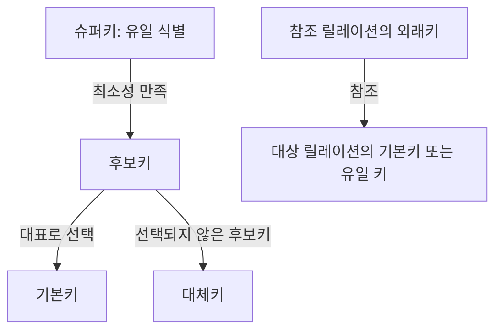

---
sidebar:
  order: 157
  label: "157. 키(Key)"
  badge:
    text: "기초"
    variant: note
title: "관계형 데이터베이스의 키 (Database Keys)"
author: "Antigravity"
date: "2026-09-24T20:16:00+09:00"
tags:
  - "notes-data"
weight: 157
extra:
  model: "GPT-6"
  keyword_grade: "기초"
  question_no: "157"
---

## 지식 로드맵 내 현재 위치

데이터베이스 → 관계형 데이터 모델 → 데이터 모델링 기초 → 관계형 데이터베이스의 키

## 30초 인출

- 본질: 관계형 데이터베이스의 **키 (Key)** 는 튜플을 식별하거나 릴레이션 간 참조를 표현하는 속성 집합
- 메커니즘: 유일성과 최소성으로 후보키를 가리고, 그중 하나를 기본키로 선택하며 외래키로 다른 릴레이션의 유일 키를 참조

핵심 용어

- **키 (Key)**: 튜플 식별이나 릴레이션 간 참조에 쓰는 속성 또는 속성 집합
- **슈퍼키 (Superkey)**: 릴레이션의 튜플을 유일하게 식별하는 속성 집합
- **후보키 (Candidate Key)**: 유일성을 만족하면서 어떤 속성도 덜어낼 수 없는 최소 슈퍼키
- **기본키 (Primary Key)**: 릴레이션의 대표 식별자로 선택한 후보키
- **대체키 (Alternate Key)**: 기본키로 선택되지 않은 나머지 후보키
- **외래키 (Foreign Key)**: 다른 릴레이션의 기본키나 유일 키를 참조하는 속성 집합
- **자연키·대리키 (Natural·Surrogate Key)**: 각각 업무 의미가 있는 식별자와 업무 의미 없이 시스템이 부여하는 식별자
- **UUID (Universally Unique Identifier)**: 분산 환경의 식별자 생성에 쓰이는 128비트 식별자 형식

---

## 1교시 예상문제 (10점)

> 관계형 데이터베이스의 키에 관하여 설명하시오. (예상)

---

## 1교시 10점 답안

## Ⅰ. 키의 개요

| 구분 | 핵심 |
|---|---|
| 정의 | **키 (Key)** 는 튜플을 식별하거나 릴레이션 간 참조를 표현하는 속성 집합 |
| 목적 | 튜플 식별과 참조 무결성 표현 |

## Ⅱ. 키의 분류

| 키 종류 | 핵심 구분 |
|---|---|
| **슈퍼키** | 튜플을 유일하게 식별하는 속성 집합 |
| **후보키** | 유일성과 최소성을 만족하는 슈퍼키 |
| **기본키·대체키** | 후보키 중 대표로 선택한 키와 선택되지 않은 나머지 키 |
| **외래키** | 다른 릴레이션의 기본키 또는 유일 키를 참조하는 속성 집합 |

## Ⅲ. 키 선택 기준

| 구분 | 자연키 | 대리키 |
|---|---|---|
| 식별자 성격 | 업무 의미를 가진 속성 | 업무 의미 없이 시스템이 부여한 값 |
| 선택 시 검토 | 변경 가능성·민감 정보·업무상 유일성 | 생성 범위·충돌 가능성·정렬 특성 |

- 제언: 업무상 유일성 제약과 시스템 식별자의 역할을 분리한 키 설계

---

## 2~4교시 예상문제 (25점)

> 관계형 데이터베이스에서 키의 개념과 종류를 설명하고, 튜플 식별과 릴레이션 간 참조에 키가 어떻게 쓰이는지 논하시오. (예상·25점)

> (25점, 예상)

---

## 2~4교시 25점 답안

## Ⅰ. 관계형 데이터베이스 키의 개요

| 구분 | 핵심 |
|---|---|
| 정의 | **키 (Key)** 는 튜플을 식별하거나 릴레이션 간 참조를 표현하는 속성 집합 |
| 목적 | 튜플 식별과 참조 무결성 표현 |

## Ⅱ. 키의 2대 핵심 특성: 유일성과 최소성

| 핵심 특성 | 학술적 정의 및 판정 기준 | 만족 예시 (학생: 학번, 주민번호, 성명) |
|---|---|---|
| **유일성 (Uniqueness)** | 하나의 릴레이션에서 키로 지정된 속성값의 조합으로 모든 튜플을 상호 중복 없이 고유하게 구별할 수 있는 성질 | `{학번}`, `{주민번호}`, `{학번, 성명}` 모두 유일성 만족 |
| **최소성 (Minimality)** | 유일성을 만족하는 키의 속성 집합에서 어떤 속성 하나라도 제거하면 유일성이 깨져버리는 최소한의 속성 구성 | `{학번}`은 최소성 만족 / `{학번, 성명}`은 `성명`을 빼도 유일하므로 최소성 위배 |

관계 예시에서 `{학번, 성명}`은 유일할 수 있지만 `성명`을 빼도 학번만으로 식별되므로 후보키가 아니라 슈퍼키.

## Ⅲ. 5대 키의 상세 비교 및 관계

| 키 종류 | 정의·역할 | 관계 |
|---|---|---|
| **슈퍼키** | 튜플을 유일하게 식별하는 속성 집합 | 불필요한 속성을 포함할 수 있음 |
| **후보키** | 최소성을 갖춘 슈퍼키 | 기본키 또는 대체키로 선택 |
| **기본키** | 후보키 중 대표 식별자로 선택한 키 | 기본키 제약으로 유일·비널 값 유지 |
| **대체키** | 기본키로 선택되지 않은 후보키 | 필요하면 유일성 제약 적용 |
| **외래키** | 참조 릴레이션의 기본키·유일 키 값을 참조하는 속성 집합 | 식별자 계층이 아니라 릴레이션 간 참조 관계 |

## Ⅳ. 기본키(PK) 선정의 4대 원칙

| 선정 기준 | 설계 확인 |
|---|---|
| 유일성·최소성 | 후보키가 모든 튜플을 식별하고 불필요한 속성을 포함하지 않는지 확인 |
| 안정성 | 업무 변경으로 키 값이 바뀔 가능성과 참조 범위 검토 |
| 필수성 | 기본키 값이 비어 있지 않도록 기본키 제약 적용 |
| 구현 적합성 | 키 길이·자료형·인덱스·분산 생성 필요성을 DBMS와 부하 조건에서 검토 |

## Ⅴ. 자연키(Natural Key) vs 대리키(Surrogate Key)

| 비교 항목 | 자연키 (Natural Key / 비즈니스 키) | 대리키 (Surrogate Key / 인조 식별자) |
|---|---|---|
| 식별자 성격 | 업무 규칙에 따라 의미가 있는 속성 | 시스템이 부여하며 업무 의미와 분리된 값 |
| 장점 | 업무상 식별 기준을 직접 표현 | 업무 속성 변경과 내부 참조 식별자를 분리하기 쉬움 |
| 검토 사항 | 안정성·민감 정보·업무 규칙의 유일성 | 생성 충돌·저장 비용·정렬 특성; 업무상 유일성은 별도 제약으로 유지 |
| 예시 | 국가·조직별로 유일성이 확인된 업무 코드 | 데이터베이스 시퀀스, 범용 고유 식별자 (Universally Unique Identifier, UUID) |

## Ⅵ. 키 제약의 구현과 검증

| 제약 | 데이터베이스에서의 구현 | 확인 항목 |
|---|---|---|
| 기본키 | 유일성·비널 조건을 갖는 기본키 제약 | 중복·누락 값 입력의 거부 |
| 대체키 | 후보키에 대응하는 유일성 제약 | 업무상 중복 방지와 NULL 처리 규칙 |
| 외래키 | 참조 대상의 기본키 또는 유일 키와 연결 | 참조 값 누락·삭제·변경 시 업무에 맞는 동작 |
| 대리키 | 시퀀스·UUID 등 생성 방식을 선택 | 다중 생성기 충돌과 복구·재시도 동작 |

## Ⅶ. 기술사적 제언

| 한계 | 해결 방안 |
|---|---|
| 업무 속성의 변경·민감성이 내부 참조 키로 전파될 수 있음 | 자연키와 대리키의 역할을 구분하고, 업무상 유일성은 별도 제약으로 관리 |
| 분산 식별자의 생성 설정이 충돌·정렬 특성에 영향을 줄 수 있음 | 생성 규모·노드 구성·시계 동작을 실제 환경에서 시험하고 충돌 처리 방식을 정함 |

---

## 출제 이력과 검증 출처

- **기출 이력**:
  - 제105회 정보관리 1교시: 관계형 데이터베이스 키의 개념, 2가지 특성 및 5가지 종류 비교
  - 제96회 컴퓨터시스템응용 1교시: 기본키, 후보키, 외래키의 개념 및 무결성 제약
- **검증 출처**:
  - E.F. Codd, "A Relational Model of Data for Large Shared Data Banks", CACM, 1970
  - Abraham Silberschatz et al., "Database System Concepts 7th Edition", Chapter 2 Introduction to Relational Model
  - [IETF RFC 9562, "Universally Unique IDentifiers (UUID)", 2024 (UUID v7 표준)](https://www.rfc-editor.org/rfc/rfc9562.html)
---

## 연결 토픽

- 상위 토픽: [정규화 종합](./024_normalization_overview.md)
- 선수 토픽: [데이터 무결성](./022_integrity.md)
- 후속 토픽: [BCNF](./153_bcnf.md), [함수적 종속성](./159_functional_dependency.md)
