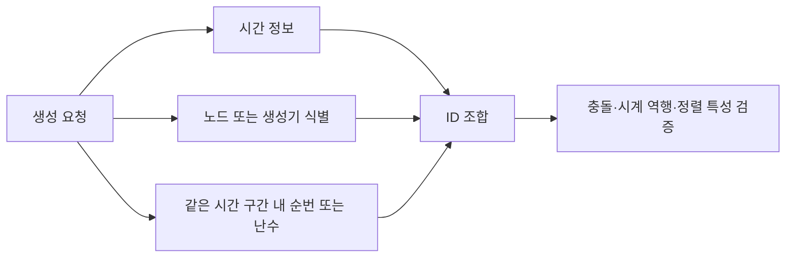

---
sidebar:
  order: 157
  label: "157. 키(Key)"
  badge:
    text: "기초"
    variant: note
title: "관계형 데이터베이스의 키 (Key Architecture)"
author: "Antigravity"
date: "2026-09-24T00:00:00+09:00"
tags:
  - "notes-data"
weight: 157
extra:
  model: "GPT-6"
  keyword_grade: "기초"
  question_no: "157"
---

## 지식 로드맵 내 현재 위치

<div class="itpe-topic-path" aria-label="지식 경로"><span>데이터베이스</span><span>관계형 데이터 모델</span><span>데이터 모델링 기초</span><strong>키(Key)의 유형과 설계 원칙</strong></div>

## 큰 그림과 30초 인출

```text
[관계형 데이터베이스 5대 키의 계층적 포함 관계]

  ┌─────────────────────────────────────────────────────────────┐
  │ 1. 슈퍼키 (Super Key): [유일성 O, 최소성 X]                 │
  │    튜플을 고유하게 식별할 수 있는 모든 속성 집합            │
  │  ┌───────────────────────────────────────────────────────┐  │
  │  │ 2. 후보키 (Candidate Key): [유일성 O, 최소성 O]       │  │
  │  │    유일성과 최소성을 모두 만족하는 최소 식별자        │  │
  │  │  ┌───────────────────────┐ ┌───────────────────────┐  │  │
  │  │  │ 3. 기본키 (Primary)   │ │ 4. 대체키 (Alternate) │  │  │
  │  │  │  - 후보키 중 대표 선정│ │  - 탈락한 나머지 후보키│ │  │
  │  │  │  - NOT NULL & UNIQUE  │ │  - Unique 인덱스 활용 │  │  │
  │  │  └───────────────────────┘ └───────────────────────┘  │  │
  │  └───────────────────────────────────────────────────────┘  │
  └─────────────────────────────────────────────────────────────┘
   * 5. 외래키 (Foreign Key): 타 릴레이션의 기본키/후보키 참조 (참조 무결성)
```

- 본질: **관계형 데이터 모델에서 키는 튜플을 식별하거나 릴레이션 간 참조를 표현하는 속성 집합으로, 후보키·기본키·외래키 등의 제약을 통해 식별과 참조 무결성을 지원**
- 암기: `유-최` (키의 2대 특성: 유일성, 최소성) / `슈-후-기-대-외` (5대 키: 슈퍼키, 후보키, 기본키, 대체키, 외래키) / `유-최-불-존` (기본키 선정 4대 원칙: 유일성, 최소성, 불변성, 존재성)
- 판단축:
  - **슈퍼키**: 유일성은 만족하나 불필요한 군더더기 속성이 포함됨 (최소성 미충족).
  - **후보키**: 유일성과 최소성을 동시에 완벽히 만족하는 정제된 키.
  - **기본키**: 후보키 중 튜플을 대표하도록 선정된 주식별자 (NOT NULL 제약 적용, 안정적 유지가 바람직).
  - **자연키 vs 대리키**: 업무 의미가 있는 자연키는 업무 규칙과 개인정보 영향을 검토하고, 대리키는 시스템 식별자로 선택할 수 있음. 어느 한 방식이 모든 모델의 원칙인 것은 아님.
- 주의: 외래키(FK)는 반드시 부모의 '기본키(PK)'만 참조해야 하는 것이 아니며, 부모 릴레이션에서 유일성을 보장하는 '후보키(UNIQUE)'이기만 하면 문법적으로 유효하게 참조 가능함
---

## 1교시 예상문제 (10점)

> 관계형 데이터베이스의 키 (Key Architecture)의 정의와 목적, 핵심 구조와 작동 원리를 설명하시오. (예상)

---

## 1교시 10점 답안

| 항목 | 핵심 서술 내용 |
|:---|:---|
| **정의** | 릴레이션 내 튜플을 고유하게 식별하거나 테이블 간 참조 관계를 형성하는 하나 이상의 속성 집합 |
| **목적** | 튜플의 식별과 릴레이션 간 참조 무결성 표현에 사용 |
| **2대 특성** | ① 유일성(모든 튜플 구별 가능) / ② 최소성(어떤 속성 하나라도 빼면 유일성이 깨짐) |
| **5대 키 계층** | 슈퍼키(유일성O, 최소성X) $\supset$ 후보키(유일성O, 최소성O) $\rightarrow$ 기본키(대표 선정, NOT NULL) + 대체키(나머지 후보키) ┃ 외래키(타 테이블 참조) |
| **자연키 vs 대리키** | 자연키는 업무 속성 자체를 식별자로 사용하고, 대리키는 업무 의미가 없는 별도 식별자. 변경성·참조·개인정보·분산 생성 요건을 보고 선택 |
| **실무 제언** | 자연키의 업무상 유일성 제약과 대리키 사용 여부를 분리해 설계하고, 분산 ID는 정렬·충돌·시계 특성을 확인 |
---

### 핵심 관계

| 핵심 특성 | 학술적 정의 및 판정 기준 | 만족 예시 (학생: 학번, 주민번호, 성명) |
|:---|:---|:---|
| **유일성 (Uniqueness)** | 하나의 릴레이션에서 키로 지정된 속성값의 조합으로 모든 튜플을 상호 중복 없이 고유하게 구별할 수 있는 성질 | `{학번}`, `{주민번호}`, `{학번, 성명}` 모두 유일성 만족 |
| **최소성 (Minimality)** | 유일성을 만족하는 키의 속성 집합에서 어떤 속성 하나라도 제거하면 유일성이 깨져버리는 최소한의 속성 구성 | `{학번}`은 최소성 만족 / `{학번, 성명}`은 `성명`을 빼도 유일하므로 최소성 위배 |

---

## 2~4교시 예상문제 (25점)

> 관계형 데이터베이스에서 키(Key)의 개념과 2가지 핵심 특성(유일성, 최소성)을 설명하고, 5가지 키(슈퍼키, 후보키, 기본키, 대체키, 외래키)의 계층적 포함 관계 및 차이점과, 자연키(Natural Key)의 한계를 극복하기 위한 대리키(Surrogate Key) 설계 원칙을 논하시오. (25점)

> (25점, 예상)

---

## 2~4교시 25점 답안

## Ⅰ. 관계형 데이터 모델의 근간인 키(Key) 개요

| 구분 | 핵심 |
|:---|:---|
| **정의** | 릴레이션 내 튜플을 고유하게 식별하거나 테이블 간 참조 관계를 형성하는 하나 이상의 속성 집합 |
| **목적** | 튜플의 식별과 릴레이션 간 참조 무결성 표현에 사용 |

#### 한줄 요약: 튜플을 유일하게 구별하고 릴레이션 간의 관계를 맺어주어 무결성을 강제하는 식별 속성 집합

- **배경**:
  - 관계형 모델의 기본 원칙은 "릴레이션 내에 중복된 튜플이 존재해서는 안 된다(수학적 집합론의 성질)"임
  - 특정 행을 유일하게 검색·수정·삭제하고, 다른 테이블과의 참조 관계를 표현하는 식별 메커니즘
- **정의**:
  - 데이터베이스에서 조건에 만족하는 튜플을 찾거나 순서대로 정렬할 때, 또는 타 릴레이션을 참조할 때 기준이 되는 하나 이상의 애트리뷰트(속성)의 모임
- **핵심 가치**:
  - **개체 무결성(Entity Integrity)**: 기본키는 절대 Null이 될 수 없으며 유일해야 함
  - **참조 무결성(Referential Integrity)**: 외래키 값은 참조하는 부모의 기본키 값과 일치하거나 Null이어야 함

## Ⅱ. 키의 2대 핵심 특성: 유일성과 최소성

#### 한줄 요약: 모든 튜플을 겹침 없이 구별하는 '유일성'과, 군더더기 속성을 일체 배제한 '최소성'

<div class="itpe-diagram-box">
  <div class="itpe-diagram-header">
    <span class="itpe-tag">아키텍처 다이어그램</span>
    <span class="itpe-title">관계형 데이터베이스 5대 키의 계층적 포함 관계 및 특성 사상</span>
  </div>
  <div class="itpe-diagram-body">
    <svg class="itpe-svg" viewBox="0 0 520 280" width="100%" height="280" xmlns="http://www.w3.org/2000/svg">
      <defs>
        <marker id="arrow-key" viewBox="0 0 10 10" refX="6" refY="5" markerWidth="6" markerHeight="6" orient="auto-start-reverse">
          <path d="M 0 1 L 8 5 L 0 9 z" fill="var(--color-text, #333)" />
        </marker>
      </defs>
      <!-- 1. 슈퍼키 (가장 바깥 박스) -->
      <rect x="15" y="15" width="490" height="200" rx="8" fill="var(--color-bg-secondary, #f0f4f8)" stroke="var(--color-border, #0284c7)" stroke-width="2" />
      <text x="35" y="38" font-size="13" font-weight="bold" fill="var(--color-primary, #0284c7)">1. 슈퍼키 (Super Key)</text>
      <text x="210" y="38" font-size="10" fill="var(--color-text-muted, #555)">[유일성 O ┃ 최소성 X] 예: {학번, 성명}, {학번, 주민번호, 이메일}</text>

      <!-- 2. 후보키 (중간 박스) -->
      <rect x="35" y="55" width="450" height="145" rx="6" fill="#ffffff" stroke="#3b82f6" stroke-width="1.8" />
      <text x="55" y="78" font-size="12" font-weight="bold" fill="#1d4ed8">2. 후보키 (Candidate Key)</text>
      <text x="230" y="78" font-size="10" fill="#2563eb">[유일성 O ┃ 최소성 O] 예: {학번}, {주민번호}</text>

      <!-- 3. 기본키 & 4. 대체키 분할 카드 -->
      <rect x="50" y="95" width="205" height="90" rx="5" fill="#eff6ff" stroke="#2563eb" stroke-width="1.5" />
      <text x="152" y="118" font-size="11" font-weight="bold" text-anchor="middle" fill="#1e40af">3. 기본키 (Primary Key)</text>
      <text x="152" y="136" font-size="9" text-anchor="middle" fill="#1e3a8a">• 후보키 중 대표로 선정된 주식별자</text>
      <text x="152" y="152" font-size="9" text-anchor="middle" fill="#1e3a8a">• NOT NULL + UNIQUE 강제</text>
      <text x="152" y="168" font-size="9" font-weight="bold" text-anchor="middle" fill="#0369a1">예: {학번} (또는 UUID 대리키)</text>

      <rect x="265" y="95" width="205" height="90" rx="5" fill="#f8fafc" stroke="#64748b" stroke-width="1.5" />
      <text x="367" y="118" font-size="11" font-weight="bold" text-anchor="middle" fill="#334155">4. 대체키 (Alternate Key)</text>
      <text x="367" y="136" font-size="9" text-anchor="middle" fill="#475569">• 기본키로 선정되지 못한 나머지 후보키</text>
      <text x="367" y="152" font-size="9" text-anchor="middle" fill="#475569">• 보조 인덱스(Unique Index)로 활용</text>
      <text x="367" y="168" font-size="9" font-weight="bold" text-anchor="middle" fill="#64748b">예: {주민번호}, {로그인ID}</text>

      <!-- 5. 외래키 (하단 배너) -->
      <rect x="15" y="225" width="490" height="42" rx="5" fill="#ecfdf5" stroke="#10b981" stroke-width="1.5" />
      <text x="35" y="246" font-size="11" font-weight="bold" fill="#065f46">5. 외래키 (Foreign Key):</text>
      <text x="165" y="246" font-size="10" fill="#047857">타 릴레이션의 기본키(PK) 또는 후보키(UK)를 참조하여 릴레이션 간의 관계를 형성</text>
      <text x="165" y="260" font-size="9" fill="#065f46">참조 무결성 제약조건 강제 (CASCADE, RESTRICT, SET NULL 동작 지원)</text>
    </svg>
  </div>
  <div class="itpe-diagram-footer">
    슈퍼키 중 최소성을 만족하는 것이 후보키이며, 후보키 중 대표가 기본키, 나머지가 대체키로 정립됨
  </div>
</div>

| 핵심 특성 | 학술적 정의 및 판정 기준 | 만족 예시 (학생: 학번, 주민번호, 성명) |
|:---|:---|:---|
| **유일성 (Uniqueness)** | 하나의 릴레이션에서 키로 지정된 속성값의 조합으로 모든 튜플을 상호 중복 없이 고유하게 구별할 수 있는 성질 | `{학번}`, `{주민번호}`, `{학번, 성명}` 모두 유일성 만족 |
| **최소성 (Minimality)** | 유일성을 만족하는 키의 속성 집합에서 어떤 속성 하나라도 제거하면 유일성이 깨져버리는 최소한의 속성 구성 | `{학번}`은 최소성 만족 / `{학번, 성명}`은 `성명`을 빼도 유일하므로 최소성 위배 |

## Ⅲ. 5대 키의 상세 비교 및 관계

#### 한줄 요약: 슈퍼키, 후보키, 기본키, 대체키, 외래키의 기능적 역할과 제약조건 비교

| 키 종류 | 유일성 | 최소성 | Null 허용 여부 | 주 역할 및 제약조건 |
|:---|:---:|:---:|:---:|:---|
| **슈퍼키 (Super Key)** | **O** | **X** | 부분 허용 | 튜플 식별이 가능한 모든 속성의 조합 (이론적 집합) |
| **후보키 (Candidate Key)** | **O** | **O** | 불허 | 유일성과 최소성을 모두 만족하여 기본키가 될 자격이 있는 식별자 |
| **기본키 (Primary Key)** | **O** | **O** | 불허 | 선택된 후보키로 튜플을 식별. 인덱스 종류·생성은 DBMS 구현에 따름 |
| **대체키 (Alternate Key)** | **O** | **O** | 제약·DBMS에 따름 | 후보키 중 기본키로 선택되지 않은 키. 유일성 제약으로 구현 가능 |
| **외래키 (Foreign Key)** | 조건부 | 조건부 | **허용 (업무 룰 의존)** | 타 릴레이션의 PK/후보키를 참조, 데이터의 부모-자식 참조 무결성 보장 |

## Ⅳ. 기본키(PK) 선정의 4대 원칙

#### 한줄 요약: 유일성과 최소성은 기본이며, 비즈니스 변경에 흔들리지 않는 '불변성'과 '존재성'이 실무의 핵심

```text
[기본키 선정을 위한 4대 절대 원칙]

  [1. 유일성 (Uniqueness)]    ──► 모든 튜플을 고유하게 식별할 수 있어야 함
  [2. 최소성 (Minimality)]    ──► 복합키 속성 수를 최소화하여 인덱스 비대화 방지
  [3. 불변성 (Immutability)]  ──► 한번 부여된 키 값은 시스템 영속 기간 동안 절대 변경 불가
  [4. 존재성 (NOT NULL)]      ──► 어떠한 경우에도 식별자가 Null이어서는 안 됨
```

- **불변성(Immutability) 위배의 참사**:
  - 회원의 '이메일'이나 '전화번호'를 기본키로 지정했을 때, 사용자가 이메일을 변경하면 수억 건의 주문, 결제, 배송 테이블의 외래키를 일괄 갱신(Cascade Update)해야 하므로 DB 전체 락 경합 및 트랜잭션 마비 발생

## Ⅴ. 자연키(Natural Key) vs 대리키(Surrogate Key)

#### 한줄 요약: 현실 세계 비즈니스 속성을 쓰는 자연키의 한계를 극복하기 위해 무의미한 인조 식별자인 대리키 채택

| 비교 항목 | 자연키 (Natural Key / 비즈니스 키) | 대리키 (Surrogate Key / 인조 식별자) |
|:---|:---|:---|
| **개념** | 실제 비즈니스 도메인에 존재하는 의미 있는 속성 | 비즈니스 의미가 전혀 없는 시스템 생성 인조 식별자 |
| **대표 예시** | 주민등록번호, 이메일 주소, 사업자등록번호, 차량번호 | 자동 증가 정수(Auto-increment), UUID v7, Snowflake ID |
| **장점** | 업무 의미를 직접 표현할 수 있음 | 비즈니스 의미 변경과 식별자 변경을 분리하기 쉬움 |
| **단점** | 비즈니스 룰 변경 시 키 값 변경 위험, 개인정보 이슈 | 인위적 컬럼 증가, 자연키 중복 방지를 위한 별도 UK 필요 |
| **인덱스 크기** | 자료형·길이·복합 구성에 따라 달라짐 | 자료형·길이·인덱스 구현에 따라 달라짐 |
| **권장 지침** | 변경 가능성·민감성·업무 유일성 검토 | 분산 발급 필요, 저장공간, 정렬 특성, 업무 유일성을 함께 평가 |

## Ⅵ. 분산 시스템 환경의 글로벌 대리키 채번 아키텍처

#### 한줄 요약: 여러 노드의 식별자 충돌을 줄이기 위해 생성 범위·시간·노드 정보를 조합하는 방식



- **단일 시퀀스의 고려사항**:
  - 단일 데이터베이스가 관리하는 시퀀스는 유일성을 제공할 수 있으나, 여러 독립 생성기에서 같은 범위를 쓰면 충돌 방지 설계가 필요
- **UUID v4의 B-Tree 인덱스 파편화 결함**:
  - 완전 무작위(Random) 생성으로 인해 B-Tree 리프 노드 분할(Page Split)이 빈번하여 디스크 I/O 폭증
- **해결책: 시간 정렬형 분산 ID (UUID v7 / Snowflake)**:
  - 시간 정보를 포함해 대략적인 시간 정렬을 지원할 수 있음. UUIDv7은 RFC 9562의 시간 필드와 난수·선택적 단조성 구성을 따르며, 전역 단조 증가나 인덱스 성능 향상을 보장하지 않음.

## Ⅶ. 기술사적 제언

### 실전 답안용 기술사적 제언

| 한계 | 우선 제안 |
|:---|:---|
| 시간 기반 ID의 정렬 특성과 시계 오류·중복 발급 위험은 생성기 설정에 좌우됨 | 발급량·노드 수·시계 동기화·재시작 동작을 시험하고, 충돌 감지와 재시도 방식을 설계 |
| 식별자 형식만 바꾸면 업무 유일성 제약이 사라질 수 있음 | 대리키와 별도로 자연키의 업무 유일성 제약 및 개인정보 취급 기준을 유지 |

---

## 출제 이력과 검증 출처

- **기출 이력**:
  - 제105회 정보관리 1교시: 관계형 데이터베이스 키의 개념, 2가지 특성 및 5가지 종류 비교
  - 제96회 컴퓨터시스템응용 1교시: 기본키, 후보키, 외래키의 개념 및 무결성 제약
- **검증 출처**:
  - E.F. Codd, "A Relational Model of Data for Large Shared Data Banks", CACM, 1970
  - Abraham Silberschatz et al., "Database System Concepts 7th Edition", Chapter 2 Introduction to Relational Model
  - IETF RFC 9562, "Universally Unique IDentifiers (UUID)", 2024 (UUID v7 표준)
---

## 연결 토픽

- 상위 토픽: [03-024 정규화 종합](file:///C:/workspace/study/src/content/docs/notes/itpe/03-data/024_normalization_overview.md)
- 선수 토픽: [03-022 데이터 무결성](file:///C:/workspace/study/src/content/docs/notes/itpe/03-data/022_integrity.md)
- 후속 토픽: [03-153 BCNF](file:///C:/workspace/study/src/content/docs/notes/itpe/03-data/153_bcnf.md), [03-159 함수적 종속성](file:///C:/workspace/study/src/content/docs/notes/itpe/03-data/159_functional_dependency.md)
