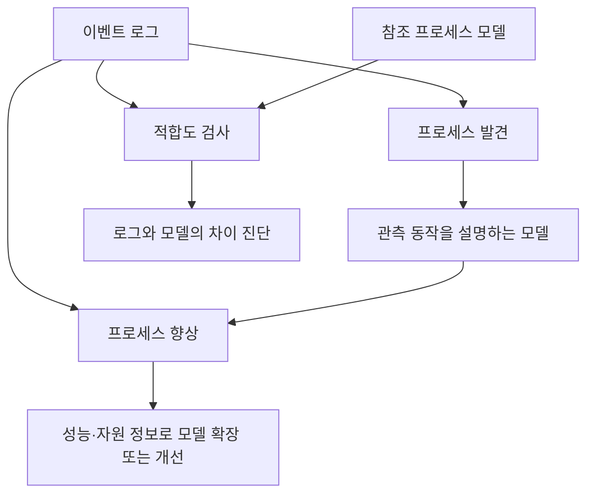
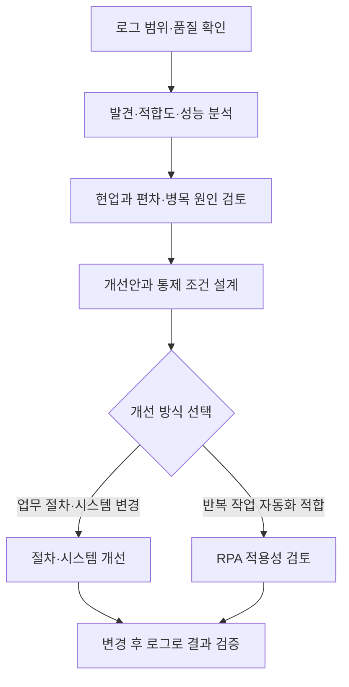

---
sidebar:
  order: 158
  label: "158. 프로세스 마이닝(Process Mining)"
  badge:
    text: "기초"
    variant: note
title: "프로세스 마이닝 (Process Mining)"
author: "Antigravity"
date: "2026-09-24T20:16:00+09:00"
tags:
  - "notes-data"
weight: 158
extra:
  model: "GPT-6"
  keyword_grade: "기초"
  question_no: "158"
---

## 지식 로드맵 내 현재 위치

데이터 분석 → 비즈니스 프로세스 분석 → 프로세스 마이닝

## 30초 인출

- 본질: **프로세스 마이닝 (Process Mining)** 은 정보시스템의 이벤트 로그로 업무 흐름을 발견·비교·분석하는 방법
- 메커니즘: 케이스·활동·시각을 가진 로그를 프로세스 모델과 연결해 실제 수행 경로, 모델과의 차이, 성능 정보를 살펴봄

핵심 용어

- **프로세스 마이닝 (Process Mining)**: 이벤트 데이터에서 업무 프로세스 모델을 발견·비교·향상하는 분석 방법
- **이벤트 로그 (Event Log)**: 업무 실행 이벤트와 케이스·활동·시각 등 속성을 기록한 데이터
- **케이스 식별자 (Case ID)**: 같은 업무 건에 속한 이벤트를 묶는 식별자
- **프로세스 발견 (Process Discovery)**: 이벤트 로그에서 관측된 동작을 설명하는 프로세스 모델을 도출하는 작업
- **적합도 검사 (Conformance Checking)**: 이벤트 로그의 동작과 참조 프로세스 모델의 동작을 비교하는 분석
- **프로세스 향상 (Process Enhancement)**: 이벤트 데이터로 기존 프로세스 모델을 확장하거나 개선하는 작업
- **직접 후행 그래프 (Directly-Follows Graph, DFG)**: 로그에서 활동 간 직접적인 선후 관계를 나타내는 그래프

---

## 1교시 예상문제 (10점)

> 프로세스 마이닝에 관하여 설명하시오. (예상)

---

## 1교시 10점 답안

## Ⅰ. 프로세스 마이닝의 개요

| 구분 | 핵심 |
|---|---|
| 정의 | **프로세스 마이닝 (Process Mining)** 은 정보시스템의 이벤트 로그로 업무 흐름을 발견·비교·분석하는 방법 |
| 목적 | 실제 수행과 참조 모델의 차이·성능 특성을 파악해 업무 개선 판단 지원 |

## Ⅱ. 이벤트 로그의 핵심 속성

| 속성 | 의미 | 사용 |
|---|---|---|
| 케이스 식별자 (Case ID) | 같은 업무 건의 이벤트를 묶는 식별자 | 업무 건별 흐름 구성 |
| 활동 (Activity) | 수행된 업무 단계의 명칭 | 단계 순서·경로 분석 |
| 시각 (Timestamp) | 이벤트 발생 시각 | 선후 관계·처리·대기 시간 분석 |
| 자원·맥락 (선택) | 수행자·조직·비용 등 추가 속성 | 자원·조직 분석 또는 모델 확장 |

## Ⅲ. 분석 유형

| 유형 | 핵심 질문 |
|---|---|
| 발견 (Discovery) | 로그에서 어떤 흐름이 관측되는가? |
| 적합도 검사 (Conformance Checking) | 참조 모델과 실제 흐름은 어디서 다른가? |
| 향상 (Enhancement) | 시간·자원 등 이벤트 속성으로 모델을 어떻게 보완할 것인가? |

- 제언: 이벤트 로그의 범위와 품질을 확인한 뒤 분석 결과를 현업과 검증

---

## 2~4교시 예상문제 (25점)

> 프로세스 마이닝에 관하여 설명하시오. (예상·25점)

---

## 2~4교시 25점 답안

## Ⅰ. 데이터 기반 업무 혁신을 위한 프로세스 마이닝 개요

| 구분 | 핵심 |
|---|---|
| 정의 | **프로세스 마이닝 (Process Mining)** 은 정보시스템의 이벤트 로그로 업무 흐름을 발견·비교·분석하는 방법 |
| 목적 | 실제 수행과 참조 모델의 차이·성능 특성을 파악해 업무 개선 판단 지원 |

## Ⅱ. 이벤트 로그(Event Log)의 3대 필수 속성

| 케이스 식별자 | 활동 | 시각 | 선택 속성 |
|---|---|---|---|
| 주문-001 | 주문 접수 | 발생 시각 | 수행 조직 |
| 주문-001 | 결제 승인 | 발생 시각 | 처리 자원 |
| 주문-001 | 출고 완료 | 발생 시각 | 채널·비용 |

같은 케이스의 이벤트를 업무 실행 순서에 따라 묶으며, 시각 정밀도·시간대·활동 의미를 원천 시스템 간에 확인.

## Ⅲ. 세 가지 분석 유형

발견은 사전 모델 없이 로그에서 모델을 도출하는 작업. 적합도 검사는 참조 모델이 있을 때 실제 로그와 비교하며, 향상은 성능·자원 정보를 모델에 더하거나 수정하는 분석.

## Ⅳ. 프로세스 발견 알고리즘 비교

발견 알고리즘은 로그 품질과 필요한 모델 표현력에 맞춰 선택하며, 어느 알고리즘도 모든 데이터에 우월하다고 단정하지 않음.

| 알고리즘 | 핵심 접근 | 적용 시 확인 |
|---|---|---|
| 알파 마이너 (Alpha Miner) | 로그의 직접 후행 관계에서 페트리 넷 구조를 도출 | 노이즈·불완전 로그와 짧은 루프 표현의 한계 |
| 휴리스틱 마이너 (Heuristics Miner) | 활동 간 발생 빈도·의존도를 이용해 모델 구성 | 임계값에 따른 예외 경로 누락·모델 복잡도 |
| 인덕티브 마이너 (Inductive Miner) | 로그를 재귀 분할해 프로세스 트리 구성 | 로그·변형·필터 조건과 모델의 적합성 |

## Ⅴ. 프로세스 마이닝 vs 데이터 마이닝 vs 전통적 BPM

| 비교 축 | BPM (Business Process Management) | 데이터 마이닝 (Data Mining) | 프로세스 마이닝 (Process Mining) |
|---|---|---|---|
| 주된 초점 | 업무 프로세스의 모델링·관리·개선 | 데이터에서 패턴·예측 관계 탐색 | 이벤트 로그에 나타난 프로세스 동작 분석 |
| 주요 근거 | 업무 규칙·모델·운영 정보 | 분석 대상 데이터와 특징량 | 케이스별 활동·시각 및 참조 모델 |
| 서로의 관계 | 프로세스 기준·개선 활동 제공 | 특정 질문의 예측·분류를 보완 | 관측된 실행 흐름과 모델 차이를 근거로 BPM 개선 지원 |

## Ⅵ. 분석 결과의 업무 개선 연결

- 경로가 지나치게 많으면 분석 질문에 맞춰 케이스·기간·활동 범위를 필터링하고, 드문 경로도 규정·위험 영향으로 선별
- 자동화는 원인과 업무 규칙을 확인한 개선안 중 반복 작업에 적용하며, 변경 후 로그로 품질·시간·예외를 재검증

## Ⅶ. 기술사적 제언

| 한계 | 우선 제안 |
|:---|:---|
| 분석 결과를 여러 부서가 다르게 해석하면 개선 책임과 사후 확인이 분산될 수 있음 | 업무 담당자·데이터 담당자·시스템 담당자의 검토 책임을 정하고, 시범 적용 후 성과와 예외를 함께 점검 |
| 개선 전후 지표의 정의가 바뀌면 변화 효과를 공정하게 비교하기 어려움 | 케이스 범위와 핵심 지표의 산정 기준을 고정해 전후 결과와 예외를 기록 |

---

## 출제 이력과 검증 출처

- **기출 이력**:
  - 제118회 정보관리 2교시: 정보시스템 이벤트 로그를 활용한 프로세스 마이닝의 개념, 3대 유형 및 프로세스 혁신 방안
  - 제125회 컴퓨터시스템응용 1교시: 프로세스 마이닝의 적합도 검사(Conformance Checking)
- **검증 출처**:
  - Wil van der Aalst et al., ["Process Mining Manifesto"](https://www.tf-pm.org/resources/manifesto), IEEE Task Force on Process Mining
  - [RWTH Aachen Process Mining Overview](https://www.processmining.org/overview.html)
  - [RWTH Aachen: Process Discovery](https://www.processmining.org/process-discovery.html)
  - [RWTH Aachen: Extracting, Filtering, and Cleaning Event Data](https://www.processmining.org/extract-filter-clean-event-data.html)
---

## 연결 토픽

- 상위 토픽: [탐색적 데이터 분석(EDA)](./080_eda.md)
- 선수 토픽: [BI](./154_bi.md)
- 후속 토픽: [SNA](./155_sna.md), [BPM·워크플로우](../01-software-engineering/016_bpm.md)
