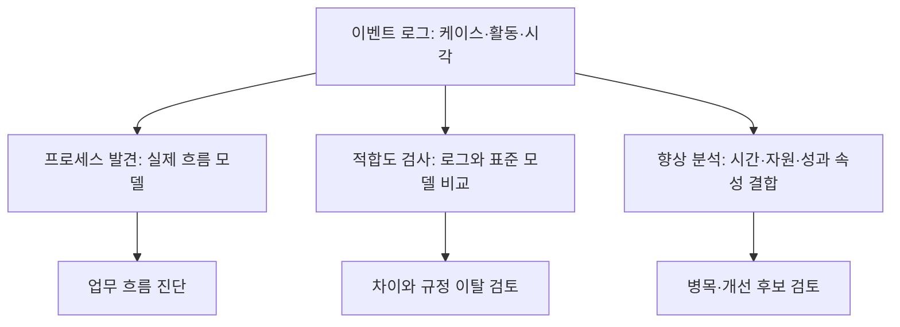

---
sidebar:
  order: 158
  label: "158. 프로세스 마이닝(Process Mining)"
  badge:
    text: "기초"
    variant: note
title: "프로세스 마이닝 (Process Mining)"
author: "Antigravity"
date: "2026-09-24T00:00:00+09:00"
tags:
  - "notes-data"
weight: 158
extra:
  model: "GPT-6"
  keyword_grade: "기초"
  question_no: "158"
---

## 지식 로드맵 내 현재 위치

<div class="itpe-topic-path" aria-label="지식 경로"><span>데이터 분석</span><span>고급 분석 기법</span><span>비즈니스 프로세스 분석</span><strong>프로세스 마이닝</strong></div>

## 큰 그림과 30초 인출



- 본질: **기업의 정보시스템(ERP, CRM, MES 등)에 자동으로 기록된 이벤트 로그(Event Log)의 Case ID, Activity, Timestamp 3대 속성을 수학적으로 분석하여, 실제 수행된 비즈니스 프로세스를 X-Ray처럼 시각화하고 규정 위반(우회)과 병목을 객관적으로 진단·개선하는 데이터 과학과 BPM의 융합 기술**
- 암기: `케-액-타` (이벤트 로그 3대 최소 속성: Case ID, Activity, Timestamp) / `발-적-향` (3대 분석 유형: 발견, 적합도 검사, 향상) / `해-스` (해피 패스 vs 스파게티 프로세스)
- 판단축:
  - **프로세스 발견 (Discovery)**: 사전 모델 없이 순수 로그만으로 실제 프로세스 맵 자동 도출 (Alpha, Inductive Miner).
  - **적합도 검사 (Conformance)**: 조직의 공식 규정 모델과 실제 실행 로그를 대조하여 불일치·부정 우회 경로 적발.
  - **프로세스 향상 (Enhancement)**: 실제 수행 시간과 비용을 모델에 투영하여 병목 구간(Bottleneck) 해소 및 업무 재설계.
- 주의: 이벤트 로그의 케이스 정의·활동명·시간 정합성과 필터 기준에 따라 발견 결과가 달라지므로, 전처리와 분석 범위를 명시.
---

## 1교시 예상문제 (10점)

> 프로세스 마이닝 (Process Mining)의 정의와 목적, 핵심 구조와 작동 원리를 설명하시오. (예상)

---

## 1교시 10점 답안

| 항목 | 핵심 서술 내용 |
|:---|:---|
| **정의** | 정보시스템 이벤트 로그에서 실제 프로세스의 흐름을 추출·분석하는 기법 |
| **목적** | 실제 수행 흐름과 표준 모델의 차이를 밝혀 업무 개선 판단을 지원 |
| **3대 필수 속성** | ① Case ID(단일 업무 건 식별) ② Activity(수행 작업 명칭) ③ Timestamp(발생 시각 및 선후 순서) |
| **3대 분석 유형** | ① 발견(Discovery: 로그로부터 맵 자동 도출) ② 적합도(Conformance: 표준 대비 우회 적발) ③ 향상(Enhancement: 병목 시간 단축) |
| **알고리즘 선택** | 발견 알고리즘은 로그의 노이즈·루프와 필요한 모델 특성을 보고 선택하며, 단일 알고리즘의 보편적 우위를 단정하지 않음 |
| **실무 제언** | 이벤트 정의와 분석 범위를 먼저 정하고 발견·적합도·향상 결과를 근거로 개선안을 검증 |
---

### 핵심 관계

| 분석 유형 | 입력 데이터 | 핵심 동작 메커니즘 | 비즈니스 산출물 |
|:---|:---|:---|:---|
| **1. 프로세스 발견 (Discovery)** | 이벤트 로그 | Alpha Miner, Inductive Miner 알고리즘으로 액티비티 간 인과관계 그래프 도출 | 실제 As-Is 프로세스 흐름도 (DFG) |
| **2. 적합도 검사 (Conformance)** | 이벤트 로그 + 표준 프로세스 모델 | 얼라인먼트(Alignment) 기법으로 로그와 표준 모델 간의 스킵(Skip) 및 인서트(Insert) 편차 측정 | 규정 위반 보고서, 적합도 지수 (Fitness) |
| **3. 프로세스 향상 (Enhancement)** | 이벤트 로그 + 발견/표준 모델 | 병목 대기 시간(Waiting Time)을 히트맵으로 색상화하고 큐잉 딜레이 진단 | 병목 최적화 방안, 리드타임 단축 모델 |

---

## 2~4교시 예상문제 (25점)

> 프로세스 마이닝의 정의와 목적, 이벤트 로그를 이용한 발견·적합도 검사·향상 유형의 핵심 구조와 작동 원리를 설명하시오. (예상)

> (25점, 예상)

---

## 2~4교시 25점 답안

## Ⅰ. 데이터 기반 업무 혁신을 위한 프로세스 마이닝 개요

| 구분 | 핵심 |
|:---|:---|
| **정의** | 정보시스템 이벤트 로그에서 실제 프로세스의 흐름을 추출·분석하는 기법 |
| **목적** | 실제 수행 흐름과 표준 모델의 차이를 밝혀 업무 개선 판단을 지원 |

#### 한줄 요약: 인터뷰에 의존하던 전통적 프로세스 분석을 탈피하고, 실제 시스템 로그로 업무 흐름을 객관적으로 규명하는 기술

- **추진 배경**:
  - 기존의 업무 혁신(PI/BPR) 컨설팅은 설문과 인터뷰에 의존하여 "사람이 기억하는 왜곡되고 이상적인 절차"만 파악하는 한계 존재
  - 규정 매뉴얼(To-Be)과 현업 실무(As-Is) 간의 괴리, 보이지 않는 비공식 우회 승인 및 장기 대기 병목을 객관적 팩트로 규명 필요
- **정의**:
  - 소프트웨어 시스템에 기록된 사건 로그(Event Log)로부터 지식을 추출하여 실제 비즈니스 프로세스를 발견(Discover), 모니터링(Monitor), 개선(Improve)하는 종합 데이터 과학 기술
- **핵심 가치**:
  - 실제 업무 수행 경로를 관찰 가능한 데이터로 분석
  - 표준 모델과의 차이, 반복·대기 구간을 확인해 개선 논의 지원

## Ⅱ. 이벤트 로그(Event Log)의 3대 필수 속성

#### 한줄 요약: 개별 업무 건(Case), 수행된 행위(Activity), 발생 시각(Timestamp)이 결합된 최소 데이터셋

```text
[이벤트 로그 데이터 표준 테이블 예시]

  Case ID │ Activity (수행 활동) │ Timestamp (발생 일시) │ Resource (담당자)
 ─────────┼──────────────────────┼───────────────────────┼───────────────────
  PO-2026 │ 구매 요청 접수       │ 2026-09-21 09:10:00   │ 김대리 (구매팀)
  PO-2026 │ 부서장 승인          │ 2026-09-21 14:30:00   │ 이부장 (기획팀)
  PO-2026 │ 발주서 발행          │ 2026-09-22 10:00:00   │ 자동 배치 시스템
  PO-2026 │ 입고 검수 완료       │ 2026-09-25 16:00:00   │ 박과장 (물류팀)
```

1. **Case ID (사례 식별자)**:
   - 분석 대상이 되는 단일 업무 인스턴스의 고유 키 (예: 주문번호, 환자번호, 클레임 접수번호).
2. **Activity (수행 활동)**:
   - 해당 프로세스 단계에서 실행된 구체적인 작업 명칭 (예: 주문 접수, 서류 검토, 대출 승인).
3. **Timestamp (발생 시각)**:
   - 이벤트 발생 시각. 요구 분석에 맞는 시간 정밀도와 시간대 기준을 정해 활동 순서·소요시간 분석에 사용.

## Ⅲ. 프로세스 마이닝의 3대 핵심 분석 유형

#### 한줄 요약: 로그로부터 모델을 만드는 '발견', 규정 준수를 보는 '적합도', 병목을 뚫는 '향상'

<div class="itpe-diagram-box">
  <div class="itpe-diagram-header">
    <span class="itpe-tag">아키텍처 다이어그램</span>
    <span class="itpe-title">프로세스 마이닝 3대 핵심 분석 유형 (Discovery, Conformance, Enhancement)</span>
  </div>
  <div class="itpe-diagram-body">
    <svg class="itpe-svg" viewBox="0 0 520 280" width="100%" height="280" xmlns="http://www.w3.org/2000/svg">
      <defs>
        <marker id="arrow-pm" viewBox="0 0 10 10" refX="6" refY="5" markerWidth="6" markerHeight="6" orient="auto-start-reverse">
          <path d="M 0 1 L 8 5 L 0 9 z" fill="var(--color-text, #333)" />
        </marker>
      </defs>
      <!-- 좌측: 이벤트 로그 -->
      <rect x="20" y="20" width="130" height="230" rx="5" fill="var(--color-bg-secondary, #f0f4f8)" stroke="var(--color-border, #0284c7)" stroke-width="1.5" />
      <text x="85" y="45" font-size="12" font-weight="bold" text-anchor="middle" fill="var(--color-primary, #0284c7)">이벤트 로그</text>
      <text x="85" y="60" font-size="9" text-anchor="middle" fill="var(--color-text-muted, #555)">(Event Log)</text>
      <line x1="30" y1="70" x2="140" y2="70" stroke="#cbd5e1" stroke-width="1" />
      <text x="35" y="95" font-size="10" fill="#1e293b">• Case ID</text>
      <text x="35" y="125" font-size="10" fill="#1e293b">• Activity</text>
      <text x="35" y="155" font-size="10" fill="#1e293b">• Timestamp</text>
      <text x="35" y="185" font-size="10" fill="#64748b">• Resource</text>
      <text x="35" y="215" font-size="9" fill="#0284c7">실제 실행 팩트</text>

      <!-- 1. 프로세스 발견 (우상단) -->
      <path d="M 150 75 L 210 55" stroke="#3b82f6" stroke-width="1.5" marker-end="url(#arrow-pm)" />
      <rect x="220" y="20" width="280" height="65" rx="5" fill="#eff6ff" stroke="#3b82f6" stroke-width="1.5" />
      <text x="235" y="40" font-size="11" font-weight="bold" fill="#1d4ed8">1. 프로세스 발견 (Process Discovery)</text>
      <text x="235" y="58" font-size="9" fill="#1e40af">• 입력: 순수 이벤트 로그만 사용 (사전 모델 불필요)</text>
      <text x="235" y="72" font-size="9" fill="#1e40af">• 산출: 실제 수행된 As-Is 프로세스 맵(DFG, Petri net) 자동 도출</text>

      <!-- 2. 적합도 검사 (우중단) -->
      <path d="M 150 135 L 210 135" stroke="#dc2626" stroke-width="1.5" marker-end="url(#arrow-pm)" />
      <rect x="220" y="100" width="280" height="75" rx="5" fill="#fee2e2" stroke="#dc2626" stroke-width="1.5" />
      <text x="235" y="120" font-size="11" font-weight="bold" fill="#991b1b">2. 적합도 검사 (Conformance Checking)</text>
      <text x="235" y="138" font-size="9" fill="#b91c1c">• 입력: 이벤트 로그 + 기존 표준 규정 모델(To-Be)</text>
      <text x="235" y="152" font-size="9" fill="#b91c1c">• 산출: 규정 위반, 필수 결재 우회(Bypass), 재작업 루프 적발</text>
      <text x="235" y="166" font-size="8" fill="#7f1d1d">※ 정합도 수치(Fitness: 0.0 ~ 1.0) 정량 평가</text>

      <!-- 3. 프로세스 향상 (우하단) -->
      <path d="M 150 195 L 210 215" stroke="#10b981" stroke-width="1.5" marker-end="url(#arrow-pm)" />
      <rect x="220" y="190" width="280" height="65" rx="5" fill="#f0fdf4" stroke="#10b981" stroke-width="1.5" />
      <text x="235" y="210" font-size="11" font-weight="bold" fill="#047857">3. 프로세스 향상 (Process Enhancement)</text>
      <text x="235" y="228" font-size="9" fill="#065f46">• 입력: 이벤트 로그의 소요 시간/비용 데이터 투영</text>
      <text x="235" y="242" font-size="9" fill="#065f46">• 산출: 병목 구간 제거, 자원 재배치, RPA 자동화 타겟 도출</text>
    </svg>
  </div>
  <div class="itpe-diagram-footer">
    로그에서 모델을 발견하고(Discovery), 표준과 대조하여 위반을 찾고(Conformance), 병목을 개선(Enhancement)함
  </div>
</div>

| 분석 유형 | 입력 데이터 | 핵심 동작 메커니즘 | 비즈니스 산출물 |
|:---|:---|:---|:---|
| **1. 프로세스 발견 (Discovery)** | 이벤트 로그 | Alpha Miner, Inductive Miner 알고리즘으로 액티비티 간 인과관계 그래프 도출 | 실제 As-Is 프로세스 흐름도 (DFG) |
| **2. 적합도 검사 (Conformance)** | 이벤트 로그 + 표준 프로세스 모델 | 얼라인먼트(Alignment) 기법으로 로그와 표준 모델 간의 스킵(Skip) 및 인서트(Insert) 편차 측정 | 규정 위반 보고서, 적합도 지수 (Fitness) |
| **3. 프로세스 향상 (Enhancement)** | 이벤트 로그 + 발견/표준 모델 | 병목 대기 시간(Waiting Time)을 히트맵으로 색상화하고 큐잉 딜레이 진단 | 병목 최적화 방안, 리드타임 단축 모델 |

## Ⅳ. 프로세스 발견 알고리즘 비교

#### 한줄 요약: 이론적 토대를 닦은 Alpha Miner에서, 노이즈를 극복하고 건전성을 보장하는 Inductive Miner로의 진화

| 알고리즘 | 동작 원리 | 장점 | 주요 한계 |
|:---|:---|:---|:---|
| **알파 마이너 (Alpha Miner)** | 로그 내 액티비티 간 직접 선행($a > b$), 인과($a \rightarrow b$), 병렬($a \parallel b$) 관계를 수학적 페트리 넷으로 변환 | 이론적으로 단순하고 명확함 | 노이즈(오류 로그)에 극도로 취약, 복잡한 루프 처리 불가 |
| **휴리스틱 마이너 (Heuristics Miner)** | 액티비티 간의 전이 빈도수(Frequency)와 임계치를 적용하여 인과 매트릭스 도출 | 노이즈 및 예외 케이스에 견고함 | 수학적 건전성(Soundness, 교착상태 방지) 미보장 |
| **인덕티브 마이너 (Inductive Miner)** | 이벤트 로그를 재귀적으로 분할해 프로세스 트리 구성 | 트리 기반 모델을 도출하며 로그 특성·알고리즘 변형에 따라 결과가 달라질 수 있음 | 로그 규모와 허용할 모델 복잡도를 기준으로 선택 |

## Ⅴ. 프로세스 마이닝 vs 데이터 마이닝 vs 전통적 BPM

#### 한줄 요약: 데이터 마이닝의 정적 속성 패턴과 BPM의 워크플로우 제어를 융합한 실시간 시공간 분석

| 비교 항목 | 전통적 BPM (Business Process Mgmt) | 전통적 데이터 마이닝 (Data Mining) | 프로세스 마이닝 (Process Mining) |
|:---|:---|:---|:---|
| **분석 관점** | 이상적인 설계 모델 중심 (Top-Down) | 데이터 행(Row) 간의 정적 상관관계 | **실제 이벤트 로그 기반 프로세스 (Bottom-Up)** |
| **시간 개념** | 정적 흐름도 (시간 경과 개념 부재) | 시점 스냅샷 데이터 위주 | **액티비티 간 선후 관계 및 정체 시간 분석** |
| **주요 한계** | 사람이 수작업 모델링 $\rightarrow$ 현실과 괴리 | 비즈니스 업무 흐름(Flow) 파악 불가 | 원천 이벤트 로그의 품질 및 정제 수준에 의존 |
| **핵심 목적** | 프로세스 표준화 및 워크플로우 제어 | 고객 이탈 예측, 상품 추천 분류 | **업무 병목 제거, 규정 위반 적발, 리드타임 단축** |

## Ⅵ. 실무 아키텍처: 하이퍼오토메이션(RPA) 연계 및 스파게티 극복

#### 한줄 요약: 스파게티 프로세스를 해피 패스로 필터링하고, 병목 구간에 정밀하게 RPA를 배치하는 데이터 주도 자동화

```text
[프로세스 마이닝 기반 하이퍼오토메이션(RPA) 파이프라인]

  [ERP/CRM 전사 로그] ──► [스파게티 프로세스 발생 (경로 수백 개)]
                                   │
                                   ▼ [빈도·업무 영향도에 따른 대표 경로 선택]
                          [핵심 표준 프로세스 정제 완료]
                                   │
                                   ▼ [프로세스 향상: 수작업 반복 병목 노드 식별]
                          [타겟: 송장 데이터 수기 입력 (대기 3일 발생)]
                                   │
                                   ▼ [정밀 자동화 봇 투입]
                          [RPA / 생성형 문서 AI(IDP) 배치]
                                   │
                                   ▼
                          [실시간 프로세스 모니터링 & 지속적 개선]
```

- **스파게티 프로세스(Spaghetti Process) 극복**:
  - 수백만 건 로그를 전수 시각화하면 실선이 거미줄처럼 얽혀 가독성이 상실됨
  - 빈도가 높은 대표 경로와 드문 변형을 구분하고, 업무 영향도·규정 위반 여부에 따라 상세 분석 대상을 선정
- **RPA 도입 실패 방지 (Hyper-automation)**:
  - 잘못된 프로세스를 무턱대고 RPA로 만들면 비효율을 고속으로 양산하는 오류 발생
  - 프로세스 마이닝을 선행하여 불필요한 결재 단계를 먼저 통폐합(Lean)한 뒤, 가장 확실한 수작업 반복 구간에만 RPA 봇을 배치

## Ⅶ. 기술사적 제언

| 한계 | 우선 제안 |
|:---|:---|
| 로그만으로는 이벤트 누락·시계 오류·업무 의미 차이를 구별하기 어려움 | 케이스 정의와 로그 품질을 확인한 뒤 결과를 현업 담당자와 검증 |
| 규정 위반 신호를 자동화 대상으로 곧바로 연결하면 잘못된 업무를 빠르게 반복할 수 있음 | 원인·업무 영향·통제 가능성을 확인한 뒤 표준 절차 개선과 자동화 순서를 결정 |

---

## 출제 이력과 검증 출처

- **기출 이력**:
  - 제118회 정보관리 2교시: 정보시스템 이벤트 로그를 활용한 프로세스 마이닝의 개념, 3대 유형 및 프로세스 혁신 방안
  - 제125회 컴퓨터시스템응용 1교시: 프로세스 마이닝의 적합도 검사(Conformance Checking)
- **검증 출처**:
  - Wil van der Aalst, "Process Mining: Data Science in Action 2nd Edition", Springer
  - IEEE Task Force on Process Mining, "Process Mining Manifesto"
  - Celonis Academic Alliance, "Process Mining Process Discovery and Conformance Whitepaper"
---

## 연결 토픽

- 상위 토픽: [03-080 탐색적 데이터 분석(EDA)](file:///C:/workspace/study/src/content/docs/notes/itpe/03-data/080_eda.md)
- 선수 토픽: [03-154 BI](file:///C:/workspace/study/src/content/docs/notes/itpe/03-data/154_bi.md)
- 후속 토픽: [03-155 SNA](file:///C:/workspace/study/src/content/docs/notes/itpe/03-data/155_sna.md), [01-016 BPM·워크플로우](file:///C:/workspace/study/src/content/docs/notes/itpe/01-software-engineering/016_bpm.md)
