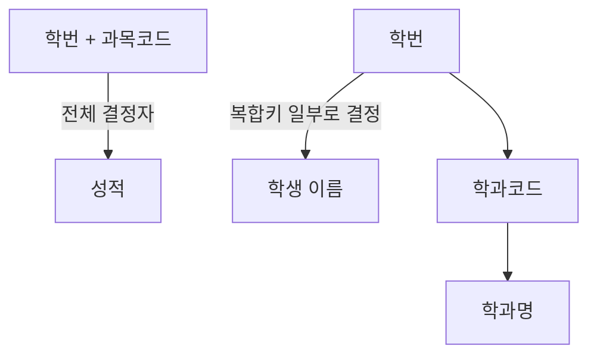
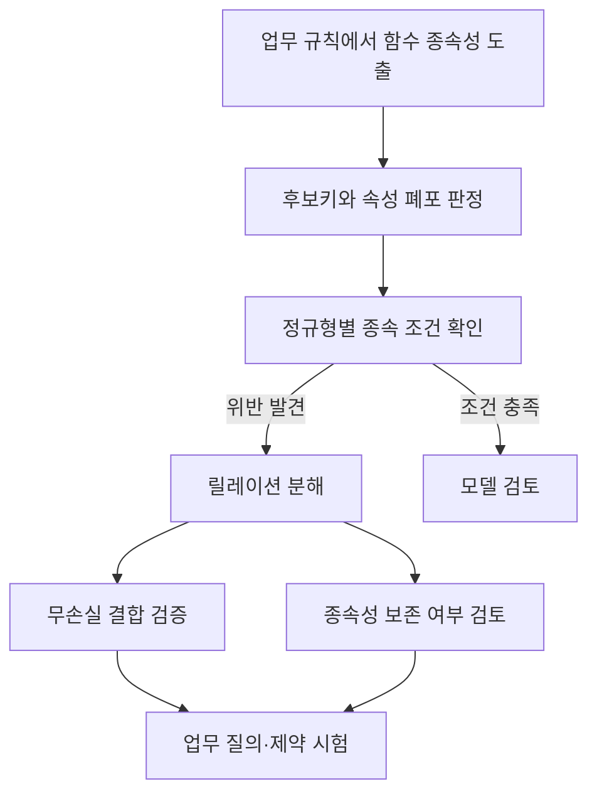

---
sidebar:
  order: 159
  label: "159. 함수적 종속성(Functional Dependency)"
  badge:
    text: "기초"
    variant: note
title: "함수적 종속성 (Functional Dependency, FD)"
author: "Antigravity"
date: "2026-09-24T20:16:00+09:00"
tags:
  - "notes-data"
weight: 159
extra:
  model: "GPT-6"
  keyword_grade: "기초"
  question_no: "159"
---

## 지식 로드맵 내 현재 위치

데이터베이스 → 관계형 데이터 모델 → 정규화 이론 → 함수적 종속성

## 30초 인출

| 회상 축 | 관계 |
|:---|:---|
| **완전 종속** | 복합키 전체가 종속자를 결정 |
| **부분 종속** | 복합키의 일부가 종속자를 결정; 2NF 검토 대상 |
| **이행 종속** | $X\rightarrow Y$, $Y\rightarrow Z$ 관계; 3NF 검토 대상 |

- 본질: **함수적 종속성 (Functional Dependency, FD)** 은 한 속성 집합의 값이 다른 속성 집합의 값을 결정한다는 관계형 데이터의 제약
- 메커니즘: 결정자 $X$가 종속자 $Y$를 결정하면 $X \rightarrow Y$로 표기하며, 업무 규칙을 후보키·정규화 검토에 활용

핵심 용어

- **함수적 종속성 (Functional Dependency, FD)**: 릴레이션의 합법적 상태에서 $X$ 값이 $Y$ 값을 결정하는 속성 간 제약
- **결정자 (Determinant)**: 종속 속성의 값을 결정하는 속성 집합 $X$
- **종속자 (Dependent)**: 결정자 $X$에 의해 값이 정해지는 속성 집합 $Y$
- **속성 폐포 (Attribute Closure, $X^+$)**: 함수 종속성 집합에 따라 $X$가 결정하는 모든 속성의 집합
- **암스트롱 공리 (Armstrong's Axioms)**: 함수적 종속성을 추론하는 건전하고 완전한 기본 규칙 집합
- **제2정규형 (Second Normal Form, 2NF)**: 후보키 일부에 종속하는 비주요 속성이 없는 정규형
- **제3정규형 (Third Normal Form, 3NF)**: 모든 비자명 함수 종속성에서 결정자가 슈퍼키이거나 종속 속성이 주요 속성인 정규형
- **보이스-코드 정규형 (Boyce–Codd Normal Form, BCNF)**: 모든 비자명 함수 종속성의 결정자가 슈퍼키인 정규형

---

## 1교시 예상문제 (10점)

> 함수적 종속성에 관하여 설명하시오. (예상)

---

## 1교시 10점 답안

## Ⅰ. 함수적 종속성의 개요

| 구분 | 핵심 |
|---|---|
| 정의 | **함수적 종속성 (Functional Dependency, FD)** 은 릴레이션의 합법적 상태에서 속성 집합 $X$의 값이 $Y$의 값을 결정하는 제약 $X \rightarrow Y$ |
| 목적 | 속성 간 업무 규칙을 나타내 후보키 판정과 정규화 검토의 근거 제공 |

## Ⅱ. 종속 유형과 정규화 기준

| 종속 유형 | 핵심 구분 |
|---|---|
| **완전 함수 종속** | 복합 결정자의 진부분집합으로는 종속자가 결정되지 않는 관계 |
| **부분 함수 종속** | 복합 결정자의 일부 속성으로 종속자가 결정되는 관계, 2NF 검토 대상 |
| **이행적 함수 종속** | $X \rightarrow Y$와 $Y \rightarrow Z$가 성립하는 관계; 비키 결정자와 비주요 종속자일 때 3NF 검토 대상 |

## Ⅲ. 암스트롱의 기본 공리

| 공리 | 추론 규칙 |
|---|---|
| 반사 (Reflexivity) | $Y \subseteq X$이면 $X \rightarrow Y$ |
| 첨가 (Augmentation) | $X \rightarrow Y$이면 $XZ \rightarrow YZ$ |
| 이행 (Transitivity) | $X \rightarrow Y$이고 $Y \rightarrow Z$이면 $X \rightarrow Z$ |

- 제언: 업무 규칙에서 결정자와 종속자를 확인해 논리 모델에 기록
## 2~4교시 예상문제 (25점)

> 함수적 종속성에 관하여 설명하시오. (예상·25점)

---

## 2~4교시 25점 답안

## Ⅰ. 함수적 종속성의 개요

| 구분 | 핵심 |
|---|---|
| 정의 | **함수적 종속성 (Functional Dependency, FD)** 은 릴레이션의 합법적 상태에서 속성 집합 $X$의 값이 $Y$의 값을 결정하는 제약 $X \rightarrow Y$ |
| 목적 | 속성 간 업무 규칙을 나타내 후보키 판정과 정규화 검토의 근거 제공 |

## Ⅱ. 완전·부분·이행적 종속

| 유형 | 예시·판정 | 정규화와의 관계 |
|---|---|---|
| 완전 함수 종속 | `(학번, 과목코드) → 성적`; 어느 한 속성만으로는 성적 결정 불가 | 복합 후보키 전체에 종속하는 비주요 속성은 2NF 조건에 부합 |
| 부분 함수 종속 | `학번 → 학생 이름`; 복합 후보키의 일부가 속성을 결정 | 비주요 속성의 부분 종속은 2NF 위반 요인 |
| 이행적 함수 종속 | `학번 → 학과코드`, `학과코드 → 학과명` | 3NF는 각 비자명 종속의 결정자와 종속 속성의 키 조건으로 판정 |

## Ⅲ. 암스트롱의 공리 (Armstrong's Axioms)

| 규칙 | 의미 |
|---|---|
| 반사 (Reflexivity) | $Y\subseteq X$이면 $X\rightarrow Y$ |
| 첨가 (Augmentation) | $X\rightarrow Y$이면 $XZ\rightarrow YZ$ |
| 이행 (Transitivity) | $X\rightarrow Y$, $Y\rightarrow Z$이면 $X\rightarrow Z$ |

이 세 규칙은 건전하고 완전하며, 분해·결합·의사이행 규칙은 이들로부터 유도 가능.

| 추론 개념 | 데이터 모델링 활용 |
|---|---|
| 속성 폐포 $X^+$ | 함수 종속 집합 $F$로부터 $X$가 결정하는 속성 집합 계산 |
| 슈퍼키 판정 | $X^+$가 릴레이션의 전체 속성을 포함하면 $X$는 슈퍼키 |
| 후보키 판정 | 슈퍼키에서 불필요한 속성을 더 제거할 수 없는지 확인 |

## Ⅳ. 함수 종속성 분석과 정규화 절차

정규화는 종속성과 키 조건을 확인하는 설계 과정. 제2정규형 (Second Normal Form, 2NF)은 후보키 일부에 종속하는 비주요 속성이 없어야 하며, 제3정규형 (Third Normal Form, 3NF)은 모든 비자명 종속성에서 결정자가 슈퍼키이거나 종속 속성이 주요 속성이어야 함. 보이스-코드 정규형 (Boyce–Codd Normal Form, BCNF)은 모든 비자명 종속성의 결정자가 슈퍼키여야 함. 분해 결과의 무손실 결합과 종속성 보존은 별도로 검토.

## Ⅴ. 함수적 종속성과 갱신 이상

| 종속 관계 예 | 한 테이블에 함께 저장할 때의 위험 | 설계 검토 |
|---|---|---|
| `(학번, 과목코드) → 성적`, `학번 → 학생 이름` | 학생 이름 반복 저장에 따른 갱신 이상 | 학생 속성을 학생 릴레이션으로 분리 검토 |
| `학번 → 학과코드`, `학과코드 → 학과명` | 학과명 반복 저장과 변경 시 불일치 가능성 | 학과 속성 분리와 참조 관계 검토 |
| BCNF 분해 중 결정자 종속 분리 | 분해 후 원래 제약을 조인 없이 확인하기 어려울 수 있음 | 무손실 결합과 종속성 보존을 각각 검증 |

## Ⅵ. 기술사적 제언

| 한계 | 해결 방안 |
|---|---|
| 현재 인스턴스에서 우연히 관측된 값의 일치를 업무 규칙으로 오인할 수 있음 | 업무 담당자와 속성의 의미·유효 범위를 확인해 함수 종속성을 명시 |
| BCNF 분해 뒤 모든 종속성이 개별 릴레이션에서 보존된다고 볼 수 없음 | 제약별 종속성 보존 여부를 검토하고, 필요한 검증을 모델·업무 규칙에 반영 |

---

## 출제 이력과 검증 출처

- [PostgreSQL 플래너 통계의 함수 종속성 설명](https://www.postgresql.org/docs/current/planner-stats.html): X 값이 Y 값을 결정한다는 함수 종속성의 정의와 추정 활용

- **기출 이력**:
  - 제84회 정보관리 1교시: 관계 데이터 모델에서 함수적 종속성(FD)의 개념, 유형(완전, 부분, 이행) 및 암스트롱의 공리
  - 제114회 컴퓨터시스템응용 1교시: 함수적 종속성과 제2정규형, 제3정규형의 관계
- **검증 출처**:
  - W.W. Armstrong, "Dependency Structures of Data Base Relationships", IFIP Congress, 1974
  - Abraham Silberschatz et al., "Database System Concepts 7th Edition", Chapter 14 Relational Database Design
  - C.J. Date, "An Introduction to Database Systems 8th Edition", Functional Dependencies
---

## 연결 토픽

- 상위 토픽: [03-024 정규화 종합](./024_normalization_overview.md)
- 선수 토픽: [03-157 키(Key)](./157_key.md)
- 후속 토픽: [03-028 제2정규형(2NF)](./028_2nf.md), [03-029 제3정규형(3NF)](./029_3nf.md), [03-153 BCNF](./153_bcnf.md)
