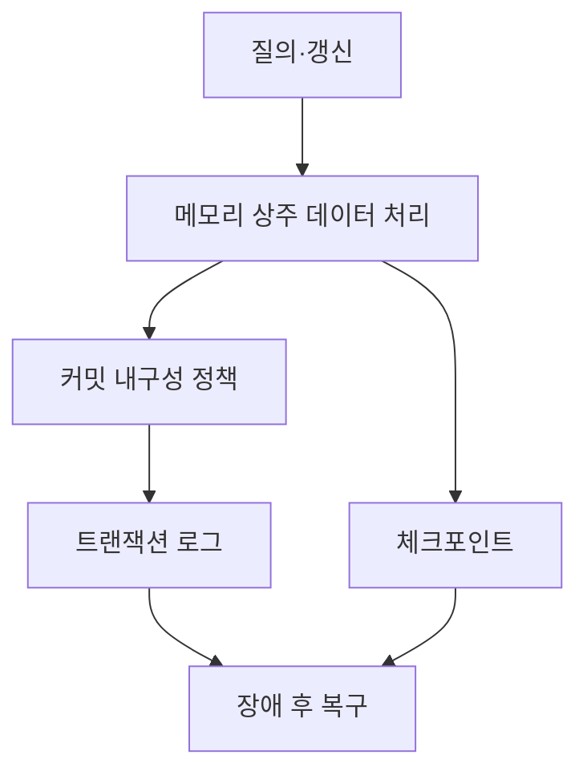
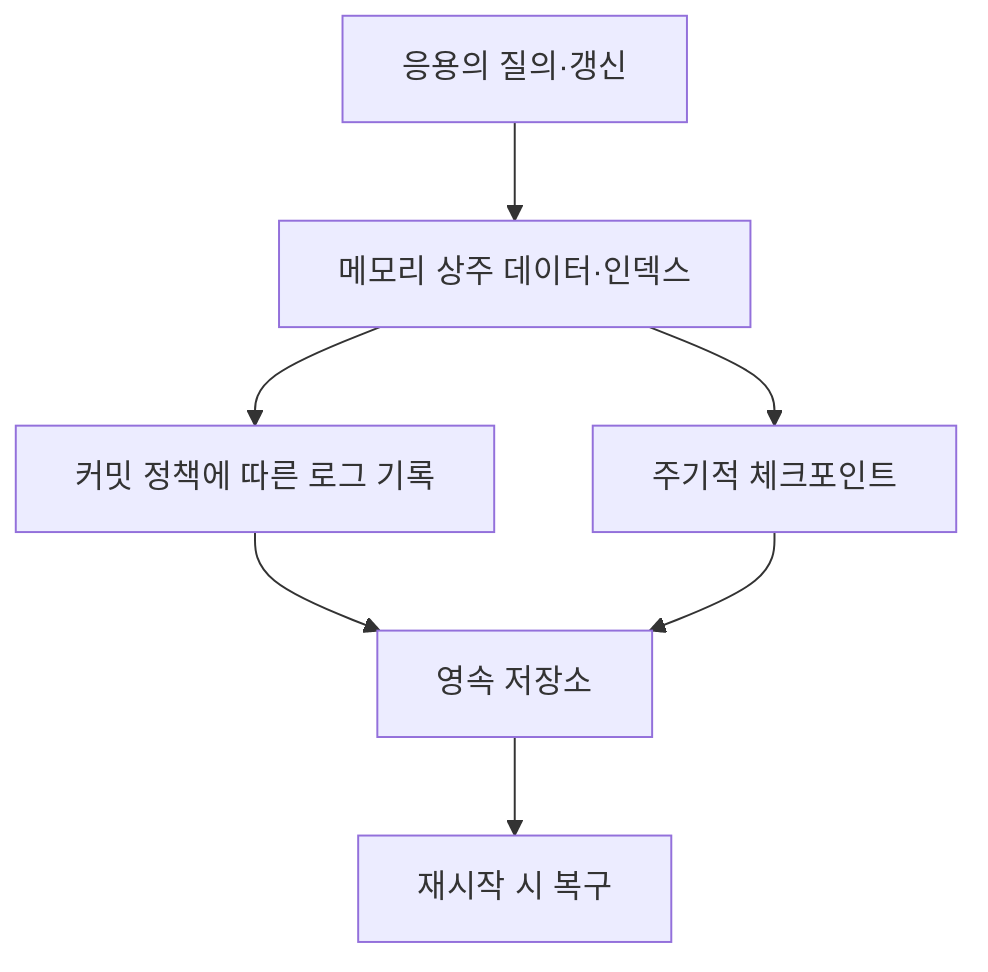
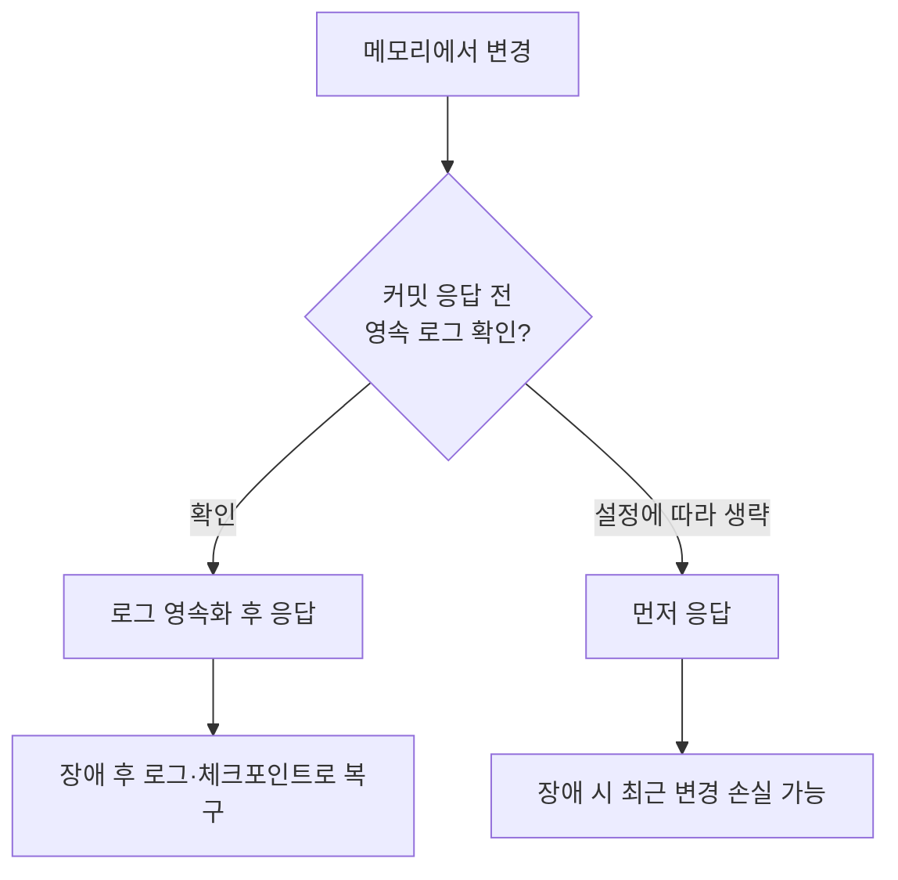

---
sidebar:
  order: 160
  label: "160. 메인 메모리 DBMS"
  badge:
    text: "기초"
    variant: note
title: "메인 메모리 DBMS(MMDBMS)"
author: "Codex"
date: "2026-09-24T00:00:00+09:00"
tags:
  - "notes-data"
weight: 160
extra:
  model: "GPT-6"
  keyword_grade: "기초"
  question_no: "160"
---

## 지식 로드맵 내 현재 위치

지식 위치: 자료처리·데이터 → DBMS 저장·처리 구조 → **메인 메모리 DBMS**

## 30초 인출

- 본질: **메인 메모리 DBMS(MMDBMS)**는 주 데이터를 메모리에 상주시켜 질의·갱신하고, 장애 복구를 위해 영속 저장 경로를 함께 두는 DBMS
- 메커니즘: 메모리에서 데이터 처리 → 커밋 내구성 정책에 따라 로그 기록 → 체크포인트·로그로 재시작 시 복구

핵심 용어

- **MMDBMS(Main Memory Database Management System, 메인 메모리 DBMS)** : 주 데이터를 메모리에 두고 처리하는 데이터베이스 관리 시스템
- **DBMS(Database Management System)** : 데이터를 저장·질의·갱신하고 동시성·복구 등을 관리하는 시스템
- **체크포인트(Checkpoint)** : 복구 시간을 줄이기 위해 데이터 상태를 영속 저장소에 반영하는 작업 또는 그 시점
- **트랜잭션 로그(Transaction Log)** : 변경 이력을 기록해 장애 후 재실행·복구에 사용하는 로그
- **내구성(Durability)** : 커밋한 결과가 약속한 장애 범위에서 유지되는 성질
- **RPO(Recovery Point Objective, 복구시점목표)** : 장애 후 허용 가능한 데이터 손실 시점을 나타내는 목표

---

## 1교시 예상문제 (10점)

> 메인 메모리 DBMS에 관하여 설명하시오. (예상·10점)

---

## 1교시 10점 답안

### Ⅰ. 메인 메모리 DBMS의 개요

| 구분 | 핵심 |
|---|---|
| 정의 | **메인 메모리 DBMS(MMDBMS)**는 주 데이터를 메모리에 상주시켜 질의·갱신하는 DBMS |
| 목적 | 저장장치 접근을 줄여 응답 지연을 낮추고 요구한 복구 수준 확보 |

### Ⅱ. 처리와 복구 구조

- **10점 제언**: 응답 지연뿐 아니라 커밋 후 장애 시 허용 손실과 복구 시간을 함께 시험.

---

## 2~4교시 예상문제 (25점)

> 메인 메모리 DBMS의 처리 구조와 복구 방법을 설명하고, 디스크 중심 DBMS와의 차이 및 적용 시 한계·대응을 제시하시오. (예상·25점)

---

## 2~4교시 25점 답안

## Ⅰ. 메인 메모리 DBMS의 개요

| 구분 | 핵심 |
|---|---|
| 정의 | **메인 메모리 DBMS(MMDBMS)**는 주 데이터를 메모리에 상주시켜 질의·갱신하는 DBMS |
| 목적 | 저장장치 접근을 줄여 응답 지연을 낮추고 요구한 복구 수준 확보 |

## Ⅱ. 데이터 처리와 영속 저장 구조

메모리 상주로 읽기 경로의 저장장치 접근을 줄여도, 로그·체크포인트·복제 정책에 따라 쓰기 지연과 장애 후 보장 범위가 달라짐.

## Ⅲ. 디스크 중심 DBMS와의 비교

| 비교 축 | 디스크 중심 DBMS | 메인 메모리 DBMS |
|---|---|---|
| 주 데이터 위치 | 영속 저장소, 메모리는 캐시·버퍼 | 주 데이터가 메모리에 상주 |
| 접근 비용 | 캐시 적중 여부와 저장장치 I/O의 영향 | 메모리 처리 비중이 큼 |
| 용량·비용 | 저장장치 용량 중심 | 메모리 용량·비용의 제약 |
| 장애 복구 | 로그·데이터 파일을 이용 | 로그·체크포인트 등 설정된 영속 경로 이용 |

두 구조 모두 제품과 설정에 따라 메모리·디스크를 함께 활용할 수 있음. 특정 인덱스나 SQL 기능을 모든 MMDBMS의 필수 속성으로 단정하지 않음.

## Ⅳ. 커밋 내구성과 장애 복구

| 확인 항목 | 적용 판단 |
|---|---|
| 로그 영속화 시점 | 커밋 응답과 실제 영속 저장의 선후 관계 |
| 체크포인트 주기 | 재시작 시 재실행할 로그 범위와 복구 시간 |
| 복제 방식 | 복제 확인 시점·장애 범위에 따른 데이터 손실 가능성 |

## Ⅴ. 적용 한계와 대응

| 한계 | 대응 |
|---|---|
| 메모리 용량·비용 제약 | 상주할 데이터와 인덱스 규모를 측정해 배치 결정 |
| 비내구성 설정에서 최근 커밋 손실 가능 | 업무 RPO에 맞춰 로그 영속화·복제 응답 조건 선택 |
| 장애 후 복구 시간이 예상보다 길어질 수 있음 | 체크포인트·로그 재실행을 포함한 복구 시험 |

## Ⅵ. 기술사적 제언

| 우선 제언 | 실행·검증 |
|---|---|
| 성능과 내구성을 함께 설계 | 정상 부하의 응답 지연과 커밋 후 장애의 손실 범위를 같은 시험에서 측정 |
| 메모리 상주 범위를 업무에 맞게 선택 | 데이터 증가량·비용·재시작 시간을 비교해 상주 범위와 체크포인트 정책 조정 |

---

## 검증 출처

- [Oracle TimesTen: Durability Options](https://docs.oracle.com/en/database/other-databases/timesten/22.1/operations/durability-options.html)
- [SAP HANA: Data and Log Volumes](https://help.sap.com/docs/SAP_HANA_PLATFORM/6b94445c94ae495c83a19646e7c3fd56/4a9a3970fb634a319f32bb76e1c59dd5.html)

## 연결 토픽

- 연관 토픽: [데이터베이스](./128_database.md), [트랜잭션](./078_transaction.md)
