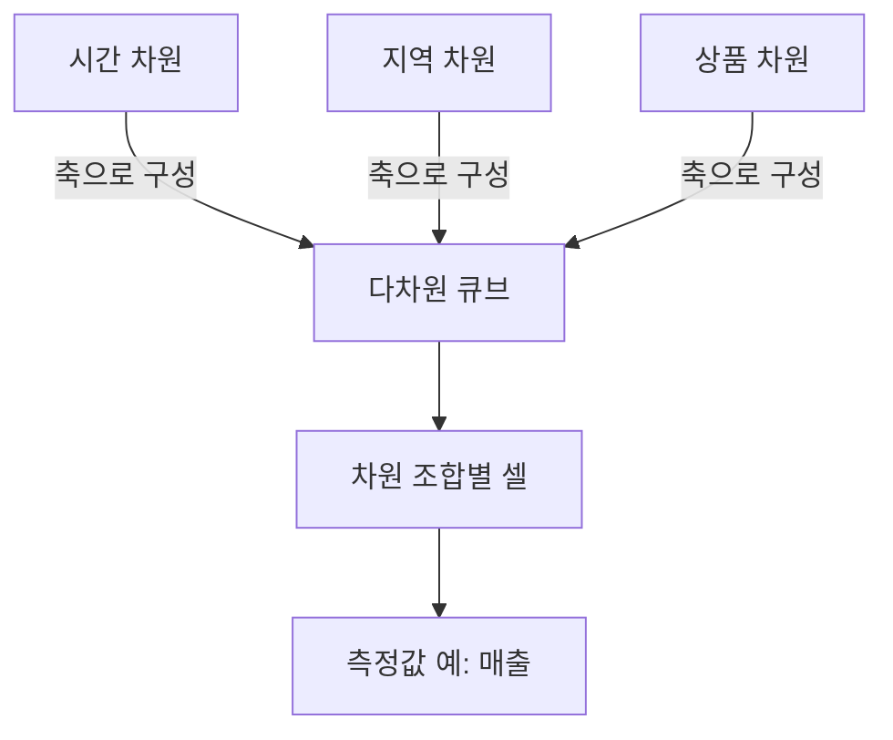

---
sidebar:
  order: 161
  label: "161. MOLAP(Multidimensional OLAP)"
  badge:
    text: "기초"
    variant: note
title: "MOLAP (Multidimensional OLAP)"
author: "Gemini 3.8 Flash"
date: "2026-09-24T00:00:00+09:00"
tags:
  - "notes-data"
weight: 161
extra:
  model: "GPT-6"
  keyword_grade: "기초"
  question_no: "161"
---

핵심 용어

- **MOLAP (Multidimensional Online Analytical Processing, 다차원 온라인 분석 처리)** : 분석 데이터를 다차원 큐브에 저장·집계해 분석 질의에 응답하는 OLAP 방식
- **OLAP (Online Analytical Processing, 온라인 분석 처리)** : 다차원 관점에서 데이터를 집계·조회해 분석하는 처리 방식
- **차원(Dimension)** : 측정값을 분류하고 분석하는 축(예: 시간·지역·상품)
- **측정값(Measure)** : 차원 조합에 따라 집계하거나 비교하는 수치 데이터
- **ROLAP (Relational OLAP, 관계형 온라인 분석 처리)** : 관계형 데이터베이스를 중심으로 분석 질의를 처리하는 OLAP 방식
- **HOLAP (Hybrid OLAP, 하이브리드 온라인 분석 처리)** : 다차원 저장과 관계형 저장·질의를 조합하는 OLAP 방식

---

## 1교시 예상문제 (10점)

> MOLAP (Multidimensional OLAP)의 정의와 목적, 핵심 메커니즘을 설명하시오. (예상)

---

## 1교시 10점 답안

### Ⅰ. 정의와 목적

| 구분 | 핵심 |
|---|---|
| **정의** | MOLAP은 분석 데이터를 다차원 큐브 구조로 저장·집계해 다차원 질의에 응답하는 OLAP 방식 |
| **목적** | 사전 집계한 값과 차원 구조를 활용해 반복적인 분석 질의의 응답을 빠르게 지원 |

### Ⅱ. 큐브의 구조와 분석 관점

| 요소 | 역할 |
|---|---|
| **차원** | 분석 축(예: 시간·지역·상품) |
| **측정값** | 차원의 교차점에서 분석할 수치(예: 매출) |
| **집계** | 질의 전에 일부 조합의 결과를 계산해 저장 |

### Ⅲ. 10점 제언

- 차원·집계 수준을 실제 질의 패턴과 데이터 크기에 맞춰 설계하고, 갱신 비용과 조회 성능을 함께 측정.
---

## 2~4교시 예상문제 (25점)

> MOLAP (Multidimensional OLAP)의 개념과 목적을 설명하고, 핵심 메커니즘과 구성요소·절차, 적용 시 문제점과 대응 방안을 제시하시오. (25점, 예상)

---

## 2~4교시 25점 답안

## Ⅰ. 정의와 목적

| 구분 | 핵심 |
|---|---|
| **정의** | MOLAP은 분석 데이터를 다차원 큐브 구조로 저장·집계해 다차원 질의에 응답하는 OLAP 방식 |
| **목적** | 사전 집계한 값과 차원 구조를 활용해 반복적인 분석 질의의 응답을 빠르게 지원 |

MOLAP은 반복 질의에 필요한 집계값을 큐브에 미리 계산해 두며, 차원과 계층이 늘수록 저장·갱신할 집계 조합이 커질 수 있음.

## Ⅱ. 큐브 구조와 분석 연산

| 연산 | 관점 변화 |
|---|---|
| **Roll-up** | 더 높은 수준으로 집계 |
| **Drill-down** | 더 상세한 수준으로 분해 |
| **Slice / Dice** | 한 개 또는 여러 차원 조건으로 부분 큐브 선택 |
| **Pivot** | 분석 축의 행·열 배치를 바꿈 |

### 큐브 폭발과 희소성
- 큐브 폭발(Cube Explosion): 차원별 값·계층과 사전 집계 수준이 늘어날수록 가능한 집계 조합과 저장·갱신 비용이 급증하는 현상. 모든 조합을 실제로 계산하거나 저장하는 것은 아님
- 희소성(Sparsity): 가능한 차원 값 조합 중 실제 관측값이 없는 셀이 존재하는 특성. 빈 셀의 비율은 데이터와 차원 구성에 따라 다름

## Ⅲ. MOLAP·ROLAP·HOLAP 비교

| 구분 | 저장·계산 방식 | 고려 사항 |
|---|---|---|
| **MOLAP** | 다차원 구조에 집계 값을 미리 구성 | 반복 분석에 유리할 수 있으나 저장·갱신 규모 고려 |
| **ROLAP** | 관계형 스키마에서 질의 시 집계 | 데이터 변경·확장에 유연할 수 있으나 질의 부하 평가 필요 |
| **HOLAP** | 집계 수준에 따라 MOLAP과 ROLAP을 조합 | 혼합 구조의 일관성·운영 복잡성 검토 |

## Ⅳ. 차원 확장 시 설계 고려

| 한계 | 대응 |
|---|---|
| 차원·계층 수와 집계 범위가 늘면 큐브의 저장량과 갱신 비용이 증가 | 자주 쓰는 집계를 우선 산정하고, 희소 데이터 처리·부분 집계·ROLAP 연계를 요구사항과 제품 기능에 맞춰 평가 |

## Ⅴ. 기술사적 제언

| 한계 | 해결 방안 |
|---|---|
| 사전 집계 범위가 커지면 큐브 저장량·갱신 부담이 늘고, 줄이면 일부 질의 계산량이 커질 수 있음 | 실제 질의 패턴과 갱신 주기로 집계 범위를 정하고 큐브 크기·갱신 시간·응답을 함께 측정 |
---

## 출제 이력과 검증 출처

- [IBM OLAP 개요](https://www.ibm.com/think/topics/olap): 다차원 큐브 기반 MOLAP과 관계형 테이블 기반 ROLAP의 구분

- **기출 이력**: 기존 원문에 제114회 OLAP 유형 비교 문항이 기재되어 있으나, 공식 문항 원문과 배점은 별도 확인 필요
- **검증 범위**: MOLAP의 다차원 큐브·사전 집계 및 OLAP 기본 연산에 한정. 제품별 저장 방식·성능은 구현과 설정에 따라 달라짐
