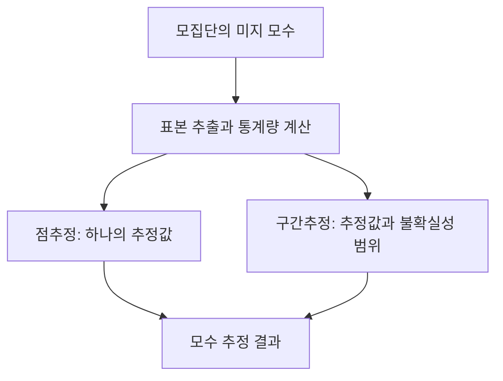

---
sidebar:
  order: 163
  label: "163. 점추정 vs 구간추정"
  badge:
    text: "서브"
    variant: note
title: "점추정(Point Estimation)과 구간추정(Interval Estimation)의 비교 및 신뢰구간 평가"
author: "OpenAI Codex"
date: "2026-09-24T00:00:00+09:00"
tags:
  - "notes-data"
weight: 163
extra:
  model: "GPT-6"
  keyword_grade: "서브"
  question_no: "163"
---

## 지식 로드맵 내 현재 위치

데이터베이스통계 분석·추론통계<strong>점추정 vs 구간추정</strong>

## 큰 그림과 30초 인출

- 본질: **점추정**은 표본으로 모수의 추정값 하나를 제시하고, **구간추정**은 신뢰수준에 맞춰 구성한 구간으로 추정 불확실성을 표현
- 암기: `불-효-일-충` (좋은 점추정량 4대 조건: 불편성, 효율성, 일치성, 충분성) / `점-단-구-범` (점추정은 단일값, 구간추정은 범위와 신뢰수준)
- 판단축:
  - **점추정**: 간결한 단일 대표값을 제공하나 그 값만으로 추정의 표본 변동성을 알기 어려움
  - **구간추정**: 신뢰수준과 오차한계로 불확실성을 표현하며, 신뢰수준을 높이면 다른 조건이 같을 때 구간이 넓어짐
- 주의: 빈도주의 95% 신뢰구간의 95%는 이미 계산된 한 구간에 대한 사후 확률이 아니라, 같은 절차를 반복할 때 생성된 구간이 참 모수를 포함하는 장기 비율을 뜻함
---

핵심 용어

- **점추정(Point Estimation)** : 표본 통계량으로 모집단 모수의 단일 추정값을 제시하는 방법
- **구간추정(Interval Estimation)** : 추정값과 신뢰수준에 따른 구간으로 모수 추정의 불확실성을 표현하는 방법
- **모수(Parameter)** : 모집단의 평균·분산·비율처럼 모집단 특성을 나타내는 값
- **통계량(Statistic)** : 표본 자료로 계산해 모수 추론에 사용하는 값
- **신뢰구간(Confidence Interval)** : 정해진 절차를 반복 적용했을 때 설정한 비율로 모수를 포함하는 구간을 만드는 추정 결과
- **오차한계(Margin of Error, ME)** : 추정값에서 신뢰구간 끝점까지의 거리

---

## 1교시 예상문제 (10점)

> 점추정과 구간추정의 정의와 목적, 신뢰구간의 해석 원리를 설명하시오. (예상)

---

## 1교시 10점 답안

### Ⅰ. 추정의 목적

| 구분 | 핵심 |
|---|---|
| **정의** | 점추정은 표본 통계량의 한 값으로, 구간추정은 구간과 신뢰수준으로 모집단 모수를 추정하는 방법 |
| **목적** | 점추정은 모수의 대표값 제시, 구간추정은 표본 변동성을 반영한 추정 불확실성 표현 |

### Ⅱ. 두 추정 방식의 차이

| 방식 | 산출물 | 해석 |
|---|---|---|
| **점추정** | 하나의 추정값 $\hat{\theta}$ | 간결하지만 추정값만으로 표본 변동성을 알 수 없음 |
| **구간추정** | 구간 $[L,U]$와 신뢰수준 $1-\alpha$ | 반복 표집에서 절차가 모수를 포함하는 구간을 만드는 비율을 나타냄 |

- **제언**: 보고와 의사결정에는 점추정치와 함께 불확실성을 보여 주는 구간 추정치를 제시.
---

### 핵심 관계

| 비교 항목 | 점추정 (Point Estimation) | 구간추정 (Interval Estimation) |
|:---|:---|:---|
| **결과 제시 형태** | 단 하나의 확정적 수치 ($\hat{\theta} = c$) | 하한과 상한으로 정의된 범위 ($[L, U]$) |
| **신뢰도/오차 표현** | 점추정만으로 표본오차를 직접 표현하지 못함 | 신뢰수준($1-\alpha$)과 오차한계를 함께 제시 가능 |
| **대표 추정 방법** | 최대우도추정법(MLE), 적률법(MOM), 최소자승법(OLS) | 정규분포(Z분포) 신뢰구간, Student's t분포 신뢰구간 |
| **의사결정 장점** | 수치가 명확하여 보고 및 즉각 의사결정에 유리 | 추정의 위험과 불확실성을 정량화하여 안전한 판단 지원 |
| **수학적 한계** | 추정량의 표본 변동성을 점 하나만으로 드러내지 못함 | 신뢰수준·표본 크기·구간 폭 사이의 선택 필요 |
| **실무 적용 분야** | 딥러닝 파라미터 최적화, KPI 단일 지표 산출 | 대선 여론조사 오차범위, 신약 유효성 임상 시험, SLA 평가 |

---

## 2~4교시 예상문제 (25점)

> 추론 통계(Inferential Statistics)에서 모집단의 모수를 추정하는 점추정(Point Estimation)과 구간추정(Interval Estimation)의 개념 및 차이점을 비교하고, 좋은 점추정량이 갖추어야 할 4대 조건과 신뢰수준(Confidence Level) 및 표본 크기($n$) 결정 원리를 설명하시오. (25점)

> (25점, 예상)

---

## 2~4교시 25점 답안

## Ⅰ. 모집단의 미지 모수를 밝히는 통계적 추정 개요

| 구분 | 핵심 |
|---|---|
| **정의** | 점추정은 표본 통계량의 한 값으로, 구간추정은 구간과 신뢰수준으로 모집단 모수를 추정하는 방법 |
| **목적** | 점추정은 모수의 대표값 제시, 구간추정은 표본 변동성을 반영한 추정 불확실성 표현 |

- **배경**: 빅데이터 환경에서도 전체 고객, 전수 센서 로그, 전 국민을 실시간 전수조사하는 것은 비용과 시간상 불가능하므로, 대표 표본을 통해 모수를 추정해야 함
- **정의**: 표본 통계량(Statistic)을 수학적 함수로 변환하여 알 수 없는 모집단의 특성치(모평균 $\mu$, 모분산 $\sigma^2$, 모비율 $p$ 등)를 예측하는 과정
- **추정의 2대 갈래**:
  1. **점추정 (Point Estimation)**: 모수에 대응하는 단 하나의 최적 수치($\hat{\theta}$)를 계산
  2. **구간추정 (Interval Estimation)**: 모수가 존재할 것으로 기대되는 하한값과 상한값의 구간($[L, U]$)을 신뢰수준과 함께 계산

## Ⅱ. 점추정과 구간추정의 5대 핵심 특성 비교

#### 한줄 요약: 직관성과 명확성을 제공하는 점추정과 불확실성과 안전성을 담보하는 구간추정의 대조

| 비교 항목 | 점추정 (Point Estimation) | 구간추정 (Interval Estimation) |
|:---|:---|:---|
| **결과 제시 형태** | 단 하나의 확정적 수치 ($\hat{\theta} = c$) | 하한과 상한으로 정의된 범위 ($[L, U]$) |
| **불확실성 표현** | 표본오차를 단일값만으로 나타내기 어려움 | 모형과 표본 조건에 따른 신뢰수준($1-\alpha$)과 오차한계(ME) 제시 |
| **대표 추정 방법** | 최대우도추정법(MLE), 적률법(MOM), 최소자승법(OLS) | 정규분포(Z분포) 신뢰구간, Student's t분포 신뢰구간 |
| **의사결정 장점** | 수치가 명확하여 보고 및 즉각 의사결정에 유리 | 추정의 위험과 불확실성을 정량화하여 안전한 판단 지원 |
| **수학적 한계** | 추정값 하나만으로 표본 변동성·추정 오차를 나타내기 어려움 | 같은 자료·방법에서 신뢰수준을 높이면 구간이 넓어져 정밀도가 낮아짐 |
| **실무 적용 분야** | 딥러닝 파라미터 최적화, KPI 단일 지표 산출 | 대선 여론조사 오차범위, 신약 유효성 임상 시험, SLA 평가 |

## Ⅲ. 좋은 점추정량이 갖추어야 할 4대 수학적 성질

#### 한줄 요약: 점추정량은 불편성·효율성·일치성·충분성 등의 성질로 평가 가능

| 성질 | 핵심 판정 |
|:---|:---|
| **불편성** | $E(\hat{\theta})=\theta$ |
| **효율성** | 비교 대상 추정량 중 분산이 작음 |
| **일치성** | 표본 크기 증가 시 추정량이 모수에 확률수렴 |
| **충분성** | 통계량이 모수에 관한 표본 정보를 요약 |

1. **불편성 (Unbiasedness)**: 추정량의 편향(Bias)이 $0$인 성질. 표본평균은 $E(\bar{X}) = \mu$이므로 모평균의 불편추정량이나, 표본분산은 자유도 $n-1$로 나누어야만 모분산 $\sigma^2$의 불편추정량이 됨
2. **효율성 (Efficiency)**: 같은 조건의 추정량을 분산 등으로 비교하는 성질. 최소분산 불편추정량(MVUE)이 크라머-라오 하한을 반드시 달성하는 것은 아님
3. **일치성 (Consistency)**: 표본 크기 $n$이 커질수록 추정량이 실제 모수에 확률수렴하는 성질
4. **충분성 (Sufficiency)**: 표본 통계량 외에 원천 표본 데이터를 추가로 알아도 모수에 대한 추가 정보를 전혀 주지 못할 정도로 통계량이 완전한 정보를 내포함

## Ⅳ. 구간추정의 메커니즘과 신뢰구간 산출

#### 한줄 요약: 표본평균을 중심으로 오차한계(Margin of Error)를 좌우로 가감하여 신뢰구간 도출

| 구간 요소 | 의미 |
|:---|:---|
| 중심 추정치 | 표본평균 $\bar{X}$ |
| 오차한계 | 임계값 × 표준오차 |
| 구간 | $[\bar{X}-ME,\;\bar{X}+ME]$ |
| 반복 표집 해석 | 같은 절차를 반복할 때 신뢰수준만큼의 구간이 고정 모수를 포함 |

### 1. 모분산을 알고 있는 경우
- 정규 모집단 표본평균의 표준화에 표준정규분포를 적용:
  $$CI = \left[ \bar{X} - Z_{\alpha/2} \frac{\sigma}{\sqrt{n}}, \quad \bar{X} + Z_{\alpha/2} \frac{\sigma}{\sqrt{n}} \right]$$
  *(95% 신뢰수준인 경우 $Z_{0.025} = 1.96$)*

### 2. 모분산을 모르고 정규 모집단 표본을 사용하는 경우
- 자유도 $df = n-1$인 Student's t분포 적용:
  $$CI = \left[ \bar{X} - t_{\alpha/2, n-1} \frac{s}{\sqrt{n}}, \quad \bar{X} + t_{\alpha/2, n-1} \frac{s}{\sqrt{n}} \right]$$

## Ⅴ. 신뢰수준($1-\alpha$), 오차한계(ME), 표본 크기($n$)의 상충 관계

#### 한줄 요약: 신뢰도를 높이면서도 구간을 좁히는 유일한 공학적 해법은 표본 크기($n$)의 확대

| 조건 변화 | 오차한계에 미치는 영향 |
|:---|:---|
| 신뢰수준 증가 | 임계값 증가로 구간 폭 증가 |
| 표준편차 증가 | 표준오차와 구간 폭 증가 |
| 표본 크기 증가 | 표준오차와 구간 폭 감소 |

- **표본 크기 결정 산식**:
  원하는 최대 허용 오차한계 $E$를 만족하기 위한 최소 표본 크기 $n$:
  $$n = \left( \frac{Z_{\alpha/2} \cdot \sigma}{E} \right)^2$$
- 오차한계를 절반으로 줄이려면 표본 크기는 4배로 늘려야 함

## Ⅵ. 실무 통계 분석 시 빈출 오류와 트러블슈팅

#### 한줄 요약: 신뢰구간의 빈도주의 오해석과 표본분산 자유도 $n-1$ 누락 방지

| 빈출 오류 | 발생 원인 및 오개념 | 올바른 통계적 해석 및 조치 |
|:---|:---|:---|
| **신뢰구간에 대한 확률 오해** | "계산된 구간 [10, 20] 안에 모수가 존재할 확률이 95%이다"라고 잘못 단정 | 모수는 고정된 상수이고 구간이 확률변수임. 같은 절차의 반복에서 장기적으로 약 95%의 구간이 모수를 포함 |
| **표본분산 편향 오류** | 표본평균을 사용하면서 $n$으로 나누면 통상적인 독립동분포 조건에서 모분산을 편향되게 추정 | 그 조건에서 불편분산이 필요하면 $n-1$로 나눔. 목적에 따라 다른 추정량도 가능 |
| **단일 점추정치 맹신** | 집단별 전환율 점추정치만 보고 차이가 확정됐다고 판단 | 차이 자체의 신뢰구간이나 적절한 가설검정으로 불확실성을 평가 |

## Ⅶ. 기술사적 제언: 추정 불확실성의 전달

#### 한줄 요약: 예측값의 불확실성 구간과 모집단 모수의 신뢰구간을 구분

| 구분 | 핵심 의미 |
|:---|:---|
| 점예측 | 새로운 관측값에 대해 단일 예측값을 제시 |
| 예측 구간 | 모형·자료 가정 또는 보정 절차로 가능한 관측값 범위를 제시 |
| 신뢰구간 | 모집단 모수의 불확실성을 반복 표집 관점에서 표현 |

| 한계 | 해결 제안 |
|:---|:---|
| 예측 구간을 모수 신뢰구간으로 오해하거나 자료 분포 변화에도 과거 보정 성능이 유지된다고 단정할 수 있음 | 출력 목적을 구분하고 적용 조건·검증 자료·분포 변화 감시를 함께 제시 |
---

## 출제 이력과 검증 출처

- [NIST 실험 통계 지침](https://nvlpubs.nist.gov/nistpubs/Legacy/hb/nbshandbook91.pdf): 모집단 평균의 점·구간 추정과 신뢰수준의 정의

- **기출 이력**:
  - 제132회 정보관리 1교시: 모집단의 특성을 추론하는 점추정과 구간추정 비교
- **검증 출처**:
  - 한국통계학회 편, "통계학 개론", 자유아카데미
  - Hogg, McKean, Craig, "Introduction to Mathematical Statistics (8th Edition)", Pearson
---

## 연결 토픽

- 상위 토픽: [03-036 기술통계 vs 추론통계](file:///C:/workspace/study/src/content/docs/notes/itpe/03-data/036_descriptive_vs_inferential_statistics.md)
- 연관 토픽: [03-011 불편추정량](file:///C:/workspace/study/src/content/docs/notes/itpe/03-data/011_unbiased_estimator.md), [03-041 가설검정](file:///C:/workspace/study/src/content/docs/notes/itpe/03-data/041_hypothesis_testing.md)
