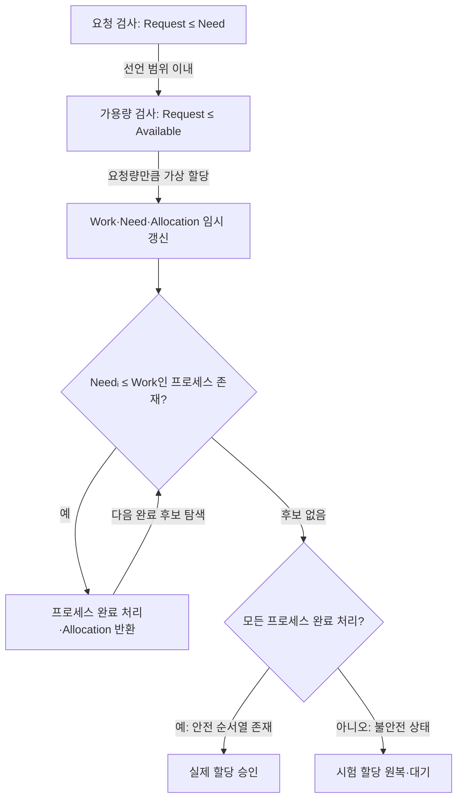

작성 모델 · GPT-6 작성 · 2026.09.24 21:00 KST

## 지식 로드맵 내 현재 위치

운영체제교착상태 회피<strong>은행가 알고리즘</strong>

## 큰 그림과 30초 인출

- 본질: 요청 자원을 시험 할당하고 **안전 순서열**이 존재할 때만 실제 할당함
- 메커니즘: `Need = Max - Allocation` 계산 → 요청 적합성 검사 → 안전성 알고리즘 실행
- 산출: 승인 또는 원복·대기 결정이며, 불안전상태는 교착상태가 아니라 교착 가능성을 배제하지 못한 상태임

핵심 용어

- **은행가 알고리즘 (Banker's Algorithm)** : 최대 요구량을 바탕으로 자원 요청을 시험 배정하고 안전 순서가 있을 때만 승인하는 교착 회피 기법.
- **안전 순서열 (Safe Sequence)** : 각 프로세스가 현재 가용량과 앞선 프로세스의 반환량으로 완료 가능한 순서.
- **Need** : 프로세스가 완료까지 추가로 요구하는 자원량으로, `Max - Allocation` 계산 결과.
- **Allocation** : 프로세스에 현재 배정된 자원 종류별 수량.
- **Available** : 현재 즉시 배정 가능한 자원 종류별 수량.
- **Work·Finish** : 안전성 검사에서 가용량과 완료 여부를 임시 기록하는 벡터.

---

## 1교시 예상문제 (10점)
> 은행가 알고리즘(Banker's Algorithm)을 설명하시오. (제138회 1교시 11번)

---

## 1교시 10점 답안
### Ⅰ. 은행가 알고리즘의 개요

| 구분 | 핵심 |
|---|---|
| 정의 | **은행가 알고리즘 (Banker's Algorithm)** 은 프로세스별 최대 자원 요구량을 기준으로 요청을 시험 할당하고 안전 순서열이 있는 상태만 승인하는 교착 회피 알고리즘 |
| 목적 | 자원 할당 뒤에도 모든 프로세스의 완료 순서가 존재하도록 유지 |

| 단계 | 핵심 판단 |
|---|---|
| 요청 검사 | `Request ≤ Need`, `Request ≤ Available` |
| 시험 할당 | Available·Allocation·Need를 임시 갱신 |
| 안전성 검사 | `Needᵢ ≤ Work`인 프로세스를 완료 처리하고 자원 반환 |
| 결정 | 모든 프로세스 완료 가능하면 승인, 아니면 원복·대기 |

- 제언: 최대 요구량을 신뢰할 수 있는 자원 풀에 선별 적용

---

## 2~4교시 예상문제 (25점)
> 은행가 알고리즘의 자료구조와 자원 요청·안전성 판정 절차를 설명하고, 교착상태 처리 기법과 비교하여 적용 한계를 제시하시오. (예상)

---

## 2~4교시 25점 답안

## Ⅰ. 은행가 알고리즘의 개요

| 구분 | 핵심 |
|---|---|
| 정의 | **은행가 알고리즘 (Banker's Algorithm)** 은 프로세스별 최대 자원 요구량을 기준으로 요청을 시험 할당하고 안전 순서열이 있는 상태만 승인하는 교착 회피 알고리즘 |
| 목적 | 자원 할당 뒤에도 모든 프로세스의 완료 순서가 존재하도록 유지 |

| 상태 | 판정 | 조치 |
|---|---|---|
| **안전상태** | 안전 순서열 존재 | 요청 승인 가능 |
| **불안전상태** | 안전 순서열 미발견 | 요청 원복·대기 |
| **교착상태** | 상호 대기로 진행 불가 | 종료·선점·롤백 |

## Ⅱ. 자원 상태를 표현하는 자료구조

> 네 행렬·벡터의 스냅샷이 정확해야 안전성 검사가 유효하며, 특히 Need 불일치는 잘못된 승인으로 이어짐.

| 구조 | 크기 | 역할 |
|---|---:|---|
| **Available** | `m` | 자원 종류별 가용량 |
| **Max** | `n × m` | 프로세스별 최대 요구량 |
| **Allocation** | `n × m` | 프로세스별 현재 할당량 |
| **Need** | `n × m` | 추가 필요량, `Max - Allocation` |

- 전제: 프로세스 수·자원 종류가 고정되고, 최대 요구량이 전체 자원량을 넘지 않으며, 완료 프로세스가 자원을 반환함

## Ⅲ. 요청 승인과 안전성 판정 절차

- 벡터 비교: 모든 자원 종류에서 조건을 만족해야 해당 프로세스를 완료 후보로 선택함
- 종료 조건: 한 개 이상의 안전 순서열을 찾으면 안전상태이며, 순서열의 유일성은 요구하지 않음

## Ⅳ. 교착상태 처리 기법과 적용 한계

> 은행가 알고리즘은 다중 인스턴스 회피에 강하지만 동적 최대량과 반복 검사 비용 때문에 통제 가능한 자원 풀에 선별 적용해야 함.

| 구분 | 예방 | 은행가 알고리즘 | 탐지·복구 |
|---|---|---|---|
| 시점 | 설계·할당 규칙 | 할당 직전 | 할당 이후 |
| 기준 | 필요조건 제거 | **안전 순서열** | 대기 사이클·교착 집합 |
| 이점 | 단순한 차단 | 자원 활용 여지 | 정상 요청 제약 최소 |
| 대가 | 낮은 이용률 | **Max 사전 선언**, 반복 계산 | 종료·선점·롤백 비용 |

| 한계 | 원인 | 대응 | 기대 결과 |
|---|---|---|---|
| 최대량 오류 | 동적 요구량·과대 선언 | 워크로드별 상한과 재측정 | 안전성과 이용률 균형 |
| 판정 지연 | 요청마다 행렬 반복 탐색 | 제한 자원 풀에 선택 적용 | 반복 계산 부담 완화 |
| 장기 대기 | 불안전 요청의 반복 보류 | 대기시간 기반 우선순위·예약 | 기아 완화 |

## 기술사적 제언

| 한계 | 해결 방안 |
|---|---|
| 최대 요구량이 부정확하면 보수적 판정으로 장기 대기와 자원 유휴가 커질 수 있음 | 최대량을 신뢰할 수 있는 자원 풀에 선별 적용하고, 상한 선언과 대기 우선순위를 운영 조건에 맞게 조정 |

## 출제 이력과 검증 출처

- 제138회 정보관리기술사 1교시 11번: `은행가 알고리즘(Banker's Algorithm)`
- [Q-Net 정보관리기술사 출제문제](https://www.q-net.or.kr/cst006.do?id=cst00601&gSite=Q&gId=)
- [University of Illinois Chicago — Operating Systems: Deadlocks, Banker's Algorithm](https://www.cs.uic.edu/~jbell/CourseNotes/OperatingSystems/7_Deadlocks)

## 연결 토픽

- [교착상태](./038_deadlock/) · [프로세스 동기화 기법](./122_process_synchronization/) · [우선순위 역전](./059_priority_inversion/)
